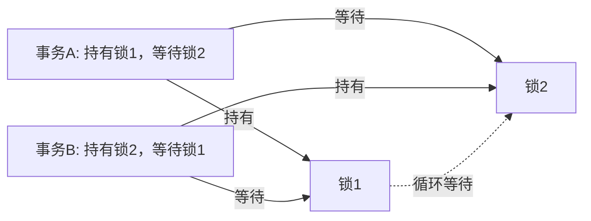
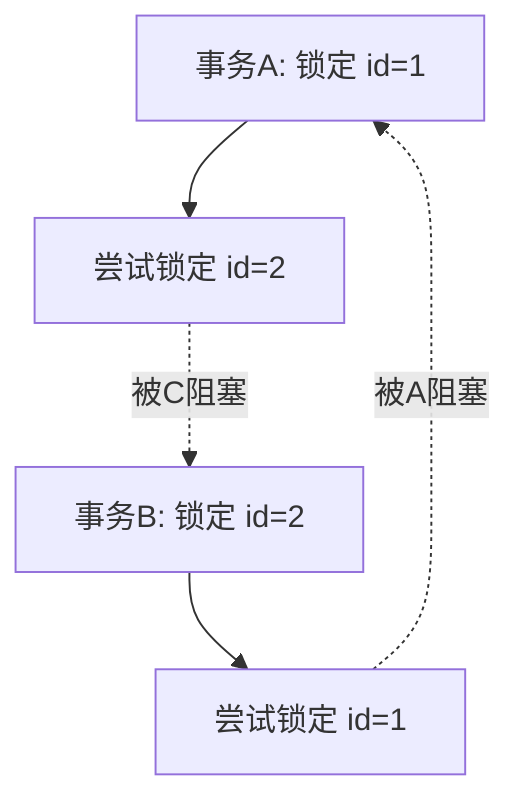
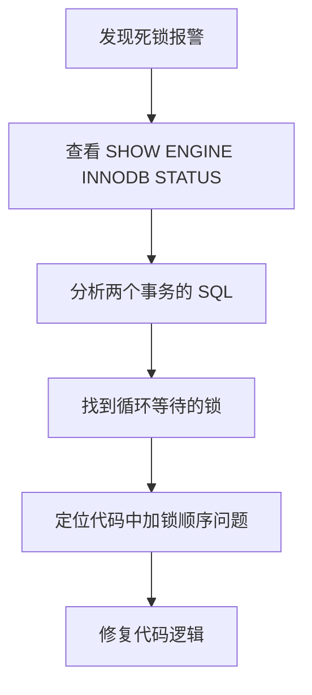

2024年双十一零点，订单服务报警：大量请求超时。

DBA 排查发现，MySQL 出现了死锁：

```
LATEST DETECTED DEADLOCK
*** (1) TRANSACTION 1:
TRANSACTION 283456, ACTIVE 5 sec
locks gap and rec but not gap lock on index `PRIMARY` of table `orders`
lock_mode X locks rec but not gap
*** (2) TRANSACTION 2:
TRANSACTION 283457, ACTIVE 3 sec
locks gap and rec but not gap lock on index `PRIMARY` of table `orders`
lock_mode X locks rec but not gap
*** WE ROLL BACK TRANSACTION (1)
```

两个事务互相等待对方持有的锁，形成了死锁。MySQL 检测到后自动回滚了其中一个事务。

【面试官心理】
这道题我用来测试候选人有没有实际处理过死锁的经验。能说出死锁原因的占 50%，能读懂死锁日志的占 20%，能提出完整解决方案的占 10%。死锁是 MySQL 面试的高频问题，因为它是生产环境中真实会遇到的。

## 一、死锁的本质 🔴

### 1.1 死锁的定义

死锁：两个或多个事务相互等待对方持有的锁，形成循环等待，无法继续执行。



### 1.2 死锁的四个必要条件

```
1. 互斥条件：锁只能被一个事务持有
2. 持有并等待：持有锁的同时等待其他锁
3. 不可抢占：锁不能被强制释放
4. 循环等待：事务之间形成循环等待
```

只要破坏其中一个条件，死锁就不会发生。

### 1.3 死锁和锁等待的区别

| 类型 | 特点 | 结果 |
| --- | --- | --- |
| 锁等待 | 正常现象，等待锁释放 | 最终会执行 |
| 死锁 | 循环等待，无法自动解除 | MySQL 检测并回滚 |

## 二、死锁的典型场景 🔴

### 2.1 场景一：批量更新顺序不一致

```sql
-- 事务A：先更新 id=1，再更新 id=2
START TRANSACTION;
UPDATE orders SET status = 1 WHERE id = 1;  -- 锁定 id=1
-- 业务处理...
UPDATE orders SET status = 1 WHERE id = 2;  -- 锁定 id=2

-- 事务B：先更新 id=2，再更新 id=1（顺序相反）
START TRANSACTION;
UPDATE orders SET status = 1 WHERE id = 2;  -- 锁定 id=2
-- 业务处理...
UPDATE orders SET status = 1 WHERE id = 1;  -- 尝试锁定 id=1，被 A 阻塞
-- 死锁！A 持有 1 等 2，B 持有 2 等 1
```



### 2.2 场景二：主键和唯一索引的锁冲突

```sql
-- 事务A：插入唯一索引冲突
START TRANSACTION;
INSERT INTO orders (order_no, amount) VALUES ('NO001', 100);  -- 成功

-- 事务B：删除并插入
START TRANSACTION;
DELETE FROM orders WHERE order_no = 'NO001';  -- 锁定索引
INSERT INTO orders (order_no, amount) VALUES ('NO001', 200);  -- 等待删除提交

-- 事务A：回滚
ROLLBACK;

-- 此时 B 持有索引锁，等待删除完成
-- 可能触发死锁检测
```

### 2.3 ❌ 错误理解

**候选人原话**："死锁是因为两个事务同时更新同一个资源。"

**问题诊断**：
- 同一资源的竞争不会导致死锁，只是锁等待
- 死锁的关键是**循环等待**，不同事务以不同顺序竞争多个资源
- 相同顺序的锁竞争只会导致锁等待，不会死锁

## 三、死锁日志解读 🟡

### 3.1 死锁日志结构

```sql
SHOW ENGINE INNODB STATUS;
```

```
LATEST DETECTED DEADLOCK
------------------------
2024-11-11 00:00:01 0x7f8a9c123000

*** (1) TRANSACTION 1:
TRANSACTION 283456, ACTIVE 5 sec updating
mysql tables in use 1, locked 1
LOCK WAIT 2 lock struct(s), heap size 1136, 1 row lock(s)
UPDATE orders SET status = 1 WHERE id = 1
*** (2) TRANSACTION 2:
TRANSACTION 283457, ACTIVE 3 sec updating
mysql tables in use 1, locked 1
LOCK WAIT 2 lock struct(s), heap size 1136, 1 row lock(s)
UPDATE orders SET status = 1 WHERE id = 2
*** (2) HOLDS THE LOCK(S):
lock struct 1, lock mode X locks rec but not gap
lock rec space 123, page no 4, heap 456
index PRIMARY of table `orders`
*** (1) HOLDS THE LOCK(S):
lock struct 1, lock mode X locks rec but not gap
lock rec space 123, page no 4, heap 789
index PRIMARY of table `orders`
*** WE ROLL BACK TRANSACTION (1)
```

### 3.2 日志关键字段

| 字段 | 含义 |
| --- | --- |
| TRANSACTION | 事务ID |
| ACTIVE | 事务活跃时间 |
| LOCK WAIT | 正在等待的锁 |
| HOLDS THE LOCK(S) | 持有的锁 |
| lock mode | 锁模式（X=排他锁） |
| lock rec but not gap | 记录锁，不是间隙锁 |

### 3.3 排查步骤



## 四、死锁预防策略 🟡

### 4.1 固定加锁顺序

**核心原则：所有事务按相同顺序获取锁。**

```sql
-- ✅ 正确做法：所有事务都按 id 从小到大顺序加锁
-- 事务A
START TRANSACTION;
UPDATE orders SET status = 1 WHERE id = 1;
UPDATE orders SET status = 1 WHERE id = 2;

-- 事务B
START TRANSACTION;
UPDATE orders SET status = 1 WHERE id = 1;
UPDATE orders SET status = 1 WHERE id = 2;
```

```java
// Java 代码中的固定顺序
public void batchUpdate(List<Long> orderIds) {
    // 先排序
    Collections.sort(orderIds);

    for (Long id : orderIds) {
        // 按顺序更新
        orderMapper.updateStatus(id, 1);
    }
}
```

### 4.2 使用低隔离级别

```sql
-- 降低隔离级别，减少锁的范围
SET SESSION TRANSACTION ISOLATION LEVEL READ COMMITTED;
-- READ COMMITTED 下间隙锁范围更小，死锁概率更低
```

### 4.3 减少事务持有时间

```sql
-- ❌ 错误：在事务中执行大量操作
START TRANSACTION;
-- 查询大量数据
SELECT * FROM orders WHERE user_id = '1001';
-- 网络延迟、用户思考...
-- 30分钟后才更新
UPDATE orders SET status = 1 WHERE user_id = '1001';
COMMIT;

-- ✅ 正确：减少事务内操作
START TRANSACTION;
SELECT * FROM orders WHERE id = 1 FOR UPDATE;
UPDATE orders SET status = 1 WHERE id = 1;
COMMIT;
```

### 4.4 使用分布式锁替代数据库锁

```java
// ✅ 使用 Redis 分布式锁
RLock lock = redisson.getLock("order:" + id);
lock.lock(10, TimeUnit.SECONDS);
try {
    // 业务逻辑
} finally {
    lock.unlock();
}
```

:::warning ⚠️
分布式锁会引入额外的复杂性和网络开销。只有在数据库锁成为性能瓶颈时才考虑使用。
:::

## 五、死锁监控与处理 🟡

### 5.1 开启死锁监控

```sql
-- 默认已开启
SHOW VARIABLES LIKE 'innodb_print_all_deadlocks';  -- OFF

-- 开启后，所有死锁信息会写入错误日志
SET GLOBAL innodb_print_all_deadlocks = ON;
```

### 5.2 监控死锁事件

```yaml
# Prometheus 监控
- alert: MySQLDeadlock
  expr: rate(mysql_innodb_row_locks_waits[5m]) > 10
  for: 1m
  labels:
    severity: critical
  annotations:
    summary: "MySQL 发生死锁"
    description: "过去5分钟每秒有 {{ $value }} 次锁等待"
```

### 5.3 死锁后的处理

```sql
-- 查看死锁后回滚的事务
SHOW ENGINE INNODB STATUS;

-- 应用层面：捕获死锁异常并重试
```

```java
public void updateOrder(Long id) {
    int maxRetries = 3;
    for (int i = 0; i < maxRetries; i++) {
        try {
            orderMapper.updateStatus(id, 1);
            return;
        } catch (DeadlockException e) {
            // 等待后重试
            Thread.sleep(100 * (i + 1));
        }
    }
    throw new RuntimeException("重试次数耗尽");
}
```

## 六、生产避坑

### 6.1 批量操作的死锁陷阱

```sql
-- ❌ 批量更新时的死锁
UPDATE orders SET status = 1 WHERE id IN (1, 2, 3, 4, 5);
-- MySQL 内部按主键顺序加锁，但如果有并发 UPDATE WHERE 条件不同
-- 仍可能死锁

-- ✅ 正确做法：拆分批次，减少锁冲突
FOR batch IN batches:
    START TRANSACTION;
    UPDATE orders SET status = 1 WHERE id IN (batch);
    COMMIT;
```

### 6.2 外键和索引的关系

```sql
-- 如果有外键但没有索引，删除操作会锁住整张子表
-- 可能导致死锁

-- ✅ 始终在外键列上建索引
ALTER TABLE order_items ADD INDEX idx_order_id (order_id);
```

【面试官心理】
能说出"外键删除锁整表"这个坑的候选人，基本都有实际踩坑经验。这道题能完整回答的，基本都是 P7 水准。

## 七、面试追问链 🟡

**第一层**：什么是死锁？
- 候选人：循环等待，无法继续

**第二层**：死锁的四个必要条件是什么？
- 候选人：互斥、持有并等待、不可抢占、循环等待

**第三层**：怎么避免死锁？
- 候选人：固定加锁顺序、减少事务时间

**第四层**：怎么排查死锁？
- 候选人：SHOW ENGINE INNODB STATUS
