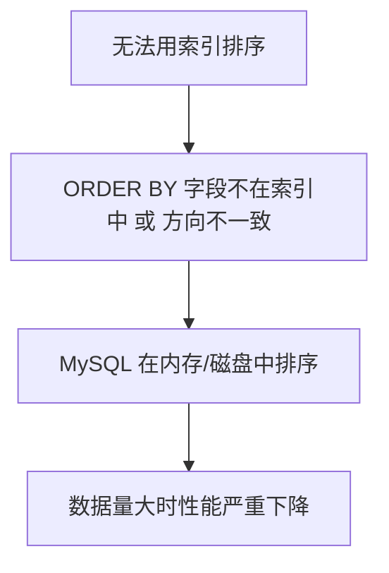
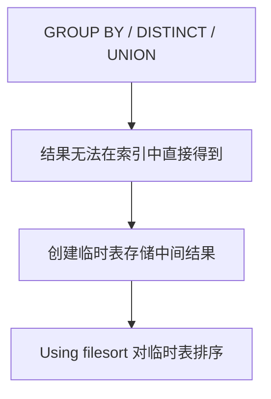

候选人小赵参加腾讯 P6 面试，面试官看了他写的慢查询：

```sql
SELECT * FROM orders WHERE status = 1 ORDER BY create_time DESC LIMIT 10;
```

问："这条 SQL 怎么分析性能？"

小赵说："用 EXPLAIN 看一下？"面试官："那你给我解读一下执行计划。"

小赵看着输出，愣了半天："type 是 ALL...key 是 NULL..."面试官："这说明什么？"

小赵答不上来。

【面试官心理】
这道题我用来测试候选人对 EXPLAIN 的掌握程度。能说出 type=ALL 是全表扫描的占 80%，能完整解读所有字段的占 30%，能根据 Extra 优化 SQL 的占 10%。EXPLAIN 是 MySQL 优化的基本功，但真正能读懂的人不多。

## 一、EXPLAIN 基础解读 🔴

### 1.1 EXPLAIN 输出格式

```sql
EXPLAIN SELECT * FROM orders WHERE status = 1;
```

| id | select_type | table | type | possible_keys | key | key_len | ref | rows | Extra |
| --- | --- | --- | --- | --- | --- | --- | --- | --- | --- |

### 1.2 核心字段详解

#### type：查询类型（最重要）

| type 值 | 含义 | 性能 |
| --- | --- | --- |
| system | 表只有一行 | 最好 |
| const | 用主键或唯一索引，最多一行 | 极好 |
| eq_ref | 关联查询，用主键或唯一索引 | 极好 |
| ref | 用普通索引等值查询 | 好 |
| range | 用索引范围查询 | 好 |
| index | 全索引扫描 | 中等 |
| ALL | 全表扫描 | 差 |

```sql
-- system: 表只有一行
EXPLAIN SELECT * FROM (SELECT 1) AS t;

-- const: 主键查询
EXPLAIN SELECT * FROM orders WHERE id = 1001;

-- eq_ref: 关联查询用主键
EXPLAIN SELECT * FROM orders o JOIN order_items i ON o.id = i.order_id;

-- ref: 普通索引查询
EXPLAIN SELECT * FROM orders WHERE user_id = '1001';

-- range: 范围查询
EXPLAIN SELECT * FROM orders WHERE id > 1000;

-- index: 全索引扫描
EXPLAIN SELECT id FROM orders;  -- 只查 id 列，用 idx_id 扫描

-- ALL: 全表扫描
EXPLAIN SELECT * FROM orders WHERE status = 1;  -- status 无索引
```

:::warning ⚠️
type=ALL 是性能杀手，意味着要扫描整张表。如果是大表，这条 SQL 就是生产事故的根源。
:::

#### key：实际使用的索引

```sql
EXPLAIN SELECT * FROM orders WHERE user_id = '1001';
```

| possible_keys | key |
| --- | --- |
| idx_user_id, idx_status | idx_user_id |

- `possible_keys`：MySQL 认为可能用到的索引（候选列表）
- `key`：MySQL 实际选择的索引

`key = NULL` 说明 MySQL 认为全表扫描比走索引更快。

#### rows：估算扫描行数

```sql
-- rows 告诉你 MySQL 估算要扫描多少行
EXPLAIN SELECT * FROM orders WHERE user_id = '1001';
-- rows = 5000，意味着 MySQL 预估要扫描 5000 行
```

rows 越大，性能越差。结合 type 字段判断：

- type=ALL, rows=10000000：大表全表扫描
- type=ref, rows=10：精准索引查询

### 1.3 ❌ 错误示范

**候选人原话**："EXPLAIN 的 key 是 NULL，说明没建索引。"

**问题诊断**：
- 混淆了 possible_keys 和 key
- 忽略了优化器可能选择不走索引的情况
- 不理解 `key=NULL` + `type=ALL` 的组合含义

## 二、Extra 字段深度解析 🔴

### 2.1 Using filesort：文件排序

```sql
EXPLAIN SELECT * FROM orders WHERE status = 1 ORDER BY create_time;
```

| Extra |
| --- |
| Using filesort |

`Using filesort` 表示 MySQL 无法利用索引顺序排序，只能在内存或磁盘中排序。



**性能影响**：filesort 是一次性排序，数据量超过 `sort_buffer_size` 时会落盘。

```sql
-- ❌ 触发 Using filesort
-- 索引 (status, create_time)，但查询条件导致索引失效
SELECT * FROM orders WHERE status = 1 ORDER BY create_time DESC;
-- 索引是正序，查询是倒序，无法使用

-- ✅ 不触发 Using filesort
-- 建倒序索引
ALTER TABLE orders ADD INDEX idx_status_time_desc (status, create_time DESC);
```

### 2.2 Using temporary：临时表

```sql
EXPLAIN SELECT * FROM orders WHERE status = 1 GROUP BY user_id;
```

| Extra |
| --- |
| Using temporary; Using filesort |

`Using temporary` 表示 MySQL 需要创建临时表保存中间结果。



:::tip 💡
`Using temporary` + `Using filesort` 是性能杀手。如果在生产环境中出现，要重点优化。
:::

### 2.3 Using index：覆盖索引

```sql
EXPLAIN SELECT id, user_id FROM orders WHERE user_id = '1001';
```

| Extra |
| --- |
| **Using index** |

`Using index` 表示完全在索引中返回数据，不需要回表。

### 2.4 Using index condition：索引下推

```sql
EXPLAIN SELECT * FROM orders WHERE user_id = '1001' AND status IN (1, 2);
```

| Extra |
| --- |
| Using index condition |

`Using index condition` 表示使用了索引下推（ICP），在索引遍历中过滤条件。

### 2.5 Using where：WHERE 条件在 Server 层过滤

```sql
EXPLAIN SELECT * FROM orders WHERE status = 1 AND create_time > '2024-01-01';
```

| Extra |
| --- |
| Using where |

`Using where` 表示 Storage 引擎返回数据后，Server 层还需要根据 WHERE 条件过滤。

**注意**：`Using where` 本身不代表性能差，要结合其他字段判断。

### 2.6 Extra 组合的含义

| Extra 组合 | 含义 | 性能 |
| --- | --- | --- |
| Using index; Using where | 覆盖索引 + WHERE | 极好 |
| Using index condition; Using where | 索引下推 + WHERE | 好 |
| Using where | WHERE 在 Server 层过滤 | 中等 |
| Using index; Using filesort | 覆盖索引但需排序 | 中等 |
| Using where; Using filesort | WHERE + 排序 | 差 |
| Using temporary; Using filesort | 临时表 + 排序 | 很差 |

## 三、实战：解读一条慢查询 🟡

### 3.1 原始查询

```sql
SELECT o.id, o.order_no, o.amount, o.status, u.name, u.phone
FROM orders o
JOIN users u ON o.user_id = u.id
WHERE o.status = 1
  AND o.create_time >= '2024-01-01'
  AND u.city = '北京'
ORDER BY o.create_time DESC
LIMIT 20;
```

### 3.2 EXPLAIN 输出

```sql
EXPLAIN SELECT o.id, o.order_no, o.amount, o.status, u.name, u.phone
FROM orders o
JOIN users u ON o.user_id = u.id
WHERE o.status = 1
  AND o.create_time >= '2024-01-01'
  AND u.city = '北京'
ORDER BY o.create_time DESC
LIMIT 20;
```

| id | select_type | table | type | key | rows | Extra |
| --- | --- | --- | --- | --- | --- | --- |
| 1 | SIMPLE | o | range | idx_status_time | 50000 | Using index condition; Using filesort |
| 1 | SIMPLE | u | eq_ref | PRIMARY | 1 | Using where |

### 3.3 问题分析

1. **orders 表**：type=range（范围查询），rows=50000（扫描 5 万行），有 Using filesort
2. **users 表**：type=eq_ref（主键关联），Using where（city='北京' 在 Server 层过滤）

**优化方向**：
1. 给 orders 加覆盖索引 `(status, create_time, id, order_no, amount)`
2. 给 users.city 加索引
3. 让 city 条件也能在索引中过滤

### 3.4 优化后

```sql
-- 添加索引
ALTER TABLE orders ADD INDEX idx_cover (status, create_time, id, order_no, amount);
ALTER TABLE users ADD INDEX idx_city (city, id, name, phone);

-- 验证优化
EXPLAIN SELECT o.id, o.order_no, o.amount, o.status, u.name, u.phone
FROM orders o
JOIN users u ON o.user_id = u.id
WHERE o.status = 1
  AND o.create_time >= '2024-01-01'
  AND u.city = '北京'
ORDER BY o.create_time DESC
LIMIT 20;
```

| Extra |
| --- |
| Using index; Using index condition; Using filesort |

`Using index` 出现了，说明覆盖索引生效了。

## 四、EXPLAIN ANALYZE（MySQL 8.0+）🟡

### 4.1 比 EXPLAIN 更精确

```sql
EXPLAIN ANALYZE SELECT * FROM orders WHERE status = 1;
```

```
-> Nested loop inner join  (cost=1000 rows=5000)
    -> Table scan on o  (cost=500 rows=10000)
    -> Single-row index lookup on u using PRIMARY (id=o.user_id)  (cost=1 rows=1)
```

`EXPLAIN ANALYZE` 显示的是**实际执行代价**，而不是预估：

- actual time：实际执行时间
- rows examined：实际扫描行数
- loops：循环次数

:::tip 💡
生产环境优化时，优先用 `EXPLAIN ANALYZE`，它能告诉你优化器的预估和实际执行的差异。
:::

## 五、生产避坑

### 5.1 误区：rows 越小越好

```sql
-- rows=1 但 type=ALL，仍然很慢
EXPLAIN SELECT * FROM orders WHERE order_no = 'abc123';  -- order_no 没有索引
```

### 5.2 误区：Extra 有 Using index 就一定快

```sql
-- Using index 但有 Using filesort
EXPLAIN SELECT id, create_time FROM orders ORDER BY create_time;
-- 索引覆盖但无法利用索引顺序
```

【面试官心理】
我问他 EXPLAIN，通常还会追问"如果 type=ALL 你怎么优化"、"Using filesort 怎么消除"。能完整回答这三个问题的，基本都有 SQL 优化实战经验。
