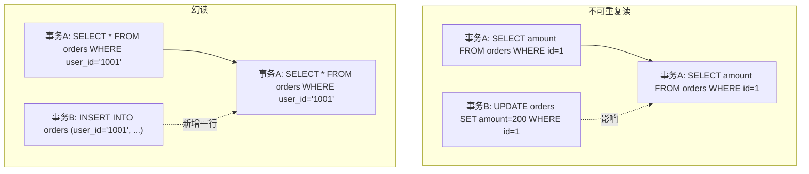
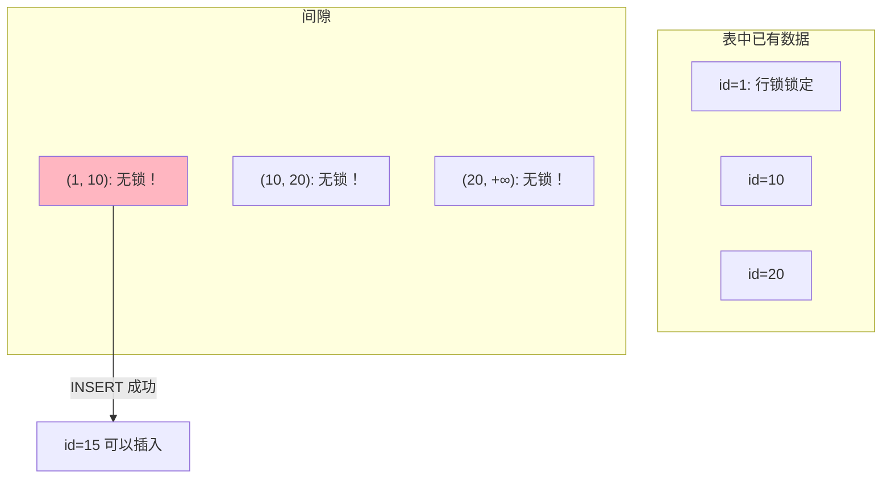
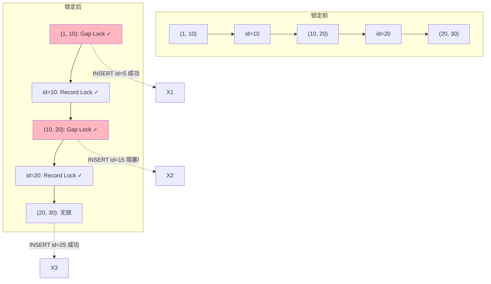

候选人小张在字节三面中，面试官问了一道 MySQL 深度题：

"什么是幻读？为什么会出现幻读？MySQL 是怎么解决幻读的？"

小张说："幻读是同一事务两次查询结果不同，MySQL 通过锁机制解决。"

面试官追问："具体是哪种锁？"

小张说："行锁？"

面试官："行锁能防止幻读吗？如果我两次查询之间有另一个事务插入了一条数据，行锁能挡住吗？"

小张答不上来了。

【面试官心理】
这道题我用来测试候选人对幻读机制的理解深度。能说出"幻读是两次查询结果数不同"的占 50%，能说出行锁挡不住新插入的占 20%，能说清间隙锁和临键锁的占 5%。幻读是 MySQL 并发控制的核心问题，能答对的候选人基本都理解 MVCC 和锁机制。

## 一、幻读的本质 🔴

### 1.1 幻读的定义

幻读（Phantom Read）：同一事务内，两次相同的查询返回不同的行数（因为其他事务插入了新数据）。

```sql
-- 事务A
START TRANSACTION;

-- 第一次查询
SELECT COUNT(*) FROM orders WHERE user_id = '1001';  -- 结果：10 条

-- 事务B（并发）插入一条数据
INSERT INTO orders (user_id, amount) VALUES ('1001', 100);
COMMIT;

-- 第二次查询
SELECT COUNT(*) FROM orders WHERE user_id = '1001';  -- 结果：11 条！
COMMIT;
```

### 1.2 幻读和不可重复读的区别

| 类型 | 区别 | 示例 |
| --- | --- | --- |
| 不可重复读 | 同一行数据被修改 | 第一次读 amount=100，第二次读 amount=200 |
| 幻读 | 查询结果集新增了行 | 第一次读 10 条，第二次读 11 条 |



## 二、行锁为什么挡不住幻读 🔴

### 2.1 行锁只锁记录

```sql
-- 事务A
START TRANSACTION;
SELECT * FROM orders WHERE id = 1 FOR UPDATE;  -- 行锁：只锁定 id=1 这一行
-- id=1 的行被锁住

-- 事务B
INSERT INTO orders (id, user_id, ...) VALUES (100, '1001', ...);  -- 不冲突！
-- 插入的是 id=100 的新行，不影响 id=1 的行
```



### 2.2 ❌ 错误理解

**候选人原话**："有了行锁，其他事务就不能修改数据了，所以不会有幻读。"

**问题诊断**：
- 行锁只锁住已存在的记录
- 新插入的数据不受已有行锁影响
- 必须锁定"记录之间的间隙"才能防止插入

## 三、间隙锁如何防止幻读 🔴

### 3.1 间隙锁的原理

间隙锁（Gap Lock）锁定的是**索引树中记录之间的间隙**，防止其他事务在这个间隙中插入新记录。

```sql
-- 假设 orders 表有以下 id: 1, 10, 20, 30
-- 索引树中的间隙：
-- (-∞, 1), (1, 10), (10, 20), (20, 30), (30, +∞)

-- 事务A 执行：
SELECT * FROM orders WHERE id = 10 FOR UPDATE;

-- 间隙锁锁定：(1, 10) 和 (10, 20)
-- 其他事务无法在 id 属于 (1, 20) 范围内插入
```

### 3.2 间隙锁的工作示意图



### 3.3 间隙锁的锁定范围

```sql
-- 等值查询锁定周围间隙
SELECT * FROM orders WHERE id = 10 FOR UPDATE;
-- 锁定：(1, 10) 和 (10, 20)

-- 范围查询锁定整个范围
SELECT * FROM orders WHERE id > 10 AND id < 20 FOR UPDATE;
-- 锁定：(10, 20) 以及 (20, 下一个值)
```

:::tip 💡
间隙锁只在 REPEATABLE READ 隔离级别下生效。在 READ COMMITTED 级别下，间隙锁只锁定等值查询的精确位置，不锁定范围。
:::

## 四、Next-Key Lock：临键锁 🔴

### 4.1 临键锁 = 记录锁 + 间隙锁

MySQL InnoDB 使用临键锁（Next-Key Lock）来解决幻读。

```sql
-- 临键锁：(上一个索引值, 当前索引值]
SELECT * FROM orders WHERE id = 10 FOR UPDATE;

-- 相当于：
-- 1. 记录锁：锁定 id=10 这一行
-- 2. 间隙锁：锁定 (1, 10) 和 (10, 20)
```

### 4.2 临键锁的查询过程

```mermaid
graph TD
    subgraph 查询: WHERE id = 10
        A[定位到 id=10] --> B[锁定 id=10 的记录]
        B --> C["锁定左侧间隙: (上一个值, 10]"]
        C --> D["锁定右侧间隙: (10, 下一个值]"]
        D --> E["Next-Key Lock 完成"]
    end
```

### 4.3 临键锁的边界情况

```sql
-- 查询 id 不存在的的情况
SELECT * FROM orders WHERE id = 15 FOR UPDATE;

-- id=15 不存在，InnoDB 会定位到最近的索引
-- 锁定：(10, 20) 这个间隙
-- 即所有 id 在 (10, 20) 范围内的插入都会被阻塞
```

## 五、不同隔离级别下的幻读处理 🟡

### 5.1 READ COMMITTED

```sql
SET SESSION TRANSACTION ISOLATION LEVEL READ COMMITTED;

-- RC 级别下，只使用记录锁，不使用间隙锁
SELECT * FROM orders WHERE id = 10 FOR UPDATE;
-- 只锁定 id=10 的记录
-- (10, 20) 之间的插入不会被阻塞！
```

### 5.2 REPEATABLE READ

```sql
SET SESSION TRANSACTION ISOLATION LEVEL REPEATABLE READ;

-- RR 级别下，使用临键锁（记录锁 + 间隙锁）
SELECT * FROM orders WHERE id = 10 FOR UPDATE;
-- 锁定 id=10 的记录 + 两侧间隙
-- (10, 20) 之间的插入会被阻塞
```

| 隔离级别 | 锁类型 | 能防止幻读 |
| --- | --- | --- |
| READ UNCOMMITTED | 无 | ❌ |
| READ COMMITTED | 记录锁 | ❌ |
| REPEATABLE READ | 临键锁 | ✅ |
| SERIALIZABLE | 串行化 | ✅ |

【面试官心理】
这张表是面试必考点。能完整说出的占 60%，能解释为什么 RC 级别下不能防止幻读的占 20%，能说出临键锁在 RC 级别下退化为记录锁的占 5%。

## 六、生产避坑 🟡

### 6.1 间隙锁导致的锁等待

```sql
-- ❌ 危险场景：范围查询导致大量间隙锁
START TRANSACTION;
SELECT * FROM orders WHERE id BETWEEN 1 AND 10000 FOR UPDATE;
-- 锁定 10000 个记录 + 10001 个间隙
-- 其他事务几乎无法插入！

-- ✅ 正确做法
-- 使用主键或唯一索引精确锁定
SELECT * FROM orders WHERE id IN (1, 2, 3, ...) FOR UPDATE;
-- 只锁定指定的几行
```

### 6.2 唯一索引的间隙锁行为

```sql
-- 唯一索引的等值查询只锁定记录，不锁定间隙
SELECT * FROM orders WHERE id = 10 FOR UPDATE;
-- 只锁定 id=10 这一行
-- id=11, id=9 都可以正常插入

-- 因为唯一索引保证了不会有重复值，间隙锁是多余的
```

```sql
-- 但是范围查询仍然需要间隙锁
SELECT * FROM orders WHERE id >= 10 AND id <= 20 FOR UPDATE;
-- 锁定 id=10 到 id=20 的所有记录和间隙
```

### 6.3 监控间隙锁

```sql
-- 查看当前锁等待
SELECT r.trx_id, r.trx_mysql_thread_id, r.trx_query,
       l.lock_id, l.lock_mode, l.lock_type
FROM information_schema.INNODB_LOCKS l
JOIN information_schema.INNODB_TRX r ON l.lock_trx_id = r.trx_id;
```

【面试官心理】
能说出"唯一索引的等值查询不锁定间隙"的候选人，基本都研究过 MySQL 锁机制的源码。这是 P7 的水准。

## 七、面试追问链 🟡

**第一层**：什么是幻读？
- 候选人：两次查询结果数不同

**第二层**：为什么行锁挡不住新插入的数据？
- 候选人：行锁只锁记录，锁不住间隙

**第三层**：间隙锁是怎么工作的？
- 候选人：锁定记录之间的间隙，防止插入

**第四层**：临键锁是什么？它和间隙锁是什么关系？
- 候选人：临键锁 = 记录锁 + 间隙锁

**第五层**：为什么唯一索引的等值查询不需要间隙锁？
- 候选人：唯一索引保证了不会有重复值，间隙锁是多余的
