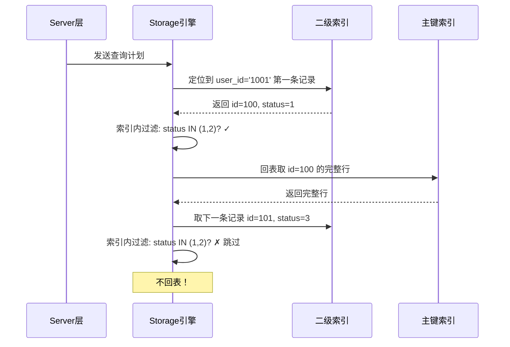

候选人小刘参加字节跳动二面，面试官问：

"MySQL 5.6 引入了一个重要优化，你知道是什么吗？"

小刘想了想："好像有索引下推？"面试官追问："索引下推是什么？它怎么工作的？"

小刘："就是在查询的时候...把条件...下推到索引里？"

面试官："具体怎么下的？减少了什么操作？"

小刘支支吾吾答不上来。

【面试官心理】
这道题我用来判断候选人是否关注 MySQL 版本演进。知道 ICP 名字的占 30%，能说清原理的占 10%，能讲清楚它减少了多少回表的占 5%。能答到最后一层的，基本都看过 MySQL 源码或者深入研究过执行计划。

## 一、索引下推是什么 🔴

### 1.1 问题背景

在没有 ICP 之前，复合索引查询的执行流程：

```sql
-- 索引 (user_id, status, create_time)
SELECT * FROM orders WHERE user_id = '1001' AND status IN (1, 2);

-- 无 ICP 的执行流程：
-- 1. 在索引树中定位到 user_id='1001' 的第一条记录
-- 2. 每一条记录都要回表（因为 status 条件无法在索引中判断）
-- 3. 在主键索引中取出完整行
-- 4. 在 Server 层过滤 status 条件
```

问题：user_id='1001' 的记录有 5000 条，就要回表 5000 次，然后 4999 次被过滤掉。

### 1.2 ICP 的核心思想

索引下推（Index Condition Pushdown，ICP）的核心是：**把 Server 层的过滤条件下推到 Storage 引擎层**，在索引遍历过程中就完成过滤，减少回表次数。


### 1.3 ICP 的工作流程

```sql
-- 索引 (user_id, status, create_time)
SELECT * FROM orders WHERE user_id = '1001' AND status IN (1, 2);

-- 有 ICP 的执行流程：
-- 1. 在索引树中定位到 user_id='1001' 的第一条记录
-- 2. 在索引叶子节点中判断 status 是否 IN (1, 2)
-- 3. 只对符合条件的记录回表
-- 4. 在主键索引中取出完整行
```



## 二、ICP 的触发条件 🟡

### 2.1 前提条件

ICP 不是万能的，触发 ICP 需要满足以下条件：

1. **使用复合索引**：必须有多于 WHERE 条件涉及到的字段
2. **部分条件在索引中**：WHERE 条件的一部分在索引列中
3. **MySQL 5.6+**：这是 5.6 引入的特性
4. **Storage 引擎支持**：InnoDB 和 MyISAM 都支持

```sql
-- 假设索引 (name, age, city)
-- ❌ 无法使用 ICP：city 不在索引中，必须回表
SELECT * FROM users WHERE name = '张三' AND city = '北京';

-- ✅ 可以使用 ICP：age 在索引中
SELECT * FROM users WHERE name = '张三' AND age > 25;
```

### 2.2 执行计划中的 ICP

```sql
EXPLAIN SELECT * FROM orders WHERE user_id = '1001' AND status IN (1, 2);
```

| 字段 | 无 ICP | 有 ICP |
| --- | --- | --- |
| type | range | range |
| key | idx_user_status | idx_user_status |
| rows | 5000 | 200 |
| Extra | Using index condition | **Using index condition; Using index** |

- `Using index condition`：使用了索引条件下推
- `Using index`：使用了覆盖索引（不需要回表）

:::tip 💡
两者同时出现表示：先在索引中用 ICP 过滤，然后完全在索引中返回数据（覆盖索引）。这是最理想的情况。
:::

### 2.3 ❌ 错误理解

**候选人原话**："索引下推就是把 WHERE 条件推送到数据库执行，越靠近数据越快。"

**问题诊断**：
- 这个说法太抽象，不理解"下推"的具体含义
- 没有理解 Server 层和 Storage 引擎层的职责分工
- 混淆了 ICP 和覆盖索引的概念

**面试官内心 OS**：这个候选人肯定看过相关文章，但没有动手验证过。

## 三、ICP vs 覆盖索引 🟡

### 3.1 两者的区别

| 特性 | ICP | 覆盖索引 |
| --- | --- | --- |
| 本质 | 在索引遍历中提前过滤 | 把 SELECT 字段放入索引 |
| 目的 | 减少回表次数 | 完全消除回表 |
| 触发 | 条件在索引中但不在最左前缀 | SELECT 字段全部在索引中 |
| 关系 | 可以和覆盖索引配合 | 可以和 ICP 配合 |

### 3.2 配合使用的最佳实践

```sql
-- 查询：用户 1001 的已支付订单
-- 索引：(user_id, status, create_time, id, order_no)

SELECT id, order_no, create_time FROM orders
WHERE user_id = '1001' AND status = 1
ORDER BY create_time DESC;

-- 执行计划分析：
-- 1. ICP：在索引中过滤 user_id + status
-- 2. 覆盖索引：id, order_no, create_time 都在索引中
-- 3. 结果：完全不需要回表
```

```sql
EXPLAIN SELECT id, order_no, create_time FROM orders
WHERE user_id = '1001' AND status = 1
ORDER BY create_time DESC;
```

| Extra |
| --- |
| Using index condition; Using index; Using filesort |

`Using filesort` 仍然存在，因为 `ORDER BY create_time` 需要额外排序。

```sql
-- 如果想让 ORDER BY 也用索引优化
-- 建索引：(user_id, status, create_time, id, order_no)
-- 查询：ORDER BY create_time DESC

EXPLAIN SELECT id, order_no, create_time FROM orders
WHERE user_id = '1001' AND status = 1
ORDER BY create_time DESC;

-- Extra: Using index  -- 不再有 Using filesort
```

## 四、ICP 的局限性 🟢

### 4.1 不适用场景

```sql
-- ❌ 索引列参与计算，无法 ICP
SELECT * FROM orders WHERE user_id + 1 = 1002;

-- ❌ 模糊查询 %开头，无法 ICP
SELECT * FROM orders WHERE user_name LIKE '%zhang';

-- ❌ 索引列有函数，无法 ICP
SELECT * FROM orders WHERE YEAR(create_time) = 2024;
```

### 4.2 ICP 和 MRR 的配合

MRR（Multi-Range Read）是另一个优化，它配合 ICP 可以进一步提升性能：

```sql
-- ICP + MRR 配合：
-- 1. ICP 在索引中过滤条件
-- 2. MRR 把主键 id 排序后再批量回表
-- 3. 批量回表可以利用顺序 IO
```

```sql
SET optimizer_switch='mrr=on,mrr_cost_based=on';
EXPLAIN SELECT * FROM orders WHERE user_id = '1001' AND status IN (1, 2);
```

| Extra |
| --- |
| Rowid-ordered scan; Using index condition |

【面试官心理】
问到 ICP 时，我通常会追问 MRR。能说出两者配合原理的，基本都读过 MySQL 内部实现。P7 候选人应该能讲清楚这些优化的边界条件。

## 五、生产优化实践 🟡

### 5.1 如何验证 ICP 是否生效

```sql
-- 查看 ICP 统计
SHOW STATUS LIKE 'Handler_icp_attempts';  -- ICP 尝试次数
SHOW STATUS LIKE 'Handler_icp_matched_to_key_part';  -- 匹配成功的次数

-- 命中率
-- Handler_icp_matched_to_key_part / Handler_icp_attempts 越高越好
```

### 5.2 ICP 对不同查询类型的优化效果

| 查询类型 | 优化效果 | 说明 |
| --- | --- | --- |
| `WHERE a = ? AND b > ?` | 显著 | b 的范围可以在索引中过滤 |
| `WHERE a = ? AND b IN (...)` | 显著 | IN 列表可以在索引中过滤 |
| `WHERE a = ? AND b LIKE 'x%'` | 中等 | 前缀匹配可以索引 |
| `WHERE a = ?` | 无 | 单一条件不需要 ICP |

### 5.3 关闭 ICP 的场景

```sql
-- 某些情况下关闭 ICP 反而更快
SET optimizer_switch='index_condition_pushdown=off';

-- 场景：当返回数据量接近全表，且索引列区分度低时
-- 例如：status IN (0, 1, 2, 3, 4, 5) 几乎覆盖所有数据
```

:::warning ⚠️
不要盲目相信优化器。在高并发压测场景下，用 `EXPLAIN ANALYZE` 查看实际执行代价比看预估计划更准确。
:::

## 六、面试追问链

**第一层**：索引下推是什么？
- 候选人：把条件下推到索引层提前过滤

**第二层**：减少了什么操作？
- 候选人：减少了回表次数

**第三层**：ICP 和覆盖索引有什么区别？
- 候选人：...（大部分人答不上来）

**第四层**：ICP 在 MySQL 源码中是怎么实现的？
- 候选人：...（只有看过源码的能答）

【面试官心理】
这道题能答到第三层的候选人已经很少了。如果能讲清楚 ICP 在 MySQL 源码中的实现位置（Storage 引擎层和 Server 层的边界），那就是 P7 的水准。
