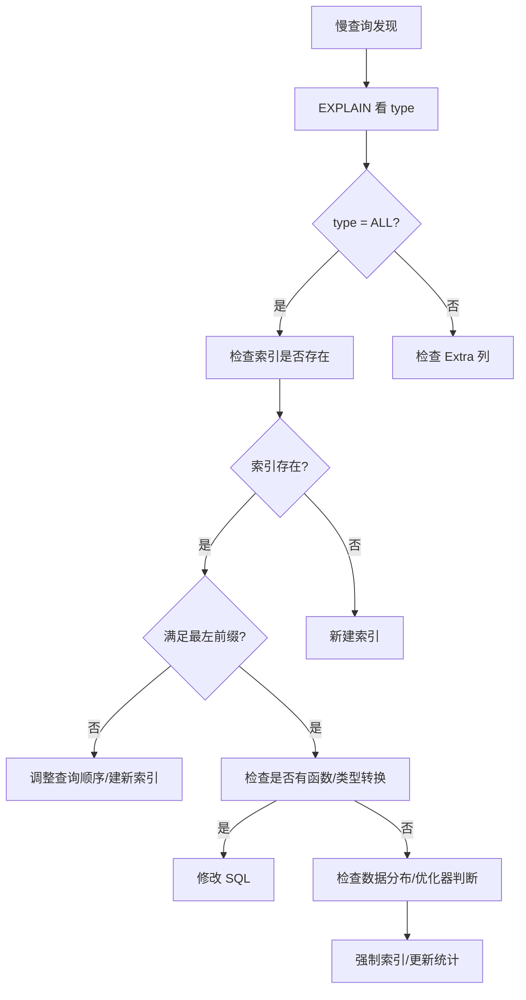

候选人小王参加字节跳动 P6 面试，面试官看了他的简历，问了一道经典题：

"有个 SQL 查询很慢，`SELECT * FROM orders WHERE status = 1 AND create_time > '2024-01-01'`，走了全表扫描，你怀疑是索引失效，怎么排查？"

小王说："可能是索引没建对？"面试官："那你说什么情况下索引会失效？"

小王开始列举："like 开头是%会导致索引失效..."面试官打断："那这条 SQL 为什么失效？status 和 create_time 都有索引。"

小王愣住了。

【面试官心理】
这道题我用来筛选有没有实际优化经验的候选人。能背出"索引失效"几条规则的占 80%，能结合具体 SQL 分析为什么失效的占 30%，能说出 MySQL 优化器行为和执行计划怎么看的占 10%。索引失效不是背规则，是理解底层原理。

## 一、最常见的索引失效场景 🔴

### 1.1 计算和函数导致索引失效

```sql
-- ❌ 索引失效：左函数/计算
SELECT * FROM orders WHERE YEAR(create_time) = 2024;
SELECT * FROM orders WHERE LEFT(user_name, 3) = 'zhang';
SELECT * FROM orders WHERE id + 1 = 1001;

-- ✅ 正确写法
SELECT * FROM orders WHERE create_time >= '2024-01-01' AND create_time < '2025-01-01';
SELECT * FROM orders WHERE user_name LIKE 'zhang%';
SELECT * FROM orders WHERE id = 1000;
```

为什么失效？因为索引树是按原始值排序的。一旦对索引列做了计算，MySQL 必须把每一行都拿出来计算一遍才能判断，相当于全表扫描。

```sql
-- 查看执行计划
EXPLAIN SELECT * FROM orders WHERE YEAR(create_time) = 2024;
-- type=ALL 表示全表扫描
```

### 1.2 隐式类型转换

```sql
-- orders.order_id 是 VARCHAR 类型
-- ❌ 索引失效：字符串和数字比较
SELECT * FROM orders WHERE order_id = 1001;  -- 1001 是数字，MySQL 会把 order_id 转成数字
-- 等价于 SELECT * FROM orders WHERE CAST(order_id AS SIGNED) = 1001

-- ✅ 正确写法
SELECT * FROM orders WHERE order_id = '1001';
```

:::warning ⚠️
这条规则坑了很多人。Java 开发者习惯用 `id = 1001`，在 MySQL 里如果 id 是 VARCHAR，就会触发隐式类型转换。解决方案：保持 SQL 参数类型和字段类型一致。
:::

### 1.3 like 左侧通配符

```sql
-- orders.user_name 有索引
-- ❌ 索引失效：%在左边
SELECT * FROM orders WHERE user_name LIKE '%zhang';
SELECT * FROM orders WHERE user_name LIKE '%zhang%';

-- ✅ 正确写法
SELECT * FROM orders WHERE user_name LIKE 'zhang%';
```

为什么 `%zhang` 没法用索引？因为字典序是从左到右排的，`%zhang` 相当于让你在字典里找一个以"zhang"结尾的词，字典不支持这种查法。

```sql
-- 如果确实需要模糊查询，考虑全文索引或 ES
ALTER TABLE orders ADD FULLTEXT INDEX ft_user_name (user_name);
SELECT * FROM orders WHERE MATCH(user_name) AGAINST('zhang');
```

### 1.4 复合索引违反最左前缀原则

这是最容易被忽略的索引失效场景。

```sql
-- 创建了复合索引 (status, create_time, user_id)
-- ❌ 索引部分失效
SELECT * FROM orders WHERE create_time > '2024-01-01';  -- 跳过了 status

-- ✅ 正确写法
SELECT * FROM orders WHERE status = 1 AND create_time > '2024-01-01';
```

复合索引按从左到右的顺序构建 B+Tree。跳过第一列，就没法二分查找了。

```mermaid
graph TD
    subgraph 复合索引 (status, create_time, user_id) 结构
        A[根节点: status 排序]
        A --> B1[status=0]
        A --> B2[status=1]
        B2 --> C1[create_time 排序]
        B1 --> C2[create_time 排序]
    end
```

### 1.5 OR 连接不同列

```sql
-- user_id 和 status 分别有索引
-- ❌ 索引失效：OR 断了索引链
SELECT * FROM orders WHERE user_id = 1001 OR status = 1;

-- ✅ 正确写法：用 UNION 代替 OR
SELECT * FROM orders WHERE user_id = 1001
UNION ALL
SELECT * FROM orders WHERE status = 1 AND user_id <> 1001;
```

OR 的问题是：如果一列有索引另一列没有，MySQL 不知道哪个代价更小，往往选择全表扫描。

## 二、MySQL 优化器的判断逻辑 🟡

### 2.1 优化器何时选择不走索引

MySQL 优化器不是傻的，它会估算走索引和全表扫描哪个更快。

```sql
-- 表 orders 有 1000 万数据，status=1 的有 900 万条
-- MySQL 认为全表扫描更快，不走索引
SELECT * FROM orders WHERE status = 1;  -- type=ALL
```

这就是开篇那道题：`WHERE status = 1 AND create_time > '2024-01-01'`，如果 status=1 的数据占大多数，优化器选择全表扫描。

### 2.2 如何强制使用索引

```sql
-- 强制使用某个索引（不推荐，优化器通常是对的）
SELECT * FROM orders USE INDEX (idx_create_time) WHERE status = 1 AND create_time > '2024-01-01';

-- 忽略某个索引
SELECT * FROM orders IGNORE INDEX (idx_status) WHERE status = 1;
```

:::tip 💡
生产环境中，强制索引通常用来绕过优化器的错误判断。但如果优化器不走索引，先问自己：是不是统计信息过期了？运行 `ANALYZE TABLE orders;` 更新统计信息。
:::

## 三、组合拳：如何系统排查索引失效 🟡

### 3.1 排查流程



### 3.2 实战：拆解开篇那道题

```sql
-- 表结构
-- orders: id, status, create_time, user_id
-- 索引: idx_status (status), idx_create_time (create_time)

EXPLAIN SELECT * FROM orders WHERE status = 1 AND create_time > '2024-01-01';
```

假设结果：

| id | select_type | table | type | key | rows | Extra |
| --- | --- | --- | --- | --- | --- | --- |
| 1 | SIMPLE | orders | ALL | NULL | 5000000 | Using where |

问题分析：
1. type=ALL，说明走了全表扫描
2. 两个索引都有，但优化器认为都不够好
3. 原因：status=1 的数据太多，走索引还要回表，全表扫描反而更快

解决方案：

```sql
-- 方案1：建复合索引
ALTER TABLE orders ADD INDEX idx_status_time (status, create_time);

-- 方案2：用 covering index
ALTER TABLE orders ADD INDEX idx_status_time_cover (status, create_time, id);
-- 覆盖索引，不需要回表，优化器可能选择走索引
```

## 四、生产避坑

### 4.1 模糊查询的正确姿势

```java
// ❌ Java 代码中的坑
String keyword = request.getParameter("keyword");
// 直接拼，会导致索引失效
String sql = "SELECT * FROM orders WHERE order_no LIKE '%" + keyword + "%'";

// ✅ 正确写法：用覆盖索引或者全文索引
String sql = "SELECT * FROM orders WHERE order_no LIKE ?";
preparedStatement.setString(1, keyword + "%");  // 右侧%才不走索引
```

### 4.2 日期范围查询的陷阱

```sql
-- ❌ 陷阱： BETWEEN 包含计算
SELECT * FROM orders WHERE create_time BETWEEN '2024-01-01' AND '2024-12-31';
-- 如果 create_time 有时间部分，'2024-12-31' 不包含 12-31 23:59:59

-- ✅ 正确写法
SELECT * FROM orders WHERE create_time >= '2024-01-01' AND create_time < '2025-01-01';
```

【面试官心理】
我问他"怎么排查"，其实是在看他有没有系统化的思路。能背规则的占 60%，能结合 EXPLAIN 输出的占 30%，能说出优化器行为和统计信息过期问题的占 10%。这道题是 P6 的分水岭。
