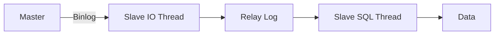

# MySQL 深度攻坚

MySQL 是后端面试的重灾区，也是区分候选人水平的关键战场。

我面试过太多人说"精通 MySQL"，结果问到索引底层就卡壳，问到事务隔离级别只会背名字，问到慢 SQL 优化就只能说"加索引"。这不是精通，这是"会用"。

这个模块，帮你从"会用"进化到"精通"。

## 一、索引与存储引擎 🔴

### 1.1 InnoDB vs MyISAM 选型

| 特性 | InnoDB | MyISAM |
| --- | --- | --- |
| 事务支持 | `YES` | `NO` |
| 外键支持 | `YES` | `NO` |
| 锁粒度 | 行锁 | 表锁 |
| 崩溃恢复 | 自动 | 需手动修复 |
| 全文索引 | 5.6+ 支持 | 原生支持 |

**面试官心理**
我问他俩区别，不是想听他背表格。真正想听的是：你在项目里怎么选的？为什么 InnoDB 现在是默认引擎？什么场景下你会用 MyISAM？说不出"因为 InnoDB 支持行锁和事务"的，直接扣分。

### 1.2 索引底层结构

**B+Tree vs Hash vs RTree**

- **B+Tree**：范围查询王者，`ORDER BY`、`>`、`<`、`BETWEEN` 秒杀
- **Hash**：等值查询 `O(1)`，但无法范围查询，无法排序
- **RTree**：GIS 场景专用，茫茫人海找附近的人

**最左前缀原则**

```sql
-- 索引: (a, b, c)
-- 能命中索引的场景
WHERE a = 1           -- ✅ 命中 a
WHERE a = 1 AND b = 2 -- ✅ 命中 a, b
WHERE a = 1 AND c = 3 -- ⚠️ 命中 a，但 c 索引失效

-- 不能命中索引的场景
WHERE b = 2           -- ❌ 失效
WHERE c = 3           -- ❌ 失效
```

**面试官心理**
这道题我通常用来试探候选人有没有亲手建过索引、排查过慢查询。只背过"最左前缀"四个字的，根本不知道中间断了会怎样。我追问 `WHERE b = 1 AND c = 1` 能不能用索引，十个候选人九个答错。

### 1.3 聚簇索引 vs 非聚簇索引

- **聚簇索引**：数据和索引绑定在一起，叶子节点存完整数据，InnoDB 主键索引
- **非聚簇索引**：叶子节点存主键值，查数据需要回表

```sql
-- 非聚簇索引回表示例
SELECT * FROM orders WHERE order_no = 'A10086';
-- 1. 在 order_no 索引树找到主键 id = 666
-- 2. 用 id 回表查完整数据行
```

**面试官心理**
我会追问："如果只需要查 order_no 和 id，还需要回表吗？"答"不需要"的才是真正理解索引覆盖的。答"需要"或"不确定"的，说明根本没亲手优化过 SQL。

## 二、事务与隔离级别 🔴

### 2.1 四种隔离级别

| 隔离级别 | 脏读 | 不可重复读 | 幻读 |
| --- | --- | --- | --- |
| READ UNCOMMITTED | 可能 | 可能 | 可能 |
| READ COMMITTED | `NO` | 可能 | 可能 |
| REPEATABLE READ | `NO` | `NO` | 可能 |
| SERIALIZABLE | `NO` | `NO` | `NO` |

### 2.2 MVCC 原理

**面试官心理**
我问他 MVCC，十个候选人八个说"多版本并发控制"。我再问："Read View 什么时候生成？活跃事务列表存的什么？TRX_ID 怎么比较的？"能答到这一层的，基本都是 P7 起步。

```sql
-- RC vs RR 的核心区别
-- READ COMMITTED: 每次 SELECT 都生成新的 Read View
-- REPEATABLE READ: 同一个事务，Read View 服复用
```

### 2.3 锁机制

- **Record Lock**：单行记录锁
- **Gap Lock**：间隙锁，锁定范围不包含记录本身
- **Next-Key Lock**：Record Lock + Gap Lock，RR 级别默认

**死锁场景**

```sql
-- 事务 A
UPDATE orders SET status = 1 WHERE id = 1; -- 锁住 id=1
UPDATE orders SET status = 1 WHERE id = 2; -- 等 id=2

-- 事务 B
UPDATE orders SET status = 2 WHERE id = 2; -- 锁住 id=2
UPDATE orders SET status = 2 WHERE id = 1; -- 等 id=1，GG
```

**面试官心理**
我会问："怎么排查死锁？"只答"看日志"的没实战经验。正确答案是：打开 `innodb_print_all_deadlocks`，看 InnoDB monitor 输出，分析锁等待链。真正踩过坑的才知道用 `SHOW ENGINE INNODB STATUS`。

## 三、SQL 优化实战 🔴

### 3.1 EXPLAIN 详解

```sql
EXPLAIN SELECT * FROM orders WHERE status = 1;
```

| 字段 | 含义 | 好的值 |
| --- | --- | --- |
| type | 访问类型 | `ref` > `range` > `ALL` |
| key | 实际用到的索引 | 非 null |
| rows | 扫描行数 | 越小越好 |
| Extra | 额外信息 | `Using index` 最好 |

**面试官心理**
我让他解释 `Using filesort` 是什么意思，十个八个会说"文件排序"。我再问："什么时候会触发filesort？能不能优化？"答不出来"可以在索引上加 ORDER BY"的，说明根本没优化过慢 SQL。

### 3.2 慢 SQL 排查套路

```sql
-- 开启慢查询日志
SET GLOBAL slow_query_log = 'ON';
SET GLOBAL long_query_time = 1; -- 超过 1 秒记录

-- 查看慢查询
SHOW VARIABLES LIKE 'slow_query_log%';
SELECT * FROM mysql.slow_log ORDER BY start_time DESC LIMIT 10;
```

**生产避坑**
线上最常见的慢 SQL 作案手法：
- `SELECT *` 不回表却查全表
- `WHERE like '%abc'` 导致索引失效
- 隐式类型转换：`phone` 是 varchar，传入数字
- 关联子查询：`WHERE id IN (SELECT ...)` 改成 JOIN

## 四、分库分表与集群 🟡

### 4.1 主从复制原理



**面试官心理**
我会问："主从延迟怎么排查？"只会说"检查网络"的没有实战经验。正确答案是：`SHOW SLAVE STATUS` 看 `Seconds_Behind_Master`，分析 `Relay_Log` 位置，判断是 SQL 线程慢还是 IO 线程慢。

### 4.2 分库分表策略

- **垂直拆分**：按业务拆分，不同表放不同库
- **水平拆分**：同一张表按某个字段拆分，如 `user_id % 4`

**路由方案**

```sql
-- 固定 Hash 分片
shard_key = user_id % 4

-- 范围分片
shard_key = user_id / 1000  -- 每1000用户一个库
```

## 五、面试题分级速查

| 级别 | 高频问题 | 期望回答 |
| --- | --- | --- |
| P5 | 索引种类、事务隔离级别、SQL 优化 | 能说清区别，不怵追问 |
| P6 | MVCC 原理、锁机制、EXPLAIN 分析 | 能讲清楚底层实现，有实战 |
| P7 | 分库分表方案、主从延迟、生产调优 | 有架构视野，能做方案选型 |

## 六、学习路径指引

**P5 阶段（会用）**
- 搞懂索引类型和最左前缀原则
- 背熟四种隔离级别和各自问题
- 会用 EXPLAIN 分析简单慢 SQL

**P6 阶段（精通）**
- 理解 B+Tree 底层结构
- 搞清楚 MVCC 和 Read View
- 能分析死锁并给出优化方案

**P7 阶段（架构）**
- 能设计分库分表方案
- 理解主从复制延迟问题
- 有生产环境调优经验，能做容量规划

---

:::tip 💡
面试官问 MySQL，其实是在筛选你有没有"生产经验"。背答案只能过 P5，能讲清原理才能冲 P6，有实战案例才能 hold 住 P7。
:::
