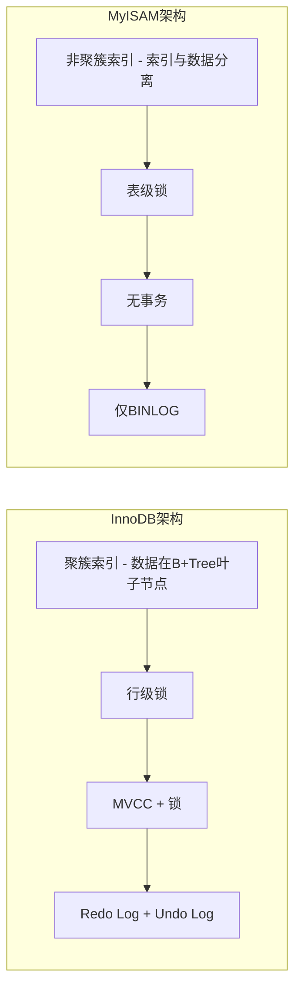
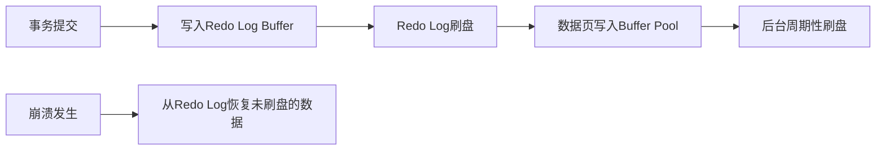

候选人小钱参加美团的后端面试，面试官问：

"MySQL 现在主流用 InnoDB，那 MyISAM 还有存在的必要吗？"

小钱说："没什么必要了，InnoDB 什么场景都比 MyISAM 强。"面试官笑了一下："那你看看这张表，COUNT(*) 查询特别慢，你打算怎么优化？"

小钱说："加索引。"面试官："字段上已经有索引了。"小钱又说："那就换 InnoDB。"面试官："这个表数据量 10 亿，只读不写。"

小赵愣住了。

【面试官心理】
我问他 MyISAM 有没有存在必要，其实是在试探他有没有真正理解两种引擎的适用场景。MyISAM 在 COUNT(*) 场景下有天然优势，因为它的元数据里存了精确行数，不需要扫表。InnoDB 虽好，但不是银弹。

## 一、核心差异概览 🔴

### 1.1 架构层面看两种引擎

InnoDB 和 MyISAM 的本质区别在于**存储模型**和**并发控制机制**。



| 维度 | InnoDB | MyISAM |
| --- | --- | --- |
| 事务 | ✅ ACID 完整支持 | ❌ 不支持 |
| 锁粒度 | 行级锁 | 表级锁 |
| 外键 | ✅ 支持 | ❌ 不支持 |
| 聚簇索引 | ✅ 数据与索引合一 | ❌ 分离存储 |
| MVCC | ✅ 支持 | ❌ 不支持 |
| Crash Safe | ✅ redo log 保证 | ❌ 需手动修复 |
| COUNT(*) | 需全表扫描 | 有专用计数器 |
| 全文索引 | 5.6+ 支持 | 原生支持 |

### 1.2 ❌ 错误示范

**候选人原话**："MyISAM 比 InnoDB 快，因为它不需要事务，而且表锁反而更稳定。"

**问题诊断**：
- 把表锁等同于稳定，混淆了"锁粒度"和"稳定性"的概念
- 不理解事务的真正价值——不是慢，是保护数据一致性
- 没见过高并发下表锁导致的性能雪崩

**面试官内心 OS**：这个人肯定没在生产环境里处理过 MyISAM 表锁导致的故障。

:::warning ⚠️
MyISAM 的表锁在写入时会锁住整张表。这意味着如果你有一个业务表，QPS 1000 的写入，COUNT(*) 查询会直接被打到超时。不理解这个，就别谈数据库选型。
:::

## 二、事务支持 🔴

### 2.1 InnoDB 的事务实现

InnoDB 的事务靠 **Redo Log + Undo Log** 实现。MyISAM 完全没有事务能力，这是两者最大的鸿沟。

```sql
-- InnoDB 事务示例
START TRANSACTION;
UPDATE account SET balance = balance - 1000 WHERE user_id = 1;  -- 写 undo log
UPDATE account SET balance = balance + 1000 WHERE user_id = 2;
-- 提交时写 redo log，崩溃后可以恢复
COMMIT;

-- MyISAM 没有事务，语句直接生效，无法回滚
UPDATE account SET balance = balance - 1000 WHERE user_id = 1;
UPDATE account SET balance = balance + 1000 WHERE user_id = 2;  -- 失败了这张单也没法回
```

### 2.2 事务在生产中的意义

```java
// 业务场景：转账
public void transfer(Long fromId, Long toId, BigDecimal amount) {
    // 如果用 MyISAM，这里任何一步失败都无法回滚
    // 如果第一步成功、第二步失败，数据就不一致了
    accountMapper.decreaseBalance(fromId, amount);
    accountMapper.increaseBalance(toId, amount);
    // InnoDB 的事务保证了要么全成功，要么全失败
}
```

:::tip 💡
很多候选人觉得"我的业务不需要事务"。这种想法非常危险。除非你的表真的是纯日志型、只写不读、不需要数据一致性，否则都应该用 InnoDB。
:::

【面试官心理】
我问事务支持的区别，其实是在判断候选人有没有生产经验。只会背"InnoDB 支持事务"的人占 80%，能说出 Redo Log 和 Undo Log 作用的占 30%，能讲清楚崩溃恢复流程的占 10%。

## 三、锁机制 🟡

### 3.1 MyISAM 的表锁

MyISAM 使用表级锁，开销小，但并发能力极差。

```sql
-- Session 1: 锁定 orders 表写入
LOCK TABLES orders WRITE;
INSERT INTO orders VALUES (1, 100, 'pending');
-- 此时所有其他 session 的读和写都被阻塞

-- Session 2: 想查 orders
SELECT * FROM orders;  -- 被阻塞，直到 Session 1 解锁
```

### 3.2 InnoDB 的行锁

InnoDB 使用行级锁，配合 MVCC 实现并发控制。

```sql
-- InnoDB 行锁示例
START TRANSACTION;
-- 锁定 user_id = 100 的行，其他行不受影响
SELECT * FROM users WHERE user_id = 100 FOR UPDATE;
UPDATE users SET last_login = NOW() WHERE user_id = 100;
COMMIT;  -- 锁释放
```

InnoDB 的行锁并不是锁定"一行"，而是锁定**索引项**。如果没有索引，InnoDB 会锁住所有行——这叫做**表锁**。

```sql
-- 如果 user_id 没有索引，下面的 FOR UPDATE 会锁住全表
SELECT * FROM users WHERE user_id = 100 FOR UPDATE;  -- 危险！
```

### 3.3 锁的性能对比

```sql
-- 模拟并发写入场景
-- MyISAM: 10个并发写入，串行执行，因为表锁
-- InnoDB: 10个并发写入，各自锁定不同的行，并行执行
```

| 场景 | MyISAM | InnoDB |
| --- | --- | --- |
| 单线程写入 | 快 | 快 |
| 多线程并发写入 | 极差（表锁） | 优秀（行锁） |
| 多线程并发读写 | 读阻塞写 | 读写可并行（MVCC） |
| 大批量写入 | 写锁开销小 | 行锁开销大 |

【面试官心理】
追问 MyISAM 和 InnoDB 的锁差异，候选人能说出"表锁 vs 行锁"只是第一步。更深入的追问会落到"如果没有索引，InnoDB 行锁会不会退化"、"锁等待超时怎么配置"这些生产细节。

## 四、外键与约束 🟡

### 4.1 InnoDB 的外键级联

```sql
CREATE TABLE orders (
    order_id BIGINT PRIMARY KEY,
    user_id BIGINT NOT NULL,
    amount DECIMAL(10,2),
    FOREIGN KEY (user_id) REFERENCES users(user_id)
        ON DELETE CASCADE  -- 删除用户时级联删除订单
        ON UPDATE CASCADE  -- 更新用户ID时级联更新订单
) ENGINE=InnoDB;
```

MyISAM 不支持外键，所以无法定义级联删除和更新。依赖应用层来处理关系一致性问题，但应用层的级联操作有**时间窗口**，在高并发下容易出现孤儿记录。

### 4.2 业务层处理 vs 数据库外键

很多互联网公司禁用外键，改用业务层代码来保证一致性。这其实是一种权衡：

```java
// 业务层处理：先删用户，再删订单（应用层控制）
@Transactional
public void deleteUser(Long userId) {
    orderService.deleteByUserId(userId);  // 先删订单
    userMapper.deleteById(userId);        // 再删用户
}
```

:::tip 💡
禁用外键的代价是：依赖应用层的代码逻辑。任何新加入的写入口都要记得手动维护级联关系。MySQL 里的外键约束其实是给你提供了一个免费的"数据一致性保镖"。
:::

## 五、崩溃恢复 🟡

### 5.1 MyISAM 的 Crash Safe 问题

MyISAM 崩溃后，需要用 `REPAIR TABLE` 手动修复。严重时会丢失数据或索引损坏。

```sql
-- 检查表
CHECK TABLE orders;

-- 修复表（需要停止服务）
REPAIR TABLE orders;

-- 如果损坏严重，可能需要重建表
ALTER TABLE orders ENGINE = MyISAM;
```

### 5.2 InnoDB 的 Crash Safe

InnoDB 通过 **redo log** 和 **double write buffer** 实现自动崩溃恢复。



:::warning ⚠️
InnoDB 的 Crash Safe 能力依赖于 `innodb_flush_log_at_trx_commit` 参数。如果设置为 0 或 2，事务提交时只写内存或每秒刷盘，崩溃时可能丢失最多 1 秒的事务数据。金融场景必须设置为 1（每次提交都刷盘）。
:::

## 六、生产避坑

### 6.1 MyISAM 的 COUNT(*) 陷阱

MyISAM 存了精确的 COUNT(*) 元数据，在只读场景下极快。

```sql
-- MyISAM 表: 直接返回元数据，O(1)
SELECT COUNT(*) FROM logs;  -- 毫秒级返回

-- InnoDB 表: 必须扫描聚簇索引，O(n)
SELECT COUNT(*) FROM logs;  -- 亿级数据可能需要几十秒
```

但 MyISAM 的 COUNT(*) 在有 WHERE 条件时同样需要扫描。

### 6.2 混合使用的问题

某些遗留系统存在 InnoDB 和 MyISAM 混用的情况：

```sql
-- 事务表用 InnoDB
CREATE TABLE accounts (...) ENGINE=InnoDB;

-- 历史统计表用 MyISAM
CREATE TABLE daily_stats (...) ENGINE=MyISAM;
```

这种设计的坑是：**跨引擎 JOIN 的性能极差**，而且 MyISAM 的表没有事务，生产环境的备份恢复顺序需要特别注意——MyISAM 先恢复，InnoDB 后恢复，否则可能出现外键约束失败。

## 七、工程选型

| 场景 | 推荐 | 原因 |
| --- | --- | --- |
| 几乎所有 OLTP 业务 | InnoDB | 事务、行锁、崩溃恢复 |
| 纯日志型表（只写不读） | MyISAM / Memory | 写性能好 |
| COUNT(*) 密集型只读表 | MyISAM | 元数据计数 |
| 全文搜索（TB级数据） | MyISAM / ElasticSearch | MyISAM 全文索引更成熟 |
| 需要外键约束 | InnoDB | MyISAM 不支持 |

:::tip 💡
一个真实的选型案例：某电商系统里，商品表（orders_detail）用 MyISAM 做只读副本库，专门用于复杂报表查询。因为报表库是只读的，不需要事务，COUNT(*) 极快。但后来系统要加实时扣库存逻辑，跨引擎 JOIN 导致性能雪崩——这才被迫迁移到 InnoDB。
:::
