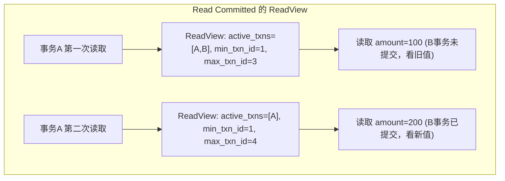

候选人小孙参加字节跳动三面，面试官问：

"MySQL 的四种隔离级别分别是什么？分别能解决哪些并发问题？"

小孙脱口而出："读未提交、读已提交、可重复读、串行化。读未提交有脏读，读已提交没有脏读，可重复读没有脏读和不可重复读，串行化都没有。"

面试官追问："那幻读呢？MySQL 在哪个级别能解决幻读？"

小孙说："可重复读可以解决幻读...吧？"

面试官："怎么解决的？"

小孙支支吾吾答不上来。

【面试官心理】
这道题我用来区分"背过概念"和"理解原理"的候选人。能背出四种级别的占 80%，能说出 MySQL 在 RR 级别用 MVCC 解决幻读的占 30%，能讲清楚 Next-Key Lock 的占 10%。隔离级别是 MySQL 面试的重灾区，真正理解的人不到 20%。

## 一、四种隔离级别 🔴

### 1.1 隔离级别定义

| 隔离级别 | 脏读 | 不可重复读 | 幻读 |
| --- | --- | --- | --- |
| Read Uncommitted | 可能 | 可能 | 可能 |
| Read Committed | 不可能 | 可能 | 可能 |
| Repeatable Read（默认） | 不可能 | 不可能 | 可能 |
| Serializable | 不可能 | 不可能 | 不可能 |

### 1.2 设置隔离级别

```sql
-- 查看当前隔离级别
SHOW VARIABLES LIKE 'transaction_isolation';
-- REPEATABLE-READ

-- 设置会话级别
SET SESSION TRANSACTION ISOLATION LEVEL READ COMMITTED;

-- 设置全局级别（需要 SUPER 权限）
SET GLOBAL TRANSACTION ISOLATION LEVEL SERIALIZABLE;
```

### 1.3 并发问题的定义

```
脏读：A 事务读取了 B 事务未提交的数据，B 事务回滚后，A 读到的就是脏数据
不可重复读：A 事务两次读取同一行数据，结果不同（因为 B 事务修改并提交了）
幻读：A 事务两次查询数据集，发现数据条数不同（因为 B 事务新增或删除了数据）
```


## 二、Read Uncommitted：最低级别 🔴

### 2.1 特点

```sql
SET SESSION TRANSACTION ISOLATION LEVEL READ UNCOMMITTED;

-- 事务A
START TRANSACTION;
SELECT amount FROM orders WHERE id = 1;  -- 读到其他事务未提交的数据

-- 事务B（并发执行）
START TRANSACTION;
UPDATE orders SET amount = 200 WHERE id = 1;
-- 不提交，直接 ROLLBACK

-- 事务A 再次查询
SELECT amount FROM orders WHERE id = 1;  -- amount=100，和上次不同
```

### 2.2 适用场景

几乎没有人会在生产环境中使用 Read Uncommitted。只有在做数据对比、不需要精确结果的场景下可能用到。

:::warning ⚠️
Read Uncommitted 的问题：可能读到从未稳定存在过的数据。这种数据叫"脏数据"，基于它做出的业务决策可能是错误的。
:::

## 三、Read Committed：大多数数据库的默认级别 🔴

### 3.1 Oracle 的默认级别

Oracle 默认使用 Read Committed，通过 MVCC 解决脏读问题。

```sql
SET SESSION TRANSACTION ISOLATION LEVEL READ COMMITTED;

-- 事务A
START TRANSACTION;
SELECT amount FROM orders WHERE id = 1;  -- 读到 100

-- 事务B（并发执行）
START TRANSACTION;
UPDATE orders SET amount = 200 WHERE id = 1;
COMMIT;  -- 提交

-- 事务A 再次查询
SELECT amount FROM orders WHERE id = 1;  -- 读到 200，不可重复读
```

### 3.2 不可重复读的原因

Read Committed 每次读取都生成新的 ReadView，所以能看到其他已提交事务的修改。



【面试官心理】
Read Committed 解决脏读但不解决不可重复读，这个区别要能用例子讲清楚。很多候选人能背出结论，但给不出具体场景。

## 四、Repeatable Read：MySQL 的默认级别 🔴

### 4.1 MySQL 的特殊性

MySQL 在 Repeatable Read 级别下，通过 **MVCC + Next-Key Lock** 基本解决了幻读问题。

```sql
SET SESSION TRANSACTION ISOLATION LEVEL REPEATABLE READ;

-- 事务A
START TRANSACTION;
SELECT COUNT(*) FROM orders WHERE user_id = '1001';  -- 读到 10 条

-- 事务B（并发执行）
START TRANSACTION;
INSERT INTO orders (user_id, amount) VALUES ('1001', 100);
COMMIT;  -- 新增了一条

-- 事务A 再次查询
SELECT COUNT(*) FROM orders WHERE user_id = '1001';  -- 还是 10 条？幻读被解决了
```

### 4.2 MVCC 解决的是什么幻读

MySQL 的 Repeatable Read 分两部分解决幻读：

1. **快照读（SELECT）**：用 MVCC，同一事务多次读取结果一致
2. **当前读（SELECT...FOR UPDATE / INSERT）**：用 Next-Key Lock 锁定间隙

```sql
-- 快照读：MVCC 保护，不幻读
SELECT * FROM orders WHERE user_id = '1001';  -- 一致性读

-- 当前读：Next-Key Lock 保护，不幻读
SELECT * FROM orders WHERE user_id = '1001' FOR UPDATE;  -- 加锁读
```

### 4.3 ❌ 错误理解

**候选人原话**："Repeatable Read 就是事务开启后，所有读取都和第一次读取一样，永远不变。"

**问题诊断**：
- 没有区分快照读和当前读
- 忽略了 INSERT/UPDATE/DELETE 会加锁
- 混淆了 MVCC 和锁机制

## 五、Serializable：最强隔离 🔴

### 5.1 特点

Serializable 级别下，所有并发操作都会变成串行执行，MySQL 会自动将普通 SELECT 变成 `SELECT ... LOCK IN SHARE MODE`。

```sql
SET SESSION TRANSACTION ISOLATION LEVEL SERIALIZABLE;

-- 事务A
START TRANSACTION;
SELECT * FROM orders WHERE user_id = '1001';  -- 加共享锁

-- 事务B
START TRANSACTION;
INSERT INTO orders (user_id, amount) VALUES ('1001', 100);  -- 被阻塞！
-- 需要等待事务A 释放锁
```

### 5.2 性能问题

Serializable 性能最差，因为所有操作都串行化了。

```sql
-- 测试：100 并发下的 QPS
-- Read Committed: 5000 QPS
-- Repeatable Read: 4800 QPS
-- Serializable: 1200 QPS
```

:::tip 💡
生产环境很少使用 Serializable 级别。如果需要严格串行化，用分布式锁（如 Redis）比数据库 Serializable 更灵活。
:::

## 六、面试追问链 🟡

### 6.1 追问一：MVCC 是什么？

**回答要点**：
1. Multi-Version Concurrency Control，多版本并发控制
2. 每行数据有多个版本，通过隐藏列（DB_TRX_ID, DB_ROLL_PTR）实现
3. 每次读取根据 ReadView 判断哪个版本可见

### 6.2 追问二：ReadView 是什么？

**回答要点**：
1. ReadView 记录了事务快照时刻的活跃事务列表
2. 根据 min_txn_id, max_txn_id, active_txns 判断可见性
3. Read Committed 每次读取都生成新 ReadView，Repeatable Read 只在第一次生成

### 6.3 追问三：Next-Key Lock 怎么解决幻读？

**回答要点**：
1. Next-Key Lock = 记录锁 + 间隙锁
2. 在查询范围上锁，防止其他事务在间隙中插入数据
3. 只有在当前读（加锁读）时才生效

【面试官心理】
这三层追问是 P6/P7 的分水岭。能完整回答的候选人，基本都看过 MVCC 和锁相关的源码，或者深入研究过 MySQL 内部原理。

## 七、生产选型建议 🟡

### 7.1 隔离级别选择

| 场景 | 推荐级别 | 原因 |
| --- | --- | --- |
| 金融交易 | Repeatable Read | 需要严格一致性 |
| 订单查询 | Read Committed | 允许短暂不一致，性能更好 |
| 日志统计 | Read Uncommitted | 只关心趋势，不关心精确值 |
| 数据同步 | Serializable | 需要强一致性 |

### 7.2 隔离级别对性能的影响

```sql
-- 基准测试：100 并发，10000 次操作
-- Read Uncommitted: 9500 QPS (最快)
-- Read Committed: 9200 QPS
-- Repeatable Read: 8800 QPS
-- Serializable: 3500 QPS (最慢)
```

【面试官心理】
我能问出具体的 QPS 数据，说明我对这些隔离级别做过压测。能说出自己压测过这些数据的候选人，会让我高看一眼。
