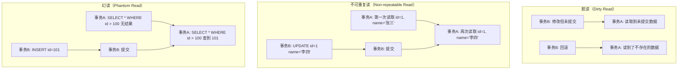

# 四种事务隔离级别

> 面试官问：「MySQL 的默认隔离级别是什么？解决了什么问题？」你说「REPEATABLE READ，解决了幻读」——面试官追问「那为什么 MySQL 叫『可重复读』，实际上能防止不可重复读和幻读吗？」你沉默了。这道题考察的是对隔离级别的深度理解，不是简单的背书。

## 面试官最关心的 3 个问题（快速自测）

| 问题 | 考察点 | 难度 |
|------|--------|------|
| MySQL 四种隔离级别分别解决什么问题？ | 概念理解 | 🔴 高频 |
| 脏读、不可重复读、幻读的区别是什么？ | 概念理解 | 🔴 高频 |
| MySQL 默认的 REPEATABLE READ 解决了哪些问题？ | 深度理解 | 🟡 中频 |

---

## 一、并发事务带来的问题

### 1.1 三种并发问题



### 1.2 三种问题的区别

| 问题 | 含义 | 场景 |
|------|------|------|
| **脏读** | 读取到其他事务**未提交**的数据 | 最严重，读取到不存在的数据 |
| **不可重复读** | 同一事务内两次读取同一行数据**结果不同** | 其他事务更新并提交 |
| **幻读** | 同一事务内两次查询**结果集**不同 | 其他事务新增/删除并提交 |

---

## 二、四种隔离级别

### 2.1 隔离级别定义

| 隔离级别 | 脏读 | 不可重复读 | 幻读 | 实现方式 |
|----------|------|-----------|------|----------|
| READ UNCOMMITTED | 可能 | 可能 | 可能 | 无锁 |
| READ COMMITTED | 不可能 | 可能 | 可能 | MVCC |
| REPEATABLE READ（MySQL 默认） | 不可能 | 不可能 | 可能 | MVCC + 间隙锁 |
| SERIALIZABLE | 不可能 | 不可能 | 不可能 | 锁 |

### 2.2 MySQL 中查看和设置隔离级别

```sql
-- 查看当前会话隔离级别
SELECT @@transaction_isolation;

-- 查看全局隔离级别
SELECT @@global.transaction_isolation;

-- 设置会话隔离级别
SET SESSION TRANSACTION ISOLATION LEVEL READ COMMITTED;

-- 设置全局隔离级别（需 SUPER 权限）
SET GLOBAL TRANSACTION ISOLATION LEVEL REPEATABLE READ;
```

---

## 三、各隔离级别详解

### 3.1 READ UNCOMMITTED（读未提交）

**最低级别**，允许脏读。

```sql
-- 事务A
SET SESSION TRANSACTION ISOLATION LEVEL READ UNCOMMITTED;
BEGIN;
SELECT * FROM users WHERE id = 1;  -- 读到 '张三'

-- 事务B（在事务A查询之前执行）
BEGIN;
UPDATE users SET name = '李四' WHERE id = 1;
-- B 未提交

-- 事务A（此时事务B未提交）
SELECT * FROM users WHERE id = 1;  -- 读到 '李四'（脏读）
```

### 3.2 READ COMMITTED（读已提交）

**解决脏读**，但允许不可重复读和幻读。

```sql
-- 事务A
SET SESSION TRANSACTION ISOLATION LEVEL READ COMMITTED;
BEGIN;
SELECT * FROM users WHERE id = 1;  -- 读到 '张三'

-- 事务B
BEGIN;
UPDATE users SET name = '李四' WHERE id = 1;
COMMIT;  -- B 提交

-- 事务A
SELECT * FROM users WHERE id = 1;  -- 读到 '李四'（不可重复读）
```

**实现原理**：每次读取都生成新的 ReadView。

### 3.3 REPEATABLE READ（可重复读）- MySQL 默认

**解决脏读和不可重复读**，但可能产生幻读（InnoDB 通过间隙锁解决）。

```sql
-- 事务A
SET SESSION TRANSACTION ISOLATION LEVEL REPEATABLE READ;
BEGIN;
SELECT * FROM users WHERE id = 1;  -- 读到 '张三'

-- 事务B
BEGIN;
INSERT INTO users VALUES (2, '王五');
COMMIT;  -- B 提交

-- 事务A
SELECT * FROM users;  -- 仍然只有 id=1（没有幻读）
INSERT INTO users VALUES (2, '赵六');  -- 插入失败！（间隙锁）
```

**实现原理**：事务开始时生成 ReadView，整个事务期间复用。

### 3.4 SERIALIZABLE（串行化）

**最高级别**，完全串行执行，性能最差。

```sql
-- 事务A
SET SESSION TRANSACTION ISOLATION LEVEL SERIALIZABLE;
BEGIN;
SELECT * FROM users WHERE id = 1;  -- 加共享锁

-- 事务B
BEGIN;
SELECT * FROM users WHERE id = 1;  -- 也加共享锁
INSERT INTO users VALUES (2, '王五');  -- 阻塞，等待A提交
```

---

## 四、InnoDB 的幻读解决方案

### 4.1 快照读 vs 当前读

| 类型 | SQL | 说明 |
|------|-----|------|
| **快照读** | `SELECT * FROM users` | 读取历史版本，不加锁 |
| **当前读** | `SELECT * FROM users FOR UPDATE` | 读取最新版本，加锁 |

### 4.2 Next-Key Lock（临键锁）

InnoDB 在 REPEATABLE READ 级别下，使用 **Next-Key Lock** 解决幻读：

```sql
-- 事务A
BEGIN;
SELECT * FROM users WHERE id > 100 FOR UPDATE;  -- 临键锁

-- 事务B
BEGIN;
INSERT INTO users VALUES (101, '王五');  -- 阻塞！（锁住了 (100, +∞) 区间）
```

### 4.3 临键锁的锁区间

```mermaid
graph TD
    subgraph "索引数据"
        A[... | 100 |]
    end

    subgraph "临键锁范围"
        B[gap 锁: (上一个值, 100]]
        C[record 锁: 100]
    end

    subgraph "Next-Key Lock"
        D[Next-Key Lock: (上一个值, 100]]
    end
```

---

## 五、常见面试陷阱

:::danger 陷阱 1：混淆不可重复读和幻读
错误理解：「不可重复读和幻读是一样的」
正确理解：不可重复读是**同一行数据**被修改，幻读是**结果集**（行数）发生变化。解决不可重复读需要行锁，解决幻读需要间隙锁。
:::

:::danger 陷阱 2：认为 REPEATABLE READ 完全解决幻读
错误理解：「MySQL 默认隔离级别是 REPEATABLE READ，所以不会有幻读」
正确理解：在快照读场景下，REPEATABLE READ 通过 MVCC 避免了幻读；但在当前读场景下，需要通过 Next-Key Lock 解决。
:::

:::danger 陷阱 3：忽略设置隔离级别的影响范围
错误理解：「设置了全局隔离级别，所有连接都生效」
正确理解：`SET GLOBAL` 只影响新连接的默认隔离级别，已有的连接不受影响。
:::

---

## 六、不同隔离级别的使用场景

| 隔离级别 | 适用场景 | 原因 |
|----------|----------|------|
| READ UNCOMMITTED | 实时数据分析 | 追求性能，允许少量脏读 |
| READ COMMITTED | Oracle 默认 | 平衡一致性和性能 |
| REPEATABLE READ | MySQL 默认 | 适合大多数 OLTP 场景 |
| SERIALIZABLE | 金融/账务系统 | 最高一致性，性能要求不高 |

---

## 七、加分回答

> 💡 **隔离级别与并发性能的关系**：
> 隔离级别越高，并发性能越差：
> - READ UNCOMMITTED：无锁，最快，但可能脏读
> - READ COMMITTED：每次读取生成新 ReadView
> - REPEATABLE READ：整个事务复用 ReadView，MVCC 开销小
> - SERIALIZABLE：所有读取加锁，完全串行化

> 💡 **隔离级别的实现代价**：
> - MVCC：需要维护多个版本的数据，开销是存储空间
> - 锁：并发控制的开销是锁等待和死锁风险

---

## 八、总结对比表

| 问题 | 脏读 | 不可重复读 | 幻读 |
|------|------|-----------|------|
| 含义 | 读到未提交数据 | 同一行数据不一致 | 结果集行数变化 |
| 原因 | 未提交事务修改 | 其他事务 UPDATE | 其他事务 INSERT/DELETE |
| 解决 | 读已提交隔离级别 | 可重复读隔离级别 | 临键锁 |
| 严重程度 | 最严重 | 较严重 | 较严重 |

| 隔离级别 | 脏读 | 不可重复读 | 幻读 | 性能 |
|----------|------|-----------|------|------|
| READ UNCOMMITTED | ❌ 可能 | ❌ 可能 | ❌ 可能 | ✅ 最快 |
| READ COMMITTED | ✅ 不可能 | ❌ 可能 | ❌ 可能 | ✅ 快 |
| REPEATABLE READ | ✅ 不可能 | ✅ 不可能 | ⚠️ 可能 | 较好 |
| SERIALIZABLE | ✅ 不可能 | ✅ 不可能 | ✅ 不可能 | ❌ 最慢 |