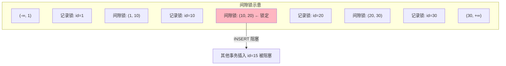

候选人小周在美团二面中，面试官问：

"MySQL 有哪些锁？"

小周说："有行锁和表锁。"

面试官追问："行锁有哪些？表锁呢？"

小周说："...行锁就是锁定行的，表锁就是锁定整张表的。"

面试官继续追问："什么是间隙锁？什么是临键锁？"

小周彻底答不上来了。

【面试官心理】
这道题我用来测试候选人对 MySQL 锁机制的理解深度。能说出行锁和表锁的占 80%，能讲清间隙锁和临键锁的占 20%。锁机制是 MySQL 面试的难点，也是生产环境中死锁的根源。

## 一、锁的分类 🔴

### 1.1 按锁粒度分类

| 锁类型 | 粒度 | 锁住内容 | 开销 | 并发度 |
| --- | --- | --- | --- | --- |
| 表锁 | 表级别 | 整张表 | 小 | 低 |
| 页锁 | 页级别 | 数据页（16KB） | 中 | 中 |
| 行锁 | 行级别 | 单行数据 | 大 | 高 |

```sql
-- 表锁：锁定整张表
LOCK TABLES orders READ;   -- 读锁：所有事务只能读
LOCK TABLES orders WRITE;  -- 写锁：只有持有锁的事务能读写

-- 解锁
UNLOCK TABLES;
```

```sql
-- 查看当前锁信息
SHOW ENGINE INNODB STATUS;
-- 显示当前锁等待、死锁、事务信息
```

### 1.2 按锁属性分类

| 锁类型 | 简称 | 允许的操作 | 冲突的锁 |
| --- | --- | --- | --- |
| 共享锁 | S 锁 | 读取 | X 锁 |
| 排他锁 | X 锁 | 读取、写入 | S 锁、X 锁 |

```sql
-- 共享锁：其他事务可以读，但不能写
SELECT * FROM orders WHERE id = 1 LOCK IN SHARE MODE;

-- 排他锁：其他事务不能读也不能写
SELECT * FROM orders WHERE id = 1 FOR UPDATE;
UPDATE orders SET status = 1 WHERE id = 1;
```

### 1.3 锁的兼容矩阵

|  | S 锁 | X 锁 |
| --- | --- | --- |
| S 锁 | ✅ 兼容 | ❌ 不兼容 |
| X 锁 | ❌ 不兼容 | ❌ 不兼容 |

## 二、行锁详解 🔴

### 2.1 行锁的实现

InnoDB 的行锁通过**索引**实现。如果没有索引，InnoDB 会锁定所有行（实质上是表锁）。

```sql
-- id 是主键，有索引
SELECT * FROM orders WHERE id = 1 FOR UPDATE;  -- 只锁定 id=1 这一行

-- user_id 是普通索引
SELECT * FROM orders WHERE user_id = '1001' FOR UPDATE;  -- 锁定所有 user_id='1001' 的行

-- 没有索引
SELECT * FROM orders WHERE amount = 100 FOR UPDATE;  -- 锁定多行（所有满足条件的行）
```

### 2.2 ❌ 错误理解

**候选人原话**："InnoDB 的行锁是锁住数据行，所以只要操作不同行就不会冲突。"

**问题诊断**：
- 忽略了行锁是通过索引实现的
- 如果 WHERE 条件没有索引，会锁很多行甚至整表
- 索引失效时行锁可能变成表锁

:::warning ⚠️
生产环境中，经常发现"我的查询只更新一行，为什么锁了整张表？"的 bug。根因往往是 WHERE 条件的索引失效了，导致行锁升级为表锁。
:::

## 三、间隙锁（Gap Lock）🔴

### 3.1 什么是间隙锁

间隙锁锁定的是**索引树中的间隙**，防止其他事务在这个间隙中插入数据。

```sql
-- 假设 orders 表有以下 id: 1, 10, 20, 30
-- 事务A 执行：
SELECT * FROM orders WHERE id = 15 FOR UPDATE;

-- 间隙锁锁定范围：(10, 20) 之间的间隙
-- 其他事务无法在这个范围内插入数据
```



### 3.2 间隙锁的作用

间隙锁的主要作用是**防止幻读**。

```sql
-- 事务A
START TRANSACTION;
SELECT * FROM orders WHERE user_id = '1001';  -- 当前读，加间隙锁
-- 锁定 user_id='1001' 的所有现有行和前后间隙

-- 事务B
INSERT INTO orders (user_id, amount) VALUES ('1001', 100);
-- 被阻塞！不能在间隙中插入

-- 事务A
SELECT * FROM orders WHERE user_id = '1001';  -- 两次结果相同，没有幻读
COMMIT;
```

### 3.3 间隙锁的范围

```sql
-- 查询条件是范围
SELECT * FROM orders WHERE id BETWEEN 10 AND 20 FOR UPDATE;
-- 锁定范围：(负无穷, 10] (10, 20] (20, 正无穷)
-- 注意：10 和 20 的记录被记录锁锁定
-- 10 到 20 之间的间隙被间隙锁锁定
-- 20 之后的区域也被锁定（防止后续插入影响范围查询）
```

## 四、临键锁（Next-Key Lock）🔴

### 4.1 什么是临键锁

临键锁 = 记录锁 + 间隙锁，即锁定一个索引记录和它前面的间隙。

```sql
-- 临键锁：(上一个索引, 当前索引]
SELECT * FROM orders WHERE id = 10 FOR UPDATE;
-- 锁定：(负无穷, 10] = (-∞, 10) 的间隙 + id=10 的记录
```

### 4.2 临键锁的查询逻辑

```sql
-- 等值查询：锁定精确行和前后间隙
SELECT * FROM orders WHERE id = 10 FOR UPDATE;
-- 临键锁：(负无穷, 10] U [10, 下一个值)

-- 范围查询：锁定整个范围的所有临键锁
SELECT * FROM orders WHERE id > 10 AND id < 20 FOR UPDATE;
-- 临键锁：(10, 20] + (20, 下一个值)
```

### 4.3 InnoDB 的默认锁行为

在 REPEATABLE READ 隔离级别下，InnoDB 默认使用临键锁来防止幻读。

```sql
SET SESSION TRANSACTION ISOLATION LEVEL REPEATABLE READ;

-- 临键锁默认开启
-- 可以通过设置关闭：
SET GLOBAL innodb_locks_unsafe_for_binlog = 1;
-- 不推荐：会导致幻读
```

【面试官心理】
临键锁是 MySQL 锁机制中最难理解的部分。能说清楚"临键锁 = 记录锁 + 间隙锁"的候选人不到 20%，能解释清楚 InnoDB 默认使用临键锁的更少。这道题是 P7 的筛选器。

## 五、表锁详解 🟡

### 5.1 表锁的分类

| 锁类型 | 持有者 | 允许的操作 | 冲突 |
| --- | --- | --- | --- |
| 共享表锁 | 读取者 | 读 | 写锁冲突 |
| 排他表锁 | 写入者 | 读、写 | S 锁、X 锁都冲突 |

### 5.2 MDL（元数据锁）

MySQL 5.5+ 引入了 MDL（元数据锁），用于保护表结构。

```sql
-- DDL 操作自动加 MDL
ALTER TABLE orders ADD COLUMN remark VARCHAR(100);
-- 加 MDL 排他锁

-- DML 操作自动加 MDL
SELECT * FROM orders LIMIT 1;
-- 加 MDL 共享锁
```

MDL 锁是 DDL 和 DML 之间的互斥锁，防止在修改表结构时读取不稳定的数据。

:::warning ⚠️
生产环境中，DDL 操作（如 ALTER TABLE）会加 MDL 排他锁，如果表有大量查询在执行，DDL 会等待，可能导致大量连接堆积。解决方案：使用 pt-online-schema-change 或 gh-ost 工具。
:::

## 六、锁的查看与排查 🟡

### 6.1 查看锁信息

```sql
-- 查看当前事务持有的锁
SELECT * FROM information_schema.INNODB_LOCKS;
-- lock_id, lock_trx_id, lock_mode, lock_type, lock_table, lock_index, lock_space, lock_page, lock_rec, lock_data

-- 查看锁等待
SELECT * FROM information_schema.INNODB_LOCK_WAITS;
-- requesting_trx_id, blocking_trx_id

-- 查看当前锁的详细状态
SHOW ENGINE INNODB STATUS;
-- TRANSACTIONS 部分显示锁等待链
```

### 6.2 死锁示例

```sql
-- 事务A
START TRANSACTION;
SELECT * FROM orders WHERE id = 1 FOR UPDATE;  -- 锁定 id=1
-- 业务处理...
SELECT * FROM orders WHERE id = 2 FOR UPDATE;  -- 尝试锁定 id=2

-- 事务B（并发）
START TRANSACTION;
SELECT * FROM orders WHERE id = 2 FOR UPDATE;  -- 锁定 id=2
-- 业务处理...
SELECT * FROM orders WHERE id = 1 FOR UPDATE;  -- 尝试锁定 id=1，被阻塞

-- 死锁！MySQL 检测到并回滚代价最小的事务
```

```sql
-- SHOW ENGINE INNODB STATUS 输出：
-- LATEST DETECTED DEADLOCK
-- *** (1) TRANSACTION 1:
-- lock_mode X locks rec but not gap
-- Record lock, heap no 2
-- index PRIMARY of `orders`
-- lock_type=RECORD lock space 0 page 3 heap 2
-- LOCK WAIT
```

## 七、生产避坑 🟡

### 7.1 索引失效导致锁升级

```sql
-- ❌ 危险操作
UPDATE orders SET status = 1 WHERE create_time > '2024-01-01';
-- 如果 create_time 没有索引，会锁定很多行甚至整表

-- ✅ 安全操作
-- 确保 WHERE 条件有合适的索引
ALTER TABLE orders ADD INDEX idx_create_time (create_time);
UPDATE orders SET status = 1 WHERE create_time > '2024-01-01';
-- 只锁定匹配的行
```

### 7.2 长事务导致锁堆积

```sql
-- ❌ 长事务的问题
START TRANSACTION;
-- 用户思考、网络延迟...
-- 业务处理 30 分钟
-- 期间持有的锁阻塞所有其他事务
COMMIT;

-- ✅ 正确做法
-- 将大事务拆成小事务
FOR batch IN batches:
    START TRANSACTION;
    UPDATE orders SET status = 1 WHERE id IN (batch);
    COMMIT;
```

【面试官心理】
能说出"索引失效导致行锁变表锁"这个点的候选人，基本都有生产问题排查经验。这道题能完整回答的，基本都是 P7 水准。

## 八、面试追问链

**第一层**：MySQL 有哪些锁？
- 候选人：行锁、表锁、页锁

**第二层**：行锁是怎么实现的？
- 候选人：通过索引实现

**第三层**：什么是间隙锁？
- 候选人：锁定索引之间的间隙，防止幻读

**第四层**：什么是临键锁？
- 候选人：记录锁 + 间隙锁

**第五层**：REPEATABLE READ 下默认使用什么锁？
- 候选人：临键锁
