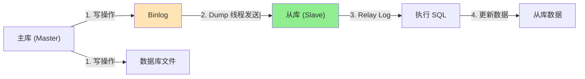
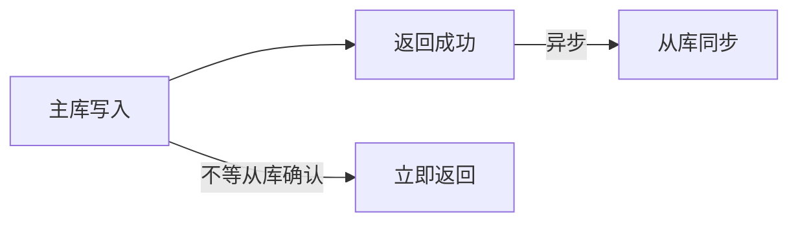
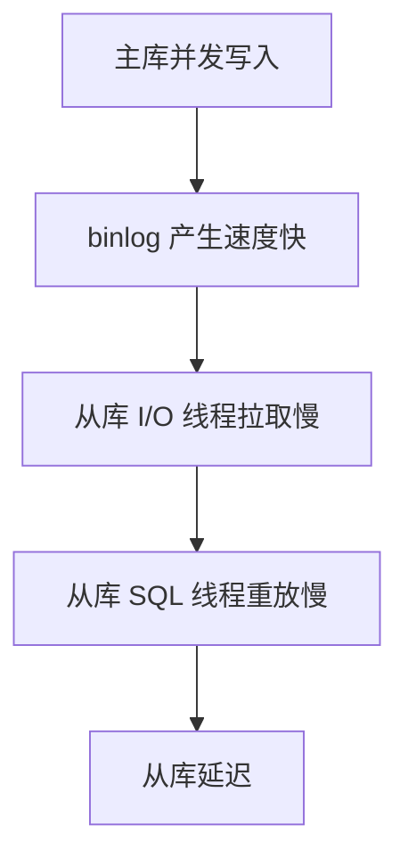

候选人小林参加字节 P7 面试，面试官问：

"你们的数据库是怎么做高可用的？"

小林说："我们用了主从复制，一主两从。"

面试官追问："主从复制的原理是什么？"

小林说："主库写，从库读。"

面试官继续追问："主库和从库之间是怎么同步的？"

小林答不上来了。

【面试官心理】
这道题我用来测试候选人对数据库高可用架构的理解深度。能说出一主多从的占 60%，能讲清 binlog 同步原理的占 20%，能说清同步延迟和应对策略的占 10%。主从复制是 MySQL 高可用的基础。

## 一、主从复制的原理 🔴

### 1.1 核心组件



| 组件 | 作用 |
| --- | --- |
| Binlog | 主库记录所有写操作的文件 |
| Dump 线程 | 主库负责发送 binlog 的线程 |
| I/O 线程 | 从库接收 binlog 的线程 |
| SQL 线程 | 从库重放 SQL 的线程 |
| Relay Log | 从库接收的 binlog 中转文件 |

### 1.2 复制流程

```
1. 主库接收写请求
2. 主库执行写操作，写入 InnoDB 存储引擎
3. 主库将写操作记录到 binlog
4. 主库的 Dump 线程通知从库有新的 binlog
5. 从库的 I/O 线程拉取 binlog，写入 Relay Log
6. 从库的 SQL 线程读取 Relay Log，执行 SQL
7. 从库数据更新完成
```

### 1.3 ❌ 错误理解

**候选人原话**："主从复制就是主库写完以后，从库会自动复制数据。"

**问题诊断**：
- 不理解 binlog 是复制的中介
- 不理解主从之间是异步通信
- 不知道 Relay Log 的作用

## 二、复制方式 🔴

### 2.1 异步复制（默认）

```sql
-- 配置异步复制
CHANGE MASTER TO
    MASTER_HOST = '192.168.1.100',
    MASTER_USER = 'repl',
    MASTER_PASSWORD = 'password',
    MASTER_LOG_FILE = 'mysql-bin.000001',
    MASTER_LOG_POS = 154;

START SLAVE;
```



特点：
- 主库不等从库确认就返回成功
- 性能最高，但可能丢数据
- 从库可能有一定延迟

### 2.2 半同步复制

```sql
-- 安装半同步插件
INSTALL PLUGIN rpl_semi_sync_master SONAME 'semisync_master.so';
INSTALL PLUGIN rpl_semi_sync_slave SONAME 'semisync_slave.so';

-- 启用半同步
SET GLOBAL rpl_semi_sync_master_enabled = 1;
SET GLOBAL rpl_semi_sync_slave_enabled = 1;
```


特点：
- 主库等待至少一个从库确认
- 至少一个从库有数据，不会丢
- 性能比异步复制低

### 2.3 全同步复制


特点：
- 所有从库都确认后才返回
- 性能最低，但数据最安全
- 一般不用

## 三、复制格式 🔴

### 3.1 三种 binlog 格式

| 格式 | 记录内容 | 优点 | 缺点 |
| --- | --- | --- | --- |
| STATEMENT | SQL 语句 | 日志量小 | 函数、存储过程可能不一致 |
| ROW | 行变化 | 数据一致 | 日志量大 |
| MIXED | 自动选择 | 平衡 | 复杂 |

```sql
-- 查看 binlog 格式
SHOW VARIABLES LIKE 'binlog_format';

-- 设置 binlog 格式
SET GLOBAL binlog_format = 'ROW';
```

### 3.2 STATEMENT 格式的问题

```sql
-- 主库执行
UPDATE orders SET create_time = NOW() WHERE id = 1;

-- 从库执行
UPDATE orders SET create_time = NOW() WHERE id = 1;
-- NOW() 在主库和从库执行时值不同！
```

### 3.3 ROW 格式的优势

```sql
-- ROW 格式记录的是行变化
UPDATE orders SET create_time = NOW() WHERE id = 1;
-- binlog 记录：id=1 的行，create_time 从 '2024-01-01 00:00:00' 变为 '2024-11-11 11:11:11'
-- 从库直接应用这个变化，不会有不一致
```

:::tip 💡
MySQL 5.7+ 推荐使用 ROW 格式。在线变更 binlog 格式：
SET GLOBAL binlog_format = 'ROW';
:::
:::warning ⚠️
ROW 格式的 binlog 日志量可能是 STATEMENT 的 10 倍。需要评估磁盘空间。
:::

## 四、主从延迟问题 🟡

### 4.1 延迟的原因



常见原因：
1. 网络延迟
2. 从库机器性能差
3. 从库并发压力大
4. 大事务执行时间长

### 4.2 监控延迟

```sql
-- 查看延迟时间
SHOW SLAVE STATUS\G;

-- 关键字段：
-- Seconds_Behind_Master: 复制延迟秒数
-- Slave_IO_Running: I/O 线程状态
-- Slave_SQL_Running: SQL 线程状态
```

```yaml
# Prometheus 监控
- alert: MySQLReplicationLag
  expr: mysql_slave_lag_seconds > 30
  for: 5m
  labels:
    severity: warning
  annotations:
    summary: "MySQL 从库延迟过大"
    description: "从库延迟 {{ $value }} 秒"
```

### 4.3 减少延迟的方法

```sql
-- 1. 开启并行复制
SET GLOBAL slave_parallel_type = 'LOGICAL_CLOCK';
SET GLOBAL slave_parallel_workers = 8;

-- 2. 减少大事务
-- 将大批量操作拆分成小事务

-- 3. 升级从库硬件
-- SSD、更多 CPU、更多内存

-- 4. 读写分离
-- 将只读操作路由到从库
```

## 五、配置实战 🟡

### 5.1 主库配置

```ini
# my.cnf
[mysqld]
server-id = 1
log-bin = mysql-bin
binlog_format = ROW
sync_binlog = 1  # 每次事务提交都同步 binlog
innodb_flush_log_at_trx_commit = 1  # 每次事务提交都刷新日志
```

### 5.2 从库配置

```ini
# my.cnf
[mysqld]
server-id = 2
relay-log = relay-log
read_only = ON  # 从库只读
super_read_only = ON  # 禁止 SUPER 权限写入
```

### 5.3 读写分离配置

```yaml
# ShardingSphere 配置
schemaName: sharding_db
dataSources:
  ds_master:
    url: jdbc:mysql://master:3306/db
    username: root
    password: password
  ds_slave_1:
    url: jdbc:mysql://slave1:3306/db
    username: root
    password: password
  ds_slave_2:
    url: jdbc:mysql://slave2:3306/db
    username: root
    password: password

rules:
  - !readwrite_splitting:
      tables:
        ds_order:
          dataSources:
            ms_order:
              type: Static
              props:
                write-data-source-name: ds_master
                read-data-source-names: ds_slave_1, ds_slave_2
              loadBalancerName: round_robin
```

【面试官心理】
能说出"并行复制"和"逻辑时钟"的候选人，基本都研究过 MySQL 复制机制的源码。这是 P7 的水准。

## 六、面试追问链 🟡

**第一层**：主从复制的原理是什么？
- 候选人：主库写 binlog，从库拉取并重放

**第二层**：binlog 有哪几种格式？
- 候选人：STATEMENT、ROW、MIXED

**第三层**：主从延迟怎么监控？
- 候选人：Seconds_Behind_Master

**第四层**：主从延迟怎么解决？
- 候选人：并行复制、读写分离
