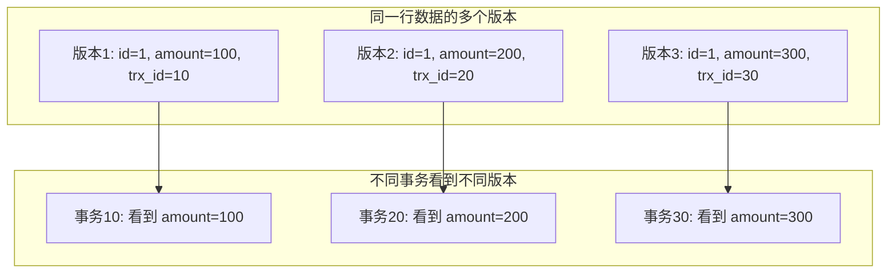
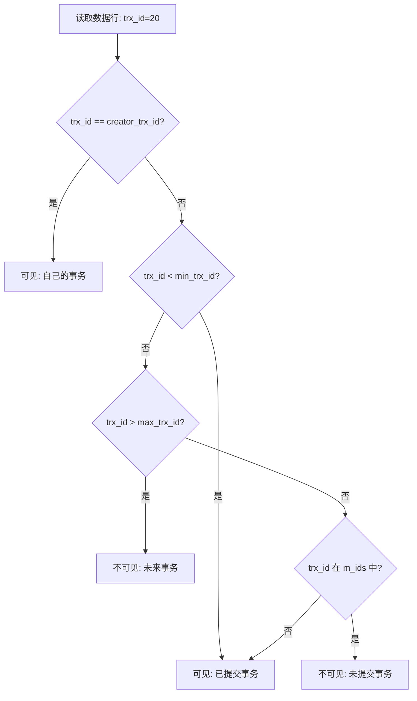
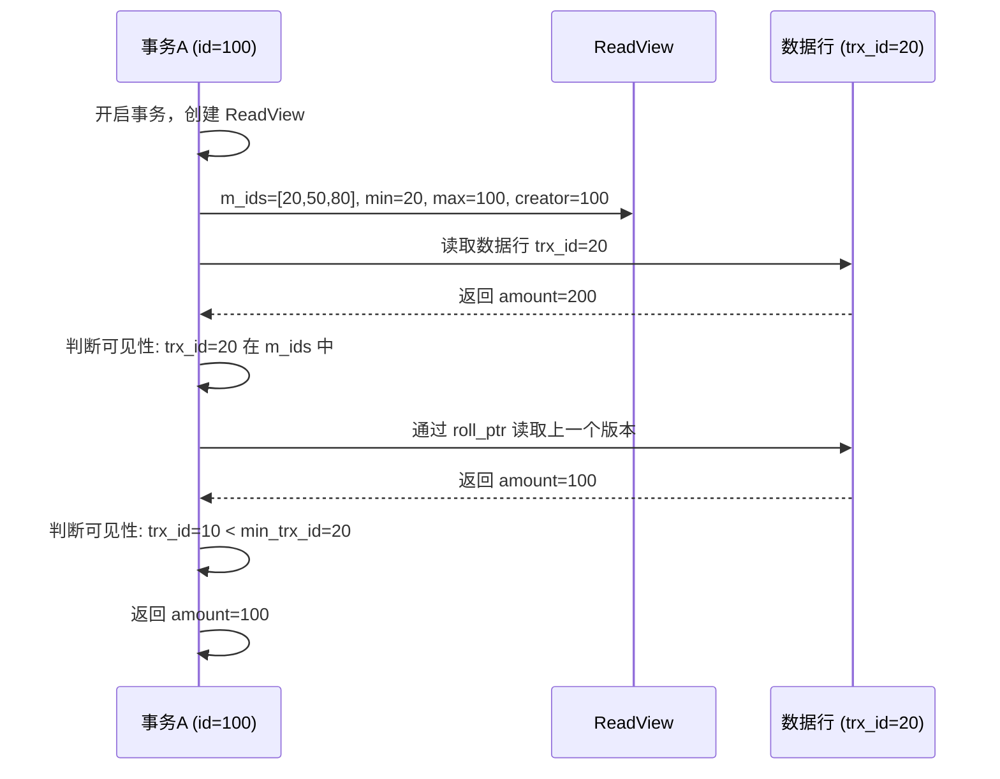

候选人小林在美团三面中，面试官问了一道 MySQL 深度题：

"什么是 MVCC？MySQL 怎么实现 MVCC 的？"

小林说："MVCC 是多版本并发控制，通过 undo log 实现。"

面试官追问："那 undo log 和 MVCC 是什么关系？ReadView 是什么？"

小林卡住了。

面试官继续问："Repeatable Read 隔离级别下，事务开启后第一次读取和第二次读取的数据版本有什么不同？"

小林彻底答不上来。

【面试官心理】
MVCC 是 MySQL 面试的深水区。能说出名字的占 40%，能讲清原理的占 15%，能画出完整数据版本的占 5%。这道题是 P7 的筛选器，答到最后的候选人基本都有源码阅读经验。

## 一、MVCC 是什么 🔴

### 1.1 核心思想

MVCC（Multi-Version Concurrency Control）是一种**并发控制机制**，通过为每个数据行维护多个版本，让读写操作互不阻塞。



### 1.2 为什么需要 MVCC

传统锁机制的缺点：
1. 读写操作互斥，写操作阻塞读操作
2. 长事务会阻塞大量读操作
3. 并发度低

MVCC 的优势：
1. 读写不互斥：读操作看到历史快照，写操作创建新版本
2. 读操作不阻塞写操作
3. 快照读不需要加锁

### 1.3 MVCC 解决的是哪类问题

```
MVCC 主要解决：快照读（SELECT）的并发问题
MVCC 无法解决：当前读（SELECT...FOR UPDATE / INSERT / UPDATE / DELETE）的并发问题
```

【面试官心理】
我问他 MVCC 解决什么问题，很多人会说"解决并发问题"，但说不清楚具体是哪类并发问题。分不清快照读和当前读的候选人，说明没有真正理解 MVCC 的适用范围。

## 二、InnoDB 的行结构 🔴

### 2.1 隐藏列

InnoDB 为每行数据添加了两个隐藏列：

| 隐藏列 | 含义 | 作用 |
| --- | --- | --- |
| DB_TRX_ID | 最近修改的事务 ID | 标识这行数据的版本 |
| DB_ROLL_PTR | 回滚指针 | 指向 undo log 链表的指针 |

```sql
-- 实际存储结构
-- +------------------------------------------------------+
-- | id | amount | DB_TRX_ID | DB_ROLL_PTR | ...其他字段 |
-- +------------------------------------------------------+
-- | 1  | 100    | 10        | 指针1       | ...         |
-- +------------------------------------------------------+
```

### 2.2 undo log 链

每行数据通过 DB_ROLL_PTR 形成一个链表，指向历史版本：


## 三、ReadView 机制 🔴

### 3.1 ReadView 的结构

ReadView 是快照读开启时生成的一个"视图"，记录了当前活跃事务的快照：

| 字段 | 含义 |
| --- | --- |
| m_ids | 活跃事务 ID 列表 |
| min_trx_id | 最小活跃事务 ID |
| max_trx_id | 创建 ReadView 时最大事务 ID |
| creator_trx_id | 创建该 ReadView 的事务 ID |

### 3.2 可见性判断规则

```
数据版本的可见性判断（trx_id 是数据行的事务 ID）：

1. trx_id == creator_trx_id？        → 可见（自己的事务）
2. trx_id < min_trx_id？             → 可见（已提交的事务）
3. trx_id > max_trx_id？            → 不可见（未来的事务）
4. trx_id 在 m_ids 中？              → 不可见（未提交的事务）
5. 否则                              → 可见（已提交的事务）
```



### 3.3 RC 和 RR 的区别

| 隔离级别 | ReadView 生成时机 | 效果 |
| --- | --- | --- |
| Read Committed | **每次快照读都生成** | 能看到其他已提交事务的修改 |
| Repeatable Read | **事务开始时只生成一次** | 整个事务都看到相同的历史快照 |

```sql
-- Read Committed: 每次读取都生成新的 ReadView
START TRANSACTION;
SELECT amount FROM orders WHERE id = 1;  -- ReadView1
-- 其他事务提交
SELECT amount FROM orders WHERE id = 1;  -- ReadView2，看到新数据

-- Repeatable Read: 只生成一次 ReadView
START TRANSACTION;
SELECT amount FROM orders WHERE id = 1;  -- ReadView1
-- 其他事务提交
SELECT amount FROM orders WHERE id = 1;  -- ReadView1，看不到新数据
```

【面试官心理】
这道追问能答对的候选人不到 30%。RC 和 RR 的核心区别就在 ReadView 的生成时机，能说清楚这个区别的基本都理解 MVCC 的核心原理。

## 四、MVCC 的执行流程 🟡

### 4.1 快照读的执行过程

```sql
SELECT amount FROM orders WHERE id = 1;
```



### 4.2 写入操作的版本链

```sql
-- 事务A (id=100) 执行 UPDATE
UPDATE orders SET amount = 300 WHERE id = 1;

-- 执行过程：
-- 1. 在原数据行上标记 DB_TRX_ID = 100
-- 2. 将原数据写入 undo log（版本2）
-- 3. 修改原数据行为 amount=300, DB_TRX_ID=100, DB_ROLL_PTR 指向版本2
```

## 五、快照读 vs 当前读 🟡

### 5.1 两种读操作的区分

| 类型 | 语句 | 加锁 | MVCC |
| --- | --- | --- | --- |
| 快照读 | SELECT ... | 不加锁 | 用 ReadView 读历史版本 |
| 当前读 | SELECT ... FOR UPDATE | 加锁 | 读取最新版本 |
| 当前读 | INSERT / UPDATE / DELETE | 加锁 | 读取最新版本并修改 |

```sql
-- 快照读：MVCC 保护，不加锁
SELECT * FROM orders WHERE id = 1;  -- 读取最新提交版本

-- 当前读：锁保护，读最新版本
SELECT * FROM orders WHERE id = 1 FOR UPDATE;  -- 读取最新版本并加排他锁
UPDATE orders SET amount = 300 WHERE id = 1;  -- 读取最新版本并加排他锁
INSERT INTO orders (...) VALUES (...);  -- 插入新版本
DELETE FROM orders WHERE id = 1;  -- 标记删除
```

### 5.2 为什么需要区分

```sql
-- 场景：统计订单数量（不需要精确实时数据）
START TRANSACTION;
-- 快照读：整个事务看到相同的订单列表
SELECT COUNT(*) FROM orders WHERE user_id = '1001';  -- 100 条

-- 业务处理...

SELECT COUNT(*) FROM orders WHERE user_id = '1001';  -- 还是 100 条
-- 不会看到中间其他事务的插入
COMMIT;
```

```sql
-- 场景：更新订单状态（必须读取最新数据）
START TRANSACTION;
-- 当前读：必须读取最新版本，避免覆盖其他事务的修改
SELECT * FROM orders WHERE id = 1 FOR UPDATE;
-- 此时其他事务的修改还未提交，当前读会等待

UPDATE orders SET status = 1 WHERE id = 1;
COMMIT;
```

:::warning ⚠️
MVCC 只保护快照读。当前读仍然需要加锁来保证串行化。混淆快照读和当前读是生产环境中产生并发 bug 的主要原因之一。
:::

【面试官心理】
这道追问能区分"会用"和"理解原理"。能说出快照读不加锁、当前读加锁的候选人，基本都踩过并发坑。

## 六、面试追问链 🟡

### 第一层：MVCC 是什么？
- 候选人：多版本并发控制，读写不互斥

### 第二层：InnoDB 的行结构有哪些隐藏列？
- 候选人：DB_TRX_ID, DB_ROLL_PTR

### 第三层：ReadView 的可见性判断规则是什么？
- 候选人：trx_id < min_trx_id 则可见

### 第四层：RC 和 RR 在 ReadView 上的区别是什么？
- 候选人：RC 每次读都生成新 ReadView，RR 只生成一次

### 第五层：为什么 UPDATE 操作不能使用快照读？
- 候选人：必须读取最新版本，否则会覆盖其他事务的修改

【面试官心理】
能答到第四层的候选人已经是少数。答到第五层并能用代码举例说明的，基本都是 P7 水准。

## 七、生产避坑

### 7.1 长事务导致 undo log 膨胀

```sql
-- ❌ 长事务的问题
START TRANSACTION;
-- 用户思考、浏览器卡顿...
-- 1小时后还在同一事务中
-- 这期间所有被修改的行都保留历史版本在 undo log
-- undo log 可能膨胀到几十 GB
COMMIT;

-- ✅ 正确做法
-- 将查询和修改分开
SELECT * FROM orders WHERE id = 1;  -- 事务A: 只读
-- 业务处理
UPDATE orders SET status = 1 WHERE id = 1;  -- 事务B: 只写
```

### 7.2 监控 undo log 使用

```sql
-- 查看 undo log 使用情况
SELECT * FROM information_schema.INNODB_UNDO_TRUNCATE;
```

:::tip 💡
生产环境中，建议设置 `innodb_max_undo_log_size` 并监控 undo 表空间使用率，避免长事务撑爆磁盘。
:::
