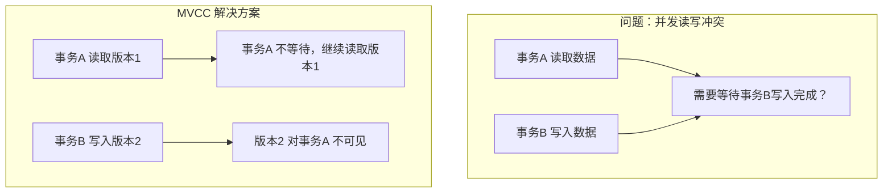
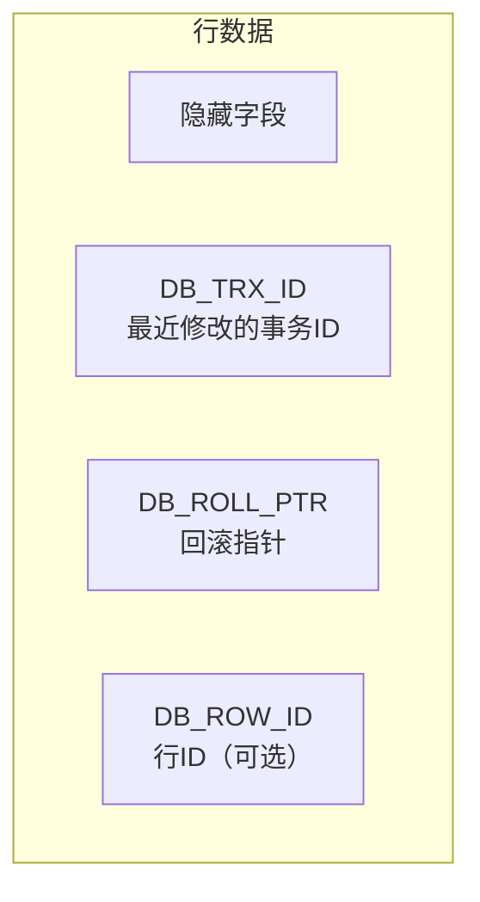
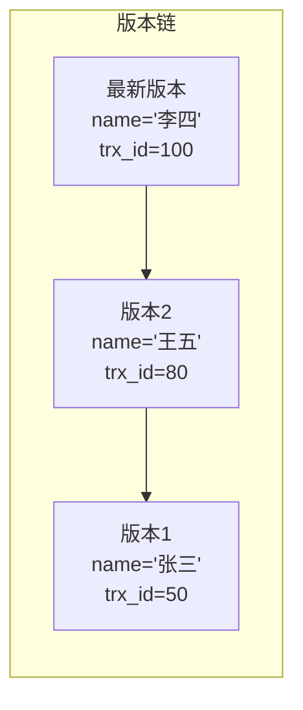
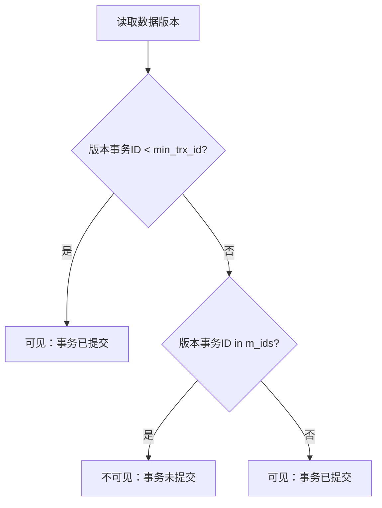

# MVCC 多版本并发控制

> 面试官问：「MySQL 是怎么实现可重复读的？」你说「通过 MVCC」——面试官追问「MVCC 是什么？它的底层原理是什么？」你开始支支吾吾。MVCC 是 MySQL 面试的最高频难点之一，这道题能区分 P6 和 P7 的技术水平。

## 面试官最关心的 3 个问题（快速自测）

| 问题 | 考察点 | 难度 |
|------|--------|------|
| MVCC 的全称是什么？解决了什么问题？ | 概念理解 | 🔴 高频 |
| MVCC 的实现原理是什么？ | 底层实现 | 🔴 高频 |
| ReadView 的生成时机和作用是什么？ | 深度理解 | 🟡 中频 |

---

## 一、MVCC 概述

### 1.1 MVCC 定义

**MVCC（Multi-Version Concurrency Control）**：多版本并发控制，通过保存数据的多个版本，实现读写不冲突，提高数据库并发性能。

### 1.2 MVCC 解决的问题



| 问题 | 无 MVCC | 有 MVCC |
|------|---------|---------|
| 读操作 | 需要加锁，阻塞写操作 | 读写不冲突 |
| 写操作 | 需要等待读完成 | 写操作可以并发 |
| 并发性能 | 低 | 高 |

### 1.3 MVCC 与事务隔离级别

| 隔离级别 | MVCC 支持 |
|----------|-----------|
| READ UNCOMMITTED | ❌ 不支持 |
| READ COMMITTED | ✅ 支持 |
| REPEATABLE READ | ✅ 支持 |
| SERIALIZABLE | ❌ 不支持（使用锁） |

---

## 二、MVCC 核心概念

### 2.1 隐藏字段

InnoDB 存储引擎为每行数据添加了三个隐藏字段：



| 字段 | 说明 |
|------|------|
| `DB_TRX_ID` | 最近修改（INSERT/UPDATE）的事务 ID |
| `DB_ROLL_PTR` | 指向 undo log 的指针，用于构建版本链 |
| `DB_ROW_ID` | 行 ID，主键未指定时自动生成 |

### 2.2 undo log 版本链



**版本链形成原理**：

1. 事务 50 插入 `name='张三'`
2. 事务 80 更新为 `name='王五'`，原值写入 undo log
3. 事务 100 更新为 `name='李四'`，原值写入 undo log

### 2.3 ReadView

**ReadView**：读视图，记录当前活跃事务 ID 列表和最小/最大事务 ID。

```mermaid
graph TD
    subgraph "ReadView 结构"
        A[ReadView]
        B[m_ids<br/>活跃事务ID列表: [50, 80]]
        C[min_trx_id<br/>最小活跃事务ID: 50]
        D[max_trx_id<br/>最大活跃事务ID: 100]
        E[creator_trx_id<br/>当前事务ID: 100]
    end
```

---

## 三、MVCC 查询流程

### 3.1 可见性判断算法



### 3.2 可见性判断规则

| 条件 | 说明 |
|------|------|
| `trx_id < min_trx_id` | 版本在所有活跃事务之前，**可见** |
| `trx_id in m_ids` | 版本被活跃事务修改，**不可见** |
| `trx_id > max_trx_id` | 读取生成 ReadView 后开启的事务，**不可见** |
| 其他 | **可见** |

### 3.3 快照读示例

```sql
-- 假设当前 ReadView: m_ids=[50,80], min=50, max=100, creator=100

-- 读取 name='张三' (trx_id=30)
-- 30 < 50? 是 → 可见 → 返回 '张三'

-- 读取 name='李四' (trx_id=80)
-- 80 in [50,80]? 是 → 不可见 → 沿着版本链查找

-- 读取 name='王五' (trx_id=80 的 undo log, 实际 trx_id=50)
-- 50 < 50? 是 → 可见 → 返回 '王五'
```

---

## 四、不同隔离级别的 ReadView 策略

### 4.1 READ COMMITTED：每次读取生成新 ReadView

```sql
-- 事务A (READ COMMITTED)
BEGIN;
SELECT * FROM users WHERE id = 1;  -- ReadView1: m_ids=[B]

-- 事务B
BEGIN;
UPDATE users SET name = '李四' WHERE id = 1;
COMMIT;  -- B 提交

-- 事务A
SELECT * FROM users WHERE id = 1;  -- 生成新 ReadView2: m_ids=[]
-- ReadView2 可见 B 的修改 → 读到 '李四'（不可重复读）
```

### 4.2 REPEATABLE READ：事务开始时生成 ReadView

```sql
-- 事务A (REPEATABLE READ)
BEGIN;
SELECT * FROM users WHERE id = 1;  -- ReadView1: m_ids=[B]

-- 事务B
BEGIN;
UPDATE users SET name = '李四' WHERE id = 1;
COMMIT;  -- B 提交

-- 事务A
SELECT * FROM users WHERE id = 1;  -- 复用 ReadView1: m_ids=[B]
-- B 已提交，但 trx_id=80 仍在 m_ids 中 → 不可见 → 读到 '张三'（可重复读）
```

---

## 五、MVCC + 临键锁解决幻读

### 5.1 快照读 vs 当前读

| 类型 | 特点 | MVCC 支持 | 锁 |
|------|------|-----------|-----|
| **快照读** | 读取历史版本，不加锁 | ✅ MVCC | 无锁 |
| **当前读** | 读取最新版本，加锁 | ❌ 最新数据 | 记录锁/间隙锁 |

```sql
-- 快照读（MVCC）
SELECT * FROM users;  -- 不加锁

-- 当前读（加锁）
SELECT * FROM users FOR UPDATE;  -- 加锁
INSERT INTO users VALUES(...);  -- 加锁
UPDATE users SET ...;  -- 加锁
DELETE FROM users ...;  -- 加锁
```

### 5.2 解决幻读的组合拳

```sql
-- 事务A (REPEATABLE READ)
BEGIN;

-- 快照读：MVCC 保证不幻读
SELECT * FROM users WHERE id > 100;  -- 读到 0 条

-- 当前读：临键锁 + MVCC 保证不幻读
SELECT * FROM users WHERE id > 100 FOR UPDATE;

-- 事务B 尝试插入
INSERT INTO users VALUES (101, '王五');  -- 阻塞！（临键锁锁住区间）
```

---

## 六、常见面试陷阱

:::danger 陷阱 1：混淆 MVCC 和锁
错误理解：「MVCC 是一种锁机制」
正确理解：MVCC 是多版本并发控制，通过版本链和 ReadView 实现读写不冲突。与锁是两种不同的并发控制方式。
:::

:::danger 陷阱 2：认为 MVCC 可以完全替代锁
错误理解：「MVCC 就不需要加锁了」
正确理解：MVCC 只解决了快照读的并发问题。当前读和写操作仍需要加锁（如 `FOR UPDATE`、`INSERT`）。
:::

:::danger 陷阱 3：忽略 undo log 的清理时机
错误理解：「undo log 会无限增长」
正确理解：purge 线程会定期清理不再需要的 undo log（当没有事务需要读取时）。
:::

---

## 七、加分回答

> 💡 **MVCC 与 Undo Log 的生命周期**：
> - INSERT 操作产生的 undo log：事务提交后即可清理
> - UPDATE/DELETE 操作产生的 undo log：需要等待所有活跃事务不再需要时才能清理
> - 清理时机由 purge 线程控制

> 💡 **MySQL 8.0 的改进**：
> MySQL 8.0 引入了 **聚簇索引记录直接存储事务 ID** 的优化，避免了回滚指针的查找，提升了 MVCC 的读取性能。

> 💡 **MVCC 的存储开销**：
> MVCC 需要存储多版本数据，开销包括：
> 1. 行数据膨胀：每行多了两个隐藏字段
> 2. undo log 膨胀：需要保留历史版本
> 3. purge 成本：定期清理 undo log 有一定开销

---

## 八、总结对比表

| 概念 | 说明 |
|------|------|
| MVCC | 多版本并发控制，读写不冲突 |
| 隐藏字段 | DB_TRX_ID（事务ID）、DB_ROLL_PTR（回滚指针） |
| 版本链 | 通过 undo log 连接的历史版本 |
| ReadView | 读视图，判断版本可见性 |

| 隔离级别 | ReadView 生成时机 |
|----------|------------------|
| READ COMMITTED | 每次 SELECT 生成新 ReadView |
| REPEATABLE READ | 事务开始时生成 ReadView |

| 操作类型 | MVCC 支持 | 锁支持 |
|----------|-----------|--------|
| 快照读 SELECT | ✅ 支持 | 无锁 |
| 当前读 SELECT | ❌ 最新数据 | ✅ 加锁 |
| INSERT | ❌ 最新数据 | ✅ 加锁 |
| UPDATE/DELETE | ❌ 最新数据 | ✅ 加锁 |