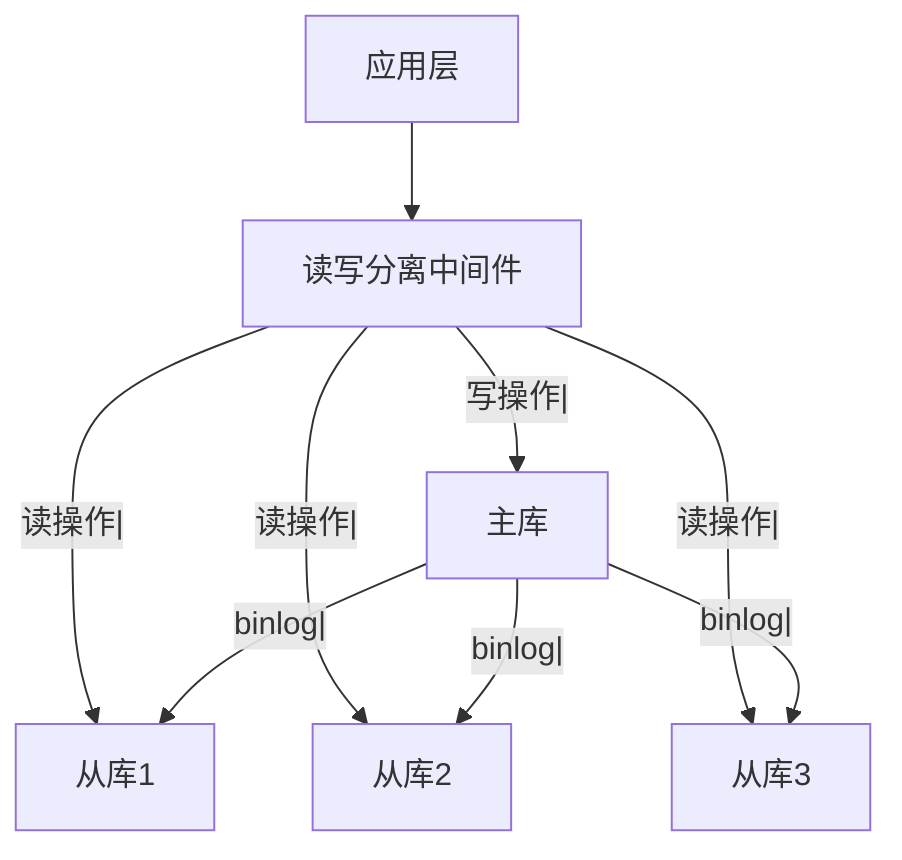
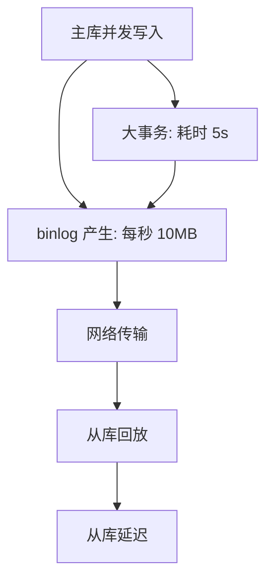

候选人小张在字节 P7 架构面中，面试官问：

"你们的数据库怎么扛住高并发的读请求？"

小张说："我们用了读写分离，主库负责写，从库负责读。"

面试官追问："读写分离有什么问题？怎么解决？"

小张说："可能会有延迟...可以加缓存..."

面试官继续追问："具体什么延迟？延迟了怎么处理？"

小张答不上来了。

【面试官心理】
这道题我用来测试候选人对数据库高可用架构的理解深度。能说出读写分离的占 60%，能讲清延迟问题的占 30%，能提出完整解决方案的占 10%。读写分离是 MySQL 架构中的核心概念。

## 一、读写分离的原理 🔴

### 1.1 架构图



### 1.2 核心原理

```
1. 所有写操作路由到主库
2. 所有读操作路由到从库
3. 主库通过 binlog 同步数据到从库
4. 从库提供只读能力
```

### 1.3 性能提升

| 场景 | 单库 | 读写分离 (1主3从) |
| --- | --- | --- |
| 写 QPS | 1000 | 1000 |
| 读 QPS | 1000 | 4000 |
| 总 QPS | 2000 | 5000 |

## 二、实现方式 🔴

### 2.1 应用层直连

```java
// 手动路由
public class DataSourceRouter {
    private DataSource master;
    private List<DataSource> slaves;

    public DataSource getDataSource(boolean write) {
        if (write) {
            return master;
        }
        // 轮询选择从库
        int index = (int) (System.currentTimeMillis() % slaves.size());
        return slaves.get(index);
    }
}

// 使用
@Bean
public DataSource dataSource() {
    // 配置主从数据源
    return new DataSourceRouter(master, slaves);
}
```

### 2.2 中间件方案

```yaml
# ShardingSphere 配置
schemaName: sharding_db
dataSources:
  ds_master:
    url: jdbc:mysql://master:3306/db
    username: root
    password: password
  ds_slave_1:
    url: jdbc:mysql://slave1:3306/db
  ds_slave_2:
    url: jdbc:mysql://slave2:3306/db

rules:
  - !readwrite_splitting:
      tables:
        ds_order:
          dataSources:
            ms_order:
              write-data-source-name: ds_master
              read-data-source-names: ds_slave_1, ds_slave_2
              loadBalancerName: round_robin
```

### 2.3 MySQL Router / ProxySQL

```ini
# ProxySQL 配置
# /etc/proxysql.cnf

[mysql-servers]
hostgroup_id=10, hostname=master, port=3306, status=ONLINE
hostgroup_id=20, hostname=slave1, port=3306, status=ONLINE
hostgroup_id=20, hostname=slave2, port=3306, status=ONLINE

[rules]
# 写操作路由到主库
=^(SELECT|INSERT|UPDATE|DELETE) WRITE => hostgroup=10
# 读操作路由到从库
=^SELECT.*FROM => hostgroup=20
```

## 三、主从延迟问题 🟡

### 3.1 延迟的原因



常见原因：
1. 网络延迟
2. 从库硬件性能差
3. 大事务执行时间长
4. 从库并发压力大
5. binlog 格式不当（STATEMENT 格式）

### 3.2 延迟的影响

```sql
-- 用户下单后立即查询订单
-- 可能查不到（因为主从延迟）

-- 场景：
-- 1. 用户下单 → 写入主库 → 返回成功
-- 2. 用户查询 → 路由到从库 → 从库还没同步 → 查不到订单！
```

### 3.3 延迟监控

```sql
SHOW SLAVE STATUS\G;

-- 关键指标：
-- Seconds_Behind_Master: 延迟秒数
-- Slave_IO_Running: I/O 线程状态
-- Slave_SQL_Running: SQL 线程状态
-- Relay_Log_Pos: Relay Log 位置
```

```java
// 应用层监控
public boolean isReplicationLagOk() {
    Long lag = jdbcTemplate.queryForObject(
        "SHOW SLAVE STATUS",
        (rs, rowNum) -> rs.getLong("Seconds_Behind_Master")
    );
    return lag != null && lag < 3;  // 延迟小于 3 秒
}
```

## 四、延迟解决方案 🟡

### 4.1 强制读主库

```java
// 对于必须读取最新数据的场景，强制读主库
@ReadOnlyConnection
public Order getOrder(Long id) {
    return orderMapper.selectById(id);
}

// 需要强制读主库时
@Transactional
public Order getOrderForceMaster(Long id) {
    return jdbcTemplate.queryForObject(
        "SELECT * FROM orders WHERE id = ?",
        id
    );  // 不加 @ReadOnlyConnection，路由到主库
}
```

### 4.2 延迟感知

```java
// 延迟大于阈值时，自动切换到主库
public Order getOrder(Long id) {
    Long lag = getReplicationLag();
    if (lag > 5) {  // 延迟超过 5 秒
        return getFromMaster(id);  // 强制读主库
    }
    return getFromSlave(id);  // 读从库
}
```

### 4.3 记录级延迟判断

```sql
-- 在主库记录写入时间
ALTER TABLE orders ADD COLUMN db_create_time TIMESTAMP DEFAULT CURRENT_TIMESTAMP;

-- 查询时判断
SELECT *, TIMESTAMPDIFF(SECOND, db_create_time, NOW()) AS lag
FROM orders
WHERE id = ?;

-- 如果 lag > 阈值，切换到主库
```

### 4.4 半同步复制

```sql
-- 配置半同步复制
INSTALL PLUGIN rpl_semi_sync_master SONAME 'semisync_master.so';
INSTALL PLUGIN rpl_semi_sync_slave SONAME 'semisync_slave.so';

SET GLOBAL rpl_semi_sync_master_wait_point = 'AFTER_SYNC';
```

:::warning ⚠️
半同步复制会增加写操作延迟（需要等待至少一个从库确认）。适合写少读多、对一致性要求高的场景。
:::

## 五、路由策略 🟡

### 5.1 负载均衡算法

```java
public interface LoadBalancer {
    DataSource select(List<DataSource> candidates);
}

// 轮询
public class RoundRobinLB implements LoadBalancer {
    private AtomicInteger index = new AtomicInteger(0);

    public DataSource select(List<DataSource> candidates) {
        int i = index.getAndIncrement() % candidates.size();
        return candidates.get(i);
    }
}

// 随机
public class RandomLB implements LoadBalancer {
    public DataSource select(List<DataSource> candidates) {
        return candidates.get((int) (Math.random() * candidates.size()));
    }
}

// 最少连接
public class LeastConnectionLB implements LoadBalancer {
    private Map<DataSource, AtomicInteger> connections = new ConcurrentHashMap<>();

    public DataSource select(List<DataSource> candidates) {
        return candidates.stream()
            .min(Comparator.comparing(c -> connections.get(c).get()))
            .orElseThrow();
    }
}
```

### 5.2 注解路由

```java
// 自定义注解标记需要写主库的操作
@Target(ElementType.METHOD)
@Retention(RetentionPolicy.RUNTIME)
public @interface Master {
}

// AOP 切面
@Aspect
@Component
public class DataSourceAspect {
    @Around("@annotation(Master)")
    public Object routeToMaster(ProceedingJoinPoint pjp) throws Throwable {
        DataSourceHolder.setMaster();
        try {
            return pjp.proceed();
        } finally {
            DataSourceHolder.clear();
        }
    }
}

// 使用
@Service
public class OrderService {
    @Master
    public void createOrder(Order order) {
        // 强制写主库
    }

    public Order getOrder(Long id) {
        // 默认读从库
    }
}
```

## 六、生产避坑 🟡

### 6.1 缓存引发的双重延迟

```java
// ❌ 错误：先查缓存，没有再查数据库
public Order getOrder(Long id) {
    Order order = cache.get(id);
    if (order == null) {
        order = orderMapper.selectById(id);  // 路由到从库
        cache.put(id, order);
    }
    return order;
}

// 如果主从延迟 2 分钟，缓存失效后从从库查到的是旧数据
// 缓存会缓存 2 分钟的旧数据
```

### 6.2 事务内读问题

```java
// ❌ 事务内先写后读，读到的是从库旧数据
@Transactional
public void processOrder(Long id) {
    orderMapper.updateStatus(id, 1);  // 写主库
    Order order = orderMapper.selectById(id);  // 默认读从库，可能读到旧数据！
}
```

:::tip 💡
事务内读写都要路由到主库。Spring 的 `@Transactional` 注解应该配合 `@Master` 注解使用。
:::

## 七、面试追问链 🟡

**第一层**：读写分离的原理是什么？
- 候选人：写主库，读从库

**第二层**：主从延迟怎么监控？
- 候选人：Seconds_Behind_Master

**第三层**：主从延迟了怎么处理？
- 候选人：强制读主库、延迟感知

**第四层**：事务内怎么保证一致性？
- 候选人：事务内强制读主库
