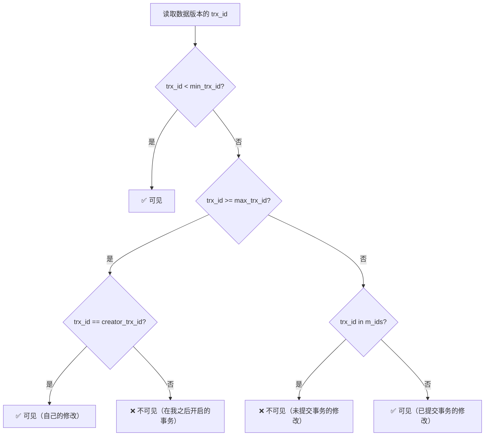

# ReadView 可见性判断

> 面试官问：「ReadView 是什么时候生成的？它是判断数据可见性的核心，你能手写一个判断逻辑吗？」这是一道 P7 级别的高难度问题。ReadView 不仅仅是背概念，而是要理解它的工作原理。

## 面试官最关心的 3 个问题（快速自测）

| 问题 | 考察点 | 难度 |
|------|--------|------|
| ReadView 包含哪些字段？各自的作用是什么？ | 原理理解 | 🔴 高频 |
| ReadView 的生成时机在 READ COMMITTED 和 REPEATABLE READ 有什么区别？ | 深度理解 | 🔴 高频 |
| ReadView 如何判断一个数据版本是否对当前事务可见？ | 源码级别 | 🟡 中频 |

---

## 一、ReadView 核心结构

### 1.1 ReadView 字段定义

```java
public class ReadView {
    // 活跃事务 ID 列表
    private final List<Long> m_ids;

    // 活跃事务 ID 的最小值
    private final long min_trx_id;

    // 活跃事务 ID 的最大值 + 1
    private final long max_trx_id;

    // 创建该 ReadView 的事务 ID
    private final long creator_trx_id;
}
```

### 1.2 ReadView 生成时机

| 隔离级别 | ReadView 生成时机 | 效果 |
|----------|------------------|------|
| READ COMMITTED | 每次 SELECT | 每次读取可能看到不同数据 |
| REPEATABLE READ | 事务开始时 | 整个事务看到相同数据 |
| SERIALIZABLE | 每次 SELECT | 使用锁，不依赖 ReadView |

---

## 二、可见性判断算法

### 2.1 核心判断逻辑



### 2.2 判断规则总结

| 条件 | 结果 | 说明 |
|------|------|------|
| `trx_id < min_trx_id` | **可见** | 版本在所有活跃事务之前创建 |
| `trx_id >= max_trx_id` | **不可见** | 版本在 ReadView 创建之后 |
| `trx_id == creator_trx_id` | **可见** | 自己的修改 |
| `trx_id in m_ids` | **不可见** | 活跃事务的修改 |
| 其他情况 | **可见** | 已提交事务的修改 |

### 2.3 Java 伪代码实现

```java
public class ReadView {
    private final List<Long> m_ids;
    private final long min_trx_id;
    private final long max_trx_id;
    private final long creator_trx_id;

    public boolean isVisible(long trx_id) {
        // 1. 如果是自己创建的版本，可见
        if (trx_id == creator_trx_id) {
            return true;
        }

        // 2. 如果版本事务 ID 小于最小活跃事务 ID，说明已提交，可见
        if (trx_id < min_trx_id) {
            return true;
        }

        // 3. 如果版本事务 ID 大于等于最大事务 ID，说明在 ReadView 创建之后，不可见
        if (trx_id >= max_trx_id) {
            return false;
        }

        // 4. 如果版本事务 ID 在活跃事务列表中，不可见
        if (m_ids.contains(trx_id)) {
            return false;
        }

        // 5. 其他情况可见（已提交事务的修改）
        return true;
    }
}
```

---

## 三、实战案例分析

### 3.1 场景设定

```
时间线：
T1: 事务 100 开始
T2: 事务 100 读取数据，看到 name='张三'（版本1）
T3: 事务 80 开始
T4: 事务 80 修改 name='王五'，提交
T5: 事务 100 再次读取，应该看到什么？
```

### 3.2 REPEATABLE READ 分析

```sql
-- 事务 100 (REPEATABLE READ)
BEGIN;
-- T1: 事务开始，生成 ReadView
-- ReadView: m_ids=[80], min_trx_id=80, max_trx_id=101

-- T2: 读取 name='张三'
SELECT * FROM users WHERE id = 1;  -- trx_id=50 < 80，可见，返回 '张三'

-- T4: 事务 80 提交

-- T5: 再次读取
SELECT * FROM users WHERE id = 1;
-- trx_id=80 >= 80? 是
-- trx_id=80 in [80]? 是 → 不可见
-- 沿着版本链查找：trx_id=50 < 80 → 可见，返回 '张三'
```

### 3.3 READ COMMITTED 分析

```sql
-- 事务 100 (READ COMMITTED)
BEGIN;

-- T1: 第一次读取，生成 ReadView1
-- ReadView1: m_ids=[], min_trx_id=80, max_trx_id=81
SELECT * FROM users WHERE id = 1;  -- trx_id=50 < 80，可见，返回 '张三'

-- T3: 事务 80 开始

-- T4: 事务 80 提交

-- T5: 再次读取，生成新 ReadView2
-- ReadView2: m_ids=[], min_trx_id=81, max_trx_id=82
SELECT * FROM users WHERE id = 1;
-- trx_id=80 < 81? 是 → 可见，返回 '王五'（不可重复读）
```

---

## 四、版本链遍历

### 4.1 遍历流程

```mermaid
graph TD
    A[读取当前版本] --> B{ReadView.isVisible(trx_id)?}
    B -->|可见| C[返回该版本]
    B -->|不可见| D[沿着 DB_ROLL_PTR 读取 undo log]
    D --> E[获取 undo log 中的历史版本]
    E --> F{ReadView.isVisible(trx_id)?}
    F -->|可见| C
    F -->|不可见| G[继续遍历]
    G --> H[直到版本链尾部]
    H --> I[返回空或最新可见版本]
```

### 4.2 代码示例

```java
public Row findVisibleRow(long tableId, long rowId, ReadView readView) {
    // 获取最新版本
    RowVersion current = getLatestRowVersion(rowId);

    while (current != null) {
        // 判断可见性
        if (readView.isVisible(current.trx_id)) {
            return current;
        }

        // 不可见，沿着版本链向上查找
        current = getPreviousVersion(current);
    }

    return null;
}
```

---

## 五、常见面试陷阱

:::danger 陷阱 1：认为 m_ids 是已提交事务列表
错误理解：「m_ids 存储的是已提交的事务 ID」
正确理解：m_ids 存储的是**活跃（未提交）事务**的 ID，是一个快照。
:::

:::danger 陷阱 2：混淆 max_trx_id 的含义
错误理解：「max_trx_id 是最大事务 ID」
正确理解：max_trx_id 是「创建 ReadView 时，最大的活跃事务 ID + 1」，用于判断版本是否在 ReadView 之后创建。
:::

:::danger 陷阱 3：忽略 creator_trx_id 的判断
错误理解：「自己创建的版本也不可见」
正确理解：如果 trx_id == creator_trx_id，说明是当前事务自己的修改，是可见的。
:::

---

## 六、加分回答

> 💡 **ReadView 的创建位置**：
> ReadView 是在**服务层**创建的，而不是存储引擎层。InnoDB 只负责提供版本链和 undo log，读取的可见性判断由 MySQL Server 层的 MVCC 模块完成。

> 💡 **ReadView 与 purge 的关系**：
> 当一个事务提交后，它会从事务列表中移除。但在此之前产生的 undo log 不能立即删除，因为可能有其他事务的 ReadView 还需要读取它。只有当所有 ReadView 都不需要某个 undo log 时，purge 线程才会清理它。

> 💡 **MySQL 8.0 的改进**：
> MySQL 8.0 优化了 ReadView 的创建时机和判断逻辑，减少了不必要的版本链遍历。

---

## 七、总结对比表

| 字段 | 含义 | 作用 |
|------|------|------|
| `m_ids` | 活跃事务 ID 列表 | 判断是否有未提交事务 |
| `min_trx_id` | 最小活跃事务 ID | 判断版本是否在所有活跃事务之前 |
| `max_trx_id` | 最大活跃事务 ID + 1 | 判断版本是否在 ReadView 之后 |
| `creator_trx_id` | 当前事务 ID | 判断是否是自己的修改 |

| 可见性条件 | 结果 |
|-----------|------|
| `trx_id < min_trx_id` | ✅ 可见 |
| `trx_id >= max_trx_id` | ❌ 不可见 |
| `trx_id == creator_trx_id` | ✅ 可见 |
| `trx_id in m_ids` | ❌ 不可见 |
| 其他 | ✅ 可见 |

| 隔离级别 | ReadView 策略 |
|----------|---------------|
| READ COMMITTED | 每次读取生成新 ReadView |
| REPEATABLE READ | 事务开始时生成 ReadView |