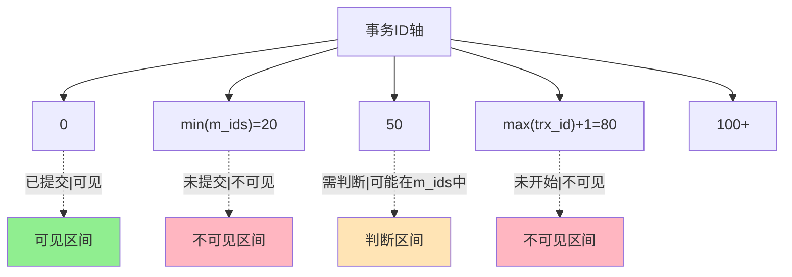
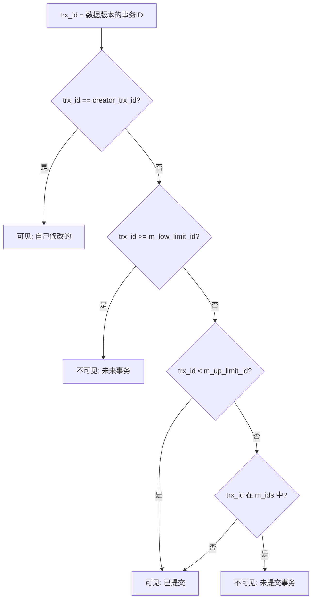

候选人小张在蚂蚁金服面试中，被追问到 MVCC 的底层实现：

"ReadView 是怎么判断一个数据版本对当前事务可见的？"

小张说："通过事务 ID 来判断，如果事务 ID 比当前事务小就能看到。"

面试官追问："那如果数据版本的事务 ID 是 50，但当前活跃事务列表里有 [20, 30, 80]，你觉得 50 可见吗？"

小张开始算：50 比 20 和 30 大，比 80 小...到底看不看到？

小张卡住了。

【面试官心理】
这道题我用来测试候选人对 ReadView 可见性算法的理解深度。能背出判断规则的占 30%，能正确应用规则的占 10%，能画出完整判断流程的占 5%。ReadView 是 MVCC 的核心，能答对这道题的候选人基本都看过源码。

## 一、ReadView 的数据结构 🔴

### 1.1 源码结构

```cpp
// MySQL 8.0 源码 (read0types.h)
struct ReadView {
    // 事务ID相关
    trx_id_t m_low_limit_id;      // 高水位，已创建的最大事务ID + 1
    trx_id_t m_up_limit_id;       // 低水位，最小活跃事务ID
    trx_id_t m_creator_trx_id;    // 创建该 ReadView 的事务ID

    // 活跃事务列表
    ids_t m_ids;                  // 活跃事务ID列表（已启动但未提交的事务）

    // 其他标志
    bool m_closed;                // ReadView 是否已关闭
};
```

### 1.2 关键字段的含义

| 字段 | 含义 | 作用 |
| --- | --- | --- |
| m_low_limit_id | 高水位 | 所有事务 ID `< m_low_limit_id` 的事务都已提交 |
| m_up_limit_id | 低水位 | 所有事务 ID `< m_up_limit_id` 且在 m_ids 中的事务未提交 |
| m_ids | 活跃事务列表 | 记录当前 ReadView 创建时，所有未提交的事务 ID |
| m_creator_trx_id | 创建者事务 ID | 当前事务自己的 ID |

### 1.3 为什么需要这些字段

```
m_up_limit_id = min(m_ids)
m_low_limit_id = max(已创建事务ID) + 1
```



## 二、可见性判断算法 🔴

### 2.1 判断规则（源码逻辑）

```cpp
// MySQL 8.0 源码 (read0.cc)
bool changes_trx(trx_id_t trx_id) {
    // 规则1: 如果数据的事务ID等于当前事务ID，可见（自己的修改）
    if (trx_id == m_creator_trx_id) {
        return(false);  // 可见，返回 false 表示没有改动
    }

    // 规则2: 如果事务ID >= m_low_limit_id，不可见（未来的事务）
    if (trx_id >= m_low_limit_id) {
        return(true);  // 不可见
    }

    // 规则3: 如果事务ID < m_up_limit_id，可见（早期事务已提交）
    if (trx_id < m_up_limit_id) {
        return(false);  // 可见
    }

    // 规则4: 如果在活跃事务列表中，不可见（未提交的事务）
    if (!m_ids.empty() && trx_id >= m_up_limit_id) {
        for (trx_id_t id : m_ids) {
            if (id == trx_id) {
                return(true);  // 在列表中，不可见
            }
        }
    }

    // 规则5: 其他情况，可见
    return(false);
}
```

### 2.2 判断流程图



### 2.3 回答开篇那道题

```
ReadView: m_ids=[20, 30, 80], m_up_limit_id=20, m_low_limit_id=100
数据版本 trx_id=50 是否可见？

判断步骤：
1. trx_id == creator_trx_id? → 取决于是否是自己事务（假设不是）
2. trx_id >= m_low_limit_id(100)? → 否
3. trx_id < m_up_limit_id(20)? → 否（50 >= 20）
4. trx_id 在 m_ids=[20, 30, 80] 中? → 否（50 不在列表中）

结论：trx_id=50 **可见**
```

## 三、RC 和 RR 的 ReadView 差异 🔴

### 3.1 Repeatable Read：事务开始时创建

```sql
-- 事务A（Repeatable Read）
START TRANSACTION;

-- 第一次读取：创建 ReadView
SELECT * FROM orders WHERE id = 1;
-- ReadView: m_ids=[B, C], m_up_limit_id=min([B,C]), m_low_limit_id=max+1

-- 事务B 提交（id=30）
-- 事务C 提交（id=50）

-- 第二次读取：复用同一个 ReadView
SELECT * FROM orders WHERE id = 1;
-- 同一个 ReadView，所以看不到 B 和 C 的提交
```

### 3.2 Read Committed：每次读取都创建

```sql
-- 事务A（Read Committed）
START TRANSACTION;

-- 第一次读取：创建 ReadView1
SELECT * FROM orders WHERE id = 1;
-- ReadView1: m_ids=[B, C]

-- 事务B 提交（id=30）

-- 第二次读取：创建新的 ReadView2
SELECT * FROM orders WHERE id = 1;
-- ReadView2: m_ids=[C]（B 已提交，不在列表中）
-- 事务A 这次能看到 B 的提交
```

```mermaid
graph TD
    subgraph Repeatable Read
        RA1[事务A开启 ReadView] --> RA2["m_ids=[B,C]"]
        RA2 --> RA3[读取数据V1]
        RA3 --> RA4[B提交]
        RA4 --> RA5[读取数据V1（复用ReadView）]
        RA5 --> RA6[结果和第一次一样]
    end
    subgraph Read Committed
        RC1[事务A开启 ReadView1] --> RC2["m_ids=[B,C]"]
        RC2 --> RC3[读取数据V1]
        RC3 --> RC4[B提交]
        RC4 --> RC5[开启 ReadView2: m_ids=[C]"]
        RC5 --> RC6[读取数据V2（能看到B提交）]
    end
```

【面试官心理】
这是 MVCC 最核心的差异。能讲清楚 RC 每次读都生成新 ReadView，RR 只生成一次的候选人，基本都理解 MVCC 的本质。

## 四、实际例子 🟡

### 4.1 完整时间线

```
时间轴：

T1: 事务A (id=10) 开启，ReadView: m_ids=[]
T2: 事务B (id=20) 开启
T3: 事务A 读取数据 amount=100 (trx_id=0，未被任何事务修改)
T4: 事务B UPDATE orders SET amount=200 WHERE id=1 (trx_id=20)
T5: 事务C (id=30) 开启
T6: 事务A 再次读取 amount=? (trx_id=20)

判断 trx_id=20 对事务A 是否可见：
1. trx_id == creator_trx_id(10)? → 否
2. trx_id >= m_low_limit_id? → 取决于当前最大事务ID
3. trx_id < m_up_limit_id? → m_up_limit_id=20(trx_id < 20)？→ 否
4. trx_id 在 m_ids=[20, 30] 中? → 是！

结论：trx_id=20 在活跃事务列表中，**不可见**，事务A 读到 amount=100
```

### 4.2 幻读场景分析

```sql
-- 事务A (RR 级别)
START TRANSACTION;

-- 第一次读取
SELECT COUNT(*) FROM orders WHERE user_id = '1001';  -- 10 条
-- ReadView: m_ids=[20, 30]

-- 事务B (id=40) 新增一条数据
INSERT INTO orders (user_id, amount) VALUES ('1001', 100);
COMMIT;

-- 事务A 再次读取
SELECT COUNT(*) FROM orders WHERE user_id = '1001';  -- ?

-- trx_id=40 判断：
1. trx_id=40 >= m_low_limit_id? → 如果 max_txn_id=50, 则 40 < 50, 不确定
2. trx_id=40 >= m_up_limit_id(20)? → 是
3. trx_id=40 在 m_ids=[20, 30] 中? → 否

结论：trx_id=40 不在活跃事务列表中，**不可见**
事务A 看到还是 10 条，没有幻读
```

## 五、ReadView 的清理 🟡

### 5.1 什么时候可以清理 ReadView

当一个事务提交后，如果没有任何其他事务的 ReadView 还需要看到它的版本，这个 ReadView 就可以清理了。

```sql
-- 事务A 提交后
-- 事务B 的 ReadView: m_ids=[A, C]
-- 事务C 的 ReadView: m_ids=[A, B]

-- 事务A 提交后：
-- 事务B 的 ReadView: m_ids=[C]（A 已不在）
-- 事务C 的 ReadView: m_ids=[B]（A 已不在）
```

### 5.2 purge 操作

MySQL 后台线程定期清理不再需要的 undo log 页面：

```sql
-- 监控 purge 进度
SHOW ENGINE INNODB STATUS;

-- History list length: undo log 页面数量
-- 如果持续增长，说明 purge 跟不上，可能有长事务
```

:::warning ⚠️
长事务会导致 undo log 无法清理，持续膨胀。这是生产环境中非常常见的问题。
:::

【面试官心理】
能答出 ReadView 清理时机和 purge 机制的人很少。能说到 undo log 膨胀问题的，基本都有生产问题排查经验。

## 六、面试追问链

**第一层**：ReadView 有哪些字段？
- 候选人：m_ids, m_up_limit_id, m_low_limit_id, m_creator_trx_id

**第二层**：可见性判断规则是什么？
- 候选人：小于 m_up_limit_id 可见，大于等于 m_low_limit_id 不可见，在 m_ids 中不可见

**第三层**：RC 和 RR 的区别是什么？
- 候选人：RC 每次读都生成新 ReadView，RR 只生成一次

**第四层**：为什么 purge 线程需要知道 ReadView 的状态？
- 候选人：只有当没有任何 ReadView 需要看到某个 undo 版本时，才能清理
