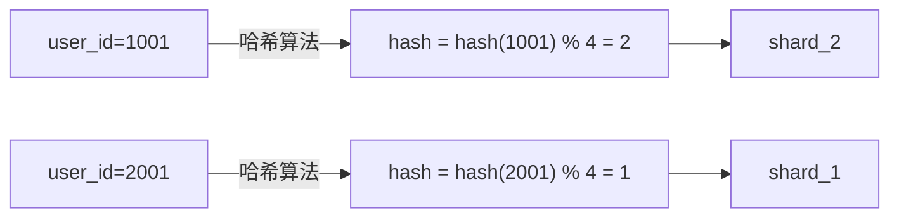

候选人小李参加字节 P7 架构面，面试官问：

"你们的订单表有几亿数据，怎么扛住的？"

小李说："我们做了分库分表，按 user_id 哈希分片。"

面试官追问："为什么按 user_id 分？按时间分不行吗？"

小李说："按时间分不太均匀..."

面试官继续追问："按 user_id 分有什么问题？如果要查某个时间段的所有订单呢？"

小李答不上来了。

【面试官心理】
这道题我用来测试候选人对大规模数据架构的理解深度。能说出分库分表的占 50%，能讲清分片键选择的占 20%，能说清跨分片查询问题的占 10%。分库分表是 MySQL 面试的进阶知识点。

## 一、为什么要分库分表 🔴

### 1.1 单库单表的瓶颈

```sql
-- 单表数据量过大的问题
-- 订单表 1 亿条数据

-- 索引查询变慢
SELECT * FROM orders WHERE user_id = '1001';  -- 扫描 1000 万行

-- 写入性能下降
INSERT INTO orders ...;  -- 锁竞争激烈

-- 备份恢复困难
mysqldump ...  -- 耗时数小时
```

### 1.2 性能指标对比

| 数据量 | 单表查询耗时 | 分表后查询耗时 |
| --- | --- | --- |
| 100 万 | 50ms | 5ms |
| 1000 万 | 200ms | 10ms |
| 1 亿 | 1000ms | 50ms |
| 10 亿 | 5000ms | 100ms |

## 二、分片策略 🔴

### 2.1 哈希分片

```sql
-- 按 user_id 哈希分片
-- shard_key = hash(user_id) % 4

shard_0: user_id = hash(1) % 4 = 1
shard_1: user_id = hash(2) % 4 = 2
shard_2: user_id = hash(3) % 4 = 3
shard_3: user_id = hash(4) % 4 = 0
```



**优点**：数据分布均匀
**缺点**：跨分片查询困难

### 2.2 范围分片

```sql
-- 按 id 范围分片
shard_0: id = 1 ~ 1000万
shard_1: id = 1000万+1 ~ 2000万
shard_2: id = 2000万+1 ~ 3000万

-- 按时间分片
shard_2024_Q1: 2024-01 ~ 2024-03
shard_2024_Q2: 2024-04 ~ 2024-06
```

**优点**：支持范围查询
**缺点**：数据可能不均匀

### 2.3 分片键选择原则

| 原则 | 说明 | 场景 |
| --- | --- | --- |
| 查询频率高 | 常用查询条件作为分片键 | user_id、order_id |
| 分布均匀 | 分片后数据量均衡 | 避免热点 |
| 业务相关 | 符合业务查询模式 | 订单按用户分片 |

:::warning ⚠️
按时间分片可能导致冷热不均：历史数据（1年前的订单）基本不访问，但占据大量空间；当前数据访问频繁。考虑冷热分离。
:::

## 三、分库分表工具 🟡

### 3.1 ShardingSphere

```yaml
# ShardingSphere 配置
schemaName: sharding_db
dataSources:
  ds_0:
    url: jdbc:mysql://host1:3306/db
  ds_1:
    url: jdbc:mysql://host2:3306/db

rules:
  - !sharding:
      tables:
        orders:
          actualDataNodes: ds_${0..1}.orders_${0..3}
          tableStrategy:
            standard:
              shardingColumn: user_id
              shardingAlgorithmName: orders_inline
          keyGenerateStrategy:
            column: order_id
            keyGeneratorName: snowflake

  - !sharding:
      bindingTables:
        - orders, order_items
      defaultDatabaseStrategy:
        standard:
          shardingColumn: user_id
          shardingAlgorithmName: database_inline

  - !keygen:
      defaultKeyGenerator:
        type: SNOWFLAKE
        props:
          worker-id: 1
```

### 3.2 MyCat

```xml
<!-- MyCat 配置 -->
<schema name="testdb" checkSQLschema="false" sqlMaxLimit="100">
    <table name="orders" dataNode="dn1,dn2,dn3,dn4"
            rule="mod-long"
            primaryKey="order_id"
            autoIncrement="true">
        <childTable name="order_items" primaryKey="id" joinKey="order_id" parentKey="order_id"/>
    </table>
</schema>

<dataNode name="dn1" dataHost="dh1" database="db1"/>
<dataNode name="dn2" dataHost="dh1" database="db2"/>
<dataNode name="dn3" dataHost="dh2" database="db3"/>
<dataNode name="dn4" dataHost="dh2" database="db4"/>

<dataHost name="dh1" maxCon="1000" minCon="10" balance="1">
    <heartbeat>select user()</heartbeat>
    <writeHost host="hostM1" url="mysql:3306" user="root" password="pwd">
        <readHost host="hostS1" url="mysql:3306" user="root" password="pwd"/>
    </writeHost>
</dataHost>
```

## 四、跨分片查询 🟡

### 4.1 方案一：禁止跨分片查询

```java
// 只支持分片键查询
public List<Order> getOrdersByUser(Long userId) {
    // 直接路由到正确分片
    return orderMapper.selectByUserId(userId);
}
```

### 4.2 方案二：聚合查询

```sql
-- 跨分片聚合查询
SELECT COUNT(*), SUM(amount), AVG(amount)
FROM orders
WHERE user_id IN ('1001', '1002', '1003')
GROUP BY user_id;

-- ShardingSphere 会自动聚合
```

### 4.3 方案三：异构索引表

```sql
-- 订单按 user_id 分片
-- 维护一张按 create_time 的异构索引表

-- 异构索引表（按时间分片）
CREATE TABLE order_time_index (
    id BIGINT PRIMARY KEY AUTO_INCREMENT,
    order_id BIGINT NOT NULL,
    user_id BIGINT NOT NULL,
    create_time DATETIME NOT NULL,
    shard_key VARCHAR(32) NOT NULL,
    INDEX idx_create_time (create_time),
    INDEX idx_shard_key (shard_key)
);

-- 查询某时间段的订单
SELECT o.* FROM orders o
JOIN order_time_index i ON o.order_id = i.order_id
WHERE i.create_time BETWEEN '2024-01-01' AND '2024-01-31';
```

### 4.4 方案四：ES 搜索引擎

```java
// 将数据同步到 Elasticsearch
public void syncOrdersToES(List<Order> orders) {
    List<IndexQuery> queries = orders.stream()
        .map(order -> new IndexQuery(order.getOrderId().toString(), order))
        .collect(Collectors.toList());
    elasticsearchTemplate.bulkIndex(queries);
}

// 使用 ES 查询
public Page<Order> searchOrders(String keyword, PageRequest page) {
    NativeQuery query = NativeQuery.builder()
        .withQuery(q -> q.match(m -> m.field("order_no").query(keyword)))
        .withPageable(page)
        .build();
    return elasticsearchTemplate.queryForPage(query, Order.class);
}
```

## 五、分库分表的问题 🟡

### 5.1 ID 生成问题

```sql
-- ❌ 自增 ID 问题：不同分片 ID 可能冲突
-- shard_0: AUTO_INCREMENT = 1, 2, 3...
-- shard_1: AUTO_INCREMENT = 1, 2, 3... (也可能是1,2,3!)
-- shard_2: AUTO_INCREMENT = 1, 2, 3...

-- ✅ 解决方案：分布式 ID
-- 1. UUID: 字符串，无序
-- 2. 雪花算法: Long 类型，有序
-- 3. 数据库号段模式
```

```java
// 雪花算法实现
public class SnowflakeIdGenerator {
    private final long twepoch = 1609459200000L;
    private final long workerIdBits = 5L;
    private final long datacenterIdBits = 5L;
    private final long maxWorkerId = ~(-1L << workerIdBits);
    private final long maxDatacenterId = ~(-1L << datacenterIdBits);
    private final long sequenceBits = 12L;
    private final long workerIdShift = sequenceBits;
    private final long datacenterIdShift = sequenceBits + workerIdBits;
    private final long timestampLeftShift = sequenceBits + workerIdBits + datacenterIdBits;
    private final long sequenceMask = ~(-1L << sequenceBits);

    private long workerId;
    private long datacenterId;
    private long sequence = 0L;
    private long lastTimestamp = -1L;

    public synchronized long nextId() {
        long timestamp = timeGen();
        if (timestamp < lastTimestamp) {
            throw new RuntimeException("Clock moved backwards");
        }
        if (lastTimestamp == timestamp) {
            sequence = (sequence + 1) & sequenceMask;
            if (sequence == 0) {
                timestamp = tilNextMillis(lastTimestamp);
            }
        } else {
            sequence = 0L;
        }
        lastTimestamp = timestamp;
        return ((timestamp - twepoch) << timestampLeftShift)
            | (datacenterId << datacenterIdShift)
            | (workerId << workerIdShift)
            | sequence;
    }
}
```

### 5.2 分片后的事务问题

```sql
-- ❌ 跨分片分布式事务
-- 订单在 shard_0，用户余额在 shard_1
-- 需要同时扣减余额和创建订单

-- ✅ 解决方案：最终一致性
-- 1. 可靠消息
-- 2. TCC
-- 3. 本地消息表
```

### 5.3 扩容问题

```sql
-- ❌ 扩容困难
-- 从 4 分片扩容到 8 分片
-- 需要迁移 50% 的数据

-- ✅ 解决方案：一致性哈希
-- 使用一致性哈希环，数据迁移量更少
-- 或者预留分片，分批迁移
```

## 六、面试追问链 🟡

**第一层**：分库分表的策略有哪些？
- 候选人：哈希分片、范围分片

**第二层**：分片键怎么选？
- 候选人：查询频率高、分布均匀

**第三层**：跨分片查询怎么处理？
- 候选人：异构索引、ES

**第四层**：分片后 ID 怎么生成？
- 候选人：雪花算法
