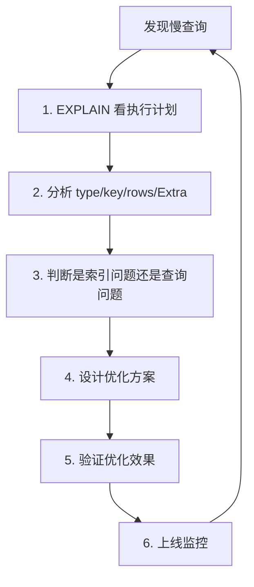

2024年双十一前夜，订单服务报警：接口响应时间从 50ms 飙到 5s。

DBA 排查发现，一条看似简单的 SQL 要执行 3 秒：

```sql
SELECT * FROM orders WHERE user_id = '10001' ORDER BY create_time DESC LIMIT 20;
```

开发同学说："我加了索引的啊！"DBA 一看执行计划，type=ALL，全表扫描 500 万行。

索引确实加了，但建在了 `status` 字段上，而这个查询没有 status 条件。

【面试官心理】
这道题我用来测试候选人有没有完整的 SQL 优化经验。能找到慢查询的占 50%，能分析执行计划的占 30%，能从索引设计层面解决问题的占 10%。慢查询优化是生产环境最常见的问题，也是最能体现工程师功力的场景。

## 一、慢查询的发现与配置 🔴

### 1.1 开启慢查询日志

```sql
-- 查看慢查询是否开启
SHOW VARIABLES LIKE 'slow_query_log';

-- 开启慢查询日志
SET GLOBAL slow_query_log = 'ON';

-- 设置慢查询阈值（默认 10 秒）
SET GLOBAL long_query_time = 1;  -- 超过 1 秒记录

-- 记录没有使用索引的查询
SET GLOBAL log_queries_not_using_indexes = 'ON';

-- 查看慢查询日志位置
SHOW VARIABLES LIKE 'slow_query_log_file';
-- /var/lib/mysql/localhost-slow.log
```

### 1.2 慢查询日志格式

```sql
-- 慢查询日志内容示例
# Time: 2024-11-11T00:00:01.123456Z
# User@Host: app[app] @ localhost [127.0.0.1]
# Query_time: 3.521341  Lock_time: 0.000234 Rows_sent: 20  Rows_examined: 5000000
SET timestamp=1731273600;
SELECT * FROM orders WHERE user_id = '10001' ORDER BY create_time DESC LIMIT 20;
```

关键字段：

| 字段 | 含义 |
| --- | --- |
| Query_time | 查询耗时（秒） |
| Lock_time | 锁等待时间 |
| Rows_sent | 返回行数 |
| **Rows_examined** | 扫描行数（最重要） |

:::warning ⚠️
`Rows_examined` 是判断查询效率的核心指标。同样是查 20 行，扫描 5000 行和扫描 500 万行的效率差 1000 倍。
:::

### 1.3 pt-query-digest 分析工具

```bash
# 安装 percona-toolkit
brew install percona-toolkit

# 分析慢查询日志
pt-query-digest /var/lib/mysql/localhost-slow.log

# 输出：
-- 200 queries examined, 20 queries in 60s
-- Queries with highest total time:
-- #1: 35.2% of total time, 50 occurrences
--   SELECT * FROM orders WHERE user_id = ?...
-- #2: 20.1% of total time, 30 occurrences
--   UPDATE orders SET status = ? WHERE ...
```

## 二、慢查询的分析流程 🟡

### 2.1 五步定位法



### 2.2 案例：用户订单列表查询

**原始 SQL**：
```sql
SELECT o.id, o.order_no, o.amount, o.status, o.create_time,
       u.name, u.phone
FROM orders o
JOIN users u ON o.user_id = u.id
WHERE o.user_id = '10001'
  AND o.create_time >= '2024-01-01'
ORDER BY o.create_time DESC
LIMIT 20;
```

**执行计划分析**：

```sql
EXPLAIN SELECT o.id, o.order_no, o.amount, o.status, o.create_time,
       u.name, u.phone
FROM orders o
JOIN users u ON o.user_id = u.id
WHERE o.user_id = '10001'
  AND o.create_time >= '2024-01-01'
ORDER BY o.create_time DESC
LIMIT 20;
```

| table | type | key | rows | Extra |
| --- | --- | --- | --- | --- |
| o | ref | idx_user_id | 5000 | Using where; Using filesort |
| u | eq_ref | PRIMARY | 1 | |

**问题诊断**：
1. orders 表扫描 5000 行（太多）
2. Using filesort 需要额外排序
3. 需要回表取所有字段

### 2.3 优化方案

```sql
-- 方案1：优化索引顺序
ALTER TABLE orders DROP INDEX idx_user_id;
ALTER TABLE orders ADD INDEX idx_user_time (user_id, create_time DESC, id, order_no, amount, status);

-- 验证优化效果
EXPLAIN SELECT o.id, o.order_no, o.amount, o.status, o.create_time,
       u.name, u.phone
FROM orders o
JOIN users u ON o.user_id = u.id
WHERE o.user_id = '10001'
  AND o.create_time >= '2024-01-01'
ORDER BY o.create_time DESC
LIMIT 20;
```

| table | type | key | rows | Extra |
| --- | --- | --- | --- | --- |
| o | ref | idx_user_time | 50 | Using index; Using index condition |
| u | eq_ref | PRIMARY | 1 | |

优化效果：
- rows 从 5000 降到 50
- Using filesort 消失
- Using index 出现（覆盖索引生效）

## 三、常见慢查询模式 🟡

### 3.1 分页查询深度分页

```sql
-- ❌ 深分页：越往后越慢
SELECT * FROM orders ORDER BY id LIMIT 1000000, 20;
-- 扫描 1000020 行，只返回 20 行
```

**原因**：MySQL 需要先排序，再跳过 100 万行。

**优化方案 1：游标分页**

```sql
-- ✅ 用主键做游标
SELECT * FROM orders WHERE id > 1000000 ORDER BY id LIMIT 20;
-- 直接定位到起始位置
```

**优化方案 2：延迟关联**

```sql
-- ✅ 先查 id，再关联其他字段
SELECT o.id, o.order_no, o.amount, u.name
FROM orders o
JOIN (SELECT id FROM orders ORDER BY id LIMIT 1000000, 20) AS t
  ON o.id = t.id
JOIN users u ON o.user_id = u.id;
```

### 3.2 COUNT(*) 统计慢

```sql
-- ❌ 全表 COUNT
SELECT COUNT(*) FROM orders WHERE status = 1;
-- 需要扫描所有 status=1 的行

-- ✅ 优化：维护计数器
-- 在订单状态变更时，更新 Redis 计数器
-- 直接读 Redis，O(1) 复杂度
```

### 3.3 JOIN 导致的慢查询

```sql
-- ❌ 小表驱动大表错误
SELECT * FROM orders o
JOIN products p ON o.product_id = p.id
WHERE p.category = '手机';

-- ✅ 正确：用小表驱动大表
-- products 表 category='手机' 只有 100 条
-- orders 表有 500 万条
-- 应该先过滤 products，再关联 orders

SELECT * FROM products p
WHERE p.category = '手机';

SELECT * FROM orders o
WHERE o.product_id IN (SELECT id FROM products WHERE category = '手机');
```

:::tip 💡
MySQL 优化器会自动选择小表驱动大表，但有时会选错。用 `STRAIGHT_JOIN` 强制指定驱动表顺序。
:::

## 四、生产优化 Checklist 🟡

### 4.1 索引优化

- [ ] 确保 WHERE 条件字段有索引
- [ ] 确保 ORDER BY 字段在索引中（且方向一致）
- [ ] 确保 SELECT 字段在覆盖索引中
- [ ] 避免索引失效（函数、隐式转换、最左前缀）

### 4.2 查询优化

- [ ] 避免 SELECT *，明确列出需要的字段
- [ ] 用 LIMIT 限制返回行数
- [ ] 用游标分页替代 OFFSET 分页
- [ ] 避免深度嵌套子查询

### 4.3 监控告警

```sql
-- 开启慢查询监控
-- 在 Prometheus 中配置：
-- mysql_global_status_slow_queries
-- mysql_global_status_questions
```

```yaml
# Prometheus 告警规则
- alert: MySQLSlowQuery
  expr: rate(mysql_global_status_slow_queries[5m]) > 10
  for: 5m
  labels:
    severity: warning
  annotations:
    summary: "MySQL 慢查询过多"
    description: "过去 5 分钟每秒产生 {{ $value }} 个慢查询"
```

【面试官心理】
我问他慢查询优化，通常还会追问：生产环境中怎么发现慢查询、多长时间优化一次、怎么验证优化效果。能给出完整流程的，基本都有实际踩坑经验。
