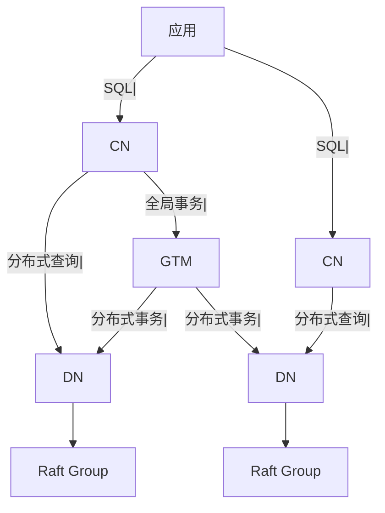

候选人小张在华为系公司面试中，面试官问：

"你们考虑过 GaussDB 吗？它和传统数据库有什么区别？"

小张说："GaussDB 是华为的数据库？"

面试官追问："GaussDB 支持分布式吗？怎么实现的？"

小张说："不太了解..."

面试官继续追问："GaussDB 和 Oracle、MySQL 比有什么优势？"

小张答不上来了。

【面试官心理】
这道题我用来测试候选人对华为生态数据库的理解深度。能说出 GaussDB 是华为数据库的占 30%，能讲清分布式架构的占 10%，能说清华为生态优势的占 5%。

## 一、GaussDB 概述 🔴

### 1.1 产品体系

```
GaussDB = 华为自研企业级数据库

产品线：
- GaussDB (For MySQL): 兼容 MySQL 的分布式数据库
- GaussDB (For PostgreSQL): 兼容 PostgreSQL 的分布式数据库
- GaussDB T: 集中式事务型数据库
- GaussDB A: 分析型数据库
```

### 1.2 GaussDB (For MySQL)

```sql
-- GaussDB (For MySQL) 架构
-- 兼容 MySQL 生态
-- 支持水平扩展

-- 组件：
-- CN (Coordinator Node): 协调节点
-- DN (Data Node): 数据节点
-- GTM (Global Transaction Manager): 全局事务管理
```

### 1.3 核心特点

```sql
-- GaussDB 核心特点
-- 1. 分布式架构
-- 2. MySQL/PG 兼容性
-- 3. 高可用
-- 4. 强一致性
-- 5. 云原生支持
```

## 二、分布式架构 🔴

### 2.1 组件架构



| 组件 | 作用 |
| --- | --- |
| CN | SQL 解析、查询优化、结果汇总 |
| DN | 数据存储、执行分布式查询 |
| GTM | 全局事务管理、唯一事务 ID |

### 2.2 数据分片

```sql
-- GaussDB 支持多种分片方式

-- 哈希分片
CREATE TABLE t1 (
    id INT,
    name VARCHAR(255),
    SHARD KEY (id)
) DISTRIBUTE BY HASH(id);

-- 复制表（广播表）
CREATE TABLE t2 (
    id INT,
    name VARCHAR(255)
) DISTRIBUTE BY BROADCAST;
```

### 2.3 全局事务

```sql
-- GTM 保证分布式事务的一致性
-- 类似于 Google Spanner 的 TrueTime

-- 事务流程：
-- 1. GTM 分配全局事务 ID (GTID)
-- 2. 各 DN 执行本地事务
-- 3. GTM 提交全局事务
```

## 三、高可用设计 🟡

### 3.1 副本机制

```sql
-- GaussDB 使用 Paxos/Raft 协议保证高可用

-- 每个数据分片 3 副本
-- 1 主 2 从，自动切换

-- 故障转移时间 < 30s
```

### 3.2 多活架构

```sql
-- 跨 AZ 多活
-- 同城双活
-- 两地三中心
```

### 3.3 备份恢复

```sql
-- 全量备份
CREATE BACKUP BACKUP001 ON NODE (all);

-- 增量备份
CREATE INCREMENTAL BACKUP BACKUP002 ON NODE (all);

-- 指定时间点恢复
RESTORE DATABASE ... TO TIME '2024-01-01 00:00:00';
```

## 四、兼容性与迁移 🟡

### 4.1 MySQL 兼容性

```sql
-- GaussDB (For MySQL) 兼容 MySQL 8.0

-- 语法兼容
SELECT * FROM t1 WHERE id = 1;

-- 数据类型兼容
-- INT, VARCHAR, DATETIME, JSON 等

-- 语法兼容
-- CREATE TABLE, ALTER TABLE, INDEX 等
```

### 4.2 迁移工具

```sql
-- 使用 DRM (Data Replication Service)
-- 从 MySQL 迁移到 GaussDB

-- 步骤：
-- 1. 评估兼容性
-- 2. 全量迁移
-- 3. 增量同步
-- 4. 切换验证
```

### 4.3 应用适配

```java
// JDBC 连接 GaussDB
String url = "jdbc:mysql://gaussdb-host:3306/mydb";
Connection conn = DriverManager.getConnection(url);

// 现有 MySQL 应用基本无需修改
```

## 五、华为生态优势 🟡

### 5.1 集成优势

```sql
-- GaussDB 集成华为云服务

-- 1. 与 OBS 对象存储集成
-- 备份直接到 OBS

-- 2. 与 IAM 集成
-- 权限管理

-- 3. 与云监控集成
-- 性能监控

-- 4. 与 DGC 数据治理中心集成
-- 数据迁移
```

### 5.2 选型场景

```sql
-- 适合用 GaussDB 的场景：
-- 1. 华为云用户
-- 2. 需要分布式数据库
-- 3. 政府、金融客户
-- 4. MySQL 迁移场景

-- 不适合用 GaussDB 的场景：
-- 1. 非华为云用户
-- 2. 简单应用
-- 3. 追求开源生态
```

:::tip 💡
GaussDB 是华为云的旗舰数据库，在政务、金融等领域有广泛应用。掌握 GaussDB 对华为系公司面试有加分。
:::

【面试官心理】
能说出"GTM 全局事务管理"和"Paxos/Raft 副本协议"的候选人，基本都有分布式系统的背景。这是 P7 的水准。
