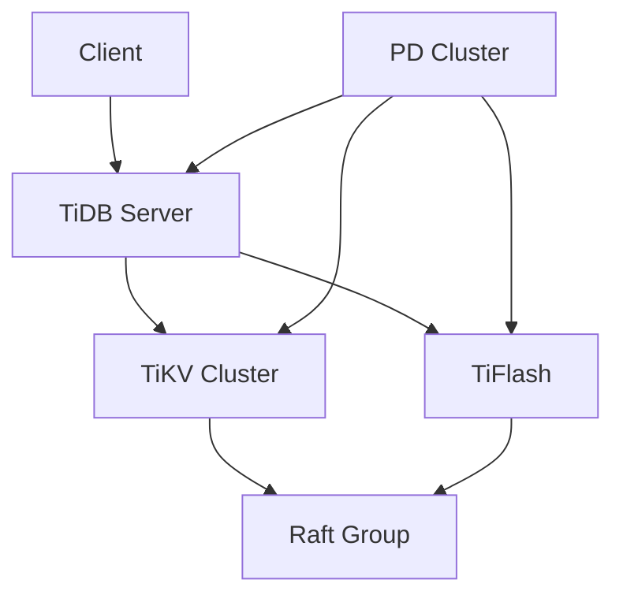
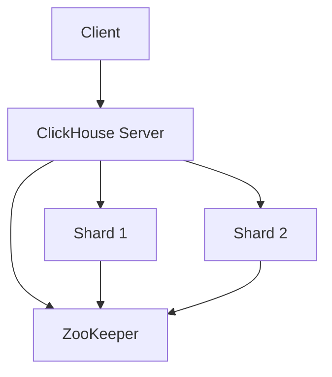
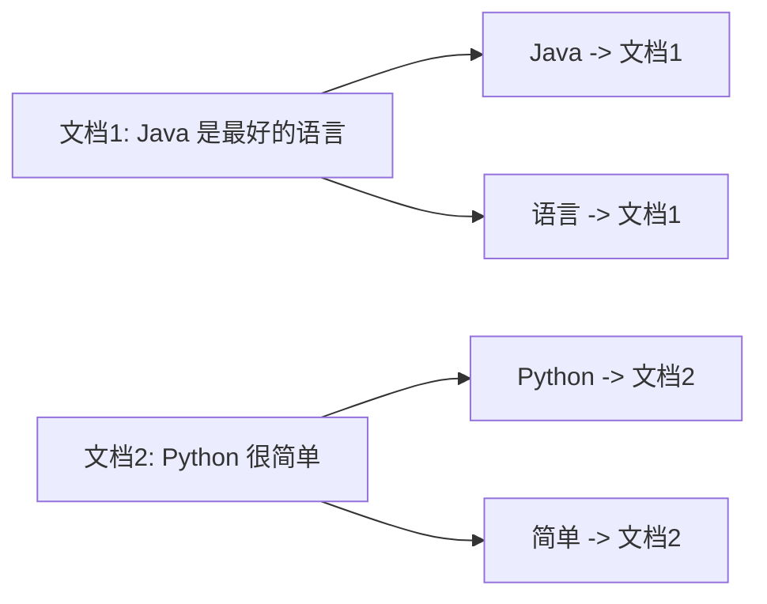
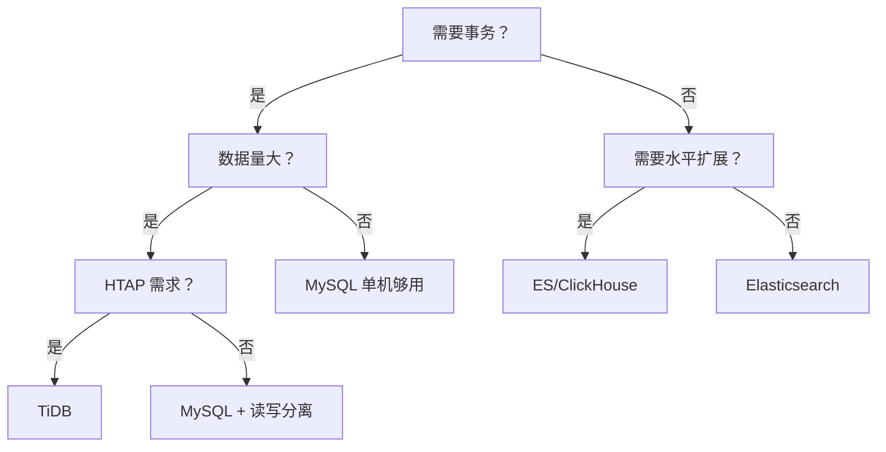

# TiDB/PG 等新潮数据库

主流数据库（MySQL/Redis/MongoDB）搞定了，下一个层次就是视野。

我面试 P7 候选人时，经常问："你们为什么选择 MySQL 而不是 TiDB？为什么选 PG 而不是 MySQL？"答不上来的，说明技术视野只停留在"会用"，没有"选型"的能力。

这个模块，帮你拓宽数据库的技术视野，理解不同场景下的数据库选型逻辑。

## 一、TiDB（NewSQL）🟡

### 1.1 什么是 NewSQL

传统数据库的两难：
- **OLTP**（事务）：MySQL/PostgreSQL，单机性能有限
- **OLAP**（分析）：Hive/Spark，延迟高，不支持实时

NewSQL 的目标：**同时支持 OLTP + OLAP**，用分布式架构解决扩展性问题。

### 1.2 TiDB 架构



| 组件 | 作用 |
| --- | --- |
| TiDB Server | SQL 层，解析 SQL，生成执行计划 |
| TiKV | 分布式事务存储引擎，基于 RocksDB |
| TiFlash | 列式存储，OLAP 加速 |
| PD | 调度器，管理 Region 分布 |

**面试官心理**
TiDB 我一般问两个核心问题：第一，TiDB 和 MySQL 的本质区别是什么？第二，TiDB 适合什么场景？只会背"Hibernate vs MyBatis"的没理解 NewSQL 的定位。正确答案是：TiDB 用 Raft 协议保证一致性，支持跨地域分布，适合需要强一致性和水平扩展的场景，但延迟比单机 MySQL 高。

### 1.3 HTAP 能力

- **TiKV**：行存，OLTP 场景
- **TiFlash**：列存，OLAP 场景，同步复制保证数据一致性

```sql
-- TiDB 自动选择 TiFlash 加速 OLAP
SELECT region, SUM(amount)
FROM orders
WHERE create_time >= '2024-01-01'
GROUP BY region
```

**面试官心理**
我会追问："TiFlash 和 TiKV 的数据同步机制是什么？"只会说"同步复制"的没研究过底层。正确答案是：TiFlash 通过 Raft Learner 角色从 TiKV 异步复制，延迟可配置，保证只读事务的快照一致性。

## 二、PostgreSQL 🟡

### 2.1 PostgreSQL vs MySQL

| 特性 | PostgreSQL | MySQL |
| --- | --- | --- |
| 事务支持 | `FULL ACID` | `ACID`（InnoDB） |
| 并发模型 | MVCC + 锁 | MVCC + 行锁 |
| JSON 支持 | 原生 JSONB（二进制） | 5.7+ 原生支持 |
| GIS 支持 | PostGIS（成熟） | MySQL GIS（较弱） |
| 全文搜索 | 内置 GIN/GiST | 需插件 |
| 扩展性 | 支持 UDF/FDW | 有限 |

### 2.2 PostgreSQL 高频面试点

**MVCC 实现**

```sql
-- PostgreSQL 的 MVCC 靠 4 个隐式字段
-- xmin：插入事务 ID
-- xmax：删除/更新事务 ID
-- cmin/cmax：命令 ID
-- txid_snapshot：事务快照
```

**面试官心理**
PG 的 MVCC 和 MySQL 的 InnoDB MVCC 实现完全不同。我会问："PostgreSQL 的 UPDATE 是怎么实现的？"只会说"版本链"的没理解 PG 的设计。正确答案是：PG 的 UPDATE 不修改原行，而是生成新行（heap-only-tuple），旧行标记为 deleted。这避免了页面分裂，但会增加垃圾回收压力。

### 2.3 高级特性

**JSONB 存储**

```sql
-- JSONB vs JSON 的区别
-- JSON：存储文本，查询时解析
-- JSONB：二进制存储，建立索引

CREATE TABLE events (
  id serial primary key,
  data jsonb
);

-- GIN 索引加速 JSON 字段查询
CREATE INDEX idx_events_data ON events USING GIN (data);

-- 查询 JSON 内部字段
SELECT * FROM events
WHERE data->>'type' = 'click';
```

**面试官心理**
JSONB 我会问："什么时候用 JSONB 而不是拆表？"答"都行"或"都行"的没做过权衡。正确答案是：半结构化数据、字段不固定、查询以整体为主时用 JSONB；需要频繁更新某个字段、查询特定子字段时拆表更优。

**PostGIS**

```sql
-- 附近的人查询
SELECT * FROM users
WHERE ST_DWithin(
  location,
  ST_MakePoint(-73.9, 40.7)::geography,
  1000  -- 1000 米内
)
ORDER BY ST_Distance(location, ST_MakePoint(-73.9, 40.7))
LIMIT 10;
```

## 三、ClickHouse（OLAP）🟡

### 3.1 列式存储的优势

| 场景 | 行存 | 列存 |
| --- | --- | --- |
| 全列扫描 | `O(n)` 全扫描 | `O(n/k)` 只读需要的列 |
| 聚合查询 | 需扫描全行 | 只读目标列 |
| 压缩比 | 低 | 高（同类数据压缩更好） |
| 写入性能 | 好 | 较差（需批量写入） |

### 3.2 ClickHouse 架构



**MergeTree 表引擎**

```sql
CREATE TABLE events (
  id UInt64,
  event_type String,
  user_id UInt64,
  event_time DateTime,
  amount Float64
) ENGINE = MergeTree()
ORDER BY (event_type, user_id, event_time)
PARTITION BY toYYYYMM(event_time)
```

**面试官心理**
ClickHouse 我通常问："MergeTree 的 ORDER BY 是什么意思？和普通索引有什么区别？"只会说"排序"的没理解它的设计。正确答案是：MergeTree 的 ORDER BY 是数据排序的依据，决定数据怎么存储和压缩。不同于 B-Tree 索引，MergeTree 的数据按 ORDER BY 物理排序，每个 PARTITION 内按 ORDER BY 排序存储。

### 3.3 适用场景

- **适合**：海量数据聚合分析、实时 BI 报表、用户行为分析
- **不适合**：高频单条写入、频繁 UPDATE/DELETE、事务需求

## 四、Elasticsearch（搜索引擎）🟢

### 4.1 ES vs 关系型数据库

| ES 概念 | 关系型概念 |
| --- | --- |
| Index | Database |
| Document | Row |
| Field | Column |
| Mapping | Schema |
| Shard | 分片 |

### 4.2 倒排索引



- 正排索引：文档 `->` 词列表
- 倒排索引：词 `->` 文档列表

**面试官心理**
倒排索引我会问："为什么 ES 的模糊查询比 MySQL 快？"只会说"ES 是专门做搜索的"的没理解原理。正确答案是：MySQL 的 `LIKE '%keyword%'` 是全表扫描，ES 的倒排索引直接定位到包含关键词的文档。ES 还用了 FST（Finite State Transducer）做前缀匹配，比暴力扫描快几个数量级。

### 4.3 适用场景

- **适合**：全文搜索、日志分析、指标监控、安全分析
- **不适合**：强事务需求、频繁关联查询、数据量小于千万级

## 五、数据库选型决策树



## 六、面试题分级速查

| 级别 | 高频问题 | 期望回答 |
| --- | --- | --- |
| P5 | 知道各数据库的特点和定位 | 能说出区别，不怵选型问题 |
| P6 | 能根据场景做选型 | 有实战经验，理解取舍 |
| P7 | 能设计多数据库混合架构 | 有架构视野，理解限界上下文 |

## 七、学习路径指引

**P5 阶段（会用）**
- 了解 TiDB、PG、ClickHouse、ES 的定位和特点
- 能在项目中选型 MySQL vs PG
- 知道什么时候该上 ES

**P6 阶段（精通）**
- 理解 NewSQL 的原理和适用场景
- 掌握 PG 的高级特性（JSONB、PostGIS）
- 能优化 ClickHouse 查询

**P7 阶段（架构）**
- 能设计多数据库混合存储架构
- 理解各数据库的局限性
- 有跨数据库数据同步经验

---

:::tip 💡
数据库选型没有银弹。MySQL 不是万能的，TiDB 也不是银弹。理解每个数据库的设计哲学和适用场景，才能做出正确的技术决策。
:::

:::warning ⚠️
切忌在简历上写"精通 TiDB/PG"，除非你真的研究过源码或有过深度实战。否则面试官追问起来，分分钟露馅。
:::
