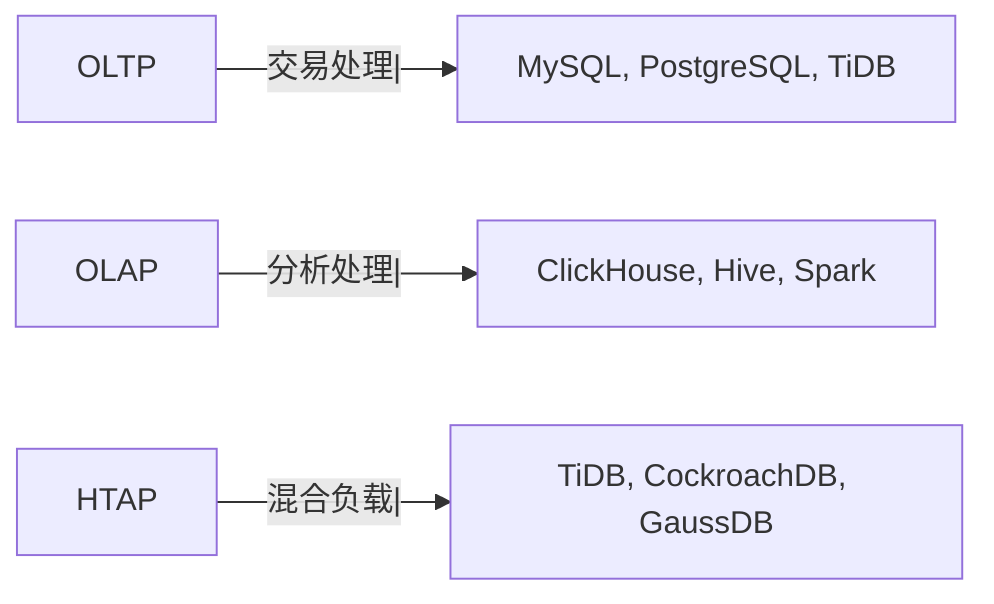
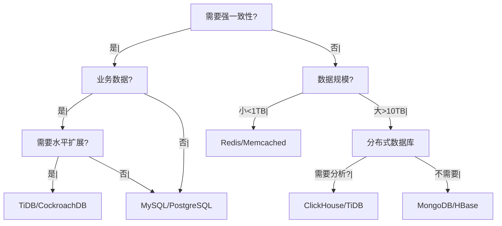

候选人小李在字节 P7 架构面中，面试官问：

"你们公司数据库怎么选的？为什么用 MySQL 而不是 PostgreSQL？为什么用 MongoDB 而不是 MySQL？"

小李说："MySQL 我们一直用，MongoDB 是因为灵活..."

面试官追问："那什么场景用 Elasticsearch？什么场景用 ClickHouse？"

小李说："我们好像都有...但不清楚为什么选这些。"

【面试官心理】
这道题我用来测试候选人对数据库选型的理解深度。能说出几种数据库的占 60%，能讲清选型原因的占 20%，能提出系统性决策框架的占 5%。

## 一、数据库分类 🔴

### 1.1 按类型分类

| 类型 | 代表产品 | 适用场景 |
| --- | --- | --- |
| 关系型 | MySQL, PostgreSQL, Oracle | 业务数据、强一致性 |
| NoSQL KV | Redis, Memcached | 缓存、分布式锁 |
| NoSQL 文档 | MongoDB | 灵活结构、日志 |
| NoSQL 列式 | HBase, Cassandra | 海量数据、时序 |
| 搜索引擎 | Elasticsearch | 全文检索、日志分析 |
| 时序数据库 | InfluxDB, TimescaleDB | IoT、监控 |
| 分析型 | ClickHouse, Hive | OLAP、报表 |
| 分布式 NewSQL | TiDB, CockroachDB | 水平扩展 + ACID |
| 图数据库 | Neo4j | 关系网络、推荐 |

### 1.2 OLTP vs OLAP



## 二、选型决策矩阵 🔴

### 2.1 核心决策因素

| 因素 | 说明 | 权重 |
| --- | --- | --- |
| 数据规模 | 小/中/大/海量 | 高 |
| 一致性要求 | 强一致/最终一致 | 高 |
| 查询复杂度 | 简单/复杂/分析 | 中 |
| 团队能力 | 熟悉程度 | 中 |
| 成本 | 授权/运维 | 中 |
| 生态 | 工具/社区 | 低 |

### 2.2 决策树



## 三、场景化选型 🟡

### 3.1 电商订单系统

```sql
-- 选型：MySQL (核心) + MongoDB (扩展) + Redis (缓存)

-- MySQL: 订单主表、支付记录、库存
-- 原因：强一致性、事务支持、成熟稳定

-- MongoDB: 订单详情、商品快照
-- 原因：灵活扩展字段、嵌套结构

-- Redis: 热点数据、会话缓存
-- 原因：高性能、支持多种数据结构
```

### 3.2 内容管理系统

```sql
-- 选型：MySQL (用户) + MongoDB (内容) + Elasticsearch (搜索)

-- MySQL: 用户、权限、配置
-- 原因：关系简单、强一致性

-- MongoDB: 文章、评论、标签
-- 原因：字段灵活、嵌套结构

-- Elasticsearch: 全文检索
-- 原因：强大的搜索能力、分词支持
```

### 3.3 物联网数据

```sql
-- 选型：MongoDB (元数据) + InfluxDB (时序) + Redis (缓存)

-- InfluxDB: 传感器数据、监控指标
-- 原因：时序数据原生支持、压缩存储

-- MongoDB: 设备信息、告警记录
-- 原因：文档结构、查询灵活

-- Redis: 实时告警缓存
-- 原因：高性能、支持发布订阅
```

### 3.4 日志分析系统

```sql
-- 选型：Elasticsearch + Kafka + ClickHouse

-- Kafka: 日志采集缓冲
-- 原因：高吞吐、持久化、消息队列

-- Elasticsearch: 日志存储与检索
-- 原因：全文检索、聚合分析

-- ClickHouse: 离线分析
-- 原因：OLAP 性能极强、SQL 支持
```

## 四、数据库对比 🟡

### 4.1 MySQL vs PostgreSQL

| 特性 | MySQL | PostgreSQL |
| --- | --- | --- |
| 性能 | 读性能好 | 综合性能好 |
| SQL 标准 | 部分支持 | 完整支持 |
| JSON 支持 | JSON 类型 | JSON/JSONB |
| 扩展性 | 有限 | 强大 (PostGIS, pg_vector) |
| 生态 | 广泛 | 较小但增长 |
| 适用 | 互联网、Web | 企业级、复杂查询 |

### 4.2 MySQL vs MongoDB

| 特性 | MySQL | MongoDB |
| --- | --- | --- |
| 数据模型 | 关系型 | 文档型 |
| 事务 | 强一致 | 多文档事务 (3.0+) |
| JOIN | 强 | 弱 (聚合替代) |
| 扩展性 | 分库分表 | 原生分片 |
| 适用 | 业务数据 | 灵活结构数据 |

### 4.3 Elasticsearch vs ClickHouse

| 特性 | Elasticsearch | ClickHouse |
| --- | --- | --- |
| 查询类型 | 全文检索 | OLAP 分析 |
| SQL 支持 | 有限 | 完整 |
| 写入性能 | 中 | 高 |
| 聚合性能 | 中 | 极高 |
| 适用 | 搜索、日志 | 报表、指标分析 |

## 五、成本考量 🟡

### 5.1 开源 vs 商业

```sql
-- 开源数据库
-- MySQL: 免费（社区版）
-- PostgreSQL: 免费
-- MongoDB: 免费（社区版）
-- Redis: 免费（开源版）

-- 商业数据库
-- Oracle: 昂贵
-- SQL Server: 中等
-- TiDB: 按节点收费
```

### 5.2 运维成本

```sql
-- MySQL/PostgreSQL
-- 运维成熟，工具完善
-- DBA 人才多

-- MongoDB
-- 运维相对简单
-- 需要关注分片设计

-- TiDB/CockroachDB
-- 运维复杂
-- 需要专业团队
```

## 六、选型 Checklist 🟡

### 6.1 必问问题

```
1. 数据规模多大？（TB 级选分布式）
2. 需要强一致性吗？（是选 RDBMS）
3. 查询复杂度如何？（复杂分析选 OLAP）
4. 团队熟悉什么？（降低风险）
5. 预算是多少？（商业 vs 开源）
6. 需要哪些特性？（事务/全文检索/时序）
```

### 6.2 常见组合

| 场景 | 推荐组合 |
| --- | --- |
| 电商 | MySQL + Redis + MongoDB + Elasticsearch |
| 游戏 | MongoDB + Redis + MySQL |
| 金融 | PostgreSQL / MySQL + TiDB |
| 物联网 | InfluxDB + MongoDB + Redis |
| 日志分析 | Elasticsearch + Kafka + ClickHouse |
| 信创 | 达梦 / GaussDB / OceanBase |

:::tip 💡
没有银弹数据库。每个数据库都有其适用场景。选型时要根据具体业务需求，而不是"哪个最流行"。
:::

【面试官心理】
能提出系统性选型框架的候选人，基本都有架构设计经验。这是 P7 的水准。
