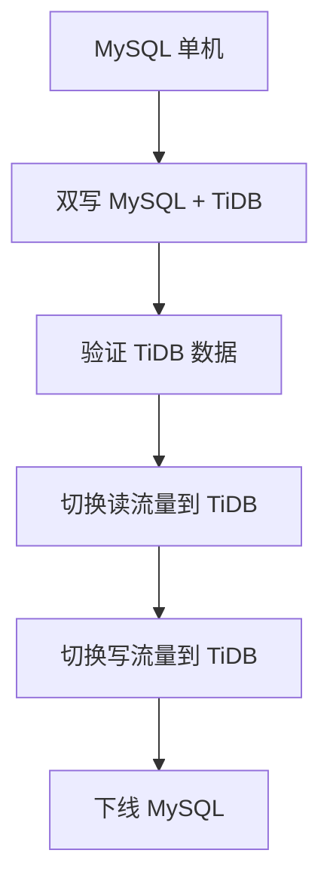

候选人小张在字节面试中，面试官问：

"你们想把 MySQL 迁移到 TiDB，兼容性怎么样？"

小张说："听说兼容 MySQL 协议，应该差不多吧？"

面试官追问："那自增主键呢？事务呢？存储过程呢？"

小张说："...应该有差异吧？"

【面试官心理】
这道题我用来测试候选人对 TiDB 迁移方案的理解深度。能说出基本兼容的占 40%，能讲清限制的占 15%，能提出迁移注意事项的占 5%。

## 一、兼容性概述 🔴

### 1.1 协议兼容

```sql
-- TiDB 兼容 MySQL 5.7 协议
-- 大部分 MySQL 客户端可以直接连接

-- 连接方式
mysql -h 127.0.0.1 -P 4000 -u root -p
-- 端口 4000 是 TiDB 默认端口
```

### 1.2 SQL 兼容

| 特性 | 支持情况 | 说明 |
| --- | --- | --- |
| SELECT / INSERT / UPDATE / DELETE | ✅ 完整支持 | |
| JOIN | ✅ 完整支持 | 分布式 JOIN 有性能差异 |
| 子查询 | ✅ 完整支持 | |
| 事务 | ✅ 完整支持 | 隔离级别有差异 |
| 存储过程 | ⚠️ 部分支持 | 有限制 |
| 触发器 | ⚠️ 部分支持 | 有限制 |
| 外键 | ⚠️ 部分支持 | 默认禁用 |
| 视图 | ✅ 完整支持 | |

### 1.3 关键字兼容

```sql
-- TiDB 和 MySQL 有一些关键字差异

-- TiDB 保留关键字
-- 需要用反引号转义
CREATE TABLE test (
    `key` VARCHAR(255)  -- key 是 TiDB 关键字
);
```

## 二、主要差异 🔴

### 2.1 自增主键

```sql
-- MySQL
CREATE TABLE t1 (
    id INT AUTO_INCREMENT PRIMARY KEY,
    name VARCHAR(255)
);
INSERT INTO t1 (name) VALUES ('a');  -- id = 1, 2, 3...

-- TiDB: 自增主键是分布式 ID
-- 可能不是连续的（因为多 TiDB Server 并行写入）
INSERT INTO t1 (name) VALUES ('a');
-- id 可能 = 1
-- id 可能 = 10000000001 (取决于分配)

-- 解决方案：使用 BIGINT + AUTO_RANDOM
CREATE TABLE t1 (
    id BIGINT AUTO_RANDOM PRIMARY KEY,
    name VARCHAR(255)
);
```

### 2.2 存储过程

```sql
-- TiDB 存储过程支持有限

-- ❌ TiDB 不支持传统的存储过程语法
DELIMITER //
CREATE PROCEDURE proc1()
BEGIN
    SELECT * FROM t1;
END //
DELIMITER ;

-- ✅ TiDB 推荐使用应用层逻辑
-- 或者使用 TiDB 的用户自定义函数 (UDF)
```

### 2.3 字符集

```sql
-- TiDB 默认字符集
-- TiDB 3.0+ 支持 UTF8MB4

-- 字符集配置
SHOW CHARACTER SET;

-- collation
SHOW COLLATION LIKE 'utf8mb4%';
```

## 三、性能差异 🟡

### 3.1 分布式 JOIN

```sql
-- TiDB 的 JOIN 在多个 TiKV 节点执行
-- 跨节点 JOIN 性能可能较差

-- ✅ 推荐：小表广播
-- 将小表复制到所有节点
SET tidb_opt_broadcast_join = 1;
SELECT * FROM t1 JOIN t2 ON t1.id = t2.t1_id;

-- ❌ 避免：大表 JOIN 大表
-- 跨节点 Shuffle 数据量大
```

### 3.2 事务限制

```sql
-- TiDB 单个事务限制
-- 默认 100MB
-- 可以调整

-- 事务过大会被回滚
SET tidb_mem_quota_query = 1073741824;  -- 1GB

-- 分批处理大事务
FOR batch IN batches:
    BEGIN;
    INSERT INTO t SELECT * FROM source WHERE id BETWEEN batch.start AND batch.end;
    COMMIT;
END FOR;
```

### 3.3 索引限制

```sql
-- TiDB 索引和 MySQL 有所不同

-- 唯一索引
-- TiDB 支持，但分布式环境下有性能考虑

-- 前缀索引
-- 支持，但需要注意索引大小

-- 表达式索引
-- TiDB 不支持
```

## 四、迁移注意事项 🟡

### 4.1 迁移前检查

```bash
# 使用 pt-table-checksum 检查数据一致性
pt-table-checksum h=source_host,u=root,p=password,D=mydb

# 使用 pt-table-sync 同步数据
pt-table-sync h=source_host h=dest_host --charset=utf8mb4
```

### 4.2 应用层适配

```java
// JDBC 连接 TiDB
String url = "jdbc:mysql://tidb-host:4000/mydb";
Connection conn = DriverManager.getConnection(url);

// 注意事项
// 1. 自增主键不再是连续 ID
// 2. 事务大小有限制
// 3. 需要调整连接池配置
```

### 4.3 灰度迁移策略



## 五、TiDB 特有功能 🟡

### 5.1 Auto Random

```sql
-- 替代自增主键的分布式 ID
CREATE TABLE t1 (
    id BIGINT PRIMARY KEY DEFAULT AUTO_RANDOM(),
    name VARCHAR(255)
);

-- 插入时不指定 id
INSERT INTO t1 (name) VALUES ('a');
-- 自动生成随机分布的 ID
```

### 5.2 分区表

```sql
-- TiDB 支持分区表
CREATE TABLE orders (
    id BIGINT,
    created_at DATETIME
) PARTITION BY RANGE (YEAR(created_at)) (
    PARTITION p2023 VALUES LESS THAN (2024),
    PARTITION p2024 VALUES LESS THAN (2025),
    PARTITION pmax VALUES LESS THAN MAXVALUE
);
```

:::tip 💡
TiDB 迁移不是简单的"替换"，需要评估应用层的兼容性。建议先在测试环境充分验证。
:::

【面试官心理】
能说出"自增主键不连续"和"分布式 JOIN 性能差异"的候选人，基本都有实际迁移经验。这是 P6+ 的水准。
