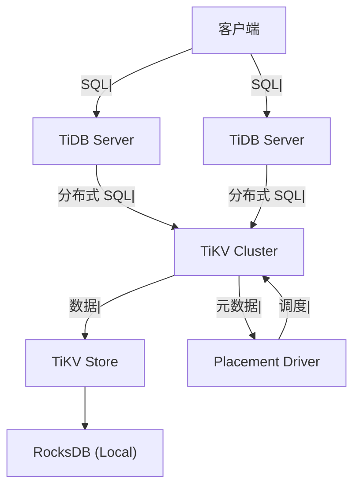
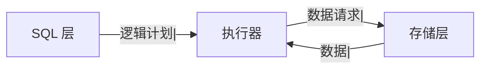
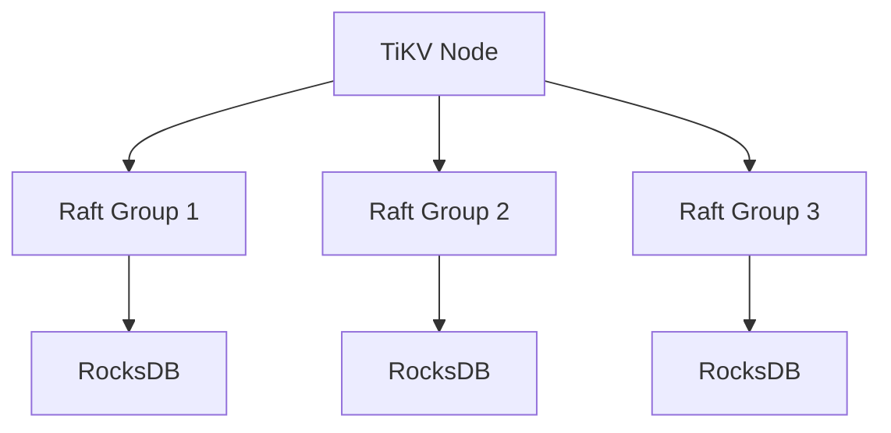
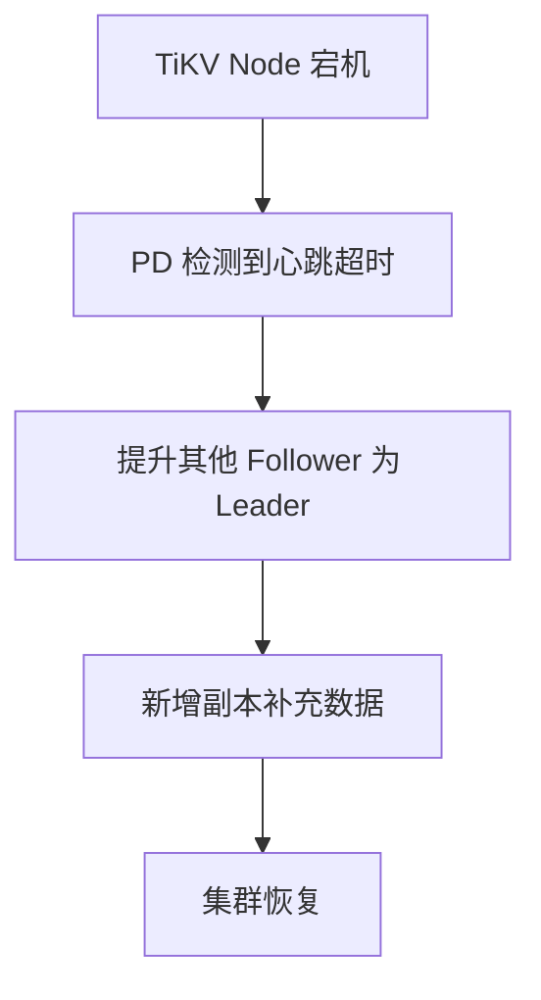

候选人小李在字节 P7 架构面中，面试官问：

"你们考虑过用 TiDB 吗？它和 MySQL 有什么区别？"

小李说："TiDB 是分布式数据库，兼容 MySQL 协议。"

面试官追问："TiDB 底层是怎么存储数据的？RocksDB？"

小张说："好像是...KV 存储？"

面试官继续追问："TiKV 和 PD 是什么关系？"

小李答不上来了。

【面试官心理】
这道题我用来测试候选人对分布式数据库的理解深度。能说出 TiDB 兼容 MySQL 的占 40%，能讲清 TiKV 架构的占 15%，能说清 PD 作用的占 5%。

## 一、TiDB 整体架构 🔴

### 1.1 组件架构



| 组件 | 作用 |
| --- | --- |
| TiDB Server | SQL 计算层，解析 SQL 生成执行计划 |
| TiKV Server | 分布式存储引擎，基于 RocksDB |
| Placement Driver (PD) | 集群调度器，管理元数据 |
| TiFlash | 列式存储，用于 OLAP 分析 |

### 1.2 TiDB Server

```bash
# TiDB Server 不存储数据
# 只负责：
# 1. SQL 解析和优化
# 2. 分布式查询执行
# 3. 事务管理

# 可以水平扩展
tidb-server --store tikv --path 127.0.0.1:2379
```

### 1.3 计算与存储分离



```
设计理念：
- 计算层和存储层分离
- TiDB Server 可以水平扩展
- TiKV 可以水平扩展
- 各自独立扩缩容
```

## 二、TiKV 存储引擎 🔴

### 2.1 TiKV 架构



```bash
# TiKV = TiDB's Key-Value Store
# 基于 Raft 协议实现分布式存储

# 每个 Region 是一个数据分片
# 默认 96MB 一个 Region
```

### 2.2 Region

```bash
# Region 是 TiKV 的数据分片单元
# 类似于 MongoDB 的 Chunk

# Region 信息
# - start_key / end_key: 数据范围
# - peers: 副本信息
# - leader: 主副本

# Region 分裂
# 当 Region 过大时，会自动分裂
```

### 2.3 RocksDB

```bash
# TiKV 使用 RocksDB 作为底层存储
# RocksDB = LSM Tree 结构

# LSM Tree vs B-Tree
# - 写入性能更好（顺序写）
# - 读取性能较差（需要合并）
# - 适合写多读少场景
```

## 三、PD 调度器 🟡

### 3.1 PD 的作用

```bash
# Placement Driver 负责：
# 1. 集群元数据管理
# 2. Region 调度
# 3. Leader 均衡
# 4. 副本分布

# 类似于 MongoDB Config Server + 均衡器
```

### 3.2 调度策略

```bash
# PD 调度的目标：
# 1. 副本分布均匀
# 2. Leader 分布均匀
# 3. 热点数据打散
# 4. Region 分裂与合并

# 查看调度状态
pd-ctl store weight
pd-ctl region top
```

### 3.3 故障恢复



## 四、HTAP 架构 🟡

### 4.1 TiFlash

```bash
# TiFlash = TiDB 的列式存储
# 用于 OLAP 分析场景

# 架构
# TiDB Server
#   ↓ (写入)
# TiKV (行存储)
#   ↓ (实时同步)
# TiFlash (列存储)
```

### 4.2 混合查询

```sql
-- 可以同时查询 TiKV 和 TiFlash
SELECT * FROM orders;  -- TiKV
SELECT * FROM orders;  -- TiFlash (分析场景)

-- TiDB 自动选择合适的存储
EXPLAIN SELECT COUNT(*) FROM orders GROUP BY region;
-- 分析查询自动路由到 TiFlash
```

## 五、和 MySQL 的区别 🟡

### 5.1 核心区别

| 特性 | MySQL | TiDB |
| --- | --- | --- |
| 架构 | 单机 / 主从 | 分布式 |
| 水平扩展 | 需要分库分表 | 原生支持 |
| 强一致性 | ✅ | ✅ (Raft) |
| SQL 支持 | 完整 | 高度兼容 |
| 存储 | InnoDB (B-Tree) | TiKV (LSM Tree) |

### 5.2 适用场景对比

```sql
-- 适合 TiDB：
-- - 数据量巨大（PB 级）
-- - 需要强一致性和高可用
-- - 需要水平扩展
-- - 想保留 MySQL 生态

-- 适合 MySQL：
-- - 数据量中等（< 10TB）
-- - 运维团队成熟
-- - 需要特定 MySQL 特性
```

【面试官心理】
能说出"Raft 协议"和"计算存储分离"的候选人，基本都有分布式系统的背景。这是 P7 的水准。
