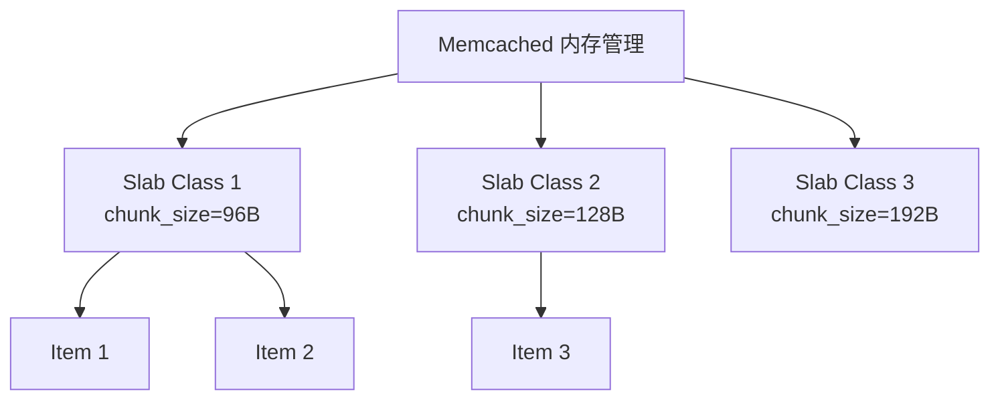
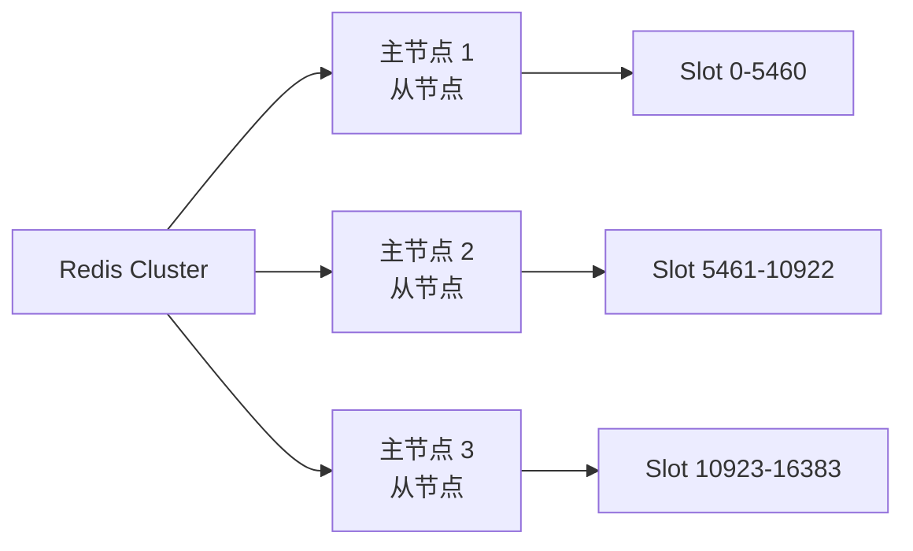

# Redis 与 Memcached 对比

面试官问："你们缓存用的什么？"

候选人小顾答："Redis。"

面试官追问："为什么不用 Memcached？两者有什么区别？"

小顾说："呃... Redis 更流行？"

面试官追问："那什么场景下用 Memcached 更合适？"

小顾答不上来。

【面试官心理】
这道题考查的是候选人对缓存技术的理解深度。Redis 和 Memcached 都是成熟的缓存方案，能说清楚两者的差异和适用场景，说明真正做过技术评估，而不是盲目从众。

---

## 一、核心差异概览

| 维度 | Redis | Memcached |
| --- | --- | --- |
| 数据结构 | 字符串、哈希、列表、集合、有序集合、Geo、Stream | 仅字符串 |
| 持久化 | 支持 RDB、AOF 持久化 | 不支持，纯内存 |
| 复制 | 支持主从复制、哨兵、集群 | 不支持 |
| 线程模型 | 单线程（6.0前）+ 多线程（6.0后IO） | 多线程（ slab 机制） |
| 内存管理 | 自己实现（动态内存分配） | slab allocator |
| 过期策略 | 8种过期策略 | 懒删除 + 过期线程 |
| 集群 | Redis Cluster 原生支持 | 需要客户端实现 |
| 客户端 | 丰富 | 有限 |
| 文档 | 完善 | 一般 |

---

## 二、数据结构对比 🔴

### 2.1 Memcached：仅支持字符串

```php
// Memcached 只能存字符串
$memcached->set('user:1', json_encode(['name' => '张三', 'age' => 30]));
$memcached->set('count', 100);

$data = json_decode($memcached->get('user:1'), true);
$count = $memcached->get('count');  // "100"（字符串）
```

### 2.2 Redis：支持多种数据结构

```php
// Redis 支持多种数据类型
// 字符串
$redis->set('count', 100);

// 哈希（存对象）
$redis->hMSet('user:1', ['name' => '张三', 'age' => 30]);
$name = $redis->hGet('user:1', 'name');

// 列表（存队列）
$redis->rPush('queue:jobs', 'job1', 'job2', 'job3');
$job = $redis->lPop('queue:jobs');

// 集合（存标签）
$redis->sAdd('tags:article:1', 'java', 'redis', 'cache');
$tags = $redis->sMembers('tags:article:1');

// 有序集合（排行版）
$redis->zAdd('ranking', 100, 'user:1', 90, 'user:2');
$top = $redis->zRevRange('ranking', 0, 9, true); // 获取前10
```

**对比**：Redis 一条命令搞定的事，Memcached 需要序列化/反序列化 + 多次 GET。

---

## 三、持久化对比 🟡

### 3.1 Memcached：无持久化

```php
// Memcached 重启后数据全失
// 纯内存缓存，服务重启即清空
$memcached->set('cache', 'value');
// 服务重启
$memcached->get('cache'); // false
```

### 3.2 Redis：支持持久化

```php
// Redis 持久化选项
// 1. RDB（快照）
$redis->save();  // 同步生成快照
$redis->bgsave(); // 异步生成快照

// 2. AOF（追加日志）
$redis->set('appendonly', 'yes'); // 开启 AOF

// 3. 混合持久化（4.0+）
$redis->config('set', 'aof-use-rdb-preamble', 'yes');
```

:::tip 💡
Redis 的持久化是把双刃剑：开启会影响性能，不开启会丢数据。根据数据重要性选择合适的持久化策略。
:::

---

## 四、内存管理对比 🟡

### 4.1 Memcached：Slab Allocator



**问题**：
- 固定 chunk size，可能浪费内存
- 不同 slab 之间的内存不能共享
- 预分配内存，不灵活

### 4.2 Redis：动态内存分配

```c
// Redis 内存分配
// 1. 小对象：jemalloc/scute
// 2. 动态扩张：根据需要分配
// 3. 内存碎片整理（activedefrag）
```

**优势**：
- 按需分配，不浪费内存
- 支持内存压缩和整理
- 更灵活的内存控制

---

## 五、过期策略对比 🔴

### 5.1 Memcached：懒删除 + 过期线程

```php
// Memcached 的过期处理
// 1. 懒删除：访问时检查，过期则删除
// 2. 定期清理：后台线程定期清理过期 item
// 问题：过期的 item 可能不会被及时清理，占用内存
```

### 5.2 Redis：8种过期策略

```php
// Redis 过期策略
// 1. volatile-lru：从已设置过期时间的 key 中删除 LRU
// 2. allkeys-lru：从所有 key 中删除 LRU
// 3. volatile-lfu：从已设置过期时间的 key 中删除 LFU
// 4. allkeys-lfu：从所有 key 中删除 LFU
// 5. volatile-random：从已设置过期时间的 key 中随机删除
// 6. allkeys-random：从所有 key 中随机删除
// 7. volatile-ttl：从已设置过期时间的 key 中删除最早过期的
// 8. noeviction：不删除任何 key，返回错误

$redis->config('set', 'maxmemory-policy', 'allkeys-lru');
```

---

## 六、集群能力对比 🔴

### 6.1 Memcached：需要客户端实现

```php
// Memcached 客户端分布式
$memcached = new Memcached();
$memcached->addServers([
    ['cache1.example.com', 11211],
    ['cache2.example.com', 11211],
    ['cache3.example.com', 11211],
]);
// 一致性哈希路由
$memcached->setOption(Memcached::DISTRIBUTION_CONSISTENT, true);
```

**问题**：
- 需要手动管理节点
- 没有内置的故障转移
- 数据分片逻辑在客户端

### 6.2 Redis：原生集群支持

```php
// Redis Cluster
$redis = new RedisCluster();
$redis->connect('redis-cluster.example.com', 6379);

// 自动分片和故障转移
$redis->set('key', 'value'); // 自动路由到正确节点
```



---

## 七、性能对比 🟡

### 7.1 单机性能

| 操作 | Redis QPS | Memcached QPS |
| --- | --- | --- |
| GET/SET | ~10-15万 | ~15-20万 |

**结论**：纯 GET/SET 性能，Memcached 略高，但 Redis 也不差。

### 7.2 实际场景性能

```php
// 复杂操作：Redis 优势明显
// Memcached 需要多次 round-trip
$memcached->get('user:1:profile');
$memcached->get('user:1:settings');
$memcached->get('user:1:friends');

// Redis 一次 MGET
$redis->mGet('user:1:profile', 'user:1:settings', 'user:1:friends');
```

---

## 八、选型决策 🔴

### 选 Memcached 的场景

- **纯缓存**：数据丢了无所谓，可以接受冷启动
- **简单 Key-Value**：只需要存字符串
- **追求极致性能**：对延迟敏感，单机 QPS 要求极高
- **PHP 环境**：PHP 的 Memcached 扩展成熟稳定

### 选 Redis 的场景

- **需要数据结构**：列表、集合、有序集合等
- **需要持久化**：数据不能丢失
- **需要集群**：高可用 + 数据分片
- **需要高级功能**：发布订阅、Lua 脚本、Stream

:::warning ⚠️
很多团队"为了显得高大上"选 Redis，但如果只是做简单缓存，Memcached 更轻量、更稳定。选择合适的，而不是选择流行的。
:::

---

## 九、面试官追问 🔴

**面试官**："Redis 单线程为什么比 Memcached 多线程快？"

**标准回答**：
- Memcached 多线程需要锁竞争，开销大
- Redis 单线程避免了锁竞争，用 IO 多路复用（epoll）
- Redis 6.0 后也引入多线程 IO，但执行还是单线程

**面试官追问**："Redis 和 Memcached 混用可以吗？"

**标准回答**：可以，但会增加复杂度。典型做法是：
- 简单数据用 Memcached（纯 GET/SET）
- 复杂数据用 Redis（需要数据结构）
- 注意数据一致性

**面试官追问**："缓存雪崩怎么解决？"

**标准回答**：
- Redis + Memcached：都可能出现雪崩
- 解决思路：过期时间加随机值、热点数据永不过期、限流降级

---

## 十、总结

| 选择 | 场景 |
| --- | --- |
| **Memcached** | 简单字符串缓存、对性能要求极高、数据丢了无所谓 |
| **Redis** | 需要数据结构、持久化、集群、复杂缓存场景 |

记住：**缓存不是银弹，合适的才是最好的**。
