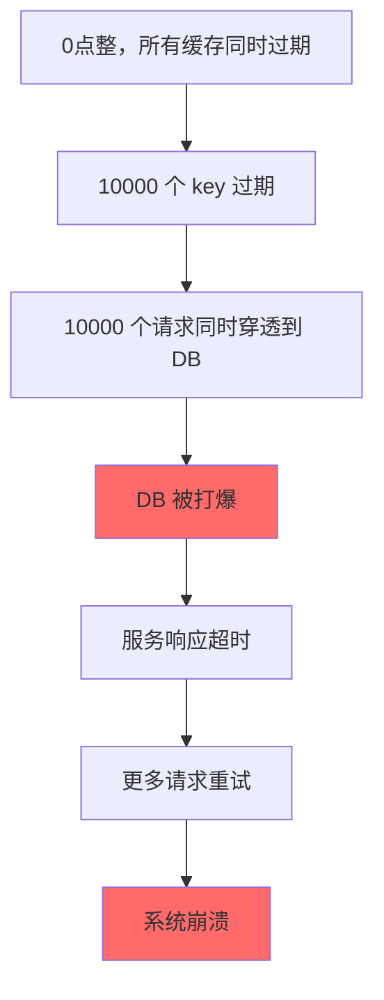
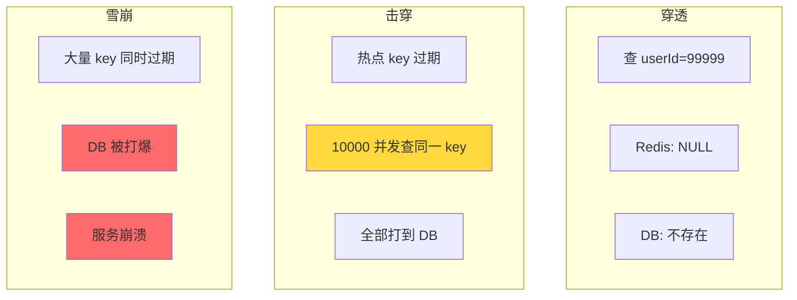
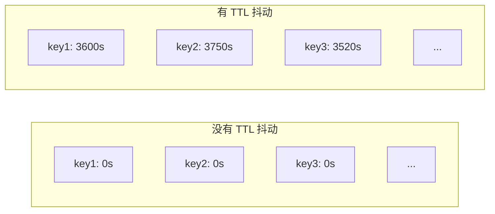
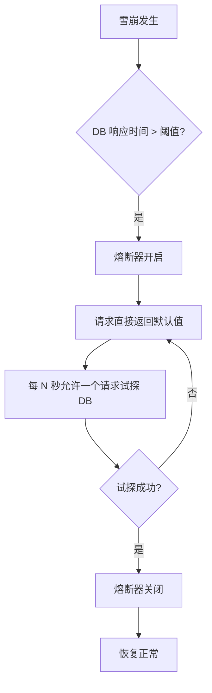

候选人小李在阿里的二面中，面试官问道：

"什么是缓存雪崩？如何避免？"

小李说："大量缓存过期导致数据库压力大。可以加随机 TTL。"面试官点点头，继续追问：

"雪崩和击穿有什么区别？"

小李愣了一下，说："击穿是单个 key，雪崩是多个 key..."

面试官追问："预热怎么做？Redis 启动时没有数据怎么办？"

小李支支吾吾。

【面试官心理】
这道题我用来区分"背概念"和"真正理解"的候选人。知道雪崩和击穿区别的占 50%，能说清预防措施的占 30%，能在面试中给出完整工程方案的占 10%。雪崩是生产环境中最常见也最致命的缓存问题之一。

## 一、什么是缓存雪崩 🔴

### 1.1 问题拆解

**缓存雪崩：大量缓存同时过期，导致大量请求同时击穿到数据库**



### 1.2 雪崩的三大成因

| 成因 | 触发条件 | 危害程度 |
| --- | --- | --- |
| **大量 key 同时过期** | 批量导入数据 + 统一 TTL | 高 |
| **Redis 宕机** | 机器故障/网络分区 | 极高（灾难级） |
| **缓存预热不足** | 冷启动时大量请求穿透 | 中 |

### 1.3 雪崩 vs 击穿 vs 穿透

这是面试官连环追问的经典：

| 问题 | 原因 | 影响范围 | 解决方案 |
| --- | --- | --- | --- |
| **穿透** | 查询不存在的数据 | 所有不存在的数据 | 布隆过滤器 |
| **击穿** | 单个热点 key 过期 | 单个 key | 互斥锁 + 本地缓存 |
| **雪崩** | 大量 key 同时过期/Redis 宕机 | 大面积缓存失效 | 预热 + TTL 抖动 + 熔断 |



【面试官心理】
三个概念必须能区分清楚。雪崩是"批量问题"，击穿是"单个热点问题"，穿透是"不存在数据问题"。能说出三者区别的占 60%，能说出各自解决方案的占 30%，能讲清楚它们之间联系的占 10%。

### 1.4 ❌ 错误示范

**候选人原话**："雪崩就是缓存过期了，多加几个过期时间就好了。"

**问题诊断**：
- 完全不理解雪崩的严重性
- "多加几个过期时间"说法错误（应该随机化 TTL）
- 没有提到 Redis 宕机的场景

**面试官内心 OS**："这个候选人肯定没有经历过真正的雪崩事故。雪崩不是'多加几个时间'就能解决的，需要完整的工程方案。"

## 二、TTL 抖动策略 🔴

### 2.1 核心思想

让缓存的过期时间**不集中**，而是分散开来：



### 2.2 代码实现

```java
// ❌ 错误：统一 TTL
redis.setex(cacheKey, 3600, value);

// ✅ 正确：随机化 TTL
int baseTTL = 3600;
int jitter = new Random().nextInt(300);  // 0~300 秒随机
redis.setex(cacheKey, baseTTL + jitter, value);

// ✅ 更优：基于业务的差异化 TTL
int baseTTL = 3600;
int jitter = (int) (baseTTL * 0.1 * Math.random());  // ±10%
redis.setex(cacheKey, (int)(baseTTL * (0.9 + Math.random() * 0.2)), value);
```

### 2.3 效果对比

```
场景：10000 个 key，TTL = 3600 秒

无抖动：0点整过期
  → 第 0 秒：0 个 key 过期
  → 第 3600 秒：10000 个 key 同时过期 → 雪崩！

有抖动：TTL = 3600~3900 秒随机
  → 第 3600 秒：约 2500 个 key 过期
  → 第 3900 秒：剩余 2500 个 key 过期
  → 过期请求被分散到 300 秒内 → 无雪崩
```

【面试官心理】
TTL 抖动是最简单有效的预防措施。能说出这个方案的占 50%，能解释其数学原理的占 20%。这道题我想验证的是候选人的"工程直觉"——用随机性打破集中性。

## 三、预热策略 🔴

### 3.1 什么是预热？

Redis 启动后，热点数据还没有加载到缓存，大量请求穿透到数据库。预热就是**在 Redis 启动时主动加载热点数据**。

### 3.2 预热方法

**方法一：手动脚本预热**

```bash
#!/bin/bash
# prewarm_cache.sh

# 预热商品列表
redis-cli --scan --pattern "product:*" | while read key; do
    id=$(echo $key | cut -d: -f2)
    data=$(mysql -e "SELECT * FROM products WHERE id=$id")
    redis-cli set "product:$id" "$data"
    echo "Prewarm: product:$id"
done

# 预热用户数据
redis-cli --scan --pattern "user:*" | head -10000 | while read key; do
    # 批量预热
done
```

**方法二：启动时自动预热**

```java
@Component
public class CachePrewarm implements CommandLineRunner {

    @Autowired
    private JedisCluster jedis;

    @Override
    public void run(String... args) {
        log.info("Starting cache prewarm...");

        // 1. 预热热点商品
        List<Product> hotProducts = db.query(
            "SELECT * FROM products ORDER BY sales DESC LIMIT 1000"
        );
        for (Product p : hotProducts) {
            jedis.setex("product:" + p.getId(), 3600, p.toJson());
        }

        // 2. 预热热门用户
        List<User> hotUsers = db.query(
            "SELECT * FROM users ORDER BY followers DESC LIMIT 500"
        );
        for (User u : hotUsers) {
            jedis.setex("user:" + u.getId(), 3600, u.toJson());
        }

        log.info("Cache prewarm completed: {} products, {} users",
            hotProducts.size(), hotUsers.size());
    }
}
```

**方法三：异步预热（不影响启动速度）**

```java
@Component
public class AsyncCachePrewarm {

    @Autowired
    private JedisCluster jedis;

    @PostConstruct
    public void init() {
        CompletableFuture.runAsync(this::prewarm);
    }

    private void prewarm() {
        // 在后台线程中预热，不影响主进程启动
        List<String> hotKeys = getHotKeyFromMonitor();
        for (String key : hotKeys) {
            try {
                loadKeyFromDb(key);
                Thread.sleep(100);  // 避免对 DB 造成压力
            } catch (Exception e) {
                log.warn("Prewarm failed for key: {}", key);
            }
        }
    }
}
```

### 3.3 ❌ 错误示范

**候选人原话**："预热就是手动执行几个 SET 命令，没什么特别的。"

**问题诊断**：
- 没有考虑预热对 DB 的压力
- 没有考虑预热的自动化
- 没有考虑预热失败的处理

**面试官内心 OS**："这个候选人肯定没有实际操作过缓存预热。预热是生产环境中非常重要但又容易被忽略的环节。"

## 四、熔断与限流 🟡

### 4.1 为什么需要熔断？

即使做了预防措施，雪崩仍然可能发生。此时需要**熔断机制**，保护数据库不被压垮：



### 4.2 Redis + 限流实现

```java
public String getUser(String userId) {
    String cacheKey = "user:" + userId;
    String cached = redis.get(cacheKey);
    if (cached != null) {
        return cached;
    }

    // 限流：每秒最多 100 个请求查 DB
    String rateLimitKey = "ratelimit:getUser:" + System.currentTimeMillis() / 1000;
    Long count = redis.incr(rateLimitKey);
    if (count == 1) {
        redis.expire(rateLimitKey, 1);  // TTL = 1 秒
    }

    if (count > 100) {
        // 限流：返回默认值或旧数据
        return getStaleData(userId);  // 返回可能过期的数据
    }

    // 查 DB
    User user = db.query("SELECT * FROM users WHERE id = ?", userId);
    if (user != null) {
        redis.setex(cacheKey, 3600, user.toJson());
    }
    return user != null ? user.toJson() : null;
}
```

### 4.3 熔断器实现

```java
@Component
public class CircuitBreaker {
    private AtomicInteger failureCount = new AtomicInteger(0);
    private volatile long lastFailureTime = 0;
    private static final int THRESHOLD = 50;
    private static final long RECOVERY_TIMEOUT = 5000;  // 5 秒

    public boolean isOpen() {
        if (failureCount.get() >= THRESHOLD) {
            if (System.currentTimeMillis() - lastFailureTime > RECOVERY_TIMEOUT) {
                // 半开状态，允许一个请求
                failureCount.set(0);
                return false;
            }
            return true;
        }
        return false;
    }

    public void recordFailure() {
        failureCount.incrementAndGet();
        lastFailureTime = System.currentTimeMillis();
    }

    public void recordSuccess() {
        failureCount.set(0);
    }
}
```

【面试官心理】
熔断和限流是系统设计的进阶话题。能说出熔断机制的占 10%，能解释熔断器状态的占 5%。这个话题通常出现在 P7 系统设计面试中。

## 五、Redis 宕机场景 🟡

### 5.1 Redis 雪崩 vs Redis 宕机

| 场景 | 原因 | 解决方案 |
| --- | --- | --- |
| **缓存雪崩** | 大量 key 同时过期 | TTL 抖动 + 预热 |
| **Redis 宕机** | 机器故障/网络问题 | 主从 + 哨兵 + Cluster |
| **双十一零点** | 缓存预热不足 + 突发流量 | 预热 + 限流 + 降级 |

### 5.2 Redis 宕机的防护

```
Redis 宕机的防护体系：
1. 主从复制：宕机后从节点接管
2. 哨兵机制：自动故障转移
3. Redis Cluster：分片 + 高可用
4. 多级缓存：本地缓存作为兜底
5. 降级方案：直接查 DB
```

:::warning ⚠️
**最容易被忽略的雪崩**：Redis 从节点宕机，主节点扛不住所有请求。更可怕的是，主从切换时，短时间内大量请求穿透到 DB。
:::

## 六、生产避坑

:::warning ⚠️
生产环境中的三大翻车点：

1. **双十一零点雪崩**：大量运营活动设置的用户缓存同时过期，业务高峰期直接击穿 DB。2021 年某电商平台就在双十一零点因为缓存雪崩导致服务崩溃 10 分钟。

2. **Redis 升级导致雪崩**：升级 Redis 时先重启从节点，再重启主节点。重启主节点时，如果没有足够的从节点，Redis 集群会短暂不可用，大量请求穿透到 DB。

3. **预热不充分导致启动雪崩**：Redis 重启或扩缩容后，缓存为空，大量请求直接打到 DB，导致服务启动失败。
:::

**完整预防方案**：

```
缓存雪崩预防体系：

[预防层]
  - TTL 抖动：基础 TTL ± 10% 随机偏移
  - 差异化 TTL：不同业务类型用不同的 TTL
  - 批量 key 错峰：不在同一时间批量设置 key

[预热层]
  - 启动预热：系统启动时加载热点数据
  - 定时预热：定时任务预加载即将过期的 key
  - 访问驱动：缓存 miss 时同步预热相邻数据

[保护层]
  - 熔断机制：DB 压力过大时熔断
  - 限流：限制穿透到 DB 的 QPS
  - 多级缓存：本地缓存兜底

[恢复层]
  - 降级方案：返回默认值或旧数据
  - 监控告警：缓存命中率 + DB QPS 监控
  - 快速回滚：支持快速关闭缓存
```

**监控告警配置**：

```bash
# 监控 Redis 缓存命中率
redis-cli INFO stats | grep -E "keyspace_hits|keyspace_misses"

# 监控 DB 慢查询
# MySQL: slow_query_log = 1
# 超过 100ms 的查询需要告警

# 告警规则
# 缓存命中率 < 80% → 告警
# DB QPS > 10000 → 告警
# Redis 内存使用率 > 90% → 告警
```

:::tip 💡
生产最佳实践：
- TTL 抖动是成本最低的预防措施，应该作为默认配置
- 预热脚本要定期执行，不能只依赖启动时预热
- 熔断和限流是保护 DB 的最后防线，但不能替代缓存设计
- Redis Cluster 是大规模缓存雪崩的最佳防护（分片 + 高可用）
- 监控是最重要的，没有监控就不知道什么时候发生了雪崩
:::

【面试官心理】
这道题我想最终验证的是候选人的"系统全局思维"。能把雪崩原理讲清楚的占 40%，能把预防层/保护层/恢复层都讲出来的占 10%。一个好的候选人，应该能从"事前预防"到"事中保护"到"事后恢复"有一个完整的思考。
