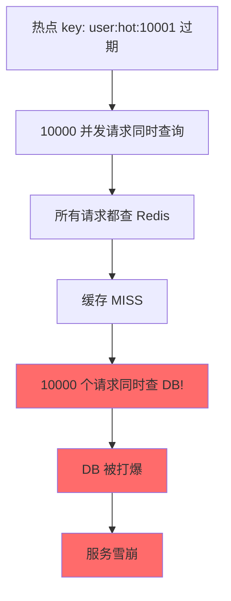
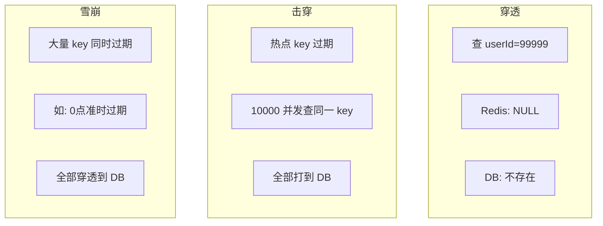
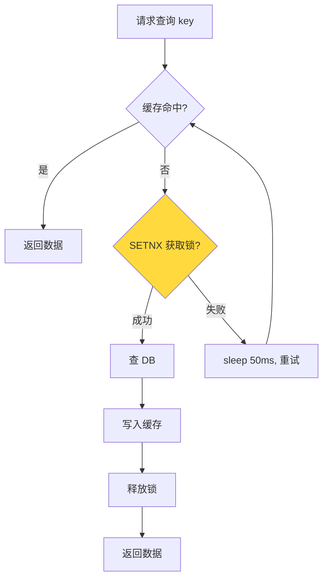
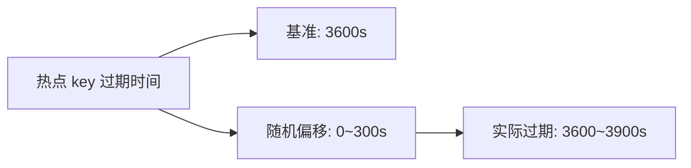
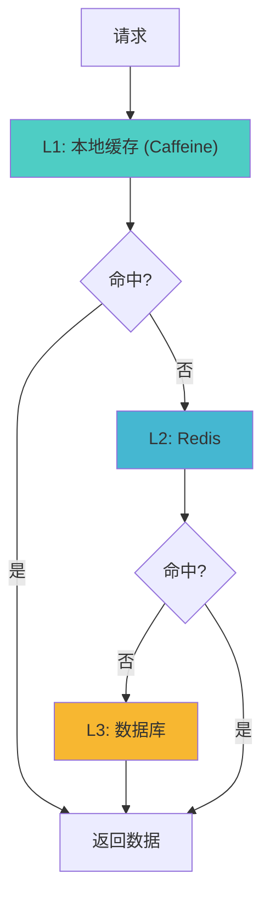

候选人小王在字节跳动的二面中，面试官问道：

"什么是缓存击穿？和穿透有什么区别？"

小王说："击穿是 key 过期，穿透是查不存在的数据。"面试官点点头，继续追问："那击穿怎么解决？"

小王说："加互斥锁。"面试官："怎么用 Redis 实现互斥锁？"

小王说："SETNX..."面试官打断："SETNX 加了锁，但是服务崩溃了，锁没释放怎么办？"

小王彻底卡住。

【面试官心理】
这道题我用来区分"知道概念"和"真正理解解决方案"的候选人。知道击穿和穿透区别的占 60%，能说出互斥锁的占 30%，能说清 SETNX + TTL + 续期机制的占 10%。这道题能答到最后的，基本都有过实际处理生产问题的经验。

## 一、什么是缓存击穿 🔴

### 1.1 问题拆解

**缓存击穿：一个热点 key 过期，大量请求同时击穿到数据库**



### 1.2 穿透 vs 击穿 vs 雪崩

这是面试官最爱的追问，很多人会搞混。

| 概念 | 原因 | 特点 |
| --- | --- | --- |
| **缓存穿透** | 查询不存在的数据 | 所有请求都穿透到 DB |
| **缓存击穿** | 热点 key 过期 | 单个 key 并发量极大 |
| **缓存雪崩** | 大量 key 同时过期 | 大面积缓存失效 |



### 1.3 ❌ 错误示范

**候选人原话**："击穿和穿透差不多，都是缓存没命中的问题。"

**问题诊断**：
- 完全不理解三个概念的本质区别
- 不知道击穿是"单个热点 key"问题，穿透是"不存在数据"问题
- 不理解雪崩是"批量 key"问题

**面试官内心 OS**："三个概念分不清的候选人，说明根本没有系统地学习过缓存问题，只是在网上扫过一眼。"

## 二、互斥锁方案 🔴

### 2.1 核心思想



### 2.2 Redis 互斥锁实现

```java
public String getUser(String userId) {
    String cacheKey = "user:" + userId;
    String cached = redis.get(cacheKey);
    if (cached != null) {
        return cached;
    }

    // 1. 获取互斥锁
    String lockKey = "lock:" + cacheKey;
    String lockToken = UUID.randomUUID().toString();

    // SETNX + TTL，防止死锁
    boolean acquired = redis.set(lockKey, lockToken, "NX", "PX", 3000);

    if (acquired) {
        try {
            // 2. 双重检查：可能其他线程已经写入缓存
            cached = redis.get(cacheKey);
            if (cached != null) {
                return cached;
            }

            // 3. 查询数据库
            User user = db.query("SELECT * FROM users WHERE id = ?", userId);

            // 4. 写入缓存
            if (user != null) {
                redis.setex(cacheKey, 3600, user.toJson());
            }

            return user != null ? user.toJson() : null;
        } finally {
            // 5. 释放锁（但只能释放自己的锁）
            if (lockToken.equals(redis.get(lockKey))) {
                redis.del(lockKey);
            }
        }
    } else {
        // 6. 没拿到锁，sleep 后重试
        Thread.sleep(50);
        return getUser(userId);  // 递归重试
    }
}
```

### 2.3 互斥锁的三大要点

这是面试官追问的核心：

```
1. SETNX + TTL：防止死锁
2. 锁值验证：释放锁时必须验证是自己加的锁
3. TTL 设置：足够长以覆盖查询 DB 的时间，但不能太长
```

:::warning ⚠️
**最常见的错误**：没有验证锁的值就释放锁。如果两个请求的 TTL 相同，后一个请求会在前一个请求释放锁之前就释放了前一个请求的锁，导致锁失效。
:::

### 2.4 ❌ 错误示范

**候选人原话**："SETNX 加锁，然后 del 删除就行了。"

**问题诊断**：
- 没有设置 TTL，可能导致死锁（服务崩溃）
- 没有验证锁的值，可能误删其他请求的锁
- 没有重试机制

**面试官内心 OS**："这个候选人肯定没有在生产环境中用过互斥锁，否则一定会遇到死锁问题。"

## 三、单飞模式（Single Flight） 🟡

### 3.1 什么是 Single Flight？

Single Flight 是 Google 提出的模式：用**一个协程**处理多个并发请求。

```java
// Single Flight 模式
public class UserService {
    // key: 请求 key, value: Future（正在进行的请求）
    private final Map<String, Future<String>> inflight = new ConcurrentHashMap<>();

    public String getUser(String userId) throws Exception {
        String cacheKey = "user:" + userId;

        // 1. 先查缓存
        String cached = redis.get(cacheKey);
        if (cached != null) {
            return cached;
        }

        // 2. Single Flight: 合并并发请求
        Future<String> future = inflight.computeIfAbsent(cacheKey, k -> {
            return executor.submit(() -> {
                try {
                    return loadFromDb(userId);
                } finally {
                    inflight.remove(k);
                }
            });
        });

        // 3. 等待结果
        return future.get();
    }
}
```

### 3.2 Single Flight vs 互斥锁

| 维度 | 互斥锁 | Single Flight |
| --- | --- | --- |
| 实现复杂度 | 中等 | 较高 |
| 请求合并 | 无，多个请求排队 | 有，多个请求合并为一个 |
| 适用场景 | 简单粗暴 | 高并发合并 |
| 典型库 | Redisson | golang.org/x/sync/singleflight |

【面试官心理】
Single Flight 是一个进阶话题。能说出 Single Flight 的占 5%，能解释其原理的占 3%。这个话题通常出现在 P7 面试或系统设计面试中。

## 四、TTL 抖动方案 🟡

### 4.1 核心思想

不让大量 key 同时过期，而是**随机化 TTL**：

```java
// 设置 TTL = 基准 TTL + 随机偏移
int baseTTL = 3600;
int jitter = (int) (Math.random() * 300);  // 0~300 秒随机
int actualTTL = baseTTL + jitter;

redis.setex(cacheKey, actualTTL, value);
```



### 4.2 优点

- 实现简单，无需额外的数据结构
- 天然避免雪崩（因为 key 不会同时过期）
- 对击穿也有一定的缓解作用

【面试官心理】
TTL 抖动是一个简单但有效的方案。能说出这个方案的占 20%，能解释其原理的占 10%。这个方案适合作为"预防性"措施，配合互斥锁一起使用。

## 五、本地缓存方案 🟡

### 5.1 什么是本地缓存？

将热点数据同时缓存在**应用进程的内存**中，减少对 Redis 的访问：

```java
@Component
public class UserCache {
    // 使用 Caffeine 作为本地缓存
    private LoadingCache<String, String> localCache = Caffeine.newBuilder()
        .maximumSize(10000)
        .expireAfterWrite(60, TimeUnit.SECONDS)  // 短 TTL
        .build(key -> redis.get(key));           // 缓存未命中时从 Redis 加载

    public String getUser(String userId) {
        String cacheKey = "user:" + userId;
        return localCache.get(cacheKey);
    }
}
```

### 5.2 本地缓存 vs Redis

| 维度 | 本地缓存 | Redis |
| --- | --- | --- |
| 读取速度 | 极快（内存访问，< 1us） | 快（网络访问，0.1~1ms） |
| 内存占用 | 进程私有，无法共享 | 共享 |
| 数据一致性 | 差（各进程独立） | 好（全局一致） |
| 适用场景 | 读多写少的热点数据 | 共享数据、变化频繁的数据 |

### 5.3 三级缓存架构



【面试官心理】
三级缓存架构是一个 P7 级别的设计问题。能画出三级缓存架构的占 5%，能解释各层职责的占 3%。这个架构在高性能系统中非常常见，如 Nginx + Redis + MySQL 的缓存体系。

## 六、生产避坑

:::warning ⚠️
生产中的三大翻车点：

1. **锁的 TTL 设置不当**：TTL 太短，可能在 DB 查询完成前就过期；TTL 太长，服务崩溃后锁长时间不释放。需要通过压测确定合理的 TTL。

2. **本地缓存数据不一致**：多个服务实例各自维护本地缓存，数据更新时只删了 Redis 缓存，本地缓存还是旧数据。解决方案：本地缓存 TTL 要短，或使用消息广播通知各实例清理本地缓存。

3. **锁竞争导致性能退化**：热点 key 并发量极大时，大量请求在等锁，反而比不用锁更慢。解决方案：结合 Single Flight 或增大本地缓存比例。
:::

**完整解决方案示例**：

```java
public String getUser(String userId) {
    String cacheKey = "user:" + userId;

    // L1: 本地缓存
    String localCached = localCache.getIfPresent(cacheKey);
    if (localCached != null) {
        return localCached;
    }

    // L2: Redis
    String cached = redis.get(cacheKey);
    if (cached != null) {
        localCache.put(cacheKey, cached);
        return cached;
    }

    // L3: 互斥锁 + DB
    String lockKey = "lock:" + cacheKey;
    String lockToken = UUID.randomUUID().toString();

    if (redis.set(lockKey, lockToken, "NX", "PX", 3000)) {
        try {
            // 双重检查
            cached = redis.get(cacheKey);
            if (cached != null) {
                return cached;
            }

            User user = db.query("SELECT * FROM users WHERE id = ?", userId);
            if (user != null) {
                String value = user.toJson();
                redis.setex(cacheKey, 3600 + (int)(Math.random() * 300), value);
                localCache.put(cacheKey, value);
                return value;
            }
            return null;
        } finally {
            if (lockToken.equals(redis.get(lockKey))) {
                redis.del(lockKey);
            }
        }
    } else {
        Thread.sleep(50);
        return getUser(userId);
    }
}
```

:::tip 💡
生产最佳实践：
- 互斥锁：适合一致性要求高的场景，但会增加响应延迟
- TTL 抖动：简单有效，适合预防性措施
- 本地缓存：适合读多写少的热点数据，但要注意数据一致性
- 三级缓存：适合超高 QPS 的场景，但实现复杂度高
- 最佳方案通常是：TTL 抖动 + 互斥锁 + 本地缓存三层组合
:::

【面试官心理】
这道题我想最终验证的是候选人的"工程落地能力"。能把互斥锁原理讲清楚的占 20%，能把 SETNX + TTL + 值验证的细节说清楚的占 10%，能在面试中主动提到生产避坑和三级缓存的占 5%。击穿、穿透、雪崩是缓存三姐妹，能把这三个概念和三个解决方案都讲清楚的，基本都是 P6+。
