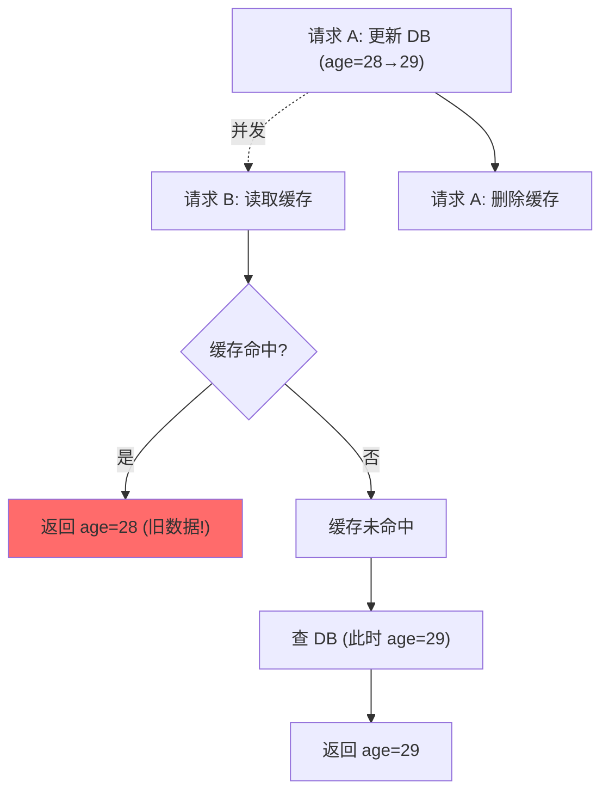
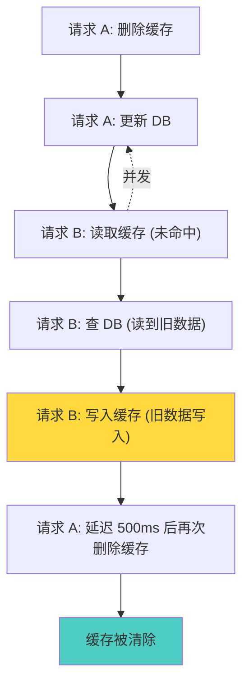
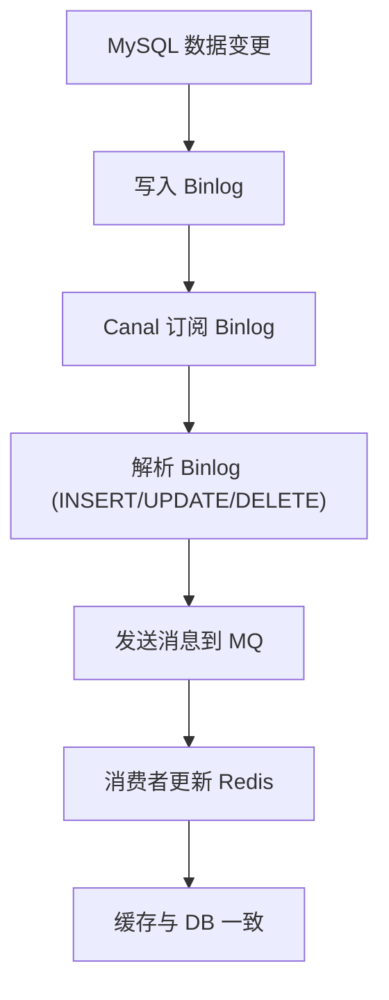

候选人小赵在字节跳动的三面中，面试官问道：

"缓存和数据库的一致性怎么保证？"

小赵说："更新数据库后删除缓存就行了。"面试官追问："那如果删缓存的时候，有新的请求进来查到了旧数据怎么办？"

小赵愣了一下，说："加个延迟再删一次？"

面试官继续："延迟多久？1 秒够吗？5 秒呢？"

小赵彻底卡住。

【面试官心理】
这道题我用来区分"知道概念"和"真正理解时序问题"的候选人。知道 Cache-Aside 模式的占 60%，能说出延迟双删的占 30%，能说清延迟时间的计算方法的占 5%。缓存一致性是分布式系统中最难解决的问题之一，涉及 CAP 理论的权衡。

## 一、缓存一致性问题 🔴

### 1.1 问题拆解

**缓存一致性的本质：数据库和缓存的数据不同步**



**经典场景**：
1. 缓存中有旧数据（age=28）
2. 请求 A 更新数据库（age=28→29）
3. 请求 B 读取缓存，命中旧数据（age=28）
4. 请求 A 删除缓存
5. 结果：请求 B 拿到了脏数据（age=28）

### 1.2 ❌ 错误示范

**候选人原话**："先删缓存，再更新数据库就行了。"

**问题诊断**：
- 完全搞反了顺序
- 先删缓存会导致大量请求穿透到 DB
- 不知道"先更新数据库还是先删缓存"的讨论

**面试官内心 OS**："这个候选人肯定没有在生产环境中处理过一致性问题。先删缓存的方案简直是灾难——会导致缓存击穿。"

## 二、三种缓存更新模式 🔴

### 2.1 Cache-Aside（旁路缓存）

最常用的模式：**读 Cache-Aside，写 Delete-Cache**。

```java
// 读操作
public String getUser(String userId) {
    String cached = redis.get("user:" + userId);
    if (cached != null) {
        return cached;
    }

    User user = db.query("SELECT * FROM users WHERE id = ?", userId);
    if (user != null) {
        redis.setex("user:" + userId, 3600, user.toJson());
    }
    return user != null ? user.toJson() : null;
}

// 写操作
public void updateUser(String userId, User user) {
    // 1. 更新数据库
    db.update("UPDATE users SET age = ? WHERE id = ?", user.getAge(), userId);

    // 2. 删除缓存（不是更新！）
    redis.del("user:" + userId);
}
```

### 2.2 Read-Through（读穿透）

缓存自动从数据库加载数据，应用层不需要关心：

```java
public String getUser(String userId) {
    // 缓存层自动处理：先查缓存，未命中则查 DB 并写入缓存
    return cache.getOrLoad("user:" + userId, () -> db.query(userId));
}
```

### 2.3 Write-Through（写穿透）

写入时同时更新数据库和缓存：

```java
public void updateUser(String userId, User user) {
    // 1. 更新数据库
    db.update(user);

    // 2. 更新缓存（不是删除！）
    redis.setex("user:" + userId, 3600, user.toJson());
}
```

### 2.4 三种模式对比

| 模式 | 读 | 写 | 一致性 | 性能 |
| --- | --- | --- | --- | --- |
| Cache-Aside | 查缓存→miss 则查 DB | 更新 DB → 删缓存 | 最终一致 | 读快写慢 |
| Read-Through | 缓存自动加载 | 同 Cache-Aside | 最终一致 | 读快 |
| Write-Through | 查缓存 | 同步写 DB + 缓存 | 强一致 | 写慢 |

【面试官心理】
三种模式是面试的基础。能说出 Cache-Aside 的占 60%，能说出 Write-Through 区别的占 30%，能解释各自适用场景的占 10%。Cache-Aside 是最常用的模式，因为它在读多写少的场景下性能最好。

## 三、延迟双删 🔴

### 3.1 核心思想

针对 Cache-Aside 的并发问题，引入"延迟双删"：

```java
public void updateUser(String userId, User user) {
    // 1. 删除缓存
    redis.del("user:" + userId);

    // 2. 更新数据库
    db.update("UPDATE users SET age = ? WHERE id = ?", user.getAge(), userId);

    // 3. 延迟一段时间后再删除缓存
    // 这个延迟要 > max(读请求时间)
    Thread.sleep(500);  // 或使用定时任务

    redis.del("user:" + userId);
}
```



### 3.2 追问：延迟多久？

这是面试的高频追问：

```
延迟时间 = max(读请求时间) + 少量缓冲

计算：
- 正常读请求：5ms
- 慢查询：100ms
- 网络抖动：200ms
- 缓冲：100ms

推荐延迟：300ms ~ 1s
```

**但 1 秒就够了吗？**

```java
// 如果读请求本身很慢（慢查询），延迟 1 秒可能不够
// 最坏情况：读请求在删除缓存前 1ms 开始，1 秒后才完成
// 这 1 秒内读到的旧数据会在 1 秒后才被写入缓存
// 但双删会在 1 秒后删除这次写入 → 实际还是可能读到脏数据
```

**真正的解法**：延迟双删 + 业务重试，或者使用分布式锁。

### 3.3 ❌ 错误示范

**候选人原话**："延迟双删就是睡 1 秒后再删一次。"

**问题诊断**：
- 把"延迟"当成万能解法
- 不知道延迟时间的计算方法
- 不知道延迟双删仍然不是强一致的

**面试官内心 OS**："这个候选人肯定没有仔细想过延迟双删的边界条件。延迟双删只能缓解，不能完全解决并发问题。"

## 四、订阅 Binlog 方案 🟡

### 4.1 核心思想

MySQL 的 Binlog 记录了所有数据变更。通过订阅 Binlog，异步更新缓存：



### 4.2 Canal 配置

```properties
# canal.properties
canal.serverMode = kafka
kafka.bootstrap.servers = 127.0.0.1:9092
kafka.retries = 3

# instance.properties
canal.instance.filter.regex = db\\.users
canal.mq.topic = mysql-binlog
```

### 4.3 消费者代码

```java
@KafkaListener(topics = "mysql-binlog")
public void onMessage(String message) {
    // 解析 Canal 的 JSON 格式
    CanalMessage msg = JSON.parseObject(message);

    String table = msg.getTable();
    String type = msg.getType();  // INSERT/UPDATE/DELETE
    String userId = msg.getData().get("id");

    if ("users".equals(table)) {
        if ("DELETE".equals(type)) {
            redis.del("user:" + userId);
        } else {
            // 查询最新数据
            User user = db.query("SELECT * FROM users WHERE id = ?", userId);
            if (user != null) {
                redis.setex("user:" + userId, 3600, user.toJson());
            }
        }
    }
}
```

### 4.4 优势与局限

| 维度 | 延迟双删 | Binlog 订阅 |
| --- | --- | --- |
| 实现复杂度 | 低 | 高 |
| 一致性 | 最终一致（仍有窗口期） | 最终一致（窗口期更小） |
| 延迟时间 | 固定延迟（可能不够） | 实时 |
| 可靠性 | 低（可能丢数据） | 高（Binlog 保证） |
| 适用场景 | 简单场景 | 生产级高一致场景 |

【面试官心理】
Binlog 订阅是生产环境中的最佳实践。能说出这个方案的占 10%，能解释其原理的占 5%，能说出 Canal 工具的占 3%。这个话题通常出现在 P7 面试或架构设计面试中。

## 五、分布式锁方案 🟡

### 5.1 核心思想

用分布式锁保证"读-修改-写"的原子性：

```java
public void updateUser(String userId, User user) {
    String lockKey = "lock:update:user:" + userId;
    String lockToken = UUID.randomUUID().toString();

    // 获取分布式锁
    if (redis.set(lockKey, lockToken, "NX", "PX", 5000)) {
        try {
            // 1. 更新数据库
            db.update(user);

            // 2. 删除缓存
            redis.del("user:" + userId);
        } finally {
            // 3. 释放锁
            if (lockToken.equals(redis.get(lockKey))) {
                redis.del(lockKey);
            }
        }
    } else {
        // 获取锁失败，重试
        Thread.sleep(50);
        updateUser(userId, user);
    }
}
```

### 5.2 分布式锁 vs 延迟双删

| 维度 | 延迟双删 | 分布式锁 |
| --- | --- | --- |
| 实现复杂度 | 低 | 中 |
| 性能影响 | 无性能损耗 | 锁竞争导致性能下降 |
| 一致性保证 | 弱 | 强 |
| 适用场景 | 写少读多 | 写多读多 |

## 六、生产避坑

:::warning ⚠️
生产环境中的三大翻车点：

1. **延迟时间设置不当**：延迟太短（如 100ms），无法覆盖慢查询；延迟太长（如 10s），严重影响更新性能。正确做法：监控读请求的 P99 延迟，延迟时间 = P99 + buffer。

2. **删缓存失败**：网络抖动导致删除缓存失败，数据不一致持续存在。解决方案：引入删除失败的重试队列。

3. **主从延迟**：先更新主库，再删从库中的缓存（如果用从库做读）。主从同步有延迟，期间从库读到旧数据导致缓存不一致。解决方案：读写都走主库，或在延迟双删时加上主从延迟时间。
:::

**重试队列实现**：

```java
@Component
public class CacheDeleteQueue {

    private BlockingQueue<String> deleteQueue = new LinkedBlockingQueue<>();

    @PostConstruct
    public void init() {
        Executors.newSingleThreadExecutor().submit(() -> {
            while (true) {
                String key = deleteQueue.take();
                try {
                    // 重试删除，最多 3 次
                    for (int i = 0; i < 3; i++) {
                        if (redis.del(key) == 1) {
                            break;
                        }
                        Thread.sleep(100);
                    }
                } catch (Exception e) {
                    log.error("Delete cache failed: {}", key, e);
                }
            }
        });
    }

    public void asyncDelete(String key) {
        deleteQueue.offer(key);
    }
}
```

```bash
# 监控缓存一致性
redis-cli INFO stats | grep -E "keyspace_hits|keyspace_misses"
# 命中率 = hits / (hits + misses)

# 命中率突然下降 → 可能发生了缓存不一致

# 监控 DB 和缓存的数据差异
# 定时任务比对 DB 和 Redis 的数据
```

:::tip 💡
生产最佳实践：
- **读多写少**：Cache-Aside + 延迟双删（延迟 300ms~1s）
- **写多读多**：分布式锁
- **高一致性要求**：Binlog 订阅 + MQ 异步更新
- **CAP 权衡**：Redis 是 AP 系统，不可能做到强一致，只能做到最终一致
- **监控最重要**：没有监控就不知道什么时候发生了一致性问题
:::

【面试官心理】
这道题我想最终验证的是候选人对"分布式一致性"的理解。缓存一致性不是一个孤立的问题，它涉及 CAP 理论、分布式事务、最终一致性等多个维度。能把这几个概念串联起来的，基本都是 P7 以上。
