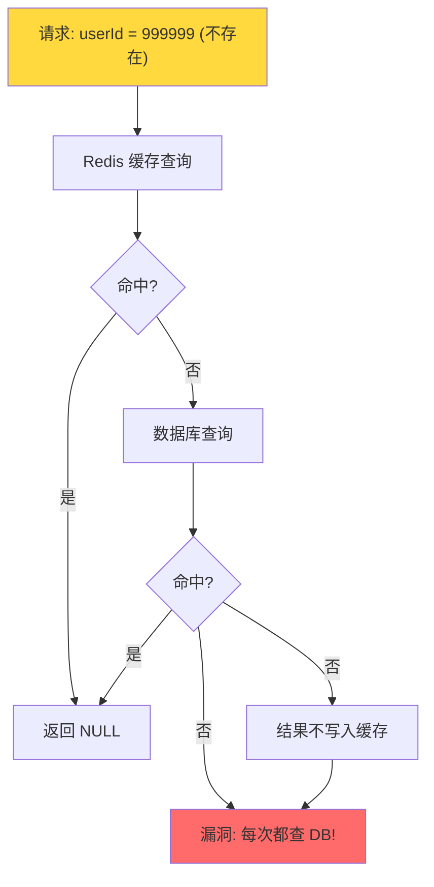
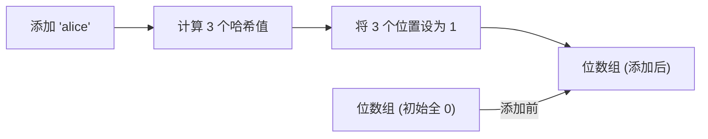

候选人小张在美团的一面中，面试官问了一个经典的生产问题：

"如果有人用大量不存在的 ID 请求你的系统，数据库会怎样？"

小张说："缓存穿透...可以加布隆过滤器。"面试官追问："布隆过滤器的原理是什么？误判率怎么算？"

小张说："用多个哈希函数...误判率大概 1%？"

面试官继续："布隆过滤器存 1 亿个数据，需要多少内存？能不能删除数据？"

小张开始慌了。

【面试官心理】
这道题我用来考察候选人对缓存三大问题（穿透/击穿/雪崩）的理解深度。知道穿透概念的占 80%，能说出布隆过滤器的占 40%，能解释误判率计算的占 10%。这道题是生产环境的真实问题，能答到最后的都是有过实际踩坑经验的人。

## 一、什么是缓存穿透 🔴

### 1.1 问题拆解

**缓存穿透：查询一个不存在的数据**



**场景举例**：
- 恶意攻击：用大量不存在的 ID 发送请求
- 业务漏洞：查询已删除的用户、已下架的商品
- 爬虫爬取：爬取不存在的 URL

### 1.2 危害

```
一次穿透 = 1次 Redis 查询 + 1次 DB 查询
1万次穿透/秒 = 1万次 DB 查询/秒

DB 扛不住 → 服务崩溃 → 连锁反应
```

### 1.3 ❌ 错误示范

**候选人原话**："缓存穿透就是缓存没命中，多查几次数据库就好了。"

**问题诊断**：
- 完全不理解穿透的严重性
- 没有意识到这是安全攻击
- 没有给出任何解决方案

**面试官内心 OS**："这个候选人肯定没有经历过生产环境的穿透攻击。穿透不是'多查几次'的问题，而是可能直接打垮数据库。"

## 二、布隆过滤器原理 🔴

### 2.1 核心思想

布隆过滤器（Bloom Filter）用**位数组 + 多个哈希函数**判断一个数据"可能存在"或"一定不存在"。



**查询逻辑**：
- 计算 3 个哈希值，查看 3 个位置
- **3 个位置全为 1** → **可能存在**（有误判）
- **任一位置为 0** → **一定不存在**（绝对准确）

### 2.2 误判率推导

这是面试的高频深水区。

设位数组长度为 **m**，哈希函数个数为 **k**，插入元素个数为 **n**。

**一个哈希函数将某一位设为 1 的概率**：`1/m`
**一位仍为 0 的概率**：`1 - 1/m`
**k 个哈希函数后，一位仍为 0 的概率**：`(1 - 1/m)^k`
**n 个元素后，一位仍为 0 的概率**：`(1 - 1/m)^(kn)`
**一位为 1 的概率**：`1 - (1 - 1/m)^(kn) ≈ 1 - e^(-kn/m)`

**查询时 k 个位置全为 1 的概率（误判率）**：

```
P(误判) ≈ (1 - e^(-kn/m))^k
```

### 2.3 误判率最优解

对 `P(k) = (1 - e^(-kn/m))^k` 求导，令导数为 0，得到**最优哈希函数个数**：

```
k = (m/n) × ln 2 ≈ 0.693 × (m/n)
```

将 `k = (m/n) × ln 2` 代入误判率公式：

```
P = (0.6185)^(m/n)    // 其中 m/n 表示每个元素的位数
```

| m/n (每位元素占位数) | 误判率 P |
| --- | --- |
| 5 | 8.0% |
| 10 | 0.8% |
| 15 | 0.1% |
| 20 | 0.01% |

### 2.4 内存计算

```
100,000,000 个元素，误判率 1%，需要多少位？

m = -n × ln(P) / (ln(2))^2
m = -1亿 × ln(0.01) / 0.693^2
m = -1亿 × (-4.605) / 0.48
m ≈ 960,000,000 位 ≈ 115 MB
```

:::tip 💡
**记忆口诀**：存 1 亿条数据，误判率 1%，只需要约 120MB 内存。相比存储原始数据（可能需要 10GB+），布隆过滤器的空间效率极高。
:::

### 2.5 Redis 中的布隆过滤器

Redis 4.0 引入了布隆过滤器模块：

```bash
# 安装 RedisBloom (第三方模块) 或 Redis 7.0 内置支持

# 添加元素
BF.ADD user:bloom "user_10001"

# 判断元素是否存在
BF.EXISTS user:bloom "user_10001"
# 1 = 可能存在，0 = 一定不存在

# 批量添加
BF.MADD user:bloom "user_10002" "user_10003"

# 批量判断
BF.MEXISTS user:bloom "user_10001" "user_10004"
```

Redis 7.0 内置的 Bloom Filter：

```bash
# Redis 7.0+ 内置布隆过滤器
BF.ADD myfilter "item1"
BF.EXISTS myfilter "item2"
```

【面试官心理】
布隆过滤器的误判率计算是 P6/P7 的分水岭。能说出误判率公式的占 10%，能推导最优哈希函数个数的占 5%，能说出"ln(2)"和"0.6185"这两个关键常数的只有 3%。这道题不是考背书，而是考数学推导能力。

## 三、布隆过滤器的局限性 🟡

### 3.1 ❌ 错误示范

**候选人原话**："布隆过滤器可以删除数据。"

**问题诊断**：
- 混淆了布隆过滤器和 Cuckoo Filter
- 不理解布隆过滤器的"只能添加，不能删除"特性

**面试官内心 OS**："布隆过滤器不能删除数据，这是最基本的常识。如果他说能删除，那说明他记混了 Cuckoo Filter。"

### 3.2 三大局限性

| 局限性 | 说明 | 解决方案 |
| --- | --- | --- |
| **不能删除** | 删除一个元素可能影响其他元素的判断 | 使用 Counting Bloom Filter 或 Cuckoo Filter |
| **不能获取元素** | 只能判断"可能存在"，不能取出元素 | 配合 Redis Hash 存储完整数据 |
| **误判不可消除** | 误判的数据无法被过滤 | 降级方案：布隆过滤判断 + DB 二次确认 |

### 3.3 解决方案：降级到数据库二次确认

```java
public String getUser(String userId) {
    // 1. 布隆过滤器判断
    if (!bloomFilter.exists(userId)) {
        // 一定不存在，直接返回
        return null;
    }

    // 2. 缓存查询（可能是误判，所以还要查缓存）
    String cached = redis.get("user:" + userId);
    if (cached != null) {
        return cached;
    }

    // 3. 数据库查询（这里一定会查到或不存）
    User user = db.query("SELECT * FROM users WHERE id = ?", userId);
    if (user == null) {
        return null;
    }

    // 4. 写入缓存
    redis.setex("user:" + userId, 3600, user.toJson());
    return user;
}
```

:::warning ⚠️
**重要**：布隆过滤器判断"不存在"时可以直接返回。但判断"存在"时**必须再查一次数据库**，因为可能是误判。
:::

## 四、其他解决方案 🟡

### 4.1 缓存空值

```java
public String getUser(String userId) {
    String cached = redis.get("user:" + userId);
    if (cached != null) {
        return cached.equals("NULL") ? null : cached;  // 空值也缓存
    }

    User user = db.query("SELECT * FROM users WHERE id = ?", userId);
    if (user == null) {
        // 空结果也缓存，短 TTL，避免缓存过多空值
        redis.setex("user:" + userId, 60, "NULL");
        return null;
    }

    redis.setex("user:" + userId, 3600, user.toJson());
    return user;
}
```

| 方案 | 优点 | 缺点 |
| --- | --- | --- |
| 缓存空值 | 简单，零误判 | 空值占用缓存空间，TTL 难定 |
| 布隆过滤器 | 内存占用极低 | 有误判率，不能删除 |
| 布隆 + 缓存空值 | 结合两者优点 | 实现复杂度稍高 |

### 4.2 参数合法性校验

```java
public String getUser(String userId) {
    // 最简单的防护：参数校验
    if (userId == null || userId.length() > 20) {
        throw new IllegalArgumentException("Invalid userId");
    }

    // 进一步：ID 范围校验
    if (Long.parseLong(userId) < 1 || Long.parseLong(userId) > 10_000_000) {
        return null;
    }
    // ... 继续业务逻辑
}
```

【面试官心理】
这道题我想考察的是候选人的"综合方案能力"。能说出布隆过滤器的占 40%，能对比不同方案的占 20%，能在面试中给出"布隆 + 降级"的完整方案的占 10%。生产环境中，通常是"布隆过滤器 + 缓存空值 + 参数校验"三层防护。

## 五、生产避坑

:::warning ⚠️
生产环境中的三大翻车点：

1. **布隆过滤器数据不同步**：用户新增时没有同步更新布隆过滤器，导致新用户被误判为"不存在"。解决方案：在新增用户后同时添加到布隆过滤器。

2. **误判率设计不合理**：初始设计的 m/n 比值过大（内存省了但误判率高），或者过小（内存浪费）。解决方案：根据业务允许的误判率反推位数。

3. **布隆过滤器重建风暴**：Redis 重启后布隆过滤器为空，所有请求都穿透到 DB。解决方案：Redis 启动前从数据库加载数据重建布隆过滤器，或使用 Redis RDB 持久化。
:::

**代码示例：布隆过滤器初始化**

```java
@Service
public class BloomFilterInit {

    @Autowired
    private JedisCluster jedis;

    @PostConstruct
    public void init() {
        // 从数据库加载所有有效用户 ID
        List<String> allUserIds = db.query("SELECT id FROM users");
        for (String userId : allUserIds) {
            jedis.setbit("user:bloom", Long.parseLong(userId), (byte) 1);
        }
        log.info("Bloom filter initialized with {} users", allUserIds.size());
    }
}
```

```bash
# 使用 Redis 原生 setbit 手动构建布隆过滤器
# 这是一个简化示例，真实场景应该用 RedisBloom 库

# Python 示例：使用 redis-py 的布隆过滤器
from redisbloom.client import Client
rb = Client()
rb.add("user:bloom", "user_10001")
rb.add("user:bloom", "user_10002")
print(rb.exists("user:bloom", "user_10001"))  # 1
print(rb.exists("user:bloom", "user_99999"))  # 0
```

:::tip 💡
生产最佳实践：
- 布隆过滤器大小预估：`m = -n × ln(P) / (ln(2))^2`
- 哈希函数个数：`k = (m/n) × ln(2)`
- 布隆过滤器的 key 要定期重建（因为不支持删除，数据会逐渐累积误判）
- 缓存空值的 TTL 不要太长（建议 30-60 秒），避免大量无效数据占用缓存
:::

【面试官心理】
这道题我想最终验证的是候选人的"工程落地能力"。能把布隆过滤器原理讲清楚的占 20%，能说出误判率计算的占 10%，能在面试中主动提到数据同步、重建风暴等生产问题的占 5%。一个好的候选人，应该能在原理和工程之间建立闭环。
