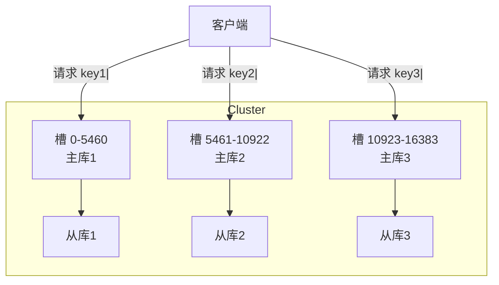
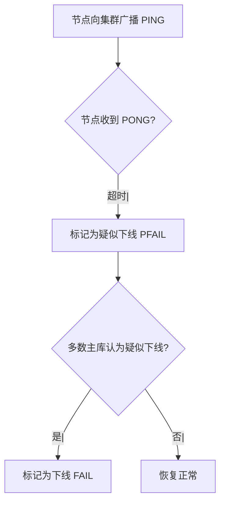
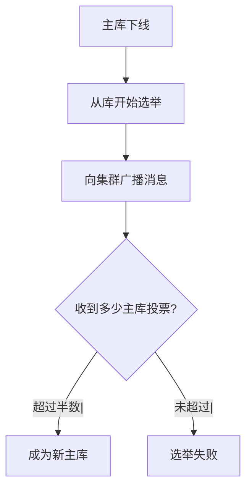
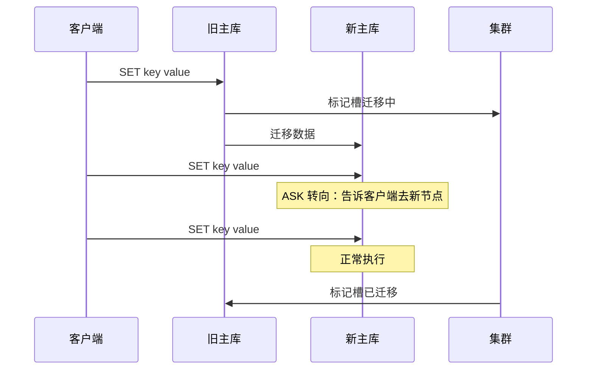

候选人小张在字节 P7 架构面中，面试官问：

"Redis Cluster 是怎么分片的？"

小张说："用槽，16384 个槽。"

面试官追问："槽是怎么分配的？主库挂了怎么选新主库？"

小张说："哨兵可以选主...不对，Cluster 有自己的选主机制？"

小张卡住了。

【面试官心理】
这道题我用来测试候选人对 Redis Cluster 架构的理解深度。能说出槽概念的占 50%，能讲清选主机制的占 20%，能说清槽迁移的占 10%。

## 一、Redis Cluster 架构 🔴

### 1.1 数据分片



### 1.2 槽的分配

```
Redis Cluster 有 16384 个槽（slot）

槽的计算公式：slot = CRC16(key) % 16384

每个主库负责一部分槽：
- 主库1: 槽 0-5460
- 主库2: 槽 5461-10922
- 主库3: 槽 10923-16383
```

### 1.3 槽的计算过程

```c
// CRC16 算法
unsigned int crc16(const char *key, int len) {
    // Redis 使用的 CRC16 实现
    // 用于将 key 映射到 0-16383 范围内
}

int slot = crc16(key, strlen(key)) % 16384;
```

## 二、故障检测与转移 🔴

### 2.1 故障检测



```bash
# 配置节点超时时间
cluster-node-timeout 15000  # 默认 15 秒
```

### 2.2 从库选举



```bash
# 选举规则：
# 1. 从库 slave-replica-validity-factor > 0
# 2. 从库复制偏移量越接近主库，优先级越高
# 3. 收到超过半数主库的投票
```

### 2.3 集群状态

```bash
# 查看集群状态
redis-cli -c -h host -p 7001 cluster info

# 输出：
# cluster_state:ok
# cluster_slots_assigned:16384
# cluster_slots_ok:16384
# cluster_slots_pfail:0
# cluster_slots_fail:0
# cluster_known_nodes:6
# cluster_size:3
# cluster_current_epoch:6
# cluster_my_epoch:3
# cluster_stats_messages_ping_sent:1000
# cluster_stats_messages_pong_sent:1000
```

## 三、槽迁移 🟡

### 3.1 迁移过程



### 3.2 ASK 转向

```bash
# 当客户端请求的槽正在迁移时
# 旧主库返回 ASK 转向
ASK key value
# 或
ASKING

# 客户端收到 ASK 后，发送 ASKING 到新主库
# 然后再执行原来的命令
```

### 3.3 在线迁移槽

```bash
# 进入集群管理界面
redis-cli -c -h host -p 7001

# 重新分片
CLUSTER SETSLOT slot MIGRATING node-id
# 例如：
CLUSTER SETSLOT 100 MIGRATING 7c7d8e9f...

# 在目标节点导入
CLUSTER SETSLOT slot IMPORTING node-id
```

## 四、集群配置 🟡

### 4.1 创建集群

```bash
# 准备配置文件
# redis-7001.conf
port 7001
cluster-enabled yes
cluster-config-file nodes-7001.conf
cluster-node-timeout 15000
daemonize yes
pidfile /var/run/redis_7001.pid
logfile /var/log/redis/redis-7001.log
dbfilename dump-7001.rdb
appendfilename "appendonly-7001.aof"

# 启动节点
redis-server redis-7001.conf
redis-server redis-7002.conf
redis-server redis-7003.conf
redis-server redis-7004.conf
redis-server redis-7005.conf
redis-server redis-7006.conf

# 创建集群
redis-cli --cluster create \
    127.0.0.1:7001 \
    127.0.0.1:7002 \
    127.0.0.1:7003 \
    127.0.0.1:7004 \
    127.0.0.1:7005 \
    127.0.0.1:7006 \
    --cluster-replicas 1
# --cluster-replicas 1 表示每个主库有 1 个从库
```

### 4.2 集群管理命令

```bash
# 查看集群节点
CLUSTER NODES

# 查看槽分配
CLUSTER SLOTS

# 添加主库
redis-cli --cluster add-node 127.0.0.1:7007 127.0.0.1:7001

# 添加从库
redis-cli --cluster add-node 127.0.0.1:7008 127.0.0.1:7001 --cluster-slave

# 重新分片
redis-cli --cluster reshard 127.0.0.1:7001

# 删除节点
redis-cli --cluster del-node 127.0.0.1:7007 node-id
```

## 五、客户端路由 🟡

### 5.1 Moved 重定向

```bash
# 客户端请求槽 100
redis-cli -c -h host -p 7001 GET key:100

# 如果槽 100 不在 7001 上
# 返回 MOVED 100 host:port
# 客户端自动转向正确节点
MOVED 100 127.0.0.1:7002
```

### 5.2 Jedis 客户端

```java
// JedisCluster
Set<HostAndPort> nodes = new HashSet<>();
nodes.add(new HostAndPort("host1", 7001));
nodes.add(new HostAndPort("host2", 7002));
nodes.add(new HostAndPort("host3", 7003));

JedisCluster cluster = new JedisCluster(
    nodes,
    3000,  // 连接超时
    3000,  // 读取超时
    3,     // 重试次数
    new JedisPoolConfig()
);

// 自动处理 MOVED 重定向
cluster.set("key", "value");
cluster.get("key");
```

## 六、集群限制 🟡

### 6.1 不支持的操作

```bash
# 以下操作在集群模式下不支持：
# - 多键操作（不在同一槽）
MGET key1 key2  # 可能返回错误

# - 跨槽的事务
MULTI
SET key1 value1
SET key2 value2
EXEC  # 可能失败

# - 跨槽的批量操作
```

### 6.2 解决方案

```java
// 1. 使用 Hash Tag 确保 key 在同一槽
// Hash Tag 用大括号包裹
// {user:1}:profile  和 {user:1}:orders  会在同一槽

// 2. 使用客户端聚合
List<String> keys = Arrays.asList("key1", "key2", "key3");
// 计算每个 key 的槽，然后按槽分组
Map<Integer, List<String>> slots = new HashMap<>();
for (String key : keys) {
    int slot = crc16(key) % 16384;
    slots.computeIfAbsent(slot, k -> new ArrayList<>()).add(key);
}
```

:::tip 💡
使用 Hash Tag 是解决跨槽操作的标准方法。例如按用户 ID 分组时，用 `{user:123}:profile` 和 `{user:123}:orders` 可以保证在同一槽。
:::

【面试官心理】
能说出"Hash Tag"解决跨槽问题的候选人，基本都有实际使用 Redis Cluster 的经验。这是 P6+ 的水准。
