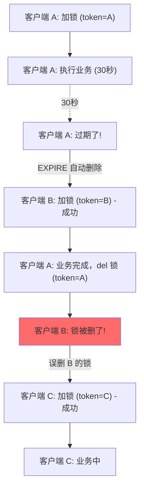
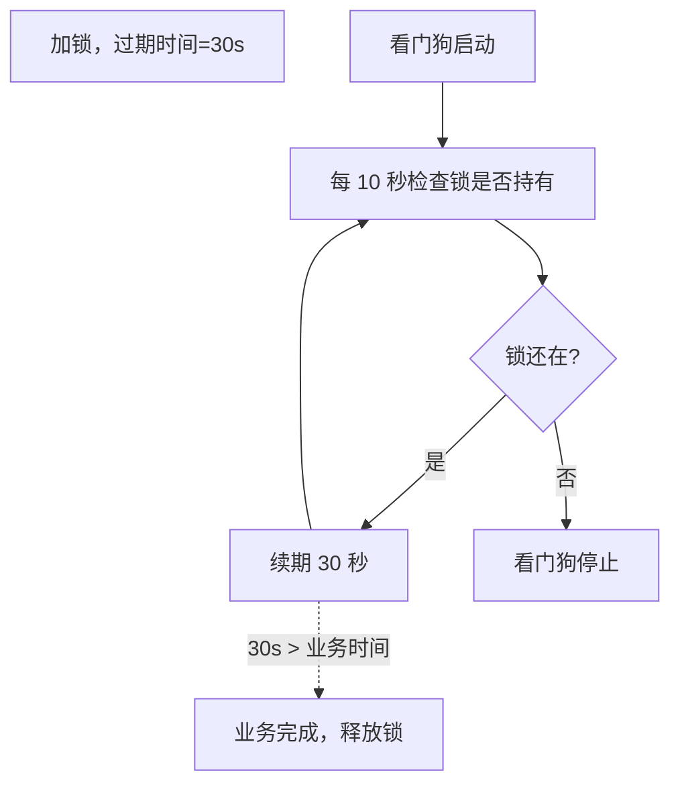

候选人小林在阿里的二面中，面试官问道：

"Redis 怎么实现分布式锁？"

小林说："SETNX 加锁，然后设置过期时间，最后 del 解锁。"面试官点点头，继续追问：

"如果 SETNX 加了锁，服务崩溃了，还没来得及设置过期时间怎么办？"

小林愣了一下，说："...用 EXPIRE 设置过期时间？"

面试官打断："SETNX 和 EXPIRE 是两个命令，不是原子的，怎么保证？"

小林开始慌了。

【面试官心理】
这道题我用来区分"会用"和"会用且理解原理"的候选人。知道 SETNX + EXPIRE 的占 60%，能说出 SET + EX = 原子的占 30%，能说清 owner 验证和 watchdog 的占 10%。分布式锁是 Redis 最经典的应用之一，但真正能用对的人不到 10%。

## 一、最简单的分布式锁 🔴

### 1.1 问题拆解

**分布式锁的核心需求**：

```
1. 互斥：同一时刻只有一个客户端能获取锁
2. 防死锁：锁必须能自动释放，不能无限期占用
3. 可重入：同一个客户端可以多次获取同一个锁
4. 原子性：加锁和解锁必须是原子操作
```

### 1.2 朴素实现的问题

```java
// ❌ 错误：SETNX + EXPIRE 不是原子操作
String lockKey = "lock:order:1001";
boolean acquired = redis.setnx(lockKey, "token");
if (acquired) {
    // 问题：服务在这里崩溃，锁就永远不会过期了
    redis.expire(lockKey, 300);  // 可能没执行到
    try {
        // 执行业务逻辑
    } finally {
        redis.del(lockKey);
    }
}
```

### 1.3 ❌ 错误示范

**候选人原话**："用 SETNX 加锁，设置过期时间就行了。"

**问题诊断**：
- 不知道 SETNX + EXPIRE 不是原子的
- 不理解 SET 命令的 NX 和 PX 选项
- 没有考虑 owner 验证
- 没有考虑锁续期

**面试官内心 OS**："这个候选人肯定没有在生产环境中用过分布式锁，否则一定会遇到死锁或锁误删的问题。"

## 二、正确的分布式锁 🔴

### 2.1 SET + NX + PX = 原子加锁

Redis 2.6.12 之后，SET 命令支持同时设置 NX 和 PX：

```java
// ✅ 正确：一条命令完成加锁 + 设置过期时间
String lockKey = "lock:order:1001";
String lockToken = UUID.randomUUID().toString();

String result = redis.set(lockKey, lockToken, "NX", "PX", 30000);
// result = "OK" 表示加锁成功
// result = null 表示锁已被占用
```

### 2.2 解锁：原子验证 + 删除

```java
public void unlock(String lockKey, String lockToken) {
    // ❌ 错误：直接删除
    redis.del(lockKey);

    // ✅ 正确：用 Lua 脚本保证原子性
    String luaScript =
        "if redis.call('get', KEYS[1]) == ARGV[1] then " +
        "    return redis.call('del', KEYS[1]) " +
        "else " +
        "    return 0 " +
        "end";

    redis.eval(luaScript, 1, lockKey, lockToken);
}
```



**问题**：客户端 A 的锁过期了（30秒还没执行完），客户端 B 加锁成功。但客户端 A 业务完成后，用自己的 token 删了锁——删的是 B 的锁！

**解决方案**：解锁前必须验证 token 是否匹配。

### 2.3 完整分布式锁代码

```java
public class RedisDistributedLock {

    private JedisCluster jedis;

    public String lock(String lockKey, String lockToken, int expireMs) {
        // SET key token NX PX milliseconds
        String result = jedis.set(lockKey, lockToken, "NX", "PX", expireMs);
        return "OK".equals(result) ? lockToken : null;
    }

    public boolean unlock(String lockKey, String lockToken) {
        String luaScript =
            "if redis.call('get', KEYS[1]) == ARGV[1] then " +
            "    return redis.call('del', KEYS[1]) " +
            "else " +
            "    return 0 " +
            "end";

        Long result = (Long) jedis.eval(luaScript, 1, lockKey, lockToken);
        return result != null && result == 1;
    }

    // 使用示例
    public void createOrder(String orderId) {
        String lockKey = "lock:order:" + orderId;
        String lockToken = UUID.randomUUID().toString();

        String token = lock(lockKey, lockToken, 30000);
        if (token == null) {
            throw new RuntimeException("获取锁失败");
        }

        try {
            // 业务逻辑
            doCreateOrder(orderId);
        } finally {
            unlock(lockKey, lockToken);
        }
    }
}
```

【面试官心理】
我连环追问的目的是让候选人意识到：分布式锁的坑比想象中多得多。SETNX + EXPIRE 不是原子（老版本问题）、del 不验证 owner（会误删）、没有锁续期（业务超时导致锁自动释放）——这三个问题都是生产环境中真实踩过的坑。

## 三、锁续期问题 🔴

### 3.1 锁续期的场景

```
客户端 A 加锁，设置过期时间 10 秒
客户端 A 业务执行需要 30 秒
10 秒后锁自动过期
客户端 B 加锁成功
客户端 A 业务完成，del 锁（删了 B 的锁）
客户端 C 加锁成功
→ 此时客户端 B 和 C 同时持有锁，数据错乱！
```

### 3.2 Watchdog（看门狗）机制

Redisson 实现了自动锁续期：

```java
// Redisson 的 lock() 默认使用看门狗机制
RLock lock = redissonClient.getLock("order:1001");
lock.lock();  // 不传过期时间，默认 30 秒，看门狗自动续期

try {
    // 业务逻辑（可能执行很久）
    doCreateOrder();
} finally {
    lock.unlock();
}
```



### 3.3 手动续期方案

如果不使用 Redisson，需要自己实现续期：

```java
public class LockWithRenew {

    private JedisCluster jedis;
    private volatile boolean renewed = false;

    public String lock(String lockKey, String lockToken, int expireMs) {
        String result = jedis.set(lockKey, lockToken, "NX", "PX", expireMs);
        if ("OK".equals(result)) {
            // 启动续期线程
            startRenewThread(lockKey, lockToken, expireMs);
        }
        return result;
    }

    private void startRenewThread(String lockKey, String lockToken, int expireMs) {
        Thread renewThread = new Thread(() -> {
            while (!renewed && Thread.currentThread().isInterrupted()) {
                try {
                    Thread.sleep(expireMs / 3);  // 每 1/3 过期时间续期一次

                    // 检查锁是否还是自己的
                    String currentToken = jedis.get(lockKey);
                    if (lockToken.equals(currentToken)) {
                        jedis.pexpire(lockKey, expireMs);
                    } else {
                        // 锁已经被别人持有了，退出
                        renewed = true;
                        break;
                    }
                } catch (InterruptedException e) {
                    break;
                }
            }
        });
        renewThread.start();
    }

    public void unlock(String lockKey, String lockToken) {
        renewed = true;  // 停止续期
        // ... 解锁逻辑
    }
}
```

## 四、可重入锁 🟡

### 4.1 什么是可重入？

同一线程可以多次获取同一个锁：

```java
public void methodA() {
    lock("lock:resource");
    try {
        methodB();  // 同一个线程，内部也需要获取同一个锁
    } finally {
        unlock("lock:resource");
    }
}

public void methodB() {
    lock("lock:resource");  // 同一个线程，可以再次获取
    try {
        // 业务逻辑
    } finally {
        unlock("lock:resource");
    }
}
```

### 4.2 可重入锁的实现

```java
// 锁值 = threadId:重入次数
// HINCRBY threadId:lockKey 1  → 加 1
// HINCRBY threadId:lockKey -1 → 减 1

String luaScript =
    "if redis.call('exists', KEYS[1]) == 0 then " +
    "    redis.call('hset', KEYS[1], ARGV[1], 1) " +
    "    redis.call('pexpire', KEYS[1], ARGV[2]) " +
    "    return 1 " +
    "elseif redis.call('hget', KEYS[1], ARGV[1]) then " +
    "    redis.call('hincrby', KEYS[1], ARGV[1], 1) " +
    "    redis.call('pexpire', KEYS[1], ARGV[2]) " +
    "    return 1 " +
    "else " +
    "    return 0 " +
    "end";

String luaUnlock =
    "if redis.call('hget', KEYS[1], ARGV[1]) then " +
    "    local count = redis.call('hincrby', KEYS[1], ARGV[1], -1) " +
    "    if count == 0 then " +
    "        return redis.call('del', KEYS[1]) " +
    "    else " +
    "        return 0 " +
    "    end " +
    "else " +
    "    return -1 " +
    "end";
```

## 五、生产避坑

:::warning ⚠️
生产中的三大翻车点：

1. **SETNX + EXPIRE 分开执行**：Redis 老版本中 SETNX 和 EXPIRE 是两个命令，服务崩溃在两者之间会导致死锁。解决方案：使用 SET key value NX PX milliseconds。

2. **解锁时不验证 owner**：解锁时直接 del 而不是验证 token，会误删其他客户端的锁，导致并发问题。解决方案：Lua 脚本保证原子性。

3. **业务执行时间超过 TTL**：锁自动过期，但业务还在执行，导致多个客户端同时持有锁。解决方案：使用 Redisson 的 watchdog 机制或手动续期。
:::

**Redis 分布式锁 vs Zookeeper 分布式锁**：

| 维度 | Redis 锁 | Zookeeper 锁 |
| --- | --- | --- |
| 可靠性 | 较低（单机不可靠，需 RedLock） | 较高（ZAB 协议保证） |
| 性能 | 高（内存操作） | 中等（网络 + 磁盘） |
| 实现复杂度 | 低 | 中 |
| 锁过期 | 需要 watchdog | Session 过期自动清理 |
| 公平锁 | 需要额外实现 | 支持临时顺序节点 |
| 使用建议 | 普通并发控制 | 高可靠要求场景 |

**Redisson 最佳实践**：

```java
@Configuration
public class RedissonConfig {

    @Bean
    public RedissonClient redissonClient() {
        Config config = new Config();
        config.useClusterServers()
            .addNodeAddress("redis://127.0.0.1:6379")
            .setPassword("password")
            .setConnectionPoolSize(64)
            .setConnectionMinimumIdleSize(24);
        return Redisson.create(config);
    }
}

// 使用
@Service
public class OrderService {

    @Autowired
    private RedissonClient redisson;

    public void createOrder(String orderId) {
        RLock lock = redisson.getLock("lock:order:" + orderId);

        // tryLock 非阻塞获取锁，等待 0 秒，锁自动过期 30 秒
        if (lock.tryLock(0, 30, TimeUnit.SECONDS)) {
            try {
                doCreateOrder(orderId);
            } finally {
                if (lock.isHeldByCurrentThread()) {
                    lock.unlock();
                }
            }
        } else {
            throw new RuntimeException("系统繁忙，请稍后重试");
        }
    }
}
```

:::tip 💡
生产最佳实践：
- **单机 Redis 锁**：SET key token NX PX 30000 + Lua 解锁
- **高可靠场景**：使用 Redisson（自动 watchdog）+ 多节点 RedLock
- **性能敏感**：锁的粒度要尽可能小（按数据 ID 锁，而不是按业务类型锁）
- **超时设置**：锁超时 = 正常业务时间 × 2，避免业务没执行完锁就过期
- **监控**：监控锁的等待时间、获取成功率等指标
:::

【面试官心理】
这道题我想最终验证的是候选人的"工程严谨性"。能把 SETNX + EXPIRE 问题说清楚的占 30%，能把 owner 验证说清楚的占 20%，能把 watchdog 说清楚的占 10%。分布式锁是 Redis 最经典的应用，但 90% 的人实现都是错的。这道题能答到最后的，基本都有过实际踩坑经验。
