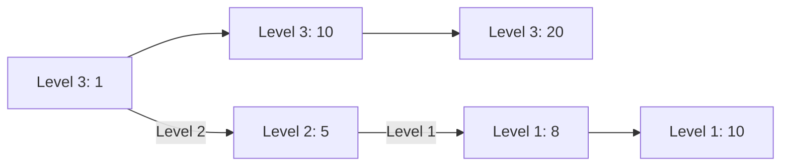
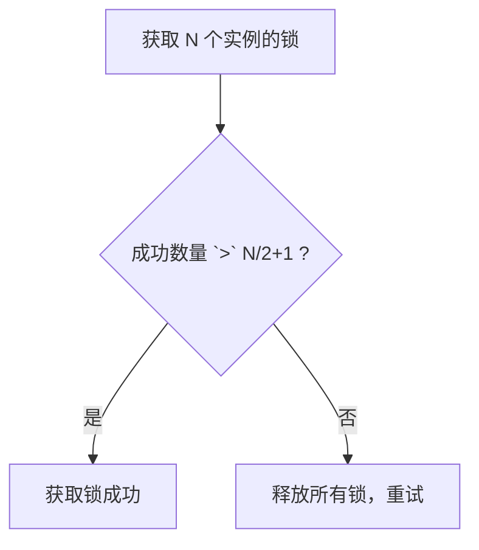
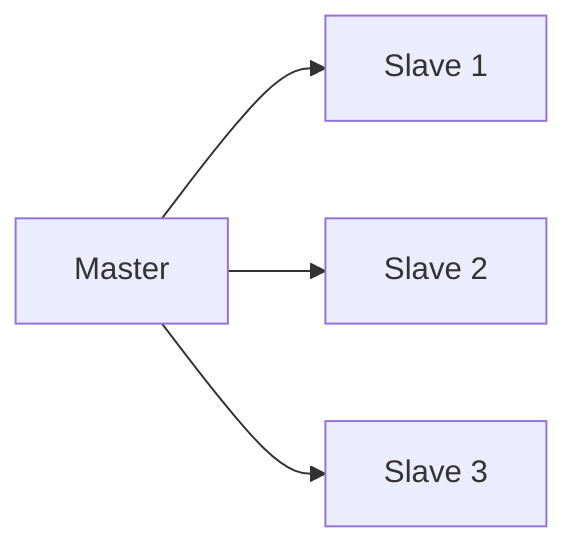

# Redis 性能圣战

Redis 是后端面试的硬仗，也是区分"背过"和"做过"的关键技术。

我见过太多候选人在简历上写"熟练使用 Redis"，结果问到 Redis 的过期策略就卡壳，问到缓存穿透就只会说"加布隆过滤器"，问到 Redis 集群脑裂就一脸懵。这不是熟练，这是"听说过"。

这个模块，帮你把 Redis 从"听说过"变成"能实战"。

## 一、数据类型与底层结构 🔴

### 1.1 五大数据类型

| 类型 | 底层结构 | 典型场景 |
| --- | --- | --- |
| String | SDS（简单动态字符串） | 缓存、计数器、分布式锁 |
| List | Quicklist（双向链表+压缩列表） | 队列、消息流、最新N条 |
| Hash | Dict + ziplist / hashtable | 对象存储、购物车 |
| Set | Dict + intset | 去重、标签、好友关系 |
| Zset | Dict + SkipList | 排行榜、延时队列 |

**面试官心理**
我问他 String 的底层实现，十个候选人六个说"char 数组"。这是送分题，答错直接扣分。SDS 才是 Redis 的_STRING_实现，它解决了 C 字符串的三个痛点：长度计算 `O(n)`、缓冲区溢出、内存重新分配。知道这个的才是真正看过源码的。

### 1.2 过期策略与淘汰策略

**过期策略（定时删除 vs 惰性删除）**

- **定时删除**：设置定时器，到期立刻删，占 CPU
- **惰性删除**：下次访问时检查，过期了才删，省 CPU
- **定期删除**：每 `100ms` 抽检一部分，平衡方案

**淘汰策略（内存不足时）**

| 策略 | 行为 |
| --- | --- |
| `noeviction` | 拒绝写入，返回错误 |
| `allkeys-lru` | 所有 Key LRU 淘汰 |
| `volatile-lru` | 已设置过期 Key LRU 淘汰 |
| `allkeys-random` | 随机淘汰 |
| `volatile-ttl` | 淘汰 TTL 最短的 |

**面试官心理**
我会问："如果你的 Redis 内存满了，新的数据还能写进去吗？"答"能"的没实战经验。实际上取决于淘汰策略，`noeviction` 会拒绝写入，其他策略会淘汰旧数据。知道这个细节的才是踩过坑的。

### 1.3 跳跃表（SkipList）



- ZSet 为什么用 SkipList 而不是 B+Tree？
- 因为 Sorted Set 需要 `O(log n)` 插入/删除，B+Tree 插入成本高
- SkipList 实现简单，占用内存更少

**面试官心理**
这道题我通常用来拉开 P6 和 P7 的差距。能说出"因为 ZSet 需要频繁插入删除，B+Tree 插入成本高"的，说明对数据结构有理解。只背"跳跃表查询快"的，根本没思考过设计原因。

## 二、持久化策略 🔴

### 2.1 RDB vs AOF

| 特性 | RDB | AOF |
| --- | --- | --- |
| 持久化方式 | 定时快照，生成 dump.rdb | 记录每个写命令 |
| 文件体积 | 小（完整备份） | 大（累积所有命令） |
| 恢复速度 | 快（二进制） | 慢（重放命令） |
| 数据完整性 | 可能丢失最后一次快照后的数据 | 可配置 `always`/`everysec`/`no` |
| fork() 影响 | 会阻塞 | copy-on-write，阻塞小 |

**面试官心理**
我会问："RDB 和 AOF 可以同时开启吗？"答"不可以"或"可以"的都没理解透。正确答案是：同时开启时 Redis 恢复优先用 AOF（数据更完整）。但要注意，AOF 文件过大会触发 rewrite，fork() 会阻塞。这个细节踩过坑的才知道疼。

### 2.2 混合持久化

```sql
-- 5.0+ 支持
aof-use-rdb-preamble yes
```

混合持久化：`RDB + AOF`，用 RDB 格式存储数据部分，用 AOF 格式存储命令部分。兼顾恢复速度和完整性。

## 三、缓存问题与解决方案 🔴

### 3.1 缓存穿透

**问题**：查询一个不存在的 key，每次都打到数据库。

**解决方案**：
- **布隆过滤器**：存所有存在的 key，O(1) 判断
- **缓存空值**：把 `null` 结果也缓存，设置短 TTL
- **接口限流**：防止大量无效请求

**面试官心理**
我问他布隆过滤器的假阳性率怎么算，十个候选人九个懵。这道题不是考数学，是考你有没有真正理解这个数据结构的局限性。知道假阳性率 `≈ (1 - e^(-kn/m))^k` 的，基本都亲手实现过。

### 3.2 缓存击穿

**问题**：热点 key 过期瞬间，大量请求打到数据库。

**解决方案**：
- **互斥锁**：只有一个线程去查数据库，其他等
- **逻辑过期**：不设置 TTL，设置一个逻辑过期时间字段
- **热点数据永不过期**：评估热点数据，打散过期时间

### 3.3 缓存雪崩

**问题**：大量 key 同时过期，或 Redis 宕机。

**解决方案**：
- 过期时间加随机值：`TTL = base + random(0, 1000)`
- Redis 集群保证高可用
- 限流 + 本地缓存兜底

### 3.4 数据一致性

```sql
-- Cache Aside（最常用）
// 读：cache hit 直接返回，miss 查 DB 写 cache
// 写：先更新 DB，再删除 cache（不是更新 cache）
```

**面试官心理**
我问他为什么不更新 cache 而删除 cache。只会说"避免脏数据"的没想过并发问题。正确答案是：并发写入时，更新 cache 可能被覆盖，而删除 cache 下次读会重新加载。Cache Aside + 删除 cache 是最稳妥的方案。

## 四、分布式锁 🟡

### 4.1 SET NX EX 方案

```sql
SET lock_key unique_value NX EX 30
-- NX: 不存在才设置（原子性）
-- EX 30: 30 秒过期
```

**问题**：如果业务执行超过 30 秒，锁自动释放，业务还没执行完。

**解决**：续命机制（watchdog），定时延长锁时间。

### 4.2 RedLock 算法



- 需要在 `N` 个 Redis 实例上获取锁
- 大多数实例成功才算成功
- 解决单点 Redis 的可靠性问题

**面试官心理**
RedLock 我一般问两个问题：第一，为什么需要多个实例？第二，如果一个实例在释放锁前宕机了怎么办？能答出"主从切换导致锁丢失"的，说明真正理解过分布式系统的一致性问题。

## 五、集群方案 🟡

### 5.1 主从复制



- **全量同步**：Slave 首次连接，执行 `RDB` 传输
- **增量同步**：后续用 `PSYNC` 同步部分命令

### 5.2 Sentinel（哨兵）模式

- 监控主从节点存活
- 自动故障转移
- 选主策略：`priority` 优先，同优先级的 `runid` 小的优先

### 5.3 Cluster 模式

- **16384 个槽**分片
- 每个节点负责一部分槽
- `MOVED` 重定向：客户端缓存 slot -> node 映射

**面试官心理**
我会问："为什么是 16384 个槽而不是 65536？"能答出"因为心跳包用 bitmap，16384 只需要 2KB，65536 需要 8KB"的，说明研究过 Redis 源码。只会背"官方推荐的"没思考过设计原因。

## 六、面试题分级速查

| 级别 | 高频问题 | 期望回答 |
| --- | --- | --- |
| P5 | 数据类型、过期策略、缓存穿透 | 能说清基本概念，不怵基础追问 |
| P6 | 持久化机制、淘汰策略、分布式锁 | 能讲清底层实现，有实战经验 |
| P7 | 集群脑裂、RedLock、数据一致性 | 有架构视野，能设计高可用方案 |

## 七、学习路径指引

**P5 阶段（会用）**
- 搞懂五种数据类型的特点和场景
- 理解缓存三大问题及基础解法
- 会用 Redis 做简单计数、缓存

**P6 阶段（精通）**
- 理解 SDS、SkipList 底层结构
- 能分析持久化策略的取舍
- 能设计分布式锁方案

**P7 阶段（架构）**
- 能设计多级缓存架构
- 理解 Redis 集群的原理和限制
- 有生产环境问题排查和调优经验

---

:::tip 💡
Redis 面试的精髓是"细节"：过期策略的细节、淘汰策略的细节、分布式锁的细节。能答到细节的才是真正踩过坑的。
:::
