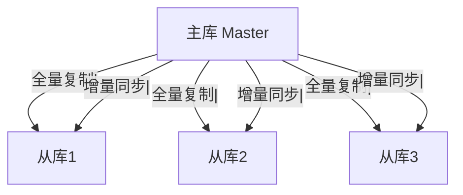
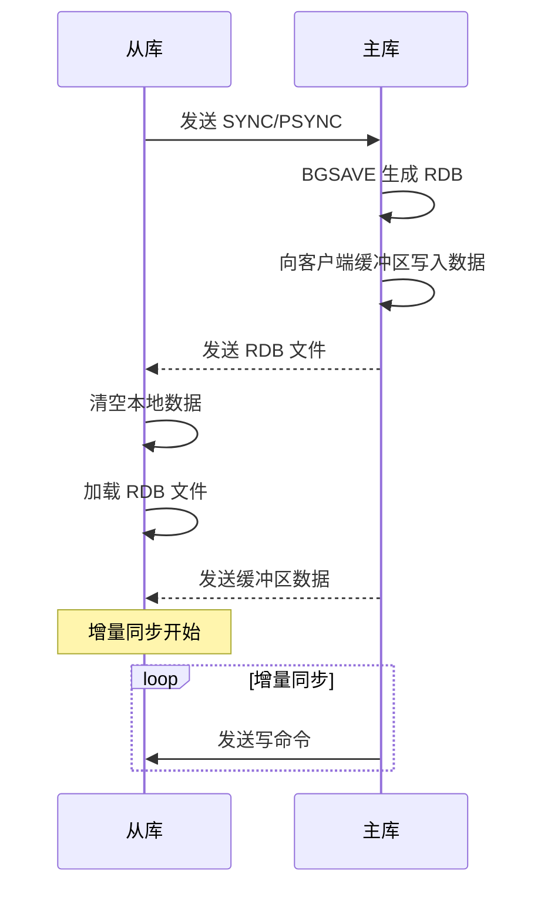
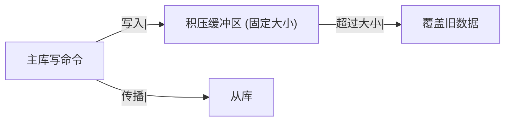
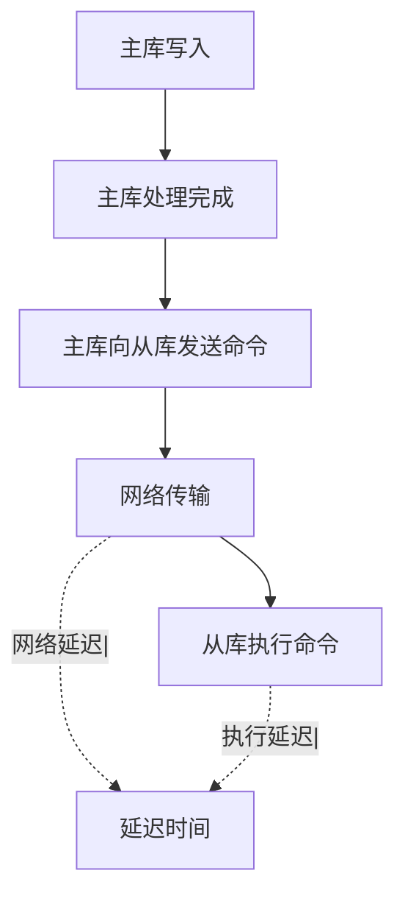
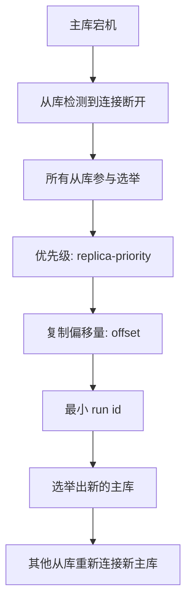

候选人小张在字节 P6 面试中，面试官问：

"Redis 怎么实现读写分离？"

小张说："配置主从复制，从库负责读。"

面试官追问："主从复制的原理是什么？"

小张说："主库把数据同步给从库。"

面试官继续追问："从库是怎么同步的？增量还是全量？"

小张答不上来了。

【面试官心理】
这道题我用来测试候选人对 Redis 主从复制的理解深度。能说出一主多从的占 60%，能讲清同步原理的占 30%，能说清 SYNC/PSYNC 区别的占 10%。

## 一、主从复制原理 🔴

### 1.1 复制架构



### 1.2 复制流程



### 1.3 全量同步（SYNC）

```bash
# 从库发送 SYNC 命令
SYNC

# 主库执行 BGSAVE
BGSAVE

# 主库向客户端缓冲区写入所有数据
# 同时记录新的写命令到复制积压缓冲区

# 主库完成 BGSAVE 后，发送 RDB 文件给从库
# 从库接收 RDB，清空本地数据，加载 RDB

# 主库发送客户端缓冲区的数据给从库
```

### 1.4 增量同步（PSYNC）

```bash
# Redis 2.8+ 支持 PSYNC
PSYNC replicationid offset

# replicationid: 主库 run id
# offset: 从库已处理的偏移量
```

```sql
-- 如果从库是第一次连接，执行全量复制
-- 如果从库之前连接过，检查复制积压缓冲区
-- 如果 offset 在缓冲区范围内，执行增量复制
-- 否则，执行全量复制
```

## 二、复制配置 🔴

### 2.1 配置从库

```bash
# 方式一：命令行启动
redis-server --replicaof master-ip master-port

# 方式二：配置文件
replicaof master-ip master-port

# 从库只读（默认开启）
replica-read-only yes
```

### 2.2 一主多从配置

```bash
# 主库配置
bind 0.0.0.0
port 6379
daemonize yes
pidfile /var/run/redis_6379.pid
logfile /var/log/redis/redis.log
dbfilename dump.rdb

# 从库配置
bind 0.0.0.0
port 6380
daemonize yes
replicaof 127.0.0.1 6379
replica-read-only yes
```

### 2.3 查看复制状态

```bash
# 从库查看复制信息
INFO replication

# 输出：
# role:slave
# master_host:127.0.0.1
# master_port:6379
# master_link_status:up
# slave_repl_offset:12345
# master_repl_offset:12345
# second_repl_offset:12345
# repl_backlog_active:1
# repl_backlog_size:1048576
# repl_backlog_first_byte_offset:1
# repl_backlog_histlen:12345
```

## 三、复制积压缓冲区 🟡

### 3.1 作用

复制积压缓冲区（Replication Backlog）是一个固定大小的环形缓冲区，保存主库最近的写命令。



```bash
# 配置积压缓冲区大小
repl-backlog-size 1mb

# 默认 1MB
# 建议设置：second_repl_offset - first_repl_offset 的 1.5 ~ 2 倍
```

### 3.2 全量 vs 增量的判断

```bash
# 如果从库的 offset 在积压缓冲区范围内
# → 增量复制

# 如果从库的 offset 不在积压缓冲区范围内
# → 全量复制
```

## 四、主从延迟问题 🟡

### 4.1 延迟原因



### 4.2 监控延迟

```bash
# 查看复制延迟
INFO replication

# 输出：
# master_repl_offset: 123456
# slave_repl_offset: 123450
# 延迟 = 6 个命令

# 使用 redis-cli 检测延迟
redis-cli -h master-host -p 6379 --latency-history
```

### 4.3 减少延迟

```bash
# 1. 使用内网复制
# 主从库部署在同一机房/同一 VPC

# 2. 调整积压缓冲区大小
repl-backlog-size 10mb

# 3. 关闭从库的 REPLICAOF 延迟报告
repl-diskless-sync yes
```

## 五、故障转移 🟡

### 5.1 从库选举

当主库不可用时，从库会选举出新的主库：



### 5.2 选举算法

```bash
# 1. 优先级最高的从库优先
replica-priority 100

# 2. 优先级相同时，复制偏移量最大的优先
# 3. 复制偏移量相同时，run id 最小的优先
```

### 5.3 手动故障转移

```bash
# 从库执行手动故障转移
redis-cli -h slave-host -p 6380
> SLAVEOF NO ONE

# 其他从库重新连接新主库
redis-cli -h other-slave -p 6381
> SLAVEOF new-master-ip new-master-port
```

## 六、常见问题与解决方案 🟡

### 6.1 复制风暴

```bash
# 问题：主库重启后，所有从库同时发起全量复制
# 解决方案：使用级联复制
# 主库 → 从库1 → 从库2,3,4
```

### 6.2 复制超时

```bash
# 配置复制超时时间
repl-timeout 60  # 默认 60 秒
```

:::tip 💡
如果从库的 repl-diskless-sync 配置为 yes，主库不会保存 RDB 文件到磁盘，而是直接通过网络发送给从库。这减少了磁盘 IO，但增加了 CPU 开销。
:::

【面试官心理】
能说出"复制风暴"和"级联复制"的候选人，基本都有实际运维经验。这是 P6+ 的水准。
