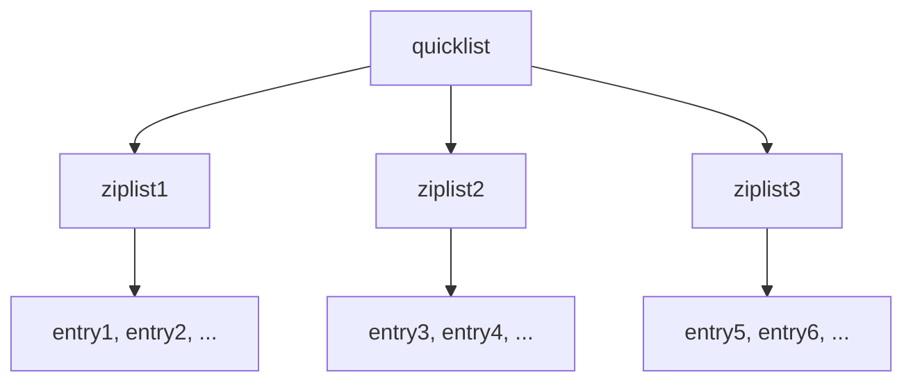

候选人小张在字节 P6 面试中，面试官问：

"Redis 是怎么存储数据的？为什么有时候一个很小的值也占用很多内存？"

小张说："Redis 内存占用和 value 大小有关？"

面试官追问："那你知道什么是压缩列表吗？什么情况下 Redis 会选择压缩列表？"

小张答不上来了。

【面试官心理】
这道题我用来测试候选人对 Redis 内存优化的理解深度。能说出压缩列表的占 20%，能讲清底层数据结构的占 10%。

## 一、Redis 内存使用 🔴

### 1.1 Redis 内存组成

```
Redis 内存 = Key 内存 + Value 内存 + 额外开销

额外开销：
- Redis 内部数据结构开销
- 内存碎片
- 客户端缓冲区
- AOF/RDB 缓冲区
- 主从复制缓冲区
```

### 1.2 查看内存使用

```bash
# 查看内存使用
redis-cli INFO memory

# 输出：
# used_memory:104857600           # Redis 分配的内存
# used_memory_human:100.00M
# used_memory_rss:120000000       # 物理内存（包含碎片）
# used_memory_peak:150000000      # 峰值内存
# mem_fragmentation_ratio:1.14    # 内存碎片率
```

## 二、底层数据结构 🔴

### 2.1 Redis Object 结构

```c
// Redis 对象的结构
typedef struct redisObject {
    unsigned type:4;       // 类型：STRING/LIST/HASH/SET/ZSET
    unsigned encoding:4;    // 编码：具体数据结构
    unsigned lru:LRU_BITS;  // LRU 时间或访问频率
    int refcount;          // 引用计数
    void *ptr;             // 指向实际数据结构的指针
} robj;
```

### 2.2 编码类型

| type | encoding | 说明 |
| --- | --- | --- |
| STRING | INT, EMBSTR, RAW | 整数、短字符串、长字符串 |
| LIST | ZIPLIST, LINKEDLIST, QUICKLIST | 列表 |
| HASH | ZIPLIST, HT | 哈希表 |
| SET | INTSET, HT | 集合 |
| ZSET | ZIPLIST, SKIPLIST | 有序集合 |

## 三、压缩列表（ziplist）🔴

### 3.1 什么是压缩列表

压缩列表是 Redis 为了节省内存设计的一种紧凑数据结构。

```bash
# 压缩列表结构
zlbytes: 4字节   # 整个列表的字节数
zltail: 4字节   # 最后一个节点的偏移量
zllen: 2字节    # 节点数量
entry1: 可变    # 节点1
entry2: 可变    # 节点2
...
zlend: 1字节    # 结束标记 0xFF
```

### 3.2 压缩列表节点

```
entry 结构：
- previous_entry_length: 前一个节点长度（1或5字节）
- encoding: 编码方式
- content: 实际内容
```

### 3.3 压缩列表的条件

```bash
# 当满足以下条件时，Redis 使用 ziplist
# 列表
list-max-ziplist-entries 512    # 元素数量 <= 512
list-max-ziplist-value 64       # 每个元素大小 <= 64 字节

# 哈希表
hash-max-ziplist-entries 512
hash-max-ziplist-value 64

# 有序集合
zset-max-ziplist-entries 128
zset-max-ziplist-value 64
```

### 3.4 压缩列表的优缺点

```bash
# 优点：
# - 内存紧凑，节省空间
# - 访问头部和尾部 O(1)
# - 小数据量时性能好

# 缺点：
# - 中间插入/删除 O(N)
# - 元素过大或数量过多时会转换为普通结构
# - 修改操作可能触发级联转换
```

## 四、整数集合（intset）🔴

### 4.1 整数集合结构

```c
typedef struct intset {
    uint32_t encoding;  // 编码：16/32/64 位整数
    uint32_t length;    // 元素数量
    int8_t contents[];  // 实际数组
} intset;
```

### 4.2 整数集合的特点

```bash
# 特点：
# - 所有元素都是整数
# - 按升序排列，无重复
# - 内存紧凑，支持不同位数的整数
# - 升级机制：从小类型自动升级到大类型
```

```bash
# 整数集合的条件
set-max-intset-entries 512
# 当元素数量 <= 512 且所有元素都是整数时使用
```

## 五、quicklist（3.2+）🟡

### 5.1 quicklist 的设计



quicklist 是 linkedlist 和 ziplist 的结合：
- 每个节点是一个 ziplist
- 保留了 linkedlist 的快速插入/删除
- 保留了 ziplist 的紧凑内存

### 5.2 quicklist 配置

```bash
# 配置每个 ziplist 的大小
list-compress-depth 0     # 不压缩
list-compress-depth 1     # 两端各有 1 个 ziplist 不压缩
list-compress-depth 2     # 两端各有 2 个 ziplist 不压缩

list-max-ziplist-size -2  # 8KB
list-max-ziplist-size -5  # 32KB（2^(2*|5|)）
```

## 六、内存优化策略 🟡

### 6.1 字符串优化

```bash
# 短字符串使用 EMBSTR
# EMBSTR: <= 39 字节的字符串，只分配一次内存
# RAW: > 39 字节的字符串，分配两次内存

redis-cli DEBUG OBJECT ENCODING key
# "embstr"
# "raw"
```

```bash
# 整数优化
# Redis 会对小于 2^32-1 的整数进行特殊编码
SET num 10086
OBJECT ENCODING num  # "int"

SET str 10086
OBJECT ENCODING str  # "embstr" 或 "raw"
```

### 6.2 内存碎片

```bash
# 内存碎片率
mem_fragmentation_ratio = used_memory_rss / used_memory
# 1.0 - 1.5: 正常
# > 1.5: 碎片过多

# 解决内存碎片
redis-cli MEMORY PURGE  # 尝试释放内存碎片（需要开启activerehashing）

# 重启 Redis 可以清理碎片
```

### 6.3 小数据优化

```bash
# 使用 Pipeline 减少网络开销
redis-cli --pipe <<EOF
SET key1 value1
SET key2 value2
GET key1
EOF

# 使用 Lua 脚本减少请求次数
EVAL "return redis.call('GET', KEYS[1])" 1 mykey
```

## 七、生产避坑 🟡

### 7.1 大 Key 问题

```bash
# 扫描大 Key
redis-cli --bigkeys

# 找到大 Key
redis-cli --scan | while read key; do
    size=$(redis-cli DEBUG OBJECT ENCODING "$key" | awk '{print $4}')
    if [ $size -gt 10000 ]; then
        echo "$key: $size"
    fi
done
```

### 7.2 内存上限

```bash
# 设置内存上限
maxmemory 10gb

# 内存淘汰策略
maxmemory-policy allkeys-lru

# 淘汰策略：
# - noeviction: 不淘汰，返回错误
# - allkeys-lru: 所有键 LRU 淘汰
# - volatile-lru: 带过期时间的键 LRU 淘汰
# - allkeys-random: 所有键随机淘汰
# - volatile-random: 带过期时间的键随机淘汰
# - volatile-ttl: 带过期时间的键，TTL 小的优先淘汰
```

:::tip 💡
生产环境中，建议设置 `maxmemory` 并配置合理的淘汰策略，防止 Redis 内存无限增长导致 OOM。
:::

【面试官心理】
能说出"ziplist 转换条件"和"quicklist 设计"的候选人，基本都有深入学习过 Redis 源码。这是 P7 的水准。
