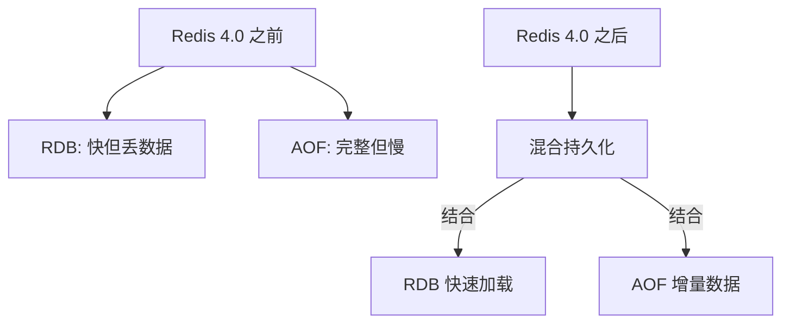
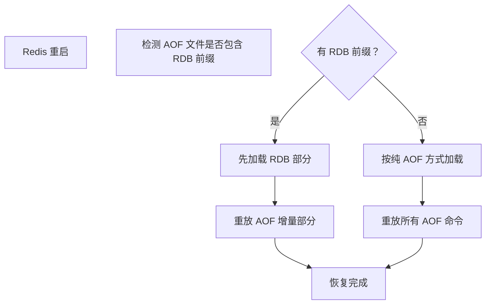

候选人小林在阿里的三面中，面试官问道：

"Redis 4.0 之后的混合持久化了解吗？它是怎么工作的？"

小林说："知道，RDB 和 AOF 混合在一起用。"面试官追问："那具体是怎么混合的？文件格式是什么样的？"

小林支支吾吾："就是...先 RDB 后 AOF？"

面试官继续："那和单独用 AOF 比，混合持久化好在哪里？"

小林彻底卡住。

【面试官心理】
这道题我用来考察候选人对 Redis 版本演进的了解程度。Redis 4.0 混合持久化是 2017 年引入的，但很多候选人到 2024 年还不知道这个功能。能说出混合持久化原理的占 10%，能解释文件格式的占 5%。这道题能答出来的，基本都是对 Redis 有深度研究的人。

## 一、为什么需要混合持久化 🔴

### 1.1 RDB 和 AOF 的各自痛点

先回顾一下 RDB 和 AOF 的问题：

```
RDB 的痛点：两次快照之间数据丢失（最多可能丢失数分钟）
AOF 的痛点：恢复速度慢（大文件重放所有命令，可能需要数小时）
```

### 1.2 问题拆解

**面试官追问**：能不能综合 RDB 和 AOF 的优点？

这就是 Redis 4.0 混合持久化的设计初衷。



【面试官心理】
这道题我想考察的是候选人对 Redis 版本演进和设计权衡的理解。能说出混合持久化背景的占 20%，能解释具体原理的占 10%。

## 二、混合持久化原理 🔴

### 2.1 文件格式

混合持久化的 AOF 文件格式：

```
[RDB 前缀: 二进制格式] [AOF 追加: RESP 文本格式]
```

具体结构：

```
┌──────────────────────────────────────────────┐
│  RDB 部分 (二进制)                            │
│  ┌────────────────────────────────────────┐  │
│  │  MAGIC: "REDIS"                         │  │
│  │  RDB_VERSION: 0007                       │  │
│  │  ... (标准 RDB 格式)                     │  │
│  │  RDB checksum (CRC64)                   │  │
│  └────────────────────────────────────────┘  │
├──────────────────────────────────────────────┤
│  AOF 增量部分 (RESP 文本格式)                  │
│  ┌────────────────────────────────────────┐  │
│  │ *3\r\n$3\r\nSET\r\n$4\r\nkey1\r\n...   │  │
│  │ *3\r\n$3\r\nINCR\r\n...                │  │
│  └────────────────────────────────────────┘  │
└──────────────────────────────────────────────┘
```

### 2.2 工作流程



### 2.3 AOF 重写时的混合持久化

```c
// AOF 重写时 (aof.c)
if (server.aof_use_rdb_preamble) {
    // 1. 先 fork 一个子进程
    // 2. 子进程遍历内存，生成 RDB 格式的 AOF 文件
    rdbSaveToRio(&aof_file, &rdb_meta);

    // 3. 主进程继续接收命令，追加到 AOF 缓冲区
    while (new_commands) {
        aofRewriteBufferAppend(new_commands);
    }

    // 4. 将 AOF 缓冲区的内容追加到新 AOF 文件
    aofRewriteBufferFlush();
}
```

:::tip 💡
混合持久化的核心优势：在 AOF 重写时，先用 RDB 格式保存内存快照（快速），再用 AOF 格式保存增量命令（节省空间）。这样恢复时既快（不用重放所有历史命令）又完整（不丢失数据）。
:::

### 2.4 ❌ 错误示范

**候选人原话**："混合持久化就是 RDB 和 AOF 一起开。"

**问题诊断**：
- 混淆了"同时开启 RDB 和 AOF"和"混合持久化"的概念
- 不理解混合持久化的具体文件格式
- 不理解混合持久化在 AOF 重写时的具体工作方式

**面试官内心 OS**："这个候选人肯定没有实际配置过混合持久化，只是在网上扫了一眼概念。"

## 三、配置方法 🟡

### 3.1 配置项

```c
// redis.conf
// 1. 开启 AOF
appendonly yes

// 2. 使用混合持久化作为 AOF 重写格式
aof-use-rdb-preamble yes   // Redis 4.0+ 默认 yes
```

### 3.2 配置对比

| 配置 | 行为 | 适用场景 |
| --- | --- | --- |
| `aof-use-rdb-preamble no` | 纯 AOF 重写（命令格式） | 需要手动编辑 AOF 文件 |
| `aof-use-rdb-preamble yes` | 混合 AOF 重写（RDB + AOF） | 正常生产环境 |

### 3.3 查看当前 AOF 文件格式

```bash
# 查看 AOF 文件头
redis-cli INFO persistence | grep aof_last_load
xxd -l 100 /var/lib/redis/appendonly.aof

# 如果文件以 "REDIS" 开头，说明是混合格式
00000000: 5245 4449 535f 4c5a ...  REDIS_LZ...
```

【面试官心理】
这道题我想验证的是候选人的动手能力。配置混合持久化非常简单，但很多候选人从来没有实际操作过。能说出具体配置项和查看方法的人，基本都有实战经验。

## 四、性能对比 🟡

### 4.1 混合持久化 vs 纯 AOF

| 维度 | 纯 AOF (重写后) | 混合持久化 |
| --- | --- | --- |
| AOF 重写速度 | 慢（要生成大量文本命令） | 快（内存快照是二进制） |
| AOF 文件大小 | 大（每条命令都要记录） | 小（RDB 压缩 + 增量追加） |
| 恢复速度 | 慢（重放所有命令） | 快（RDB 快速加载 + 增量追加） |
| 数据完整性 | 完整 | 完整 |
| 文件可读性 | 好（纯文本） | 差（混合格式） |

### 4.2 性能测试数据

```bash
# 模拟 1GB 内存数据的 AOF 重写
# 纯 AOF 重写：约 30-60 秒
# 混合持久化重写：约 5-10 秒

# 恢复时间（1GB 数据）
# 纯 AOF：约 5-10 分钟
# 混合持久化：约 30 秒 - 1 分钟
```

【面试官心理】
这道性能对比题我想验证的是候选人有没有实际做过对比测试。只有真正在生产环境中做过性能调优的人，才能说出具体的数字。知道混合持久化比纯 AOF 快的占 20%，能说出具体性能差距的占 5%。

## 五、选型建议 🟡

### 5.1 持久化策略选择

| 数据量 | 推荐策略 | 原因 |
| --- | --- | --- |
| < 1GB | RDB + AOF (纯) | 文件小，混合优势不明显 |
| 1GB - 10GB | 混合持久化 | 重写快，恢复快 |
| > 10GB | 混合持久化 + 关闭 RDB | 避免 fork() 长时间阻塞 |
| > 50GB | 只用 AOF 混合模式 | fork() 延迟不可接受 |

### 5.2 生产配置推荐

```c
// redis.conf 推荐配置
appendonly yes
aof-use-rdb-preamble yes
appendfsync everysec
auto-aof-rewrite-percentage 100
auto-aof-rewrite-min-size 64mb
aof-load-truncated yes           // 截断的 AOF 文件自动修复
aof-use-rdb-preamble yes         // 开启混合持久化

// 关闭 RDB 自动保存，避免 fork() 冲突
save ""
```

:::warning ⚠️
生产中的坑：
1. 混合持久化的 AOF 文件不能用普通文本编辑器编辑（前半部分是二进制）
2. 从旧版 Redis 升级到 4.0+ 时，默认使用 RDB 前缀
3. Redis 5.0 修复了一些混合持久化的 bug，建议使用 Redis 5.0+
4. AOF 文件损坏时，混合格式的恢复比纯 AOF 更复杂
:::

## 六、版本演进

| 版本 | 持久化能力 |
| --- | --- |
| Redis 2.4 | RDB + AOF (纯文本) |
| Redis 2.6 | AOF 重写优化 |
| Redis 2.8 | AOF 断点续传（partial rewrite） |
| Redis 3.0 | AOF/RDB 混合加载 |
| Redis 4.0 | 混合持久化（RDB 前缀 + AOF 增量） |
| Redis 5.0 | 修复混合持久化 bug |
| Redis 7.0 | 多部分 AOF (multi-part AOF)，支持增量追加 |


【面试官心理】
这道题我想最终验证的是候选人对 Redis 版本演进的理解。Redis 从 2.4 到 7.0，持久化机制经历了多次演进。能说出混合持久化在哪个版本引入的占 30%，能说出 Redis 7.0 的 multi-part AOF 的占 5%。能对 Redis 版本演进有全局视野的，基本都是 P7 以上。

## 七、生产避坑

:::warning ⚠️
生产中的三大翻车点：

1. **AOF 文件损坏**：混合格式的 AOF 损坏后，无法像纯 AOF 那样手动修复。Redis 7.0 引入了 AOF 文件校验，可以检测损坏。

2. **fork() 冲突**：如果同时开启 RDB 自动保存和混合持久化的 AOF 重写，可能出现两个子进程同时 fork() 的情况，内存压力翻倍。

3. **版本混用**：主从复制时，如果主从版本不一致，混合持久化的 AOF 可能无法正确加载。
:::

**排查方法**：
```bash
# 查看 AOF 加载状态
redis-cli INFO persistence | grep -E "aof_last_write|aof_rewrite"

# 检查 AOF 文件格式
xxd -l 10 /var/lib/redis/appendonly.aof
# 如果输出包含 "REDIS"，说明是混合格式

# Redis 7.0+ 查看 AOF 文件列表
redis-cli BGREWRITEAOF
ls -la /var/lib/redis/appendonly.aof.*
```

:::tip 💡
生产最佳实践：
- Redis 4.0+ 推荐使用混合持久化
- Redis 7.0+ 使用 multi-part AOF，自动管理 AOF 文件
- 定期检查 AOF 文件完整性：`redis-check-aof --fix`
- 大数据量场景下，优先考虑 Redis Cluster 分片 + 关闭 RDB
:::

【面试官心理】
混合持久化是一道很好的综合性题目，既考察了 RDB 和 AOF 的基础理解，又考察了对 Redis 版本演进和工程实践的关注。能把混合持久化讲清楚的，基本都是认真研究过 Redis 源码的人。
