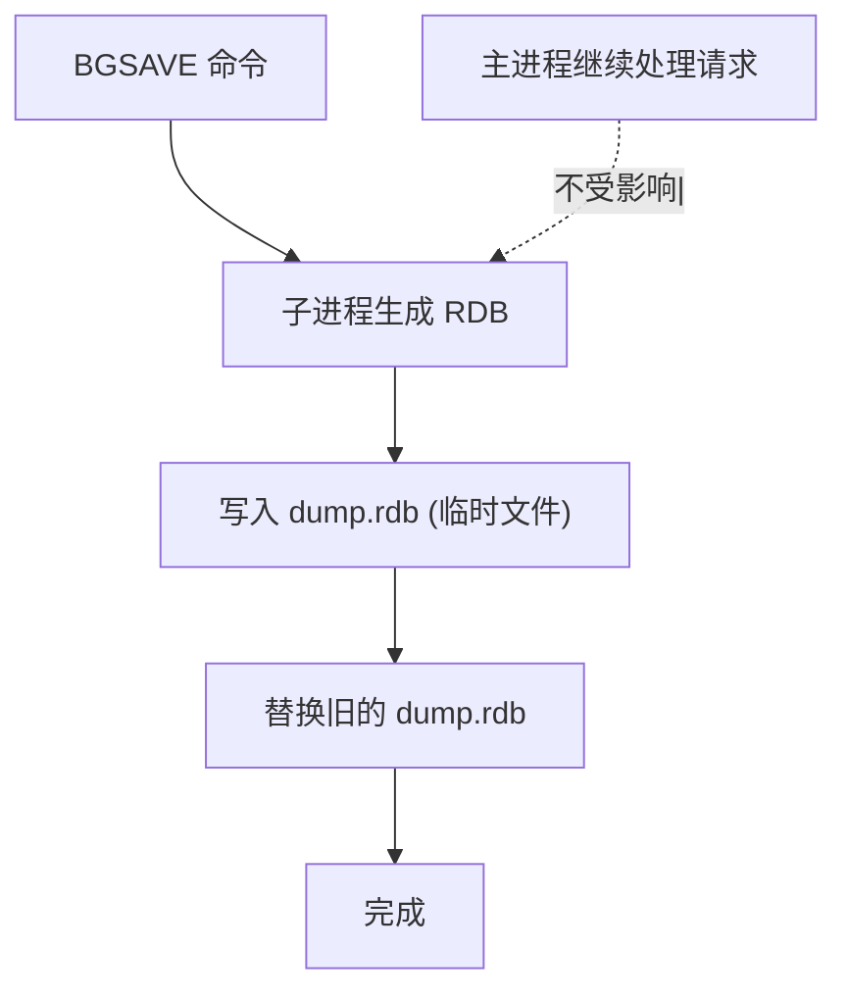
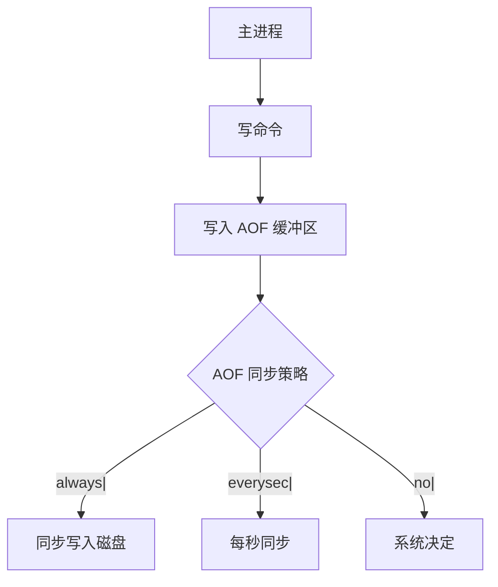
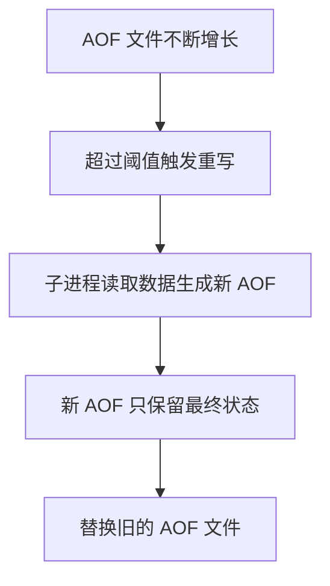

2024年双十一前夜，Redis 报警：OPS（每秒操作数）从 10 万降到 3 万。

DBA 排查发现，BGSAVE 正在执行，CPU 使用率飙到 80%。

开发同学问："持久化不是异步的吗？怎么会影响性能？"

【面试官心理】
这道题我用来测试候选人对 Redis 持久化机制的理解深度。能说出 RDB 和 AOF 的占 60%，能讲清各自对性能影响的占 20%，能说清优化策略的占 10%。

## 一、持久化机制 🔴

### 1.1 RDB（快照持久化）



```bash
# 配置 RDB 触发条件
save 900 1      # 900 秒内 1 次写操作
save 300 10     # 300 秒内 10 次写操作
save 60 10000   # 60 秒内 10000 次写操作

# 关闭 RDB
save ""

# 手动触发
BGSAVE  # 后台保存
SAVE    # 同步保存（会阻塞）
```

### 1.2 AOF（追加文件持久化）

```bash
# 开启 AOF
appendonly yes

# AOF 同步策略
appendfsync always     # 每个命令都同步（最安全，最慢）
appendfsync everysec   # 每秒同步（默认，推荐）
appendfsync no         # 由系统决定同步时机（最快，不可靠）
```



## 二、RDB 对性能的影响 🔴

### 2.1 fork() 的代价

```bash
# BGSAVE 时，Redis 会 fork() 一个子进程
# fork() 的代价：
# - 复制父进程的页表
# - COW (Copy-On-Write) 机制
```

```bash
# 查看 fork 耗时
redis-cli INFO stats | grep latest_fork_usec
# latest_fork_usec:500

# fork 耗时和内存大小成正比
# 10GB 内存，fork 耗时约 500ms
```

### 2.2 COW 机制

```mermaid
graph TD
    A[fork() 后] --> B["父子进程共享物理内存"]
    B --> C[主进程修改数据]
    C --> D[触发 COW，复制页面]
    D --> E["只有被修改的页面被复制"]
    E --> F[子进程看到的是 fork 时刻的数据]
```

```bash
# COW 期间的内存使用
# 如果主进程持续写入大量数据，COW 页面会增加
# 需要预留足够的内存
```

### 2.3 RDB 的问题

```bash
# 问题：fork() 会阻塞吗？
# 答案：fork() 本身不阻塞，但 COW 会增加内存压力

# 问题：BGSAVE 期间可以写吗？
# 答案：可以，但会增加 COW 开销

# 问题：RDB 文件太大怎么办？
# 答案：使用子文件，减少每次 fork 的数据量
```

## 三、AOF 对性能的影响 🟡

### 3.1 AOF 写入策略对比

| 策略 | 性能 | 安全性 | 说明 |
| --- | --- | --- | --- |
| always | 最慢 | 最安全 | 每个命令都 fsync |
| everysec | 较快 | 较快 | 每秒 fsync，最多丢 1 秒数据 |
| no | 最快 | 不安全 | 由系统决定，可能丢大量数据 |

### 3.2 AOF 重写

```bash
# AOF 文件会不断增大
# 需要定期重写压缩

# 触发重写
BGREWRITEAOF

# 配置自动重写
auto-aof-rewrite-percentage 100  # 文件大小超过上次重写后的 100%
auto-aof-rewrite-min-size 64mb # 最小 64MB 才触发重写
```



### 3.3 AOF 的性能问题

```bash
# everysec 策略的抖动
# 如果 fsync 需要 2 秒，下一次 fsync 会延迟到 3 秒后
# 这会导致最多 3 秒的数据丢失

# AOF 写入是单线程的吗？
# 是的，AOF 写入是主线程执行的
# 可以使用 appendonly yes + appendfsync no 提高性能
```

## 四、优化策略 🟡

### 4.1 RDB + AOF 混合持久化

```bash
# 开启混合持久化
aof-use-rdb-preamble yes

# 混合持久化的工作流程：
# 1. AOF 重写时，使用 RDB 格式写入开头
# 2. 后续增量命令用 AOF 格式追加
# 3. 恢复时先加载 RDB 部分，再加载 AOF 部分
```

### 4.2 性能监控

```bash
# 查看持久化状态
redis-cli INFO persistence

# aof_current_size: 当前 AOF 大小
# aof_base_size: 上次重写时的 AOF 大小
# rdb_changes_since_last_save: 自上次保存以来的变更数

# 查看 fork 耗时
redis-cli INFO stats | grep latest_fork
# latest_fork_usec:500000

# 查看 AOF fsync 延迟
redis-cli INFO commandstats | grep fsync
```

### 4.3 配置建议

```bash
# 高性能场景配置
# 关闭 RDB，使用 AOF everysec
save ""
appendonly yes
appendfsync everysec
auto-aof-rewrite-percentage 100
auto-aof-rewrite-min-size 64mb

# 数据安全场景配置
# 使用 RDB + AOF 混合
save 900 1 300 10 60 10000
appendonly yes
appendfsync everysec
aof-use-rdb-preamble yes
```

## 五、生产最佳实践 🟡

### 5.1 避免 fork 阻塞

```bash
# 1. 控制 Redis 内存使用
# 最大内存不要超过机器物理内存的 70%
maxmemory 10gb

# 2. 使用低峰期执行 BGSAVE
# 避免在业务高峰期触发持久化

# 3. 使用子进程而非线程
# Redis 的持久化都是子进程执行的
```

### 5.2 AOF 磁盘选择

```bash
# AOF 文件应该放在 SSD 上
# 如果放在机械硬盘，everysec 策略可能无法按时完成

# 可以使用 tmpfs（内存文件系统）临时存储 AOF
# 然后异步同步到磁盘
appendfilename "/mnt/aof/appendonly.aof"
```

### 5.3 容量规划

```bash
# 预估 AOF 文件大小
# 每个写命令约 50-100 字节
# 10 万 OPS 的系统，每秒 AOF 增量约 5-10MB
# 每秒追加的文件大小应该小于磁盘写入速度
```

:::tip 💡
生产环境推荐使用 everysec 策略 + 混合持久化。在数据安全和性能之间取得平衡。
:::

【面试官心理】
能说出"COW 机制"和"混合持久化"的候选人，基本都研究过 Redis 源码。这是 P6+ 的水准。
