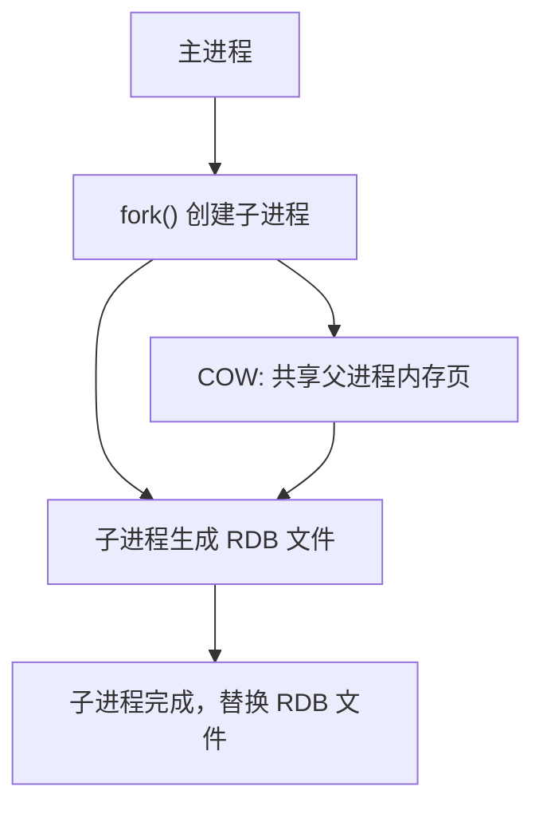
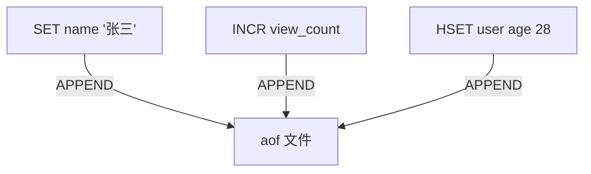
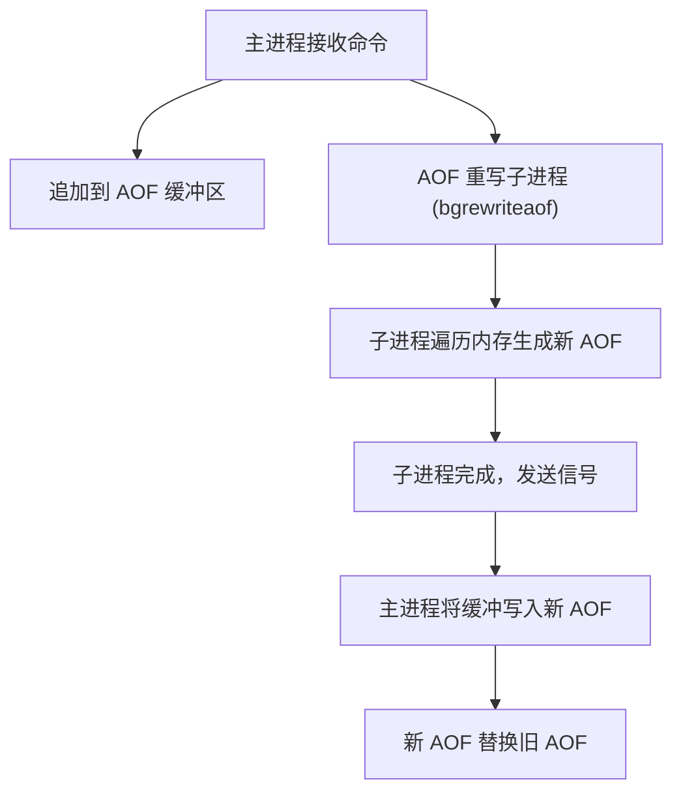

候选人小钱在美团的二面中，面试官问道：

"Redis 的持久化机制是怎样的？RDB 和 AOF 有什么区别？"

小钱说："RDB 是定期快照，AOF 是写操作日志。"面试官追问："RDB 的快照是怎么生成的？fork() 是什么？COW 呢？"

小钱愣了一下，说："fork 是复制进程...COW 是写时复制..."

面试官继续："AOF 的 fsync 策略有哪些？everysec 真的是每秒刷盘吗？"

小钱开始语无伦次。

【面试官心理】
这道题我用来区分"会用"和"会用且懂原理"的候选人。知道 RDB 和 AOF 区别的占 80%，能解释 fork() 和 COW 的占 30%，能说清 AOF fsync 策略的占 20%。持久化是 Redis 面试的高频深水区，因为涉及操作系统底层知识，很多人都会在这里露馅。

## 一、RDB 快照 🔴

### 1.1 问题拆解

**RDB 的核心原理：fork() + COW（Copy-On-Write）**



### 1.2 fork() 是什么？

fork() 是 Linux 的系统调用，用于创建子进程：

```c
// fork() 的特点：调用一次，返回两次
pid_t pid = fork();

if (pid == 0) {
    // 子进程：开始生成 RDB
    redisFork(CHILD_TYPE_RDB);
} else if (pid > 0) {
    // 父进程：继续处理请求
    // ... 处理客户端命令 ...
} else {
    // fork 失败
}
```

fork() 在 Linux 中是**写时复制**的：
- fork() 之后，父子进程共享同一份物理内存
- 只有当某个进程尝试修改内存页时，才会复制该页给子进程

### 1.3 RDB 的生成时机

```c
// redis.conf 配置
save 900 1      // 900 秒内 ≥1 次写入
save 300 10     // 300 秒内 ≥10 次写入
save 60 10000   // 60 秒内 ≥10000 次写入

// 关闭自动保存
save ""         // 只有手动 BGSAVE
```

```bash
# 手动触发 RDB 快照
redis-cli BGSAVE          # 后台异步保存
redis-cli SAVE            # 同步保存（会阻塞）

# 查看最近一次 RDB 保存时间
redis-cli LASTSAVE
```

### 1.4 ❌ 错误示范

**候选人原话**："RDB 就是 Redis 把数据复制一份存到磁盘上。"

**问题诊断**：
- 不理解 fork() 的 COW 机制
- 不知道 RDB 是子进程生成的而不是主进程
- 不理解 COW 对性能的影响

**面试官内心 OS**："这个候选人肯定没有在生产环境中经历过 Redis 的 fork 延迟问题。fork() 在数据量大时可能阻塞主进程数秒，这是生产中的大坑。"

## 二、AOF 日志 🔴

### 2.1 AOF 的核心原理

AOF（Append Only File）将每个写命令追加到文件末尾：



### 2.2 AOF 文件格式

```
*3\r\n$3\r\nSET\r\n$4\r\nname\r\n$6\r\n张三\r\n
*3\r\n$5\r\nINCR\r\n$10\r\nview_count\r\n
*3\r\n$4\r\nHSET\r\n$4\r\nuser\r\n$3\r\nage\r\n$2\r\n28\r\n
```

这是 Redis 的 RESP（REdis Serialization Protocol）协议，是二进制安全的。

### 2.3 AOF 的 fsync 策略 🔴

这是面试的高频深水区。

```c
// redis.conf 配置
appendonly yes
appendfsync always      // 每次写都刷盘
appendfsync everysec     // 每秒刷盘一次
appendfsync no           // 让操作系统决定
```

| 策略 | 性能 | 数据安全性 | 实际刷盘时机 |
| --- | --- | --- | --- |
| `always` | 最差 | 最高（不丢数据） | 每个命令执行后立即 fsync |
| `everysec` | 中等 | 较高（最多丢1秒） | 每秒一次 fsync |
| `no` | 最高 | 较差（依赖系统） | 操作系统决定 |

**追问：everysec 真的是每秒刷盘吗？**

```c
// AOF 伪代码 (aof.c)
if (server.unixtime - server.last_fsync > 1) {
    // 只有超过 1 秒才触发刷盘
    // 如果上一次 fsync 还没完成，本次跳过
    fd = open(AOF_FILE, O_WRONLY);
    write(fd, buf, len);
    fsync(fd);  // 同步刷盘
    close(fd);
}
```

:::warning ⚠️
everysec 不是"每秒精确刷盘一次"，而是"每秒最多刷盘一次"。如果上一次 fsync 还没完成，本次就会跳过。这意味着最坏情况下可能丢失 **2 秒的数据**，而不是 1 秒。
:::

### 2.4 标准回答

```bash
# AOF 的推荐配置
appendonly yes
appendfsync everysec
auto-aof-rewrite-percentage 100  # AOF 文件比上次大 100% 时重写
auto-aof-rewrite-min-size 64mb  # AOF 文件至少 64MB 时才重写
```

【面试官心理】
AOF fsync 策略是 Redis 面试的经典深水区。能说出三种 fsync 策略的占 60%，能解释 eachsec 的具体实现的占 20%，能说出"上一次未完成就跳过"这个细节的占 5%。这个细节能说出来的，基本都看过 Redis 源码。

## 三、RDB vs AOF 对比 🟡

### 3.1 优缺点对比

| 维度 | RDB | AOF |
| --- | --- | --- |
| 文件大小 | 小（二进制压缩） | 大（纯文本命令） |
| 恢复速度 | 快（直接加载二进制） | 慢（重放所有命令） |
| 数据安全性 | 差（可能丢失快照之间的数据） | 好（可配置刷盘策略） |
| 性能影响 | fork() 时短暂阻塞 | 持续写入开销 |
| 启动时机 | 主进程 fork() 阻塞 | 后台追加，无阻塞 |
| 兼容性 | 好（文本格式，可手动编辑） | 差（命令重放，格式严格） |

### 3.2 何时选 RDB？

```
适合场景：
- 数据备份：每天凌晨 RDB 全量备份
- 容灾恢复：RDB 文件小，便于传输
- 允许数据丢失：缓存场景，数据可以从 DB 重新加载
- 数据量中等：数据量小于 10GB
```

### 3.3 何时选 AOF？

```
适合场景：
- 数据安全性要求高：不能接受数据丢失
- 作为数据库而非缓存：需要持久化保证
- 数据量较大：RDB 恢复太慢，AOF 可以逐步追加
- 写操作频繁：append-only 模式性能更好
```

【面试官心理】
这道对比题我想考察的是候选人的"方案选型能力"。能列出对比表的占 60%，能结合场景讲清楚选哪个的占 30%。生产环境中，Redis 通常同时开启 RDB 和 AOF——RDB 做定期备份，AOF 做数据安全保证。

## 四、AOF 重写 🔴

### 4.1 AOF 文件为什么会变大？

```c
// AOF 文件内容
INCR counter    // counter: 1
INCR counter    // counter: 2
INCR counter    // counter: 3
...（1万次 INCR）
INCR counter    // counter: 10000

// AOF 重写后
SET counter 10000  // 一个命令替代 1 万条
```

### 4.2 AOF 重写原理



```bash
# 手动触发 AOF 重写
redis-cli BGREWRITEAOF
```

### 4.3 AOF 重写的原子性保证

AOF 重写过程中，新命令如何不丢失？

```c
// Redis 使用父子进程 + AOF 缓冲区的设计
if (has_child) {
    // 子进程正在重写，将新命令追加到 AOF 缓冲区
    aofRewriteBufferAppend(server.replica_repl_buf);
} else {
    // 正常追加到 AOF 文件
    write(aof_fd, buf, len);
}
```

子进程重写完成后，主进程会：
1. 将 AOF 缓冲区的内容追加到新 AOF 文件
2. 用新 AOF 文件替换旧 AOF 文件

这是 Redis 实现**无锁重写**的核心技巧。

### 4.4 ❌ 错误示范

**候选人原话**："AOF 重写就是删除旧的 AOF 命令。"

**问题诊断**：
- 完全不理解 AOF 重写的原理
- 不知道重写是在子进程中进行的
- 不理解 AOF 缓冲区的存在

【面试官心理】
AOF 重写是 Redis 中比较复杂的机制，涉及进程间通信和文件系统操作。能说清楚父子进程 + 缓冲区设计的占 10%，知道"无锁重写"概念的占 15%。

## 五、生产避坑

:::warning ⚠️
生产环境中的三大翻车点：

1. **fork() 阻塞**：Redis 数据量超过 10GB 时，fork() 可能阻塞主进程数秒到数十秒，导致 Redis 假死。在大数据量场景下，这是生产事故的高发区。

2. **AOF 文件过大**：没有配置 AOF 重写策略，AOF 文件膨胀到数百 GB，恢复时间长达数小时。

3. **everysec 数据丢失**：误以为 everysec 完全安全，实际上最坏可能丢 2 秒数据。
:::

**排查方法**：
```bash
# 查看 RDB/AOF 配置
redis-cli CONFIG GET save
redis-cli CONFIG GET appendonly
redis-cli CONFIG GET appendfsync

# 查看 AOF 文件大小
redis-cli INFO persistence | grep aof

# 查看 fork() 耗时
redis-cli INFO stats | grep latest_fork_usec

# 查看 AOF 重写状态
redis-cli INFO persistence | grep -E "aof_rewrite|child"
```

:::tip 💡
生产最佳实践：
- 数据量 < 10GB：同时开启 RDB 和 AOF，RDB 做备份，AOF 做安全保证
- 数据量 > 10GB：只开 AOF，使用 everysec 策略，并配置 AOF 重写
- 开启 RDB + AOF 时，Redis 重启优先加载 AOF（数据更完整）
- fork() 延迟超过 1 秒时，考虑升级 Redis 版本或增加机器内存
:::

【面试官心理】
这道题我想最终验证的是候选人的"生产实战经验"。能把 RDB 和 AOF 的原理讲清楚的占 40%，能说出 fork() 阻塞问题的占 20%，能在面试中主动提到生产配置建议的占 10%。一个有深度的 Redis 候选人，应该既懂原理，又踩过坑。
