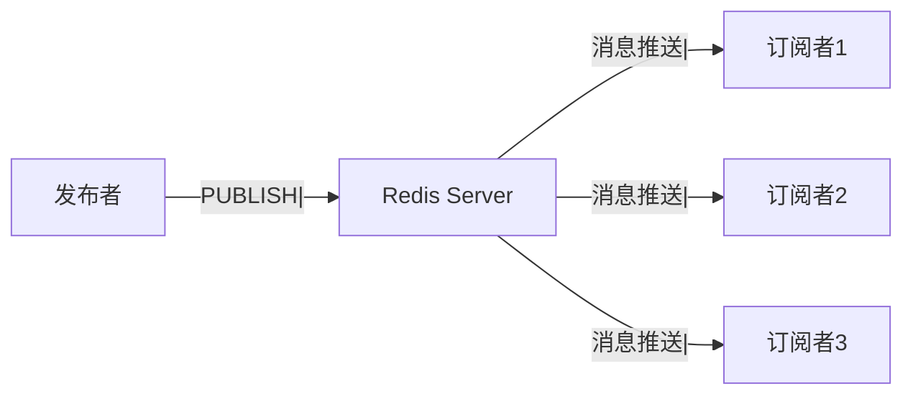
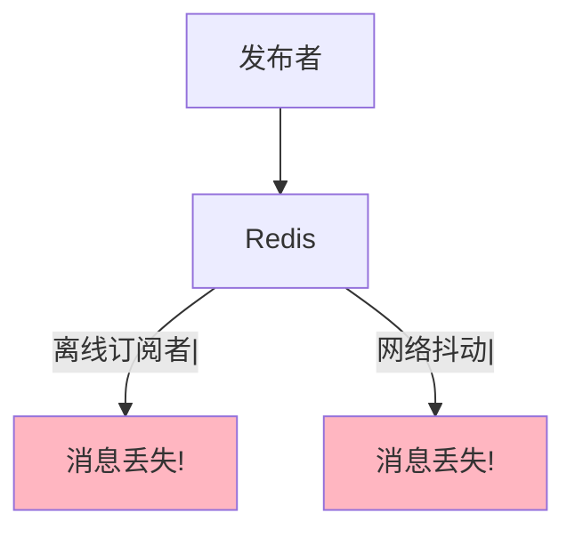
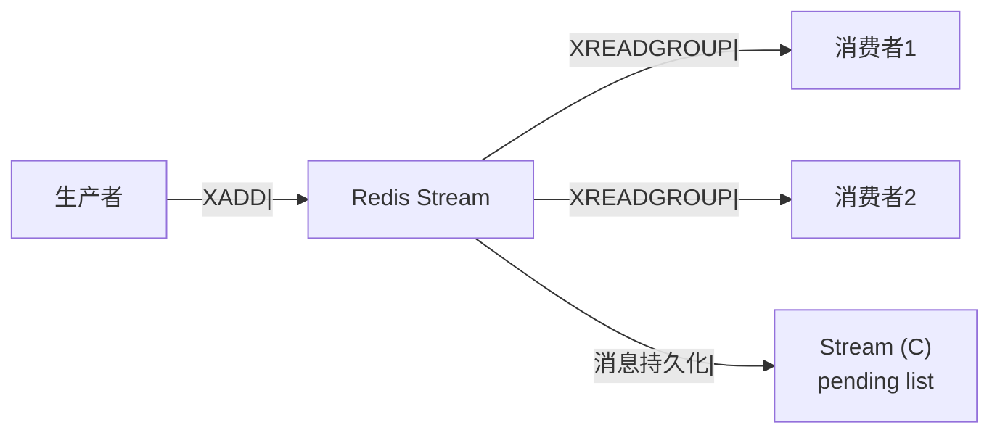

候选人小张在字节面试中，面试官问：

"Redis 怎么实现消息队列？"

小张说："用 Redis 的发布订阅。"

面试官追问："发布订阅和消息队列有什么区别？"

小张说："...都能发消息？"

面试官继续追问："发布订阅的消息丢失了怎么办？"

小张答不上来了。

【面试官心理】
这道题我用来测试候选人对 Redis 发布订阅机制的理解深度。能说出 PUB/SUB 命令的占 50%，能讲清和消息队列区别的占 20%，能说清缺点的占 10%。

## 一、发布订阅原理 🔴

### 1.1 基本命令

```bash
# 发布者
PUBLISH channel message
# 返回：订阅者数量

# 订阅者
SUBSCRIBE channel
# 订阅后，会阻塞接收消息

# 模式订阅
PSUBSCRIBE channel.*
# 支持通配符

# 取消订阅
UNSUBSCRIBE channel
PUNSUBSCRIBE channel.*
```

### 1.2 执行示例

```bash
# 终端 1：订阅频道
SUBSCRIBE news

# 输出：
# 1) "subscribe"
# 2) "news"
# 3) (integer) 1

# 终端 2：发布消息
PUBLISH news "Hello World"

# 终端 1 输出：
# 1) "message"
# 2) "news"
# 3) "Hello World"
```

### 1.3 架构图



## 二、发布订阅的模式 🔴

### 2.1 频道订阅

```bash
# 订阅多个频道
SUBSCRIBE channel1 channel2 channel3

# 按频道退订
UNSUBSCRIBE channel1
```

### 2.2 模式订阅

```bash
# 订阅匹配模式的消息
PSUBSCRIBE news.*
# 匹配 news.sports, news.tech, news.entertainment

PSUBSCRIBE user.*
# 匹配 user.login, user.logout, user.register

# 按模式退订
PUNSUBSCRIBE news.*
```

### 2.3 PubSub 命令

```bash
# 查看频道信息
PUBSUB CHANNELS
PUBSUB CHANNELS news*
PUBSUB NUMSUB news
PUBSUB NUMPAT
```

## 三、Redis PubSub 的问题 🟡

### 3.1 消息丢失



```
问题：
1. 订阅者离线，消息丢失
2. 网络抖动，消息丢失
3. Redis 重启，消息丢失
```

### 3.2 消息不持久化

```bash
# Redis PubSub 不存储消息
# 消息是"即发即弃"模式
# 没有消费者，消息直接丢弃
```

### 3.3 ❌ 错误理解

**候选人原话**："Redis 发布订阅就是消息队列。"

**问题诊断**：
- 发布订阅不保证消息送达
- 没有消息确认机制
- 消息不持久化

## 四、和消息队列的区别 🟡

### 4.1 对比表

| 特性 | Redis PubSub | Redis Stream | Kafka/RabbitMQ |
| --- | --- | --- | --- |
| 消息持久化 | ❌ | ✅ | ✅ |
| 消息确认 | ❌ | ✅ ACK | ✅ ACK |
| 消息回溯 | ❌ | ✅ | ✅ |
| 消息堆积 | ❌ | ✅ | ✅ |
| 消息重试 | ❌ | ✅ | ✅ |
| 延迟队列 | ❌ | ✅ | ✅ |

### 4.2 Redis Stream（5.0+）

```bash
# Redis Stream 是真正的消息队列
XADD stream-name * field value
XREAD STREAMS stream-name 0
XREADGROUP GROUP group-name consumer-name STREAMS stream-name >
XACK stream-name group-name message-id
```



### 4.3 选型建议

```bash
# 适合使用 PubSub 的场景：
# - 实时性要求高，可以接受消息丢失
# - 订阅者短暂在线
# - 广播通知

# 适合使用 Stream 的场景：
# - 需要消息持久化
# - 需要消息确认
# - 需要消息重试
# - 需要消息回溯
```

## 五、Java 客户端实现 🟡

### 5.1 Jedis 实现

```java
// 发布者
public class Publisher {
    private JedisPool jedisPool;

    public void publish(String channel, String message) {
        try (Jedis jedis = jedisPool.getResource()) {
            jedis.publish(channel, message);
        }
    }
}

// 订阅者
public class Subscriber extends JedisPubSub {
    @Override
    public void onMessage(String channel, String message) {
        System.out.println("收到消息：" + message);
    }

    @Override
    public void onSubscribe(String channel, int subscribedChannels) {
        System.out.println("订阅频道：" + channel);
    }
}

// 使用
public class SubscriberDemo {
    public static void main(String[] args) {
        JedisPool jedisPool = new JedisPool("127.0.0.1", 6379);

        // 订阅线程
        new Thread(() -> {
            Jedis jedis = jedisPool.getResource();
            jedis.subscribe(new Subscriber(), "news");
        }).start();

        // 发布消息
        Publisher publisher = new Publisher();
        publisher.publish("news", "Hello World");
    }
}
```

### 5.2 Spring Boot 实现

```java
// 发布
@Service
public class MessagePublisher {
    @Autowired
    private StringRedisTemplate template;

    public void publish(String channel, String message) {
        template.convertAndSend(channel, message);
    }
}

// 订阅
@Component
public class MessageListener {
    @RabbitListener(topics = "news")
    public void handleMessage(String message) {
        System.out.println("收到消息：" + message);
    }
}
```

## 六、生产避坑 🟡

### 6.1 连接管理

```java
// ❌ 错误：每个消息都创建新连接
public void publish(String message) {
    Jedis jedis = new Jedis("127.0.0.1", 6379);
    jedis.publish("channel", message);
    jedis.close();
}

// ✅ 正确：使用连接池
public class Publisher {
    private JedisPool jedisPool;

    public void publish(String message) {
        try (Jedis jedis = jedisPool.getResource()) {
            jedis.publish("channel", message);
        }
    }
}
```

### 6.2 订阅者断开重连

```java
// 订阅者需要处理断开重连
public class Subscriber extends JedisPubSub {
    @Override
    public void onPUnsubscribe(String pattern, int subscribedChannels) {
        System.out.println("取消订阅模式：" + pattern);
    }

    @Override
    public void onUnsubscribe(String channel, int subscribedChannels) {
        System.out.println("取消订阅频道：" + channel);
    }
}
```

:::tip 💡
Redis PubSub 适合做实时通知、广播消息等场景。如果需要可靠消息传递，使用 Redis Stream 或专业的消息队列。
:::

【面试官心理】
能说出"Redis PubSub 消息丢失问题"的候选人，基本都有实际踩坑经验。这是 P6 的水准。
