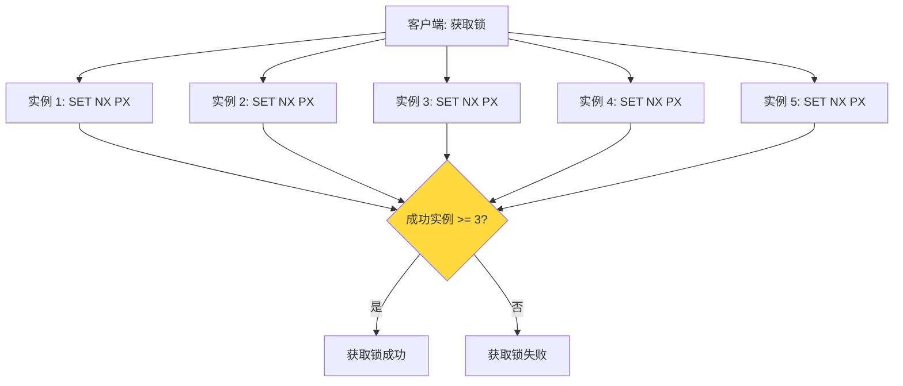
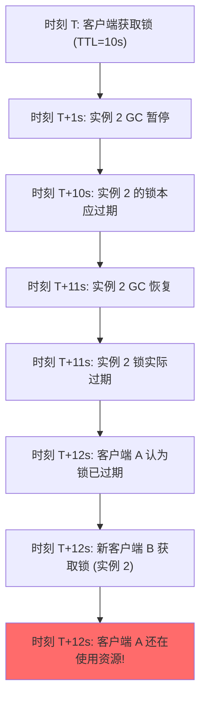

候选人小张在阿里的三面中，面试官问了一个高难度问题：

"RedLock 了解吗？它是怎么工作的？"

小张说："Redis 作者提的，用多个 Redis 实例做分布式锁。"面试官追问："为什么需要多个实例？"

小张说："单实例不可靠..."面试官继续："那 RedLock 有没有争议？Martin Kleppmann 怎么批评的？"

小张彻底卡住。

【面试官心理】
这道题我用来区分"会用"和"理解其局限性"的候选人。知道 RedLock 的占 20%，能说出争议的占 5%，能说出替代方案的占 3%。RedLock 是 Redis 分布式锁的进阶话题，涉及到分布式系统的核心问题——时钟漂移和 CAP 理论。

## 一、RedLock 的设计 🔴

### 1.1 问题拆解

**为什么需要 RedLock？**

```
单机 Redis 分布式锁的问题：
- 主节点宕机，但锁还在从节点
- 从节点晋升为主节点，但锁数据还没同步
- 结果：其他客户端获取了新主节点的锁，但旧锁持有者还在使用
→ 分布式锁失效！
```

### 1.2 RedLock 的核心思想

RedLock 用 **N 个独立的 Redis 实例**，获取锁时在多数实例上成功才算成功：



### 1.3 RedLock 算法流程

```java
public class RedLock {

    private List<Jedis> instances;  // N 个 Redis 实例

    public String lock(String resource, int ttlMs) {
        // 1. 计算获取锁的过期时间
        long ttl = System.currentTimeMillis() + ttlMs;

        // 2. 在 N 个实例上顺序获取锁
        List<String> successInstances = new ArrayList<>();
        for (Jedis jedis : instances) {
            boolean acquired = acquireLock(jedis, resource, ttlMs);
            if (acquired) {
                successInstances.add(jedis.getClient().getHost());
            }
        }

        // 3. 计算总耗时
        long elapsedTime = System.currentTimeMillis() - (ttl - ttlMs);

        // 4. 检查是否在有效时间内获取了多数锁
        if (successInstances.size() >= N / 2 + 1 &&
            elapsedTime < ttlMs) {
            return generateLockToken();
        } else {
            // 5. 失败：释放所有获取到的锁
            releaseAllLocks(successInstances, resource);
            return null;
        }
    }
}
```

【面试官心理】
RedLock 算法看起来很美好——用多数原则保证可靠性。但它真的可靠吗？这就要引入 Martin Kleppmann 的批评了。

## 二、Martin Kleppmann 的批评 🔴

### 2.1 核心批评：RedLock 不是有效的分布式锁

2024 年 2 月，分布式系统专家 Martin Kleppmann 发表了一篇著名的批评文章。

### 2.2 批评一：时钟漂移问题

```
RedLock 的前提假设：
- 所有 Redis 实例的系统时钟以相同速率前进
- TTL 能准确反映锁的持有时间

实际情况：
- Linux 系统时钟有漂移（每天 ± 秒级）
- 虚拟机迁移会导致时钟跳跃
- 虚拟机暂停（VM pause）会导致时钟"冻结"
```



### 2.3 批评二：RedLock 的安全性依赖于不可靠的时钟

```
标准分布式锁的正确性条件：
- 互斥：同一时刻只有一个客户端持有锁
- 死锁避免：锁最终能被释放

RedLock 的问题：
- TTL 不能精确保证锁的持有时间
- 客户端 A 可能认为自己还有锁，但锁已经过期
- 这违反了"互斥"条件
```

### 2.4 批评三：RedLock 的性能代价

| 维度 | 单机 Redis 锁 | RedLock |
| --- | --- | --- |
| Redis 实例 | 1 | N（推荐 5） |
| 获取锁耗时 | 1 次网络 RTT | N 次串行 RTT |
| 复杂度 | 简单 | 复杂 |
| 可用性 | 单点 | 高（但复杂度高） |

```
RedLock 获取锁需要：
- 5 个 Redis 实例
- 串行获取：5 × RTT (假设 RTT = 1ms)
- 总耗时：5ms + 处理时间

单机锁：
- 1 个 Redis 实例
- 1 次 RTT：1ms
```

### 2.5 ❌ 错误示范

**候选人原话**："RedLock 是 Redis 官方推荐的分布式锁方案，很可靠。"

**问题诊断**：
- 只看过官方文档，没有看过批评
- 不理解分布式系统中的时钟问题
- 不理解 CAP 理论的实际约束

**面试官内心 OS**："这个候选人肯定没有深入研究过 RedLock 的设计缺陷。RedLock 的争议是 Redis 面试中最高级的话题之一，能说清楚的人凤毛麟角。"

## 三、RedLock 的回应 🟡

### 3.1 Redis 作者 antirez 的回应

antirez 对 Kleppmann 的批评做出了回应，核心观点：

```
1. 时钟漂移问题：
   - 时钟漂移在 Linux 上通常很小（每天 ±0.5 秒）
   - 可以通过 NTP 同步缓解
   - GC 暂停是所有语言都有的问题，不只是 Redis

2. RedLock 的设计目标：
   - 不是完美的分布式锁，而是"足够好"的锁
   - 对于大多数场景，单机 Redis 锁 + Redisson 已经够用
   - RedLock 主要用于需要高可靠的场景
```

### 3.2 两者的核心分歧

| 维度 | antirez 观点 | Kleppmann 观点 |
| --- | --- | --- |
| 时钟漂移 | NTP 可以解决，GC 暂停是普遍问题 | NTP 不能保证单调性，GC 暂停不可忽视 |
| 正确性标准 | 足够好就行 | 必须严格满足互斥 |
| 工程取舍 | 简单 + 够用 | 正确性 > 简单 |

【面试官心理】
这道题我想验证的是候选人的"批判性思维"。知道 RedLock 的占 20%，知道 Martin Kleppmann 批评的占 5%，能说出两者核心分歧的占 3%。分布式系统的设计从来不是非黑即白，理解争议比背结论更重要。

## 四、工程实践 🟡

### 4.1 什么时候用 RedLock？

```
适合用 RedLock：
- 对锁的正确性要求极高
- 有足够的运维能力管理 N 个 Redis 实例
- 可以接受较高的延迟（多次 RTT）

不适合用 RedLock：
- 对延迟敏感（每次锁操作需要 N 次 RTT）
- 运维能力有限
- 锁的正确性要求不是极端严格
```

### 4.2 实际工程中的替代方案

**方案一：单节点 Redis + Redisson（最常用）**

```java
// 对于大多数场景，单机 Redis + Redisson 已经足够
RLock lock = redissonClient.getLock("resource");
lock.lock(30, TimeUnit.SECONDS);
// Redisson 内部实现了 watchdog 自动续期
```

**方案二：Zookeeper 分布式锁（更可靠）**

```
Zookeeper 锁的优势：
- ZAB 协议保证分布式一致性
- 锁的创建和删除是原子操作
- Session 过期自动清理（不需要 watchdog）
- 临时顺序节点天然支持公平锁
```

```java
// Zookeeper 分布式锁（Curator 实现）
InterProcessMutex lock = new InterProcessMutex(
    curatorClient, "/locks/resource"
);
lock.acquire(30, TimeUnit.SECONDS);
try {
    // 业务逻辑
} finally {
    lock.release();
}
```

### 4.3 选择建议

| 场景 | 推荐方案 |
| --- | --- |
| 普通并发控制 | 单机 Redis + Redisson |
| 高可靠要求 | Zookeeper 或 etcd |
| 超高并发 | Consul |
| RedLock | 仅在需要多 Redis 实例时考虑 |

【面试官心理】
这道题我想验证的是候选人的"方案选型能力"。能说出 RedLock 争议的占 10%，能说出替代方案的占 5%。RedLock 不是银弹，Zookeeper 也不是。在实际工程中，选择哪种方案取决于对正确性、性能、运维成本等多个维度的权衡。

## 五、生产避坑

:::warning ⚠️
生产中的三大翻车点：

1. **RedLock 实现错误**：很多候选人在面试中能写出 RedLock 的流程，但实际代码实现漏洞百出（如没有正确处理失败回滚、没有考虑时钟漂移）。建议使用 Redisson 或 Curator 的现成实现。

2. **锁粒度设计错误**：锁的粒度太大导致并发性能差，粒度太小导致锁不住（如按用户锁而不是按订单锁）。正确做法：锁的粒度 = 数据操作的粒度。

3. **RedLock vs 主从切换**：即使使用了 RedLock，如果某个实例在获取锁后宕机，锁数据丢失，其他客户端可能获取锁。RedLock 只保证了多数节点的情况，但无法处理"锁数据未持久化"的问题。
:::

```bash
# 监控 RedLock 各节点的锁获取情况
redis-cli INFO stats | grep -E "sync_full|sync_partial"

# 监控锁竞争情况
# 如果 blocked_clients > 0，说明有大量锁等待
redis-cli INFO clients | grep blocked_clients
```

:::tip 💡
生产最佳实践：
- **大多数场景**：单机 Redis + Redisson 的 watchdog 机制已经足够
- **高可靠场景**：使用 Zookeeper 或 etcd
- **RedLock**：仅在你有足够的 Redis 实例（N >= 5）和运维能力时才考虑
- **不要重复造轮子**：使用 Redisson、Curator 等成熟库
- **监控很重要**：监控锁等待时间、获取成功率、持有时间等
- **测试不可少**：用 chaos engineering 工具测试锁在各种故障场景下的行为
:::

【面试官心理】
RedLock 是 Redis 面试中最高级的话题之一。能说出 RedLock 算法的占 15%，能说出 Martin Kleppmann 批评的占 5%，能理解两者分歧并给出工程建议的占 2%。这道题通常出现在 P7 架构设计面试中。
