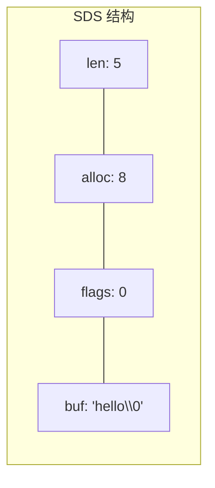

候选人小李在美团的一面中，面试官问道：

"Redis 的 String 底层用的什么字符串？为什么不用 C 的 char 数组？"

小李说："SDS 吧，比 C 字符串好。"面试官追问："好在哪里？"

小李说："...快？"面试官："SDS 的 header 里存了什么？为什么要有 len 字段？"

小李愣住了，说："存长度...方便取？"

面试官继续："那 SDS 的空间预分配机制是什么？惰性删除又是什么？"

小李彻底卡住。

【面试官心理】
这道题我用来考察候选人对 Redis 底层实现的理解程度。知道 SDS 比 C 字符串好的人很多，但能说出"好在哪里"——O(1) 长度获取、二进制安全、空间预分配——的人不到 30%。能讲清楚 SDS header 结构和预分配算法的，基本都看过 Redis 源码。

## 一、SDS 是什么 🔴

### 1.1 C 字符串的三大缺陷

在聊 SDS 之前，先说说 C 字符串为什么不够用。

```c
// C 字符串的问题
char buf[1024];
strcpy(buf, "hello");
strlen(buf);  // O(n) — 必须遍历到 \0 才能知道长度
```

**问题一：长度获取是 O(n)**
C 字符串用 `\0` 结尾，获取长度需要遍历整个字符串。对于 Redis 这种高频 get/set 的场景，每次都要从头到尾扫描一遍，性能根本无法接受。

**问题二：缓冲区溢出**
```c
char buf[8];
strcpy(buf, "hello world");  // 溢出！没有边界检查
```

**问题三：二进制不安全**
C 字符串遇到 `\0` 就截断，无法存储图片、音频等二进制数据。

### 1.2 SDS 结构

SDS（Simple Dynamic String）的核心改进就是在字符串前面加了一个 header：

```c
// Redis 3.0 SDS 结构 (sds.h)
struct __attribute__ ((__packed__)) sdshdr8 {
    uint8_t len;    // 已使用长度
    uint8_t alloc;  // 总分配长度（不含 header）
    unsigned char flags;
    char buf[];     // 实际字符串
};
```



关键设计：**len 字段直接存储长度，strlen 是 O(1)**。

### 1.3 ❌ 错误示范

**候选人原话**："SDS 就是加了个长度，没别的了。"

**问题诊断**：
- 只看到了表面，不知道空间预分配
- 不理解惰性删除的设计意图
- 不了解二进制安全的具体含义

**面试官内心 OS**："这个候选人肯定只是简单翻过 Redis 源码，没有理解 SDS 设计背后的工程权衡。"

### 1.3 标准回答

SDS 的四大优势：

```
1. O(1) 长度获取：header 中直接存 len，无需遍历
2. 二进制安全：按 len 而非 \0 判断结束，可以存任意字节
3. 空间预分配：减少扩容次数
4. 惰性删除：删除操作不立即释放内存
```

【面试官心理】
SDS 是 Redis 最基础的数据结构，但也是最能体现设计功力的地方。我追问空间预分配和惰性删除，是想看他有没有从"系统设计"的角度思考 Redis。知道 SDS 有这些优化的占 40%，能说出具体实现细节的占 15%。

## 二、空间预分配 🔴

### 2.1 为什么需要预分配？

如果 SDS 每次 append 都要重新分配内存，性能会非常差：

```c
// 暴力扩容：每次 append 都重新分配
SDS s = sdsnew("hello");
s = sdscat(s, " world");   // 重新分配 + 拷贝
s = sdscat(s, " !");       // 又重新分配 + 拷贝
```

Redis 的空间预分配策略：

```c
// SDS 扩容算法 (sds.c)
if (newlen <= sdsavail(s)) {
    // 空间足够，无需扩容
} else {
    // 计算新容量
    if (newlen < SDS_MAX_PREALLOC) {
        // < 1MB：容量翻倍
        newlen *= 2;
    } else {
        // >= 1MB：多分配 1MB
        newlen += SDS_MAX_PREALLOC;
    }
}
```

| 原长度 | 扩容策略 | 新容量 |
| --- | --- | --- |
| 10 字节 | 翻倍 | 20 字节 |
| 100 字节 | 翻倍 | 200 字节 |
| 1MB | 翻倍会太大 | 1MB + 1MB = 2MB |
| 100MB | 翻倍会太大 | 100MB + 1MB = 101MB |

### 2.2 追问

**面试官追问**：为什么 `>= 1MB` 后不再翻倍，只加 1MB？

这是 P7 级别的追问。翻倍策略在数据量大时会导致严重的内存浪费：
- 1MB 翻倍 = 2MB，浪费 50%
- 100MB 翻倍 = 200MB，浪费 100MB

改为"加 1MB"后：
- 100MB + 1MB = 101MB，浪费率降到 1%

这是一个典型的**时间换空间 vs 空间换时间**的权衡。Redis 选择了在数据量大时用更保守的预分配来节省内存。

【面试官心理】
这道追问我想验证的是候选人有没有"系统级的资源意识"。能说出翻倍策略的占 30%，能解释 1MB 阈值的占 10%。Redis 的设计处处体现了"小数据省内存、大数据省空间"的理念。

## 三、惰性删除 🟡

### 3.1 什么是惰性删除？

SDS 的删除操作不会立即释放内存，而是记录新的长度：

```c
// SDS 惰性删除示例
SDS s = sdsnew("hello world");
sdsrange(s, 0, 4);  // 截断为 "hello"
printf("%d", sdslen(s));  // 输出 5

// 此时 buf 实际可能是 'h''e''l''l''o'' ''w''o''r''l''d''\0'
// 但 sdslen(s) 返回 5，只取前5个字符
```

### 3.2 惰性删除 vs 立即释放

| 策略 | 惰性删除 | 立即释放 |
| --- | --- | --- |
| CPU 消耗 | 低（无需内存操作） | 高（可能触发大量 free） |
| 内存占用 | 可能暂时偏高 | 立即回收 |
| 适用场景 | 高频短字符串 | 需要立即释放的场景 |

### 3.3 真正的内存回收

SDS 提供了手动释放接口：

```c
// 真正的内存释放
sdsfree(s);  // 释放整个 SDS
sdsupdatelen(s);  // 更新 len，丢弃惰性空间
```

【面试官心理】
惰性删除是 Redis 中一个非常巧妙的优化，但大多数候选人从未注意到。这个问题我通常用来试探候选人是不是真的看过 Redis 源码，而不是道听途说。

## 四、二进制安全 🟡

### 4.1 为什么 C 字符串不是二进制安全的？

```c
// C 字符串遇到 \0 就截断
char buf[256];
strcpy(buf, "hello\x0world");  // 存进去的是 "hello"，后面的丢了
printf("%s", buf);  // 输出 "hello"
```

### 4.2 SDS 的二进制安全

SDS 按 `len` 字段判断结束，不依赖 `\0`：

```c
// SDS 二进制安全
SDS s = sdsnewlen("hello\x0world", 11);  // 明确指定长度 11
printf("%d", sdslen(s));  // 输出 11，不是 5
```

### 4.3 应用场景

```c
// 存储图片二进制数据
unsigned char image_data[] = {0x89, 0x50, 0x4E, 0x47, ...};
SDS s = sdsnewlen(image_data, sizeof(image_data));

// 存储序列化对象
SDS serialized = sdsnewlen(obj_bytes, obj_len);
```

【面试官心理】
二进制安全这个问题，我想验证的是候选人有没有实际使用场景。很多候选人能背出"SDS 是二进制安全的"，但说不出实际应用——比如为什么 Redis 可以用 String 存储图片和序列化对象。

## 五、综合对比

| 维度 | C 字符串 | SDS |
| --- | --- | --- |
| 获取长度 | O(n) | O(1) |
| 二进制安全 | 否 | 是 |
| 缓冲区溢出 | 可能 | 不可能 |
| 追加操作 | 每次重新分配 | 空间预分配 |
| 删除操作 | 立即释放 | 惰性释放 |
| API 复杂度 | 简单 | 稍复杂 |

```c
// Redis 中 String 的底层就是 SDS
// 每次 SET key value，实际调用了 sdsnew() 或 sdscpy()
// 每次 GET key，实际调用了 sdslen() + sdsdup()
```

## 六、生产避坑

:::warning ⚠️
SDS 的两大生产隐患：

1. **大 Key 字符串**：预分配导致 String 内存可能比实际数据大很多。100MB 的 String 实际占用可能超过 200MB（翻倍预分配）。

2. **大量短字符串**：Redis 内部大量使用 SDS（如 key 名、命令参数），jemalloc 的内存碎片率可能高达 1.5x 以上。
:::

**排查方法**：
```bash
# 查看内存碎片率
redis-cli INFO memory | grep mem_fragmentation_ratio

# 碎片率 > 1.5 时触发内存整理
redis-cli MEMORY PURGE  // 尝试释放碎片
```

:::tip 💡
生产优化建议：
- 字符串 value 超过 10KB 时，考虑拆分或使用其他存储
- 关注 `mem_fragmentation_ratio`，过高时重启或使用 MEMORY PURGE
- Redis 7.0 引入的动态 AOF 碎片管理可以缓解这个问题
:::

【面试官心理】
这道题我想最终验证的是候选人的"系统思维"。SDS 看似简单，但背后涉及内存管理、性能优化、系统设计等多个维度。能把 SDS 的设计讲清楚并联系到生产优化的，基本都是 P6 以上。
