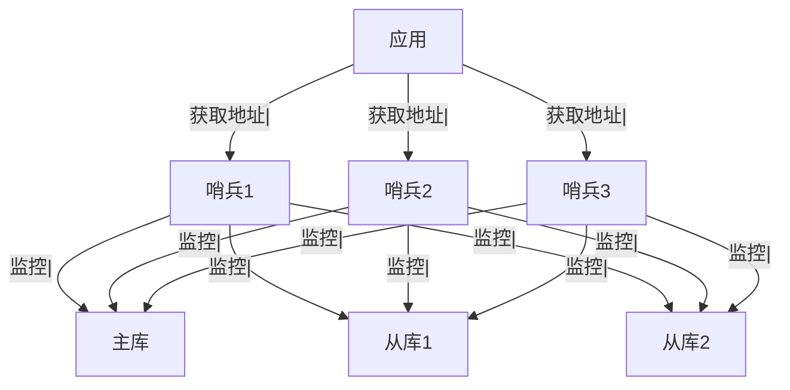
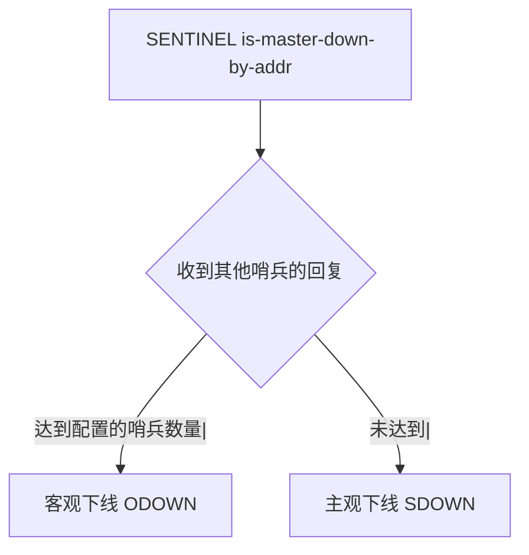
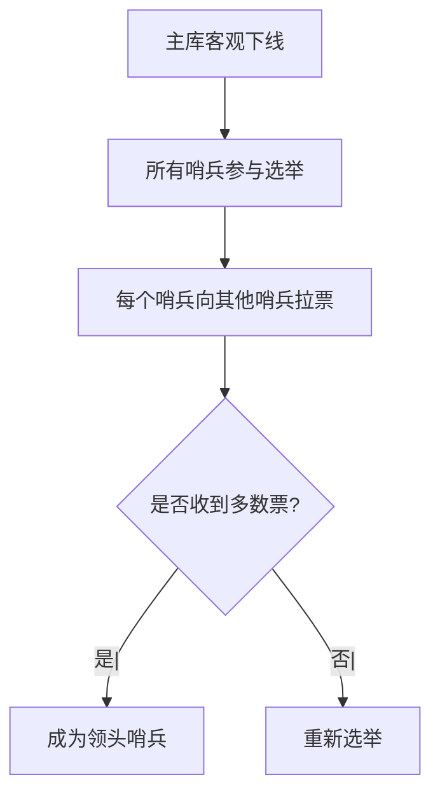
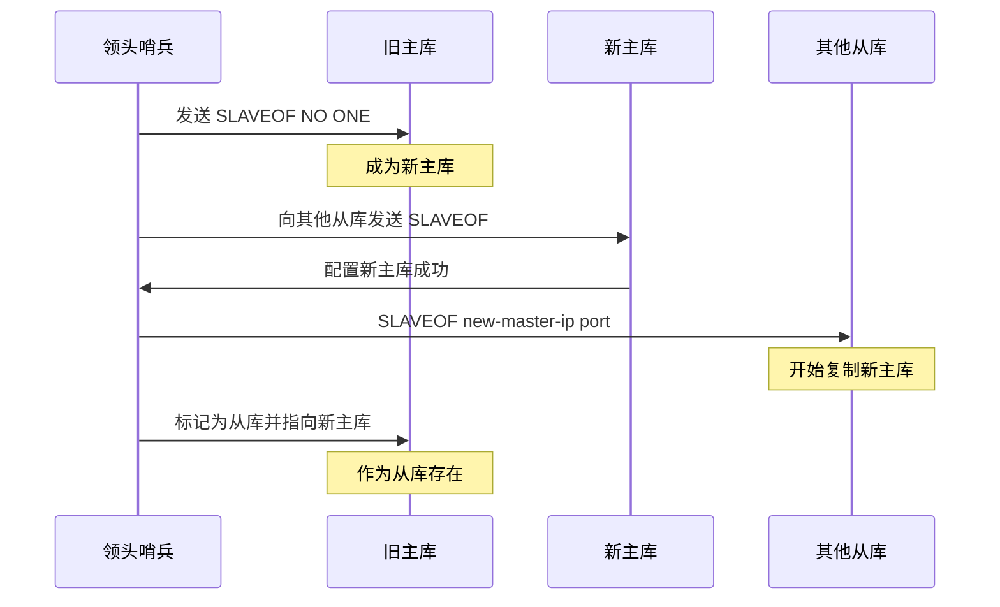
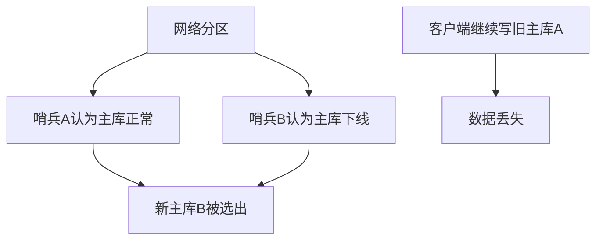

候选人小李在美团 P7 架构面中，面试官问：

"Redis 主从集群如果主库挂了，怎么自动恢复？"

小李说："用哨兵，哨兵会检测主库状态。"

面试官追问："哨兵是怎么检测的？主观下线还是客观下线？"

小李说："好像是...多数哨兵同意就客观下线？"

面试官继续追问："那主库恢复后是怎么变成从库的？"

小李答不上来了。

【面试官心理】
这道题我用来测试候选人对 Redis 高可用方案的理解深度。能说出哨兵作用的占 60%，能讲清主观下线和客观下线的占 20%，能说清完整故障转移流程的占 10%。

## 一、哨兵架构 🔴

### 1.1 哨兵的作用

```
1. 监控（Monitoring）：持续监控主库和从库的运行状态
2. 自动故障转移（Automatic Failover）：主库下线时自动选主
3. 通知（Notification）：故障转移时通知应用
4. 配置提供者（Configuration Provider）：应用从哨兵获取主库地址
```

### 1.2 架构图



### 1.3 为什么需要多个哨兵

```
- 防止哨兵本身单点故障
- 多数哨兵同意才能判断主库客观下线
- 分布式协商，避免误判
```

## 二、下线检测机制 🔴

### 2.1 主观下线（SDOWN）

```bash
# 哨兵每秒向主库/从库发送 PING
PING

# 如果超过 down-after-milliseconds 没有回应，标记为 Subjectively Down
# 单个哨兵的判断，不一定准确
```

```bash
# 配置主观下线时间
sentinel monitor mymaster 127.0.0.1 6379 2
# 2 表示：超过 2 个哨兵同意才客观下线

sentinel down-after-milliseconds mymaster 30000
# 30 秒没有响应，标记为主观下线
```

### 2.2 客观下线（ODOWN）



```bash
# 哨兵之间通过 SENTINEL is-master-down-by-addr 命令交流
# 当多数哨兵都认为主库主观下线时，才判定为客观下线
```

### 2.3 故障转移触发条件

```
客观下线 + 主库真的不可用 + 超过配置的哨兵数量同意
```

## 三、故障转移流程 🟡

### 3.1 选举领头哨兵



```bash
# 选举算法：Raft 协议的简化实现
# 1. 每个哨兵有一个 runid
# 2. 向其他哨兵发送 SENTINEL is-master-down-by-addr 请求
# 3. 收到多数票的哨兵成为领头哨兵
# 4. 领头哨兵负责执行故障转移
```

### 3.2 选择新主库

```bash
# 领头哨兵从从库中选择新的主库
# 选择标准：
# 1. 优先级: replica-priority 最高的
# 2. 复制偏移量: master_repl_offset 最大的
# 3. run id: 最小的
```

```bash
# 配置从库优先级
sentinel down-after-milliseconds mymaster 30000
sentinel failover-timeout mymaster 180000
sentinel parallel-syncs mymaster 1
```

### 3.3 故障转移步骤



### 3.4 并行同步数量

```bash
# 配置同时同步的从库数量
sentinel parallel-syncs mymaster 1
# 默认 1，表示一个一个同步
# 设置为更大的值会加快故障转移，但会增加主库压力
```

## 四、哨兵配置 🟡

### 4.1 哨兵配置文件

```bash
# sentinel.conf

# 监控的主库名称、IP、端口、法定投票数
sentinel monitor mymaster 127.0.0.1 6379 2

# 主观下线时间（毫秒）
sentinel down-after-milliseconds mymaster 30000

# 故障转移超时时间
sentinel failover-timeout mymaster 180000

# 同步时同时复制的从库数量
sentinel parallel-syncs mymaster 1

# 认证密码
sentinel auth-pass mymaster your-password

# 通知脚本
sentinel notification-script mymaster /var/redis/notify.sh

# 客户端重新配置脚本
sentinel client-reconfig-script mymaster /var/redis/reconfig.sh
```

### 4.2 启动哨兵

```bash
# 启动哨兵
redis-sentinel /path/to/sentinel.conf

# 或
redis-server /path/to/sentinel.conf --sentinel
```

### 4.3 查看哨兵状态

```bash
# 查看哨兵信息
redis-cli -p 26379 INFO sentinel

# 输出：
# sentinel_masters:1
# sentinel_tilt:0
# sentinel_running_scripts:0
# sentinel_scripts_queue_length:0
# master0:name=mymaster,status=ok,address=127.0.0.1:6379,slaves=2,sentinels=3
```

## 五、客户端连接 🟡

### 5.1 Jedis 连接哨兵

```java
// JedisSentinelPool
Set<String> sentinels = new HashSet<>();
sentinels.add("host1:26379");
sentinels.add("host2:26379");
sentinels.add("host3:26379");

JedisSentinelPool pool = new JedisSentinelPool(
    "mymaster",  // 监控的主库名称
    sentinels,
    new JedisPoolConfig(),
    3000,  // 连接超时
    3000,  // 读取超时
    "password"  // 认证密码
);

// 获取连接
Jedis jedis = pool.getResource();
jedis.set("key", "value");
jedis.close();
```

### 5.2 Spring Boot 配置

```yaml
spring:
  redis:
    sentinel:
      master: mymaster
      nodes: host1:26379,host2:26379,host3:26379
      password: your-password
```

## 六、常见问题 🟡

### 6.1 脑裂问题



```bash
# 配置最小从库数量
min-replicas-to-write 2
# 主库必须至少有 2 个从库可用才能接受写请求
# 防止脑裂时主库继续接收写入
```

### 6.2 故障转移时间

```bash
# 故障转移时间组成：
# 主观下线检测: down-after-milliseconds
# 客观下线检测: 约 1 秒
# 选举领头哨兵: 约 1 秒
# 故障转移执行: 约 1-2 秒
# 总计: 约 35-40 秒
```

:::warning ⚠️
哨兵的故障转移时间较长，不适合对延迟要求极高的场景。需要更快的故障转移可以考虑 Redis Cluster 或 ProxySQL + Keepalived。
:::

【面试官心理】
能说出"脑裂问题"和 `min-replicas-to-write` 配置的候选人，基本都有实际运维经验。这是 P6+ 的水准。
