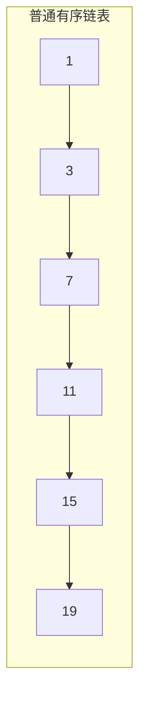
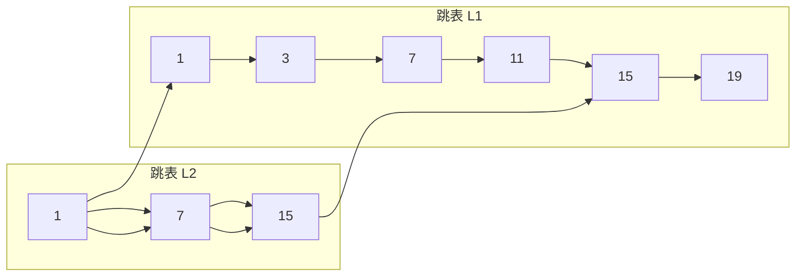
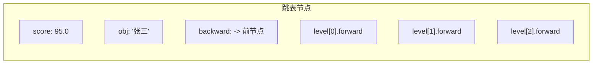
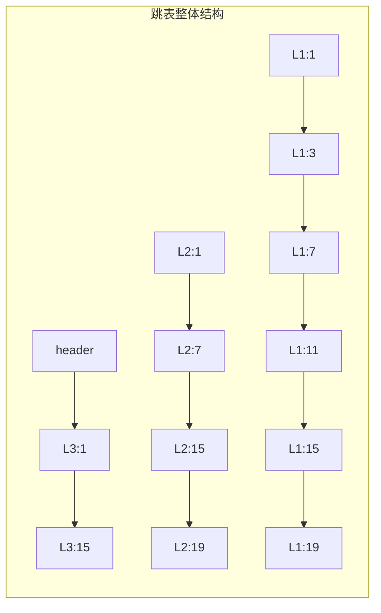
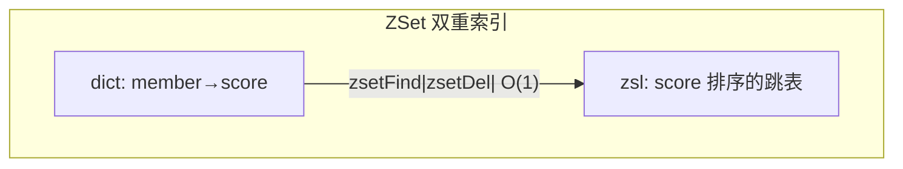

候选人小周在阿里的三面中，面试官拿起简历上"精通 Redis"这一行，说：

"来，画一下跳表的数据结构，说说为什么 Redis 用跳表而不是红黑树。"

小周在白纸上画了一个多层链表，面试官看了一眼："你这个层数是怎么决定的？"

小周说："呃...随机？"面试官："说详细点。"

小周："就是随机生成层数..."面试官追问："那为什么这样设计是 O(log n) 的？"

小周开始擦汗。

【面试官心理】
这道题我用来区分 P6 和 P7。能把跳表画出来的占 50%，能解释层数随机化原理的占 20%，能说出 Redis 为什么选跳表而不是 B+Tree 或红黑树的只有 10%。跳表是 Redis 中最优雅的数据结构设计之一，值得深入理解。

## 一、跳表是什么 🔴

### 1.1 问题拆解

**第一层：为什么需要跳表？**

普通有序链表查询是 O(n)：



查找 15，需要遍历：1 → 3 → 7 → 11 → 15，共 5 次。

**跳表的核心思想：给链表建索引，多层跳跃**



查找 15：L2: 1 → 7 → (超过15, 回退) → L1: 11 → 15，只需要 4 次。

### 1.2 ❌ 错误示范

**候选人原话**："跳表就是用随机层数建多级索引，查询是 O(log n)。"

**问题诊断**：
- 只说了结论，没说为什么是 O(log n)
- 不知道层数随机化的具体概率分布
- 不理解跳表的空间复杂度

**面试官内心 OS**："这个候选人肯定是在背题，根本没有动手推算过跳表的复杂度。"

## 二、跳表结构详解 🔴

### 2.1 节点结构

```c
// Redis 跳表节点 (server.h)
typedef struct zskiplistNode {
    // member (元素值，sds 字符串)
    robj *obj;

    // score (分值，double 类型)
    double score;

    // 后退指针 (从高层降到低层时使用)
    struct zskiplistNode *backward;

    // 层结构数组 (柔性数组)
    struct zskiplistLevel {
        struct zskiplistNode *forward;  // 前向指针
        unsigned int span;               // 到下一个节点的跨度
    } level[];
} zskiplistNode;
```



### 2.2 跳表结构

```c
typedef struct zskiplist {
    // 表头和表尾
    struct zskiplistNode *header, *tail;

    // 最大层数
    unsigned long level;

    // 节点数量
    unsigned long length;
} zskiplist;
```



【面试官心理】
我让他画跳表结构，其实是想看他对"层"的理解。很多候选人能画出多层，但说不清楚每层的前向指针和 span 是什么意思。Redis 的跳表实现中，span 是用来计算 rank（排名）的，这个细节很少有人注意到。

## 三、层数随机化 🔴

### 3.1 为什么用随机层数？

这是跳表最核心的设计：用概率代替确定性。

```c
// Redis 跳表层数生成算法 (t_zset.c)
#define ZSKIPLIST_MAXLEVEL 64   // 最大层数 64
#define ZSKIPLIST_P 0.25        // 每层概率 25%

int zslRandomLevel(void) {
    int level = 1;
    while (random() < ZSKIPLIST_P * RAND_MAX) {
        level += 1;
    }
    return (level < ZSKIPLIST_MAXLEVEL) ? level : ZSKIPLIST_MAXLEVEL;
}
```

层数生成概率分布：
```
level = 1: 概率 75%
level = 2: 概率 25% × 75% = 18.75%
level = 3: 概率 25%² × 75% = 4.6875%
level = 4: 概率 25%³ × 75% = 1.17%
...
```

### 3.2 为什么是 O(log n)？

这是面试官最爱的追问。让我从数学上证明：

假设每层节点数是上一层的 1/p（即 p = 4，概率 0.25）：

```
第 1 层（底层）：n 个节点
第 2 层：n/p 个节点
第 3 层：n/p² 个节点
...
第 k 层：n/pᵏ 个节点 ≈ 1 个节点
```

**k = logₚ(n)**，即层数是 O(log n)。

查询时每层最多遍历 p 个节点（因为节点间距是 p），总复杂度 = **O(log n) × p** = **O(log n)**。

### 3.3 标准回答

跳表层数随机化的本质是**用抛硬币（概率）代替掷骰子（确定性）**：

```
每增加一层，概率是 25%
不靠精确计算，靠概率分布来保证平均 O(log n)
```

【面试官心理】
这个追问我能看出候选人有没有数学思维。能推导出 O(log n) 的占 15%，能用生活类比（抛硬币）讲清楚的占 10%。更重要的是，我想看他有没有想过"为什么不固定层数"——固定层数就变成了确定性索引，需要维护平衡，而随机化用"概率保证平衡"而不是"规则强制平衡"，这是算法设计的精髓。

## 四、Redis 为什么选跳表 🔴

### 4.1 追问链

**面试官追问**：Redis 为什么用跳表而不是红黑树或 B+Tree？

这是 P6/P7 的核心分水岭。

| 维度 | 跳表 | 红黑树 | B+Tree |
| --- | --- | --- | --- |
| 查询复杂度 | O(log n) | O(log n) | O(log n) |
| 插入/删除 | O(log n)，改指针 | O(log n)，需旋转 | O(log n)，需分裂/合并 |
| 范围查询 | 找到起点 + 遍历 | 中序遍历 | 天然顺序遍历 |
| 实现难度 | 简单（300行） | 中等 | 复杂 |
| 并发友好 | 只需锁局部节点 | 需要整棵树或复杂的锁 | 页级锁 |
| 内存开销 | 1/p 额外指针 | 2个指针 + 颜色位 | 多个指针 + 页结构 |

### 4.2 Redis 的取舍

Redis 作者 antirez 选择跳表的核心原因：

```
1. 实现简单：Redis 的跳表实现只有约 300 行代码
2. 无锁设计：插入时只需修改局部指针，不影响其他节点
3. 范围查询够用：跳表从起点顺序遍历，红黑树需要中序遍历
4. 调试友好：跳表可以直观打印，红黑树的树结构很难可视化
```

### 4.3 ❌ 错误示范

**候选人原话**："跳表比红黑树快，因为它是链表。"

**问题诊断**：
- 把"链表"等同于"慢"，完全不理解跳表的索引原理
- 混淆了普通链表和跳表的区别
- 不理解时间复杂度的含义

**面试官内心 OS**："这个候选人肯定没有深入理解跳表和红黑树的核心差异，只是在背结论。"

【面试官心理】
这道题我想考察的是候选人的"算法选型能力"。能列出对比表的占 40%，能说出 Redis 作者取舍原因的占 15%，能结合 Redis 的单线程模型解释"并发友好"的占 5%。Redis 是单线程的，所以不需要复杂的锁机制，跳表的简单性在这里是巨大优势。

## 五、空间复杂度 🟡

### 5.1 跳表内存开销

每个节点的层数是随机的，期望层数是：

```
E(层数) = 1 + p + p² + p³ + ... = 1 / (1 - p) = 1 / 0.25 = 4
```

平均每个节点有 4 层指针，额外内存开销约为 **3 个指针/节点**。

相比之下，红黑树的额外开销是 **2 个指针 + 1 个颜色位**。

### 5.2 Redis 的优化

```c
// Redis 跳表的层数上限是 64
// 但实际平均层数只有 4 层（p=0.25）
// 这意味着：即使存 10 亿个元素，最大层数也很少超过 32
```

:::tip 💡
跳表的空间开销约为 **3x 指针**，而 B+Tree 的空间开销约为 **0.5x 页结构**。但 Redis 的数据量通常远小于数据库，所以跳表的额外内存开销是可以接受的。
:::

## 六、ZSet 的双重索引 🟡

### 6.1 ZSet 同时使用跳表和哈希表

这是 Redis 的经典设计：

```c
typedef struct zset {
    dict *dict;         // Hash 表：member -> score (O(1) 查询 member)
    zskiplist *zsl;     // 跳表：按 score 排序 (O(log n) 范围查询)
} zset;
```



为什么需要两个索引？

| 操作 | dict | zsl |
| --- | --- | --- |
| ZSCORE key member | O(1) | O(log n) |
| ZRANK key member | 不支持 | O(log n) |
| ZRANGE key 0 100 | 不支持 | O(log n + M) |
| ZADD key score member | O(1) | O(log n) |

**dict 提供 O(1) 的 member→score 查询，zsl 提供有序的 score 遍历。**

### 6.2 ❌ 错误示范

**候选人原话**："ZSet 用跳表就够了，不需要哈希表。"

**面试官内心 OS**："这个候选人没有理解 Redis 的设计哲学——永远用最合适的数据结构达到 O(1) 或 O(log n) 的操作复杂度，而不是为了省内存牺牲性能。"

【面试官心理】
ZSet 的双重索引是我在 Redis 面试中最喜欢追问的点。能说出 dict + zsl 双重结构的占 30%，能解释为什么要用两个索引而不是一个的占 10%。这个设计完美体现了"空间换时间"和"用合适的结构做合适的事"的原则。

## 七、生产避坑

:::warning ⚠️
生产环境中的跳表翻车点：

1. **ZSet 元素过多导致性能退化**：ZSet 从 ziplist 转成 skiplist 后，插入复杂度从 O(1) 变成 O(log n)，且元素越多跳表层数越高。

2. **大 Key 问题**：某个 ZSet（如热门游戏的排行榜）可能包含上百万个元素，内存占用可达数百 MB。

3. **热 Key 问题**：排行榜这种 ZSet 的查询 QPS 可能高达几十万，单节点成为瓶颈。
:::

**排查方法**：
```bash
# 查看 ZSet 的编码类型
redis-cli DEBUG OBJECT leaderboard:game:1

# 扫描大 ZSet Key
redis-cli --scan --pattern "*" | while read key; do
    size=$(redis-cli ZCARD "$key")
    if [ "$size" -gt 10000 ]; then
        echo "$key: $size elements"
    fi
done
```

:::tip 💡
ZSet 性能优化建议：
- 合理设置 `zset-max-ziplist-entries`（默认 128），延缓编码转换
- 对超大型排行榜使用分桶策略：按 score 区间分到不同的 ZSet
- 热 Key 问题用 Redis Cluster 水平扩展
:::

【面试官心理】
这道题我最终想验证的是候选人的"全局工程能力"。能画出跳表的占 40%，能讲清楚层数随机化原理的占 20%，能解释 Redis 为什么选跳表的占 15%，能说出 ZSet 双重索引设计的占 10%。能把原理和工程结合的，基本都是 P6+。
