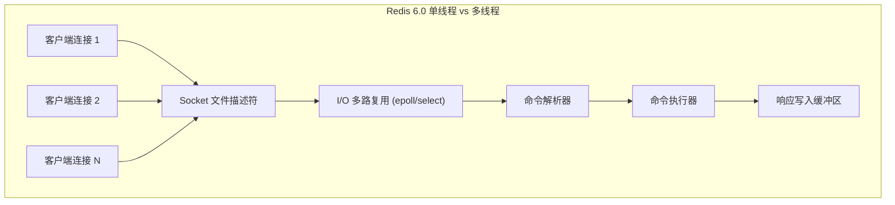
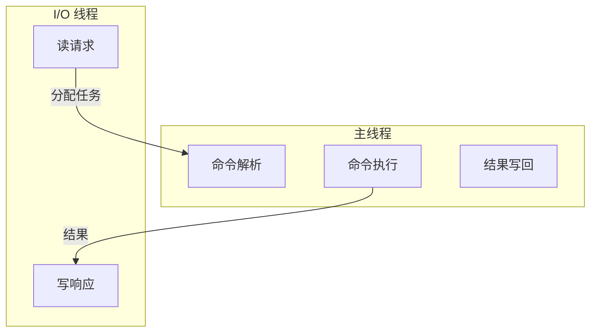
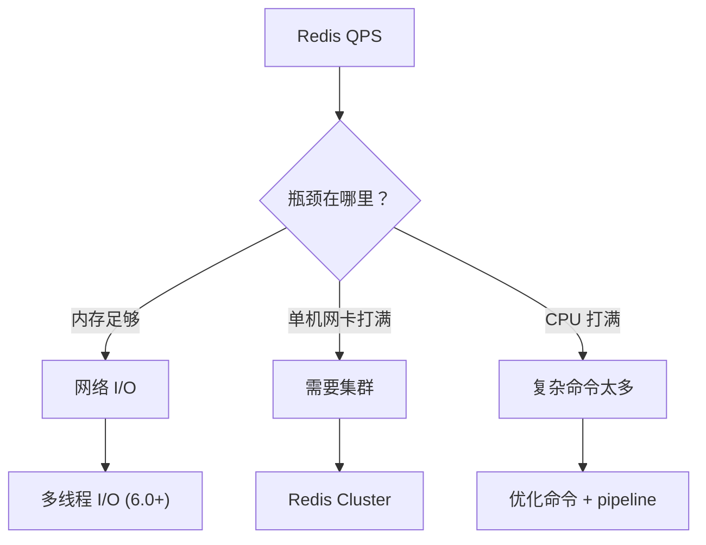

候选人小孙在字节跳动的一面中，面试官问了一个"送命题"：

"Redis 是单线程还是多线程？为什么？"

小孙秒答："单线程，因为快。"面试官追问："为什么单线程就快？"

小孙说："...上下文切换少？"面试官："那 nginx 也是单线程吗？"

小孙开始慌。

面试官继续追问："Redis 6.0 引入了多线程，你知道吗？多线程用在什么地方？"

小孙彻底卡住，说："好像是...网络 I/O？"

【面试官心理】
这道题我用来筛选"知其然不知其所以然"的候选人。知道 Redis 单线程的占 95%，能解释为什么单线程快的占 40%，能说出 6.0 多线程 I/O 细节的占 10%。Redis 的单线程模型是面试高频题，但大多数候选人只知其一不知其二。

## 一、Redis 为什么是单线程 🔴

### 1.1 问题拆解

**第一层：Redis 单线程模型架构**



Redis 6.0 之前，真正的"单线程"指的是**命令执行**是单线程，但网络 I/O 和命令解析实际上也是单线程在处理（严格来说是主线程）。

### 1.2 ❌ 错误示范

**候选人原话**："Redis 单线程所以快，因为没有线程竞争。"

**问题诊断**：
- 把"单线程快"当成万能答案，没有深入分析
- 不理解 I/O 多路复用的原理
- 混淆了"单线程"和"无锁"的关系

**面试官内心 OS**："这个候选人对 Redis 的理解还停留在表面，根本没有理解单线程模型的本质。"

### 1.3 标准回答

Redis 单线程的核心原因：

```
1. CPU 不是 Redis 的瓶颈：Redis 是内存型数据库，主要瓶颈在 I/O
2. 简化数据结构：无需为每个数据结构加锁
3. 避免上下文切换：无线程调度开销
4. 借助 I/O 多路复用：用 epoll 等机制处理高并发
```

**Redis 真正的瓶颈是内存和网络，不是 CPU。**

### 1.4 为什么单线程快？

关键在于 Redis 是 **I/O 密集型** 而非 **CPU 密集型**：

| 场景 | Redis | 多线程服务器 |
| --- | --- | --- |
| CPU 使用 | 很低（主要在解析命令） | 高（频繁上下文切换） |
| QPS（简单 GET/SET） | 10万+ | 5万~10万 |
| 内存占用 | 固定 | 每个线程占用额外内存 |
| 锁开销 | 无 | 同步开销大 |

```c
// Redis 单线程命令执行伪代码
while (true) {
    // 1. 等待事件就绪 (I/O 多路复用)
    aeApiPoll(eventLoop, timeout);

    // 2. 处理就绪事件
    for (每个就绪的 fd) {
        // 3. 读取命令
        readCommand(fd);

        // 4. 解析命令
        parseCommand();

        // 5. 执行命令 (这里就是单线程的核心！)
        executeCommand();

        // 6. 写回响应
        writeResponse(fd);
    }
}
```

【面试官心理】
这道题我想验证的是候选人是否理解"单线程"的真正原因。99%的候选人知道 Redis 单线程，但只有 30%能解释为什么是单线程。能说出"I/O 多路复用"的占 40%，能解释 epoll 原理的占 10%。Redis 作者 antirez 的原话是："Redis 是单线程的，因为 CPU 从来不是 Redis 的瓶颈。"

## 二、I/O 多路复用 🔴

### 2.1 为什么需要 I/O 多路复用？

传统的阻塞 I/O 模型：

```c
// 阻塞 I/O：每个连接一个线程
while (true) {
    int client = accept(listen_fd);
    // 每个客户端都要开一个线程，线程开销巨大！
    pthread_create(handle_client, client);
}
```

10万个连接 = 10万个线程 = 内存爆炸 + CPU 调度崩溃。

### 2.2 Redis 的 I/O 多路复用

```c
// Redis 事件循环 (ae.c)
typedef struct aeEventLoop {
    int maxfd;           // 最大文件描述符
    int setsize;          // 监听的最大连接数
    aeApiState *apidata; // 底层 I/O 多路复用的状态

    aeFileEvent *events;   // 注册的事件
    aeTimeEvent *timeEvents; // 定时事件
} aeEventLoop;
```

Redis 支持多种 I/O 多路复用实现，根据平台自动选择：

| 系统 | 实现 | 优先级 |
| --- | --- | --- |
| Linux | epoll | 最高 |
| macOS/FreeBSD | kqueue | 次高 |
| Solaris | evport | 次高 |
| 通用 | select | fallback |

```c
// ae.c 自动选择最佳实现
#ifdef HAVE_EPOLL
    api = &aeApiStatePoll;  // Linux: epoll
#elif defined(HAVE_KQUEUE)
    api = &aeKqueueState;   // macOS: kqueue
#else
    api = &aeSelectState;    // fallback: select
#endif
```

### 2.3 epoll 的优势

```c
// select 的问题：每次调用都要传入所有 fd，O(n) 遍历
fd_set readfds;
select(maxfd+1, &readfds, NULL, NULL, timeout);

// epoll 的优势：注册一次，回调通知，O(1) 复杂度
int epfd = epoll_create(1);
struct epoll_event ev = { .events = EPOLLIN, .data.fd = fd };
epoll_ctl(epfd, EPOLL_CTL_ADD, fd, &ev);
struct epoll_event events[1024];
epoll_wait(epfd, events, 1024, timeout);
```

【面试官心理】
I/O 多路复用是 Redis 高性能的核心之一。我追问这个问题的深度在于让候选人理解：Redis 单线程不是"没办法"，而是"故意的设计"。用 epoll 的 O(1) 事件通知 + 单线程无锁执行，这才是 Redis 快的原因。

## 三、Redis 6.0 多线程 I/O 🟡

### 3.1 追问

**面试官追问**：Redis 6.0 引入了多线程，用在哪些地方？

这是 2024 年面试的新热点。

Redis 6.0 的多线程**只在网络 I/O 层面**：



**注意：命令执行仍然是单线程的！**

### 3.2 为什么要引入多线程 I/O？

```
瓶颈分析：
- 命令执行（单线程）：10万 QPS，CPU 利用率 30%
- 网络 I/O（单线程）：10万 QPS，CPU 利用率 70%
- 结论：网络 I/O 成了新的瓶颈！
```

**多线程 I/O 的工作流程**：

```
1. 主线程建立连接，分配 client
2. I/O 线程读取请求数据 → 主线程解析命令
3. 主线程执行命令
4. I/O 线程写回响应 → 主线程释放 client
```

### 3.3 ❌ 错误示范

**候选人原话**："Redis 6.0 变成了多线程，执行命令也是多线程的。"

**问题诊断**：
- 完全混淆了多线程 I/O 和多线程执行
- 不知道 Redis 的命令执行为什么不能多线程
- 不理解多线程 I/O 的具体分工

**面试官内心 OS**："这个候选人肯定没有仔细看过 Redis 6.0 的设计文档，只是在网上扫了一眼'多线程'三个字。"

### 3.4 标准回答

```c
// redis.conf 配置
io-threads 4        // I/O 线程数（主线程 + 3 个工作线程）
io-threads-do-reads yes  // 是否在 I/O 线程中执行读操作
```

:::tip 💡
Redis 6.0 多线程默认是关闭的，需要手动开启。对于高并发短连接场景（如 Lua 脚本、HGETALL），多线程 I/O 可以提升 30%~50% 的吞吐量。但对于命令执行本身，单线程仍然是最优解。
:::

【面试官心理】
这道题我想考察的是候选人对 Redis 版本演进的关注程度。Redis 6.0 是 2019 年发布的，但很多候选人到 2024 年都不知道这个变化。能说出多线程 I/O 的具体细节的占 10%，能解释为什么命令执行不能多线程的占 5%。命令执行不能多线程的原因是 Redis 的数据结构（Hash、ZSet 等）不是线程安全的，如果要并发执行，就要给每个操作加锁，反而更慢。

## 四、主线程 vs 多线程执行对比 🟡

### 4.1 为什么命令执行不能多线程？

Redis 的数据结构不是线程安全的：

```c
// 如果两个线程同时操作同一个 Hash
// 线程 A: HGET + HSET
// 线程 B: HDEL
// → 数据错乱！
```

如果要用多线程执行命令，代价是给每个数据结构操作都加锁：

```c
// 多线程 + 锁的方案
pthread_mutex_lock(&hash_lock);
HGET hash key;
pthread_mutex_unlock(&hash_lock);
// → 大量锁竞争，性能退化
```

Redis 作者的选择：**单线程 + 无锁 = 最高性能**。

### 4.2 什么操作是 CPU 密集型的？

```
SCAN、JGETALL、KEYS * → 命令解析
SMEMBERS → 序列化响应
KEYS * → 全量扫描
```

这些操作如果数据量大，即使单线程也可能占用大量 CPU。Redis 6.0 引入了 **lazy free** 来异步释放大对象：

```c
lazyfreelazy_server_del yes
lazyfreelazy_expire yes
lazyfreelazy_user_del yes
```

【面试官心理】
我追问这个问题的深度在于验证候选人对"并发控制"的理解。能说出 Redis 命令执行为什么不能多线程的占 20%，能解释锁竞争问题的占 10%，能进一步提到 lazy free 的占 5%。

## 五、性能瓶颈分析 🟡

### 5.1 Redis 的性能天花板



| 瓶颈 | 表现 | 解决方案 |
| --- | --- | --- |
| 网络 I/O | CPU 高，QPS 上不去 | 6.0 多线程 I/O |
| 单机网卡 | 连接数够但带宽满 | Cluster 分片 |
| CPU | 复杂命令占用高 | 避免 KEYS/SCAN 全扫 |
| 内存 | 内存满了 | 淘汰策略 + 扩容 |

### 5.2 压测方法

```bash
# 简单 SET/GET 压测
redis-benchmark -t SET,GET -n 100000 -c 100

# 指定 key 大小
redis-benchmark -t SET -n 10000 -d 102400  # 100KB value

# Pipeline 压测
redis-benchmark -t SET -n 10000 -P 10  # 10 个 pipeline 请求
```

:::warning ⚠️
生产环境的坑：
1. redis-benchmark 默认用 16 字节的 key 和 value，与生产数据差异巨大
2. 压测单机和压测集群的瓶颈完全不同
3. `redis-benchmark -c 100` 只代表 100 个并发连接，实际生产可能是 1 万+
:::

## 六、生产避坑

| 场景 | 翻车原因 | 解决方案 |
| --- | --- | --- |
| 单机 QPS 达到 10 万 | 网卡带宽打满 | Cluster 分片 |
| 使用 KEYS * | O(n) 全量扫描，阻塞主线程 | 用 SCAN 替代 |
| big key（10MB String） | 序列化/反序列化阻塞 | 拆分 key |
| O(n) 命令 | 数据量大时严重阻塞 | 优化数据结构 |

```bash
# 查看 Redis 延迟原因
redis-cli --latency-history

# 查看命令耗时分布
redis-cli --latency-dist

# 查看慢查询
redis-cli SLOWLOG GET 10
```

【面试官心理】
这道题我想最终验证的是候选人的"全链路性能意识"。Redis 面试到最后，拼的不是谁背得多，而是谁理解得深。能把单线程模型、I/O 多路复用、6.0 多线程讲成一个完整逻辑链的，基本都是 P6+。
