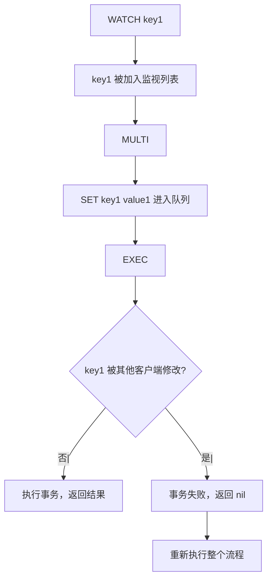

候选人小李在美团二面中，面试官问：

"Redis 怎么实现事务？"

小李说："用 MULTI 和 EXEC。"

面试官追问："Redis 事务能回滚吗？"

小李说："...不能吧？"

面试官继续追问："那 Redis 事务和 MySQL 事务有什么区别？"

小张答不上来了。

【面试官心理】
这道题我用来测试候选人对 Redis 事务机制的理解深度。能说出 MULTI/EXEC 的占 50%，能讲清不能回滚的原因的占 20%，能说清 WATCH 的占 10%。

## 一、Redis 事务是什么 🔴

### 1.1 事务命令

```bash
# Redis 事务的四个命令
MULTI     # 开启事务，之后的命令进入队列
EXEC      # 执行队列中的所有命令
DISCARD   # 清空命令队列，取消事务
WATCH     # 监视一个或多个键，事务开始前如果被改动则事务失败
```

### 1.2 事务执行流程

```bash
# 示例
MULTI
SET key1 value1
SET key2 value2
GET key1
EXEC

# 输出：
# QUEUED  # 命令进入队列
# QUEUED
# QUEUED
# 1) OK    # 执行结果
# 2) OK
# 3) "value1"
```

### 1.3 ❌ 错误理解

**候选人原话**："Redis 事务和 MySQL 事务一样，可以回滚。"

**问题诊断**：
- Redis 事务不支持回滚
- 如果 EXEC 执行失败，不会回滚已执行的命令
- Redis 选择不支持回滚是为了保持高性能

## 二、Redis 为什么不支持回滚 🔴

### 2.1 设计哲学

```bash
# Redis 设计哲学：
# - 简单高性能
# - 命令失败通常是编程错误
# - 不需要回滚机制

# 命令错误类型：
# 1. 语法错误：EXEC 前就能检测到
# 2. 运行时错误：EXEC 后才发现（如对字符串执行 INCR）
```

### 2.2 事务中的错误

```bash
# 语法错误：整个事务被取消
MULTI
SET key string_value
INCR key  # 语法错误：字符串不能 INCR
EXEC

# 输出：(error) EXECABORT Transaction discarded

# 运行时错误：部分命令执行成功
MULTI
SET key 1
SADD key 2  # 运行时错误：SET 的值不能用于 SADD
INCR key
EXEC

# 输出：
# 1) OK
# 2) (error) WRONGTYPE Operation against a key...
# 3) (integer) 2
# SET 和 INCR 成功了，SADD 失败了
```

## 三、WATCH 机制 🔴

### 3.1 WATCH 的作用

WATCH 实现了乐观锁，在事务执行前检查键是否被修改。

```bash
# 示例：账户余额扣减
WATCH balance
balance = GET balance
if balance >= amount:
    MULTI
    DECRBY balance amount
    INCRBY reserved amount
    EXEC
else:
    UNWATCH
    return "余额不足"
```

### 3.2 WATCH 的原理



### 3.3 WATCH 的特性

```bash
# WATCH 可以监视多个键
WATCH key1 key2 key3

# WATCH 是乐观锁，不阻塞其他客户端
# 其他客户端可以正常读写

# EXEC 执行后，所有 WATCH 自动取消
# 或者手动 UNWATCH 取消所有 WATCH
UNWATCH
```

## 四、Pipeline 和事务 🟡

### 4.1 Pipeline

```java
// Pipeline：将多个命令打包发送，减少网络开销
Jedis jedis = jedisPool.getResource();
Pipeline pipeline = jedis.pipelined();
pipeline.set("key1", "value1");
pipeline.get("key1");
pipeline.incr("counter");
List<Object> results = pipeline.exec();
```

### 4.2 Pipeline vs 事务

| 特性 | Pipeline | 事务 |
| --- | --- | --- |
| 原子性 | 无 | 有 |
| 监视 | 不支持 | 支持 WATCH |
| 错误处理 | 无法回滚 | 部分命令失败不影响其他 |
| 网络优化 | 有 | 有 |

### 4.3 Lua 脚本

```bash
# Lua 脚本是原子执行的
EVAL "
local balance = redis.call('GET', KEYS[1])
if tonumber(balance) >= tonumber(ARGV[1]) then
    redis.call('DECRBY', KEYS[1], ARGV[1])
    redis.call('INCRBY', KEYS[2], ARGV[1])
    return 1
else
    return 0
end
" 1 balance reserved 100
```

```java
// Jedis 执行 Lua 脚本
String script =
    "local balance = redis.call('GET', KEYS[1]) " +
    "if tonumber(balance) >= tonumber(ARGV[1]) then " +
    "    redis.call('DECRBY', KEYS[1], ARGV[1]) " +
    "    redis.call('INCRBY', KEYS[2], ARGV[1]) " +
    "    return 1 " +
    "else " +
    "    return 0 " +
    "end";

Jedis jedis = jedisPool.getResource();
Object result = jedis.eval(script, 1, "balance", "reserved", "100");
```

## 五、Redis vs MySQL 事务 🟡

### 5.1 对比表

| 特性 | Redis | MySQL |
| --- | --- | --- |
| 原子性 | MULTI/EXEC 批量原子执行 | ACID 事务 |
| 隔离性 | 无隔离级别 | 4 种隔离级别 |
| 回滚 | 不支持 | 支持 |
| 锁 | 无锁（WATCH 乐观锁） | MVCC/排他锁 |
| 一致性 | 无约束 | 强一致 |
| 持久性 | 依赖 AOF/RDB | Redo Log |

### 5.2 Redis 事务的适用场景

```bash
# 适合的场景：
# - 批量操作，不需要回滚
# - 对性能要求高
# - 需要 WATCH 的乐观锁场景

# 不适合的场景：
# - 需要强一致性的场景
# - 需要回滚的场景
# - 跨数据库的事务
```

## 六、生产避坑 🟡

### 6.1 WATCH 导致的死循环

```java
// ❌ 错误：WATCH 失败后没有退出机制
while (true) {
    jedis.watch("balance");
    int balance = Integer.parseInt(jedis.get("balance"));
    if (balance >= amount) {
        jedis.multi();
        jedis.decrby("balance", amount);
        // 如果 WATCH 失败，这里不会执行
        // 导致死循环
        jedis.exec();
        break;
    }
    jedis.unwatch();
}
```

```java
// ✅ 正确：限制重试次数
int maxRetries = 3;
int retries = 0;
while (retries < maxRetries) {
    try {
        jedis.watch("balance");
        int balance = Integer.parseInt(jedis.get("balance"));
        if (balance >= amount) {
            jedis.multi();
            jedis.decrby("balance", amount);
            jedis.exec();
            break;
        }
        jedis.unwatch();
        break;
    } catch (JedisWatchException e) {
        retries++;
        if (retries >= maxRetries) {
            throw new RuntimeException("操作失败");
        }
    }
}
```

### 6.2 Pipeline 和事务混用

```java
// ❌ 错误：Pipeline 中混合事务
Pipeline pipeline = jedis.pipelined();
pipeline.multi();
pipeline.set("key1", "value1");
pipeline.exec();  // 错误：Pipeline 中不能有 EXEC
pipeline.get("key1");
pipeline.sync();

// ✅ 正确：分开使用
Pipeline pipeline = jedis.pipelined();
// 批量只读操作
pipeline.set("key1", "value1");
pipeline.get("key1");
pipeline.sync();

// 单独的事务
Transaction tx = jedis.multi();
tx.set("key2", "value2");
tx.exec();
```

:::tip 💡
Redis 事务适合批量操作但不需要回滚的场景。如果需要回滚，使用 Lua 脚本。
:::

【面试官心理】
能说出"Redis 不支持回滚的原因"的候选人，基本都理解 Redis 的设计哲学。这是 P6 的水准。
