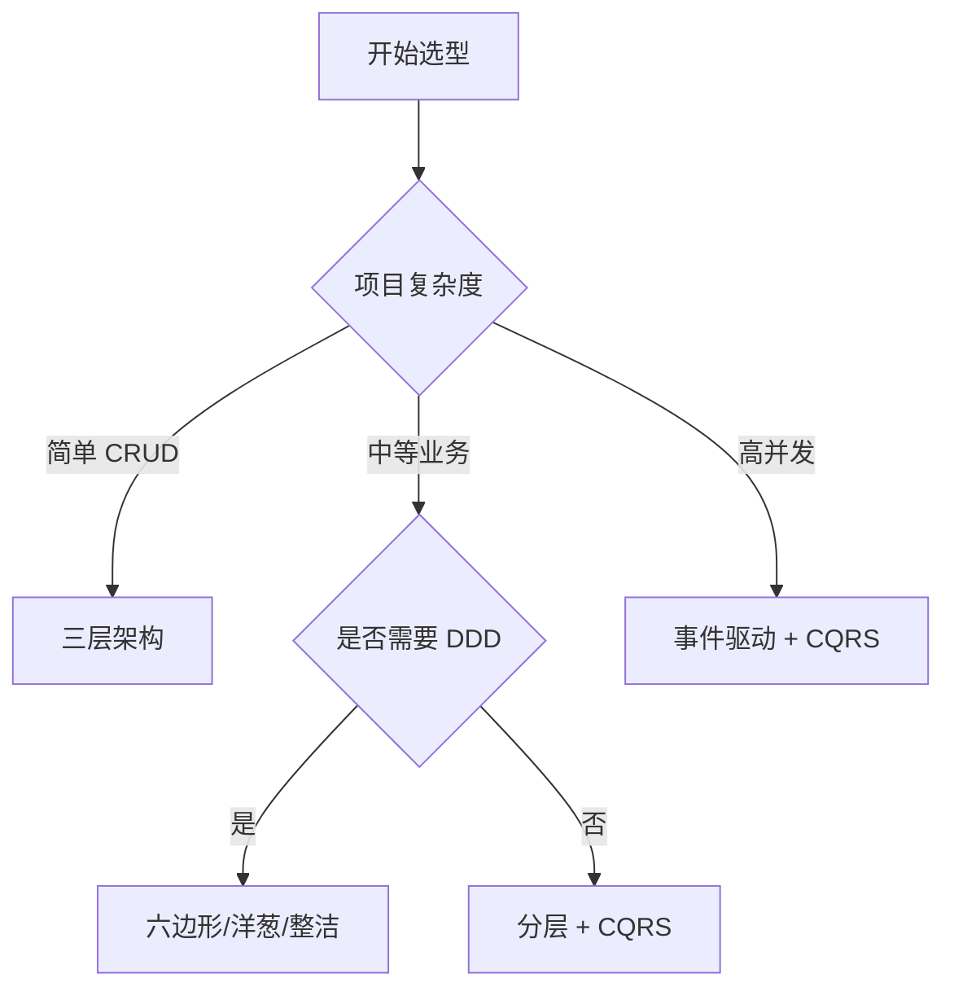

# 架构模式选型对比

**目标读者**：P6/P7 面试准备  
**面试级别**：P6 高频 / P7 进阶

## 快速自测

> **🔴 面试官最关心的 3 个问题**
>
> 1. 如何选择合适的架构模式？
> 2. 不同架构模式的适用场景是什么？
> 3. 如何从 MVC 演进到 DDD？

---

## 一、架构模式对比表

| 架构模式 | 核心思想 | 适用场景 | 复杂度 |
|----------|----------|----------|--------|
| MVC | 控制器分发请求 | Web 应用 | 低 |
| 三层架构 | 分层职责 | 企业应用 | 中 |
| 六边形架构 | 端口与适配器 | 集成系统 | 高 |
| 洋葱架构 | 依赖向内 | DDD 项目 | 高 |
| 整洁架构 | 同心圆分层 | 企业应用 | 高 |
| 微内核架构 | 核心+插件 | 可扩展系统 | 中 |
| 事件驱动 | 异步消息 | 高并发系统 | 高 |
| CQRS | 读写分离 | 复杂查询 | 高 |

---

## 二、选型决策树



---

## 三、场景选型指南

### 1. 电商系统

```
推荐：分层架构 + DDD + CQRS
├── 表现层：Spring MVC
├── 应用层：应用服务
├── 领域层：DDD 聚合
└── 基础设施：Repository + Event Bus
```

### 2. 金融系统

```
推荐：整洁架构 + 事件溯源
├── 高安全要求
├── 完整审计日志
├── 复杂业务规则
└── 需要回溯能力
```

### 3. 内容管理系统

```
推荐：微内核架构
├── 核心功能固定
├── 功能需要插件扩展
└── 需要第三方集成
```

### 4. 高并发系统

```
推荐：事件驱动 + CQRS
├── 读写分离
├── 异步处理
├── 高吞吐量
└── 最终一致性
```

---

## 四、架构演进路线

### 演进路径

```
Phase 1: 简单项目
    MVC → 三层架构

Phase 2: 业务复杂度增加
    三层架构 → DDD + 六边形

Phase 3: 性能要求提高
    DDD → CQRS + 事件驱动

Phase 4: 团队规模扩大
    单体 → 微服务
```

### 演进时机

| 信号 | 说明 |
|------|------|
| 代码难以维护 | 单一类超过 1000 行 |
| 团队协作困难 | 多人修改同一文件 |
| 部署频率低 | 一周以上才能发布 |
| 性能瓶颈 | 数据库成为瓶颈 |
| 测试覆盖率低 | 低于 50% |

---

## 五、架构原则

| 原则 | 说明 |
|------|------|
| SOLID | 单一职责、开闭原则 |
| DRY | 不要重复自己 |
| KISS | 保持简单 |
| YAGNI | 不需要就不做 |
| 关注分离 | 不同层负责不同事 |

---

## 六、面试追问

> **第一层**：你的项目用过哪些架构模式？
>
> **第二层**：如何决定用哪种架构？
>
> **第三层**：架构如何随业务演进？

**💡 加分回答**：可以提到 `Strangler Fig` 模式用于遗留系统迁移。
