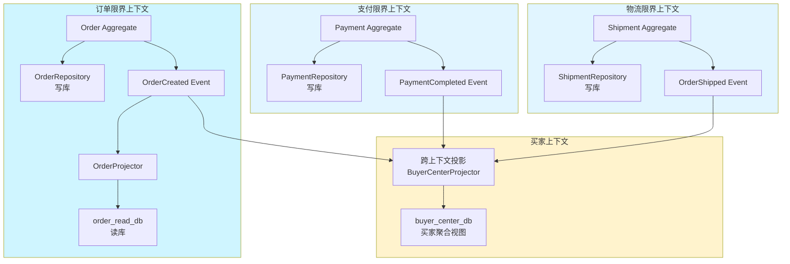

# CQRS与DDD结合

## 一个电商订单的查询灾难

2021年，我们电商平台上线了新功能——"买家中心"订单详情页。

页面包含：订单基本信息、商品明细、物流信息、优惠明细、发票信息、商家信息。这些数据来自 8 个不同的微服务。

最直接的方案是前端聚合——前端调用 8 个接口自己拼。但这样前端性能差，每个用户的设备性能参差不齐，有些低端机光等这些接口就卡了 5 秒。

我们改成了 BFF（Backend For Frontend）聚合模式，在网关层统一调 8 个服务。但新的问题来了：随着业务增长，这个聚合查询的响应时间从 200ms 飙升到 3 秒。业务方抱怨用户体验差，转化率下降了 15%。

排查发现：订单服务为了支撑这个聚合查询，在数据库里搞了 3 个大 JOIN，每次查询都是一次全表扫描。读写混合在一起，读的流量把写的性能也拖累了。

最后我们把订单域拆成了读模型和写模型——CQRS 上线后，聚合查询响应时间从 3 秒降到了 50ms。

## 问题定义

DDD（领域驱动设计）解决的是"如何建模复杂业务"，CQRS（命令查询职责分离）解决的是"如何高性能地读写分离"。两者天然互补：

- **DDD** 提供战术设计（聚合根、领域事件、限界上下文），帮我们把业务建模清楚
- **CQRS** 提供读写分离架构，让读和写各自优化，不互相影响

但两者结合不是简单的"DDD 项目里用 CQRS"。如果结合不好，会引入大量复杂度，反而不如不用。

【架构权衡】

CQRS 和 DDD 结合的核心价值：
1. **写模型专注业务正确性**：聚合根维护业务规则和不变量，领域事件捕获所有状态变更
2. **读模型专注查询性能**：反范式化设计、预计算、缓存，支撑各种复杂查询场景
3. **天然支持事件驱动**：领域事件直接驱动读模型的更新，无需额外的同步机制

## 方案演进

### 方案A：单模型 + 读写混合（传统做法）

```java
// 订单服务：单模型，读写混合
@Service
class OrderService {

    @Autowired private OrderRepository orderRepository;

    // 写：创建订单
    public void createOrder(CreateOrderCommand cmd) {
        Order order = new Order();
        order.setBuyerId(cmd.getBuyerId());
        order.setStatus("PENDING");
        // ... 复杂的业务校验
        orderRepository.save(order);
    }

    // 读：订单聚合查询（JOIN了8张表）
    public OrderDetailDTO getOrderDetail(Long orderId) {
        // 这个方法里做了3个JOIN，查询响应时间3秒
        return orderRepository.findOrderWithDetails(orderId);
    }
}
```

**问题**：
- 读写互相影响：复杂查询占满数据库连接，写操作被阻塞
- 查询模型受限于写模型：为了支持聚合查询，不得不破坏范式
- 聚合根被污染：聚合根上多了很多"为查询而生"的字段

### 方案B：CQRS + DDD 分离

```mermaid
graph TD
    subgraph 写路径
        A[CreateOrderCommand] --> B[Order Aggregate]
        B --> C[OrderRepository<br/>写库]
        B --> D[DomainEvent<br/>OrderCreated]
        D --> E[EventBus]
    end

    subgraph 读路径
        E --> F[Projection<br/>OrderDetailProjector]
        F --> G[ReadDB<br/>订单聚合视图]
        G --> H[OrderQueryService]
    end

    H --> I[GET /orders/{id}]
    A --> J[POST /orders]
```

```java
// ==================== 写模型 ====================
// 聚合根：Order（只负责业务逻辑和状态变更）
class Order extends AbstractAggregateRoot {

    private OrderId id;
    private BuyerId buyerId;
    private OrderStatus status;
    private List<OrderItem> items;
    private Money totalAmount;

    // 工厂方法：创建订单
    public static Order create(BuyerId buyerId, List<OrderItem> items, Coupon coupon) {
        // 业务校验全部在聚合根内
        if (items.isEmpty()) {
            throw new OrderException("订单项不能为空");
        }

        Money subtotal = items.stream()
            .map(OrderItem::getPrice)
            .reduce(Money.ZERO, Money::add);

        Money discount = coupon != null ? coupon.calculateDiscount(subtotal) : Money.ZERO;
        Money total = subtotal.subtract(discount);

        Order order = new Order();
        order.id = OrderId.generate();
        order.buyerId = buyerId;
        order.status = OrderStatus.PENDING;
        order.items = items;
        order.totalAmount = total;

        // 发布领域事件
        order.registerDomainEvent(
            new OrderCreatedEvent(order.id, buyerId, total, LocalDateTime.now())
        );

        return order;
    }

    // 命令方法：支付
    public void pay(PaymentId paymentId, Money paidAmount) {
        if (this.status != OrderStatus.PENDING) {
            throw new OrderException("订单状态不是待支付，无法支付");
        }
        if (paidAmount.compareTo(this.totalAmount) < 0) {
            throw new OrderException("支付金额不足");
        }
        this.status = OrderStatus.PAID;
        this.registerDomainEvent(
            new OrderPaidEvent(this.id, paymentId, paidAmount, LocalDateTime.now())
        );
    }

    // 只能通过事件重建聚合根
    private Order() {}
}

// 仓储：只负责持久化聚合根
interface OrderRepository {
    void save(Order order);         // 持久化聚合根 + 未发布事件
    Optional<Order> findById(OrderId id);
}
```

```java
// ==================== 读模型 ====================
// 读数据库：反范式化的订单聚合视图
@TableName("order_detail_view")
class OrderDetailView {
    Long orderId;
    String buyerName;
    String buyerPhone;
    String status;              // 状态中文描述
    String statusColor;         // 前端展示用
    BigDecimal totalAmount;
    String itemNames;            // "商品A, 商品B, 商品C"（逗号拼接）
    Integer itemCount;           // 商品数量汇总
    String shippingAddress;      // 物流地址
    String logisticsCompany;     // 物流公司
    String trackingNumber;       // 物流单号
    String couponName;           // 优惠券名称
    BigDecimal discountAmount;   // 优惠金额
    // ... 更多冗余字段
}

// 投影构建器：监听领域事件，构建读模型
@Component
class OrderDetailProjector {

    @Autowired private JdbcTemplate jdbcTemplate;

    // 监听 OrderCreated 事件
    @EventListener
    @Async
    public void onOrderCreated(OrderCreatedEvent event) {
        String sql = """
            INSERT INTO order_detail_view
            (order_id, buyer_name, status, total_amount, created_at)
            VALUES (?, ?, ?, ?, ?)
            ON DUPLICATE KEY UPDATE status = VALUES(status)
            """;
        jdbcTemplate.update(sql,
            event.getOrderId(),
            event.getBuyerName(),
            "待支付",
            event.getTotalAmount(),
            event.getOccurredAt()
        );
    }

    // 监听 OrderPaid 事件
    @EventListener
    @Async
    public void onOrderPaid(OrderPaidEvent event) {
        String sql = """
            UPDATE order_detail_view
            SET status = '已支付', paid_at = ?
            WHERE order_id = ?
            """;
        jdbcTemplate.update(sql, event.getOccurredAt(), event.getOrderId());
    }

    // 监听 OrderShipped 事件（来自物流域）
    @EventListener
    @Async
    public void onOrderShipped(OrderShippedEvent event) {
        String sql = """
            UPDATE order_detail_view
            SET logistics_company = ?, tracking_number = ?,
                shipping_status = '运输中', shipped_at = ?
            WHERE order_id = ?
            """;
        jdbcTemplate.update(sql,
            event.getLogisticsCompany(),
            event.getTrackingNumber(),
            event.getOccurredAt(),
            event.getOrderId()
        );
    }
}

// 读服务：直接查读模型，性能极佳
@Service
class OrderQueryService {

    @Autowired private JdbcTemplate jdbcTemplate;

    public OrderDetailView getOrderDetail(Long orderId) {
        return jdbcTemplate.queryForObject(
            "SELECT * FROM order_detail_view WHERE order_id = ?",
            (rs, rowNum) -> mapToView(rs),
            orderId
        );
    }

    // 支持复杂聚合查询，直接在读库上做
    public List<BuyerOrderSummary> getBuyerOrderSummary(Long buyerId) {
        String sql = """
            SELECT status, COUNT(*) as cnt, SUM(total_amount) as total
            FROM order_detail_view
            WHERE buyer_id = ?
            GROUP BY status
            """;
        // 直接返回聚合结果，无需应用层计算
    }
}
```

## 核心设计：限界上下文边界

CQRS + DDD 结合时，最关键的设计决策是**限界上下文的划分**。划分不合理，CQRS 会变成灾难。



【架构权衡】

**跨限界上下文的读模型**是 CQRS + DDD 中最容易翻车的地方：

1. **跨上下文的事件顺序**：OrderPaid 事件和 OrderShipped 事件到达投影的顺序是不确定的（都是异步的）。如果买家中心要展示"支付后发货"的物流信息，需要额外的处理。
2. **跨上下文的事件 Schema**：不同上下文的事件 Schema 是独立演进的，买家上下文投影需要适配各方的 Schema 变更。
3. **最终一致性延迟**：写操作完成后，读模型可能需要几十毫秒到几秒才能更新完成。用户可能在"下单成功"后立刻刷新页面，看到的还是空白。

### 最终一致性延迟处理

```java
// 方案1：同步返回结果后再异步更新读模型
public OrderCreatedResponse createOrder(CreateOrderCommand cmd) {
    // 1. 在写模型处理命令
    Order order = orderService.createOrder(cmd);

    // 2. 同步写入读模型（重要：确保读模型立即可用）
    // 只写入订单核心信息，不等待物流、优惠等跨域数据
    syncWriteToReadModel(order);

    // 3. 异步发布事件，触发其他读模型更新
    applicationEventPublisher.publishEvent(
        new OrderCreatedInternalEvent(order)
    );

    // 4. 返回时读模型已有核心数据
    return new OrderCreatedResponse(order.getId());
}

// 方案2：读模型支持"构建中"状态
public OrderDetailView getOrderDetail(Long orderId) {
    OrderDetailView view = readModelRepository.findById(orderId);
    if (view != null && view.getBuildStatus() == "COMPLETED") {
        return view;
    }

    // 读模型还没构建完，从写模型兜底查一次
    // 这种降级方案可以接受，因为只有新订单的第一次查询会走到这里
    Order order = orderRepository.findById(orderId);
    return buildFallbackView(order);
}
```

## 生产避坑

### 坑1：写模型泄露到读服务

CQRS 的核心原则是**读服务和写模型完全隔离**。但实践中很容易出现"为了方便"而绕过这个边界。

```java
// 错误：在 QueryService 里直接调用 Repository 查聚合根
class OrderQueryService {
    @Autowired private OrderRepository orderRepository;

    public OrderDTO getOrder(Long orderId) {
        // ❌ 违反了 CQRS 原则：读服务不应该接触写模型的仓储
        Order order = orderRepository.findById(orderId);
        return order.toDTO();  // 在这里又做了转换，聚合根被污染
    }
}

// 正确：读服务只查读数据库
class OrderQueryService {
    @Autowired private JdbcTemplate readJdbcTemplate;

    public OrderDTO getOrder(Long orderId) {
        // ✅ 只查读库，不接触任何写模型
        return readJdbcTemplate.queryForObject(
            "SELECT * FROM order_view WHERE order_id = ?",
            rowMapper,
            orderId
        );
    }
}
```

### 坑2：事件丢失导致读模型不一致

如果事件总线（Event Bus）丢了事件，读模型就会出现数据不一致，而且很难发现。

**解决方案**：
1. **事件溯源双写**：写模型保存事件到 EventStore，Event Bus 基于 EventStore 投递而不是内存事件
2. **幂等投影**：投影处理器支持幂等，可以重复处理同一个事件而不产生重复数据
3. **定期校验**：定期比对写模型和读模型的数据，发现不一致立即告警

```java
// 幂等投影：使用订单ID作为幂等键
@EventListener
public void onOrderCreated(OrderCreatedEvent event) {
    String sql = """
        INSERT INTO order_detail_view
        (order_id, buyer_name, total_amount, created_at)
        VALUES (?, ?, ?, ?)
        ON DUPLICATE KEY UPDATE
        buyer_name = VALUES(buyer_name),
        total_amount = VALUES(total_amount)
        """;
    // 即使事件被重复投递，ON DUPLICATE KEY UPDATE 保证了幂等性
    jdbcTemplate.update(sql,
        event.getOrderId(),
        event.getBuyerName(),
        event.getTotalAmount(),
        event.getOccurredAt()
    );
}
```

### 坑3：读模型重建时间过长

系统上线或故障恢复时，需要从事件重放重建读模型。如果历史事件有几千万条，重建可能需要数小时甚至数天。

**解决方案**：
- **快照 + 增量重放**：定期打快照，重建时从最新快照 + 增量事件
- **分片并行重放**：按聚合根 ID 分片，多机器并行重放
- **蓝绿投影**：新旧投影同时运行，切换时无停机

## 工程代价评估

| 维度 | 评估 |
| --- | --- |
| 运维成本 | 高——需要维护写库、读库、事件总线、投影服务多套组件 |
| 开发成本 | 高——开发者需要理解 DDD 战术设计、CQRS 模式、事件驱动，开发时间增加 2~3 倍 |
| 排障复杂度 | 中——跨限界上下文的事件追踪复杂，需要分布式追踪系统 |
| 扩展性 | 高——读模型可按查询维度独立扩展，写模型按业务维度扩展 |
| 数据一致性 | 最终一致——写操作成功后，读模型有延迟（毫秒到秒级） |
| 查询性能 | 极高——读模型反范式化，查询无需 JOIN，单表查询可达毫秒级 |

【架构权衡】

CQRS + DDD 不是万能药。适合使用的场景：
- 复杂业务域，业务规则经常变化，需要清晰的领域模型
- 读写压力差异大，写少读多或写多读少
- 需要支撑多种不同维度的查询，查询模型经常变化
- 对数据一致性要求不是绝对实时（可以接受最终一致）

不太适合的场景：
- 简单 CRUD 业务，领域模型不复杂
- 需要强一致性（每次写入后立即读取，必须看到自己的写入）
- 团队对 DDD 和 CQRS 没有经验
- 项目时间紧张，需要快速交付

## 落地 Checklist

- [ ] 限界上下文划分确定（哪些上下文需要 CQRS，哪些不需要）
- [ ] 写模型：聚合根、领域事件、仓储接口设计完成
- [ ] 读模型：反范式化视图设计完成（哪些字段要冗余存储）
- [ ] 事件总线选型（Kafka / RabbitMQ / Redis Stream）
- [ ] 投影处理器幂等性设计（防止事件重复投递导致数据重复）
- [ ] 读模型重建方案（快照策略、分片并行）
- [ ] 最终一致性延迟监控（写成功到读可见的平均延迟）
- [ ] 降级方案（读模型不可用时的 fallback）
- [ ] 单元测试：聚合根业务规则、投影转换逻辑
- [ ] 集成测试：端到端命令 → 事件 → 投影 → 查询
