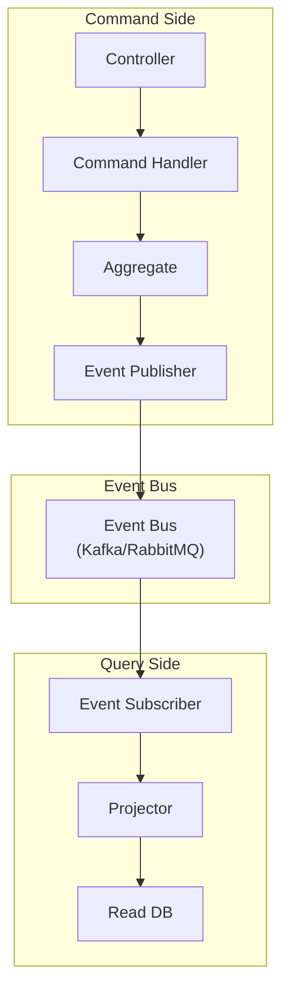

# CQRS 与 DDD 结合

**目标读者**：P7 面试准备  
**面试级别**：P7 高频

## 快速自测

> **🔴 面试官最关心的 3 个问题**
>
> 1. CQRS 和 DDD 如何结合？
> 2. 命令端和查询端的数据同步如何实现？
> 3. CQRS + DDD 在实际项目中如何落地？

---

## 一、整体架构



---

## 二、代码实现

### 1. 领域层（Domain）

```java
// 聚合根
public class Account implements AggregateRoot {
    private AccountId id;
    private Money balance;
    private AccountStatus status;

    // 命令：存款
    public void deposit(Money amount) {
        if (amount.isNegative()) {
            throw new DomainException("存款金额必须为正");
        }
        this.balance = this.balance.add(amount);
        DomainEvents.publish(new MoneyDepositedEvent(this.id, amount, this.balance));
    }

    // 命令：取款
    public void withdraw(Money amount) {
        if (amount.isNegative()) {
            throw new DomainException("取款金额必须为正");
        }
        if (this.balance.lessThan(amount)) {
            throw new DomainException("余额不足");
        }
        this.balance = this.balance.subtract(amount);
        DomainEvents.publish(new MoneyWithdrawnEvent(this.id, amount, this.balance));
    }
}
```

### 2. 命令端（Command Side）

```java
// 命令
public class DepositCommand {
    private Long accountId;
    private BigDecimal amount;
    private String currency;

    // getters
}

public class WithdrawCommand {
    private Long accountId;
    private BigDecimal amount;
    private String currency;

    // getters
}

// 命令处理器
@Service
@Transactional
public class AccountCommandHandler {
    private final AccountRepository accountRepository;

    public void handle(DepositCommand cmd) {
        AccountId accountId = new AccountId(cmd.getAccountId());
        Account account = accountRepository.findById(accountId)
            .orElseThrow(() -> new AccountNotFoundException(accountId));

        Money amount = new Money(cmd.getAmount(), cmd.getCurrency());
        account.deposit(amount);

        accountRepository.save(account);
    }

    public void handle(WithdrawCommand cmd) {
        AccountId accountId = new AccountId(cmd.getAccountId());
        Account account = accountRepository.findById(accountId)
            .orElseThrow(() -> new AccountNotFoundException(accountId));

        Money amount = new Money(cmd.getAmount(), cmd.getCurrency());
        account.withdraw(amount);

        accountRepository.save(account);
    }
}
```

### 3. 查询端（Query Side）

```java
// 读取模型
@Entity
@Table(name = "account_read_model")
public class AccountReadModel {
    @Id
    private Long accountId;
    private String accountNumber;
    private BigDecimal balance;
    private String currency;
    private String status;
    private LocalDateTime lastUpdated;

    // getters/setters
}

// 查询服务
@Service
public class AccountQueryService {
    @Autowired
    private AccountReadModelRepository readModelRepository;

    public AccountReadModel getAccount(Long accountId) {
        return readModelRepository.findById(accountId)
            .orElseThrow(() -> new AccountNotFoundException(accountId));
    }

    public List<AccountReadModel> searchAccounts(String keyword) {
        return readModelRepository.searchByKeyword(keyword);
    }
}
```

### 4. 数据同步（Projection）

```java
// 事件订阅器
@Component
public class AccountEventSubscriber {
    private final AccountReadModelRepository readModelRepository;

    // 处理存款事件
    @EventListener
    public void handleMoneyDeposited(MoneyDepositedEvent event) {
        AccountReadModel readModel = readModelRepository
            .findById(event.getAccountId().getValue())
            .orElseThrow(() -> new AccountNotFoundException(event.getAccountId()));

        readModel.setBalance(event.getNewBalance().getAmount());
        readModel.setLastUpdated(LocalDateTime.now());
        readModelRepository.save(readModel);
    }

    // 处理取款事件
    @EventListener
    public void handleMoneyWithdrawn(MoneyWithdrawnEvent event) {
        AccountReadModel readModel = readModelRepository
            .findById(event.getAccountId().getValue())
            .orElseThrow(() -> new AccountNotFoundException(event.getAccountId()));

        readModel.setBalance(event.getNewBalance().getAmount());
        readModel.setLastUpdated(LocalDateTime.now());
        readModelRepository.save(readModel);
    }
}
```

---

## 三、异步同步方案

### 消息队列同步

```java
// 发布到 Kafka
@Service
public class AccountEventPublisher {
    @Autowired
    private KafkaTemplate<String, DomainEvent> kafkaTemplate;

    public void publish(DomainEvent event) {
        String topic = getTopic(event);
        kafkaTemplate.send(topic, event.getAccountId().toString(), event);
    }

    private String getTopic(DomainEvent event) {
        if (event instanceof MoneyDepositedEvent) return "account.deposited";
        if (event instanceof MoneyWithdrawnEvent) return "account.withdrawn";
        return "account.general";
    }
}

// 消费事件
@KafkaListener(topics = "account.deposited")
public void handleDepositedEvent(ConsumerRecord<String, MoneyDepositedEvent> record) {
    MoneyDepositedEvent event = record.value();
    // 更新读取模型
    updateReadModel(event);
}
```

---

## 四、项目结构

```
src/main/java/com/example/
├── domain/
│   ├── model/
│   │   ├── Account.java           // 聚合根
│   │   ├── Money.java             // 值对象
│   │   └── AccountId.java         // 标识值对象
│   ├── repository/
│   │   └── AccountRepository.java // 仓储接口
│   └── event/
│       ├── MoneyDepositedEvent.java
│       └── MoneyWithdrawnEvent.java
│
├── application/
│   ├── command/
│   │   ├── DepositCommand.java
│   │   ├── WithdrawCommand.java
│   │   └── AccountCommandHandler.java
│   └── query/
│       ├── AccountReadModel.java
│       └── AccountQueryService.java
│
├── infrastructure/
│   ├── persistence/
│   │   ├── JpaAccountRepository.java
│   │   └── AccountReadModelRepository.java
│   └── messaging/
│       ├── KafkaEventPublisher.java
│       └── KafkaEventSubscriber.java
│
└── interface/
    ├── command/
    │   └── AccountCommandController.java
    └── query/
        └── AccountQueryController.java
```

---

## 五、面试追问

> **第一层**：CQRS 和 DDD 如何结合？
>
> **第二层**：命令端和查询端如何同步？
>
> **第三层**：CQRS 的数据一致性如何保证？

**💡 加分回答**：可以提到 `Saga` 模式在 CQRS 中处理跨聚合的分布式事务。
