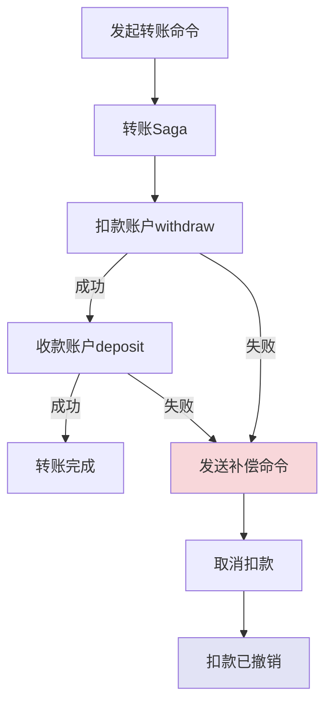

# CQRS与EventSourcing实战

## 一个支付对账的噩梦

2022年Q4，我们支付系统月底对账时，发现有一笔 38 万元的转账订单，在用户端显示"成功"，但银行侧实际未出账。

这笔订单在数据库里的状态是"成功"，但银行侧没有对应记录。排查了整整 3 天，最后发现根因：

系统重构时，开发同学在聚合根上修改了一个字段的语义，但没有同步更新历史事件的解释逻辑。某些边界条件下，事件重放的结果和当时的实际行为不一致。

事件重放时，系统"认为"这笔交易没有完成，但实际上当时确实完成了。两个模型的语义在某个时间点分叉了。

这次事故让我们意识到：**CQRS + Event Sourcing 不是银弹，如果没做好版本化，会比传统方案更危险。**

## 问题定义

CQRS（命令查询职责分离）和 Event Sourcing（事件溯源）是两个独立的模式，但组合在一起威力最大：

- **Event Sourcing** 让写模型只存储不可变的事件序列，通过重放计算状态
- **CQRS** 让读模型独立于写模型，按需反范式化
- **组合** = Event Store（写）+ Projection（读）+ Event Bus（连接）

【架构权衡】

组合模式的核心优势：
1. **天然的数据一致性**：事件是唯一的真相来源，任何时间点都可以重建完整状态
2. **完整的审计轨迹**：不需要额外的审计表，事件本身即审计
3. **强大的调试能力**：任何生产问题，都可以通过重放事件来重现
4. **灵活的读模型**：可以为不同的查询场景构建多个读模型，互不干扰

但组合模式也引入了最大挑战：**事件 Schema 演进**。当业务逻辑变更后，历史事件的语义可能和当前代码不一致。

## 场景：金融账户系统

我们用一个简化版的金融账户系统来完整演示 CQRS + Event Sourcing 的实战。

### 聚合根设计

```java
// 账户聚合根
class AccountAggregate {

    private String accountId;
    private String accountNo;
    private Money availableBalance;    // 可用余额
    private Money frozenBalance;       // 冻结金额
    private AccountStatus status;
    private Long version;              // 乐观锁版本

    // 只能通过事件创建或重建
    private AccountAggregate() {}

    // 工厂：开户
    public static AccountAggregate openAccount(String accountNo, String ownerName, Money initialDeposit) {
        AccountAggregate account = new AccountAggregate();
        account.accountId = UUID.randomUUID().toString();
        account.accountNo = accountNo;
        account.availableBalance = initialDeposit;
        account.frozenBalance = Money.ZERO;
        account.status = AccountStatus.ACTIVE;

        // 发布领域事件
        account.registerDomainEvent(
            new AccountOpenedEvent(
                account.accountId,
                accountNo,
                ownerName,
                initialDeposit,
                LocalDateTime.now()
            )
        );
        return account;
    }

    // 命令：存款
    public void deposit(Money amount, String traceId) {
        assertActive();
        if (amount.compareTo(Money.ZERO) <= 0) {
            throw new DomainException("存款金额必须大于0");
        }
        this.availableBalance = this.availableBalance.add(amount);
        this.registerDomainEvent(
            new MoneyDepositedEvent(
                this.accountId,
                amount,
                traceId,
                this.availableBalance,  // 记录事件发生后的余额快照
                LocalDateTime.now()
            )
        );
    }

    // 命令：取款
    public void withdraw(Money amount, String traceId) {
        assertActive();
        if (amount.compareTo(Money.ZERO) <= 0) {
            throw new DomainException("取款金额必须大于0");
        }
        if (this.availableBalance.compareTo(amount) < 0) {
            throw new InsufficientBalanceException(
                "余额不足，可用余额：" + this.availableBalance + "，取款金额：" + amount
            );
        }
        this.availableBalance = this.availableBalance.subtract(amount);
        this.registerDomainEvent(
            new MoneyWithdrawnEvent(
                this.accountId,
                amount,
                traceId,
                this.availableBalance,
                LocalDateTime.now()
            )
        );
    }

    // 命令：冻结
    public void freeze(Money amount, String reason) {
        assertActive();
        if (this.availableBalance.compareTo(amount) < 0) {
            throw new InsufficientBalanceException("冻结金额超出可用余额");
        }
        this.availableBalance = this.availableBalance.subtract(amount);
        this.frozenBalance = this.frozenBalance.add(amount);
        this.registerDomainEvent(
            new BalanceFrozenEvent(
                this.accountId,
                amount,
                reason,
                this.availableBalance,
                this.frozenBalance,
                LocalDateTime.now()
            )
        );
    }

    // 命令：解冻
    public void unfreeze(Money amount, String reason) {
        if (this.frozenBalance.compareTo(amount) < 0) {
            throw new DomainException("解冻金额超出冻结金额");
        }
        this.frozenBalance = this.frozenBalance.subtract(amount);
        this.availableBalance = this.availableBalance.add(amount);
        this.registerDomainEvent(
            new BalanceUnfrozenEvent(
                this.accountId,
                amount,
                reason,
                this.availableBalance,
                this.frozenBalance,
                LocalDateTime.now()
            )
        );
    }

    private void assertActive() {
        if (this.status != AccountStatus.ACTIVE) {
            throw new DomainException("账户状态异常，当前状态：" + this.status);
        }
    }
}
```

### 事件存储

```java
// 事件存储接口
interface EventStore {
    void append(String aggregateId, List<DomainEvent> events, Long expectedVersion);
    List<DomainEvent> getEvents(String aggregateId);
    List<DomainEvent> getEventsSince(String aggregateId, Long fromVersion);
}

// MySQL + Redis 双写
@Service
class ReliableEventStore implements EventStore {

    @Autowired private JdbcTemplate jdbcTemplate;
    @Autowired private RedisTemplate<String, String> redisTemplate;

    @Transactional
    public void append(String aggregateId, List<DomainEvent> events, Long expectedVersion) {
        // 1. 乐观锁：检查版本号
        Long currentVersion = getVersion(aggregateId);
        if (!expectedVersion.equals(currentVersion)) {
            throw new ConcurrencyException(
                "版本冲突：期望 " + expectedVersion + "，实际 " + currentVersion);
        }

        // 2. 写入 MySQL（持久化）
        for (DomainEvent event : events) {
            String sql = """
                INSERT INTO domain_events
                (event_id, aggregate_id, event_type, event_data, version, occurred_at)
                VALUES (?, ?, ?, ?, ?, ?)
                """;
            jdbcTemplate.update(sql,
                event.getEventId(),
                aggregateId,
                event.getClass().getSimpleName(),
                toJson(event),
                event.getVersion(),
                event.getOccurredAt()
            );
        }

        // 3. 写入 Redis Stream（用于实时消费）
        for (DomainEvent event : events) {
            redisTemplate.opsForStream().add(
                "events:" + aggregateId,
                StreamRecords.newRecord()
                    .in(ListValue.of(toJson(event)))
                    .withStreamKey("events:" + aggregateId)
            );
        }

        // 4. 更新聚合根版本号
        updateVersion(aggregateId, expectedVersion + events.size());
    }
}
```

### 投影构建（读模型）

```java
// 账户余额读模型（实时更新）
@Component
class AccountBalanceProjector {

    @Autowired private JdbcTemplate jdbcTemplate;

    // 监听存款事件
    @EventListener(topic = "MoneyDepositedEvent")
    public void onMoneyDeposited(MoneyDepositedEvent event) {
        String sql = """
            UPDATE account_balance_view
            SET available_balance = ?, last_updated = ?, version = version + 1
            WHERE account_id = ?
            """;
        jdbcTemplate.update(sql,
            event.getBalanceAfter(),
            event.getOccurredAt(),
            event.getAccountId()
        );
    }

    // 监听取款事件
    @EventListener(topic = "MoneyWithdrawnEvent")
    public void onMoneyWithdrawn(MoneyWithdrawnEvent event) {
        String sql = """
            UPDATE account_balance_view
            SET available_balance = ?, last_updated = ?, version = version + 1
            WHERE account_id = ?
            """;
        jdbcTemplate.update(sql,
            event.getBalanceAfter(),
            event.getOccurredAt(),
            event.getAccountId()
        );
    }

    // 监听冻结/解冻事件
    @EventListener(topic = "BalanceFrozenEvent")
    public void onFrozen(BalanceFrozenEvent event) {
        String sql = """
            UPDATE account_balance_view
            SET available_balance = ?, frozen_balance = ?,
                last_updated = ?, version = version + 1
            WHERE account_id = ?
            """;
        jdbcTemplate.update(sql,
            event.getAvailableBalanceAfter(),
            event.getFrozenBalanceAfter(),
            event.getOccurredAt(),
            event.getAccountId()
        );
    }

    // 监听开户事件：初始化读模型
    @EventListener(topic = "AccountOpenedEvent")
    public void onAccountOpened(AccountOpenedEvent event) {
        String sql = """
            INSERT INTO account_balance_view
            (account_id, account_no, available_balance, frozen_balance, status, version)
            VALUES (?, ?, ?, 0, 'ACTIVE', 0)
            ON DUPLICATE KEY UPDATE
            available_balance = VALUES(available_balance)
            """;
        jdbcTemplate.update(sql,
            event.getAccountId(),
            event.getAccountNo(),
            event.getInitialDeposit()
        );
    }
}

// 账户流水读模型（审计用）
@Component
class AccountTransactionProjector {

    @Autowired private JdbcTemplate jdbcTemplate;

    @EventListener(topics = {
        "MoneyDepositedEvent",
        "MoneyWithdrawnEvent",
        "BalanceFrozenEvent",
        "BalanceUnfrozenEvent"
    })
    public void onTransaction(DomainEvent event) {
        String sql = """
            INSERT INTO account_transaction_view
            (account_id, event_id, event_type, amount, balance_after,
             trace_id, occurred_at, created_at)
            VALUES (?, ?, ?, ?, ?, ?, ?, NOW())
            """;
        if (event instanceof MoneyDepositedEvent e) {
            jdbcTemplate.update(sql,
                e.getAccountId(), e.getEventId(), "DEPOSIT",
                e.getAmount(), e.getBalanceAfter(), e.getTraceId(), e.getOccurredAt()
            );
        } else if (event instanceof MoneyWithdrawnEvent e) {
            jdbcTemplate.update(sql,
                e.getAccountId(), e.getEventId(), "WITHDRAW",
                e.getAmount(), e.getBalanceAfter(), e.getTraceId(), e.getOccurredAt()
            );
        }
    }
}
```

## 分布式事务：Saga 编排

在金融系统中，转账涉及两个账户的原子性更新。Event Sourcing 不支持传统 ACID 事务，需要用 Saga 模式处理分布式事务。



```java
// Saga 编排器
@Component
class TransferSaga {

    @Autowired private CommandGateway commandGateway;
    @Autowired private EventBus eventBus;

    public void execute(TransferCommand command) {
        String sagaId = UUID.randomUUID().toString();

        // Step 1: 从账户扣款
        try {
            commandGateway.send(new WithdrawCommand(
                command.getFromAccountId(),
                command.getAmount(),
                sagaId,
                command.getTraceId()
            ));

            // Step 2: 往账户存款
            try {
                commandGateway.send(new DepositCommand(
                    command.getToAccountId(),
                    command.getAmount(),
                    command.getTraceId()
                ));

                // Step 3: 发布转账成功事件
                eventBus.publish(new TransferCompletedEvent(
                    sagaId,
                    command.getFromAccountId(),
                    command.getToAccountId(),
                    command.getAmount(),
                    LocalDateTime.now()
                ));

            } catch (Exception e) {
                // Step 2 失败：补偿，撤销 Step 1
                compensate(sagaId, command.getFromAccountId(), command.getAmount());
                eventBus.publish(new TransferFailedEvent(
                    sagaId, e.getMessage(), LocalDateTime.now()
                ));
            }

        } catch (InsufficientBalanceException e) {
            // Step 1 失败：直接发布失败事件
            eventBus.publish(new TransferFailedEvent(
                sagaId,
                "余额不足",
                LocalDateTime.now()
            ));
        }
    }

    // 补偿操作：撤销扣款
    private void compensate(String sagaId, String accountId, Money amount) {
        try {
            commandGateway.send(new CompensateWithdrawCommand(
                accountId,
                amount,
                sagaId,
                "补偿：转账失败，撤销扣款"
            ));
        } catch (Exception e) {
            // 补偿失败，告警，人工介入
            alertService.alert("补偿失败", "SagaId: " + sagaId);
        }
    }
}
```

## 读模型重建

系统上线或故障后，需要从事件重建读模型。

```java
// 读模型重建器
@Service
class ReadModelRebuilder {

    @Autowired private EventStore eventStore;
    @Autowired private AccountBalanceProjector balanceProjector;
    @Autowired private AccountTransactionProjector transactionProjector;

    @Async
    @Scheduled(cron = "0 3 * * * ?")  // 每天凌晨3点增量重建
    public void incrementalRebuild() {
        // 找出过去1小时内有事件更新的账户
        List<String> recentAccounts = findRecentlyUpdatedAccounts(
            LocalDateTime.now().minusHours(1)
        );

        for (String accountId : recentAccounts) {
            rebuildAccount(accountId);
        }
    }

    public void rebuildAccount(String accountId) {
        // 1. 清空该账户的读模型
        clearReadModel(accountId);

        // 2. 从事件存储重放
        List<DomainEvent> events = eventStore.getEvents(accountId);

        for (DomainEvent event : events) {
            // 3. 按事件类型分发给对应投影
            if (event instanceof AccountOpenedEvent e) {
                balanceProjector.onAccountOpened(e);
                transactionProjector.onTransaction(e);
            } else if (event instanceof MoneyDepositedEvent e) {
                balanceProjector.onMoneyDeposited(e);
                transactionProjector.onTransaction(e);
            } else if (event instanceof MoneyWithdrawnEvent e) {
                balanceProjector.onMoneyWithdrawn(e);
                transactionProjector.onTransaction(e);
            } else if (event instanceof BalanceFrozenEvent e) {
                balanceProjector.onFrozen(e);
                transactionProjector.onTransaction(e);
            } else if (event instanceof BalanceUnfrozenEvent e) {
                balanceProjector.onUnfrozen(e);
                transactionProjector.onTransaction(e);
            }
        }

        log.info("账户 {} 读模型重建完成，共重放 {} 个事件",
            accountId, events.size());
    }
}
```

## 生产避坑

### 坑1：事件 Schema 版本化失败

这是 CQRS + ES 组合最危险的生产事故。上文提到的 38 万转账事故就是根源于此。

```java
// 错误的 Upcaster：没有处理历史事件的语义差异
class LegacyEventUpcaster {

    public DomainEvent upcast(DomainEvent event) {
        // ❌ 简单返回，不处理语义差异
        // 历史事件中，BalanceFrozenEvent 的 frozenBalance 含义和现在不同
        return event;
    }
}

// 正确的 Upcaster：显式转换语义
class BalanceFrozenUpcaster implements EventUpcaster {

    @Override
    public boolean canUpcast(String eventType, Long fromVersion) {
        // V1 版本中 frozenBalance 包含"预冻结"金额
        // V2 版本中 frozenBalance 只包含正式冻结金额
        return "BalanceFrozenEvent".equals(eventType) && fromVersion < 2L;
    }

    @Override
    public DomainEvent upcast(DomainEvent event, Long fromVersion) {
        // 将 V1 语义转换为 V2 语义
        // V1: frozenBalance = 预冻结 + 正式冻结
        // V2: frozenBalance = 正式冻结
        if (fromVersion == 1L) {
            BalanceFrozenEventV2 upgraded = new BalanceFrozenEventV2();
            upgraded.setAccountId(event.getAccountId());
            upgraded.setFrozenBalance(
                event.getFrozenBalance().subtract(event.getPreFrozenBalance())
            );
            upgraded.setAvailableBalance(event.getAvailableBalance());
            upgraded.setVersion(2L);
            return upgraded;
        }
        return event;
    }
}
```

### 坑2：投影和聚合根的事件解释不一致

聚合根处理事件时有自己的解释逻辑，读模型投影也有自己的解释逻辑。如果两者不一致，读出来的余额和重放出来的余额会不同。

**解决方案**：投影的逻辑应该和聚合根完全对称。更好的方案是：**聚合根在事件中保存完整的余额快照**，投影直接使用快照，不重新计算。

```java
// 聚合根：事件中保存余额快照
public void withdraw(Money amount, String traceId) {
    // ...
    this.registerDomainEvent(
        new MoneyWithdrawnEvent(
            this.accountId,
            amount,
            traceId,
            this.availableBalance,  // ✅ 保存快照
            this.frozenBalance,     // ✅ 保存快照
            LocalDateTime.now()
        )
    );
}

// 投影：直接使用快照，不重新计算
public void onMoneyWithdrawn(MoneyWithdrawnEvent event) {
    String sql = """
        UPDATE account_balance_view
        SET available_balance = ?, frozen_balance = ?, version = version + 1
        WHERE account_id = ?
        """;
    // ✅ 直接用事件中的快照值，不在投影层做计算
    jdbcTemplate.update(sql,
        event.getAvailableBalance(),
        event.getFrozenBalance(),
        event.getAccountId()
    );
}
```

### 坑3：事件风暴（Event Storming）变成争论大会

DDD 落地时，团队往往会用事件风暴工作坊来发现领域事件。但如果引导不好，会变成无休止的争论。

**建议**：
- 事件风暴的输出物是**UBL（统一描述语言）**，不是代码
- 每个限界上下文单独做事件风暴，不要多个上下文混在一起
- 事件命名用**过去式**（OrderCreated, PaymentCompleted），强调已完成的事实

## 工程代价评估

| 维度 | 评估 |
| --- | --- |
| 运维成本 | 极高——需要维护 EventStore、多个读库、事件总线、Saga编排器、投影服务 |
| 排障复杂度 | 高——需要完整的事件链路追踪，任何生产问题都需要重放事件来排查 |
| 开发周期 | 长——CQRS + ES + DDD 组合，开发时间是传统方案的 3~5 倍 |
| 数据存储 | 大——事件只增不减，数据量随时间线性增长，需要定期归档 |
| 查询性能 | 极高——读模型独立反范式化，查询性能可达毫秒级 |
| 容灾能力 | 强——完整的事件链支持任意时间点状态重建 |
| 团队要求 | 极高——需要同时理解 DDD、CQRS、ES、Saga四种模式 |

【架构权衡】

CQRS + Event Sourcing 的组合，只适合以下场景：
1. **金融/支付系统**：审计合规要求高，事件即审计记录，任何状态变更可追溯
2. **订单/业务流程系统**：业务过程本身有价值，需要任意时间点状态重建
3. **多团队协作的复杂业务**：限界上下文划分清晰，各团队独立演进

不适合以下场景：
1. **简单 CRUD 业务**：过度设计，维护成本远超收益
2. **团队经验不足**：四种模式同时引入，复杂度叠加，容易翻车
3. **需要强一致性**：ES 是最终一致性的，写完立即读可能还是旧数据
4. **项目交付时间紧**：CQRS + ES + DDD 三件套的开发和排障都需要大量时间

## 落地 Checklist

- [ ] 限界上下文划分完成（事件风暴工作坊输出）
- [ ] 聚合根建模完成（每个聚合根只管理一条一致性边界）
- [ ] 事件 Schema 设计完成（事件名、字段、版本号）
- [ ] Event Store 选型和实现（MySQL / EventStoreDB / MongoDB）
- [ ] 事件 Upcaster 链设计（第一个 Upcaster 就应该设计好版本化策略）
- [ ] 快照策略（间隔、存储、清理规则）
- [ ] Saga 编排器实现（补偿逻辑、失败处理、人工介入告警）
- [ ] 投影处理器幂等性设计
- [ ] 读模型重建机制（全量重建 + 增量重建）
- [ ] 监控告警：事件写入延迟、投影延迟、Saga 补偿次数、事件积压
- [ ] 降级方案：投影不可用时的 fallback 查询
- [ ] 团队培训：至少2周 DDD + CQRS + ES 培训后再开始开发
