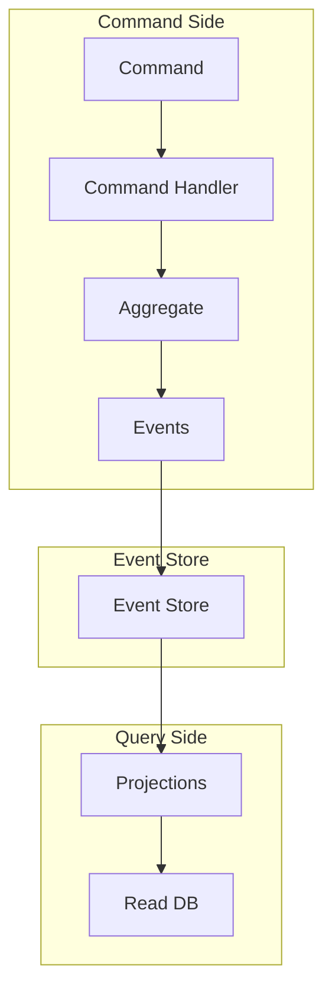

# CQRS + 事件溯源实战

**目标读者**：P7 面试准备  
**面试级别**：P7 高频

---

## 一、整体架构



---

## 二、代码实现

### 1. 事件定义

```java
// 事件接口
public interface DomainEvent {
    Long getAggregateId();
    LocalDateTime getOccurredOn();
    int getVersion();
}

// 账户事件
public class AccountCreated implements DomainEvent {
    private final Long accountId;
    private final String accountName;
    private final LocalDateTime occurredOn;

    public AccountCreated(Long accountId, String accountName) {
        this.accountId = accountId;
        this.accountName = accountName;
        this.occurredOn = LocalDateTime.now();
    }

    @Override
    public Long getAggregateId() { return accountId; }
    @Override
    public LocalDateTime getOccurredOn() { return occurredOn; }
    @Override
    public int getVersion() { return 1; }
}

public class MoneyDeposited implements DomainEvent {
    private final Long accountId;
    private final BigDecimal amount;
    private final BigDecimal balanceAfter;
    private final LocalDateTime occurredOn;

    public MoneyDeposited(Long accountId, BigDecimal amount, BigDecimal balanceAfter) {
        this.accountId = accountId;
        this.amount = amount;
        this.balanceAfter = balanceAfter;
        this.occurredOn = LocalDateTime.now();
    }

    @Override
    public Long getAggregateId() { return accountId; }
    @Override
    public LocalDateTime getOccurredOn() { return occurredOn; }
    @Override
    public int getVersion() { return 1; }
}
```

### 2. 聚合根

```java
public class Account implements AggregateRoot {
    private Long id;
    private String name;
    private BigDecimal balance;
    private int version;
    private final List<DomainEvent> uncommittedEvents = new ArrayList<>();

    // 从事件重建
    public Account(List<DomainEvent> events) {
        for (DomainEvent event : events) {
            apply(event);
        }
    }

    // 创建账户
    public static Account create(Long id, String name) {
        Account account = new Account();
        account.id = id;
        account.name = name;
        account.balance = BigDecimal.ZERO;
        account.uncommittedEvents.add(new AccountCreated(id, name));
        return account;
    }

    // 存款
    public void deposit(BigDecimal amount) {
        if (amount.compareTo(BigDecimal.ZERO) <= 0) {
            throw new IllegalArgumentException("金额必须大于0");
        }
        this.balance = this.balance.add(amount);
        this.uncommittedEvents.add(new MoneyDeposited(this.id, amount, this.balance));
    }

    // 取款
    public void withdraw(BigDecimal amount) {
        if (amount.compareTo(BigDecimal.ZERO) <= 0) {
            throw new IllegalArgumentException("金额必须大于0");
        }
        if (this.balance.compareTo(amount) < 0) {
            throw new IllegalStateException("余额不足");
        }
        this.balance = this.balance.subtract(amount);
        this.uncommittedEvents.add(new MoneyWithdrawn(this.id, amount, this.balance));
    }

    // 获取未提交事件
    public List<DomainEvent> getUncommittedEvents() {
        List<DomainEvent> events = new ArrayList<>(uncommittedEvents);
        uncommittedEvents.clear();
        return events;
    }

    // 应用事件
    private void apply(DomainEvent event) {
        if (event instanceof AccountCreated) {
            AccountCreated e = (AccountCreated) event;
            this.id = e.getAccountId();
            this.name = e.getAccountName();
        } else if (event instanceof MoneyDeposited) {
            MoneyDeposited e = (MoneyDeposited) event;
            this.balance = e.getBalanceAfter();
        }
        this.version++;
    }
}
```

### 3. 命令处理

```java
public class AccountCommandHandler {
    private final EventStore eventStore;

    public void handle(CreateAccountCommand cmd) {
        Account account = Account.create(cmd.getAccountId(), cmd.getAccountName());
        List<DomainEvent> events = account.getUncommittedEvents();
        eventStore.append(events);
    }

    public void handle(DepositCommand cmd) {
        List<DomainEvent> existingEvents = eventStore.getEvents(cmd.getAccountId());
        Account account = new Account(existingEvents);
        account.deposit(cmd.getAmount());
        List<DomainEvent> newEvents = account.getUncommittedEvents();
        eventStore.append(newEvents);
    }
}
```

### 4. 查询模型

```java
// 读取模型
@Entity
@Table(name = "account_summary")
public class AccountSummary {
    @Id
    private Long accountId;
    private String accountName;
    private BigDecimal balance;
    private int transactionCount;
    private LocalDateTime lastActivity;
}

// 投影器
@Component
public class AccountProjection {
    @Autowired
    private AccountSummaryRepository repository;

    @EventListener
    public void onAccountCreated(AccountCreated event) {
        AccountSummary summary = new AccountSummary();
        summary.setAccountId(event.getAccountId());
        summary.setAccountName(event.getAccountName());
        summary.setBalance(BigDecimal.ZERO);
        summary.setTransactionCount(0);
        repository.save(summary);
    }

    @EventListener
    public void onMoneyDeposited(MoneyDeposited event) {
        AccountSummary summary = repository.findById(event.getAccountId())
            .orElseThrow();
        summary.setBalance(event.getBalanceAfter());
        summary.setTransactionCount(summary.getTransactionCount() + 1);
        summary.setLastActivity(event.getOccurredOn());
        repository.save(summary);
    }
}
```

---

## 三、快照策略

```java
@Service
public class SnapshotService {
    private static final int SNAPSHOT_THRESHOLD = 100;

    @Autowired
    private EventStore eventStore;
    @Autowired
    private SnapshotRepository snapshotRepository;

    public Account rebuild(Long accountId) {
        Snapshot latestSnapshot = snapshotRepository.findLatest(accountId);

        List<DomainEvent> events;
        if (latestSnapshot != null) {
            events = eventStore.getEventsAfter(accountId, latestSnapshot.getVersion());
            Account account = rebuildFromSnapshot(latestSnapshot);
            events.forEach(account::apply);
            return account;
        } else {
            events = eventStore.getEvents(accountId);
            return new Account(events);
        }
    }

    public void maybeTakeSnapshot(Account account) {
        if (account.getVersion() % SNAPSHOT_THRESHOLD == 0) {
            Snapshot snapshot = new Snapshot(
                account.getId(),
                account.getVersion(),
                account.getSnapshotData()
            );
            snapshotRepository.save(snapshot);
        }
    }
}
```

---

## 四、幂等处理

```java
@Service
public class IdempotentEventProcessor {
    @Autowired
    private ProcessedEventRepository processedRepository;

    public void process(DomainEvent event) {
        String eventId = event.getAggregateId() + "-" + event.getVersion();

        if (processedRepository.existsByEventId(eventId)) {
            return;  // 已处理，忽略
        }

        // 处理事件
        doProcess(event);

        // 标记已处理
        processedRepository.save(new ProcessedEvent(eventId));
    }
}
```

---

## 五、面试要点

| 要点 | 说明 |
|------|------|
| 事件存储 | 使用 append-only 存储 |
| 聚合重建 | 从事件重放重建状态 |
| 快照优化 | 避免全量重放 |
| 幂等处理 | 防止重复处理 |
| 一致性 | 最终一致性 |
