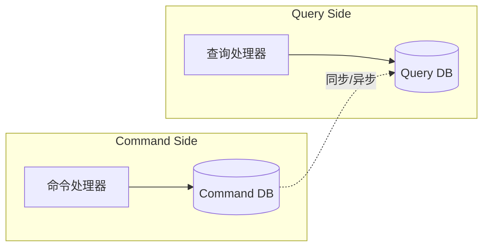
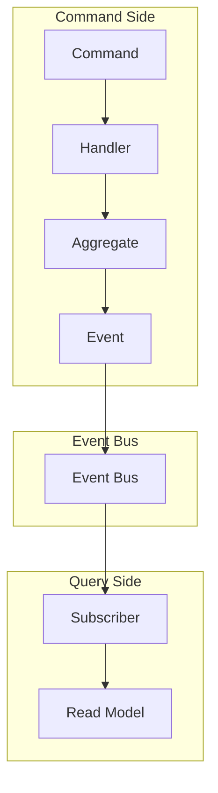

# CQRS 模式

**目标读者**：P7 面试准备  
**面试级别**：P7 高频

## 快速自测

> **🔴 面试官最关心的 3 个问题**
>
> 1. 什么是 CQRS？解决了什么问题？
> 2. CQRS 和传统 CRUD 有什么区别？
> 3. CQRS 如何与 DDD 结合？

---

## 一、为什么需要 CQRS

### 传统 CRUD 的问题

```java
// 传统做法：一个对象既管创建又管查询
public class User {
    private Long id;
    private String name;
    private String email;
    private int age;
    private String address;
    private String phone;
    private String avatar;
    private String bio;
    private List<String> interests;
    private List<Order> recentOrders;
    private Statistics statistics;

    // 问题：读和写的数据结构完全不同
    // 但我们用一个类处理所有操作
}

public interface UserService {
    void createUser(User user);        // 写入
    User getUser(Long id);            // 读取
    List<User> searchUsers(String name); // 复杂查询
    User getUserDetail(Long id);      // 更多字段
    Statistics getUserStats(Long id);  // 统计
}
```

---

## 二、CQRS 核心概念

**Command Query Responsibility Segregation（命令查询职责分离）**

- **Command（命令）**：修改状态的操作，返回 void
- **Query（查询）**：读取数据的操作，返回结果



---

## 三、CQRS 实现

### 1. 命令端

```java
// 命令
public interface Command {
}

public class CreateUserCommand implements Command {
    private String name;
    private String email;
    private String password;

    // getters
}

public class UpdateUserCommand implements Command {
    private Long userId;
    private String name;
    private String email;

    // getters
}

public class DeleteUserCommand implements Command {
    private Long userId;

    // getters
}

// 命令处理器
public class UserCommandHandler {
    private final UserRepository repository;

    public void handle(CreateUserCommand cmd) {
        User user = new User(cmd.getName(), cmd.getEmail(), cmd.getPassword());
        repository.save(user);
    }

    public void handle(UpdateUserCommand cmd) {
        User user = repository.findById(cmd.getUserId());
        user.update(cmd.getName(), cmd.getEmail());
        repository.save(user);
    }

    public void handle(DeleteUserCommand cmd) {
        repository.delete(cmd.getUserId());
    }
}
```

### 2. 查询端

```java
// 查询端 DTO（针对不同查询场景）
public class UserSummaryDTO {
    private Long id;
    private String name;
    private String email;
}

public class UserDetailDTO {
    private Long id;
    private String name;
    private String email;
    private int age;
    private String address;
    private String phone;
    private String avatar;
    private List<String> interests;
}

public class UserStatisticsDTO {
    private Long id;
    private int orderCount;
    private BigDecimal totalSpent;
    private int loginCount;
}

// 查询处理器
public class UserQueryHandler {
    private final JdbcTemplate jdbcTemplate;

    public UserSummaryDTO getUserSummary(Long userId) {
        return jdbcTemplate.queryForObject(
            "SELECT id, name, email FROM users WHERE id = ?",
            new BeanPropertyRowMapper<>(UserSummaryDTO.class),
            userId
        );
    }

    public UserDetailDTO getUserDetail(Long userId) {
        return jdbcTemplate.queryForObject(
            "SELECT * FROM users WHERE id = ?",
            new BeanPropertyRowMapper<>(UserDetailDTO.class),
            userId
        );
    }

    public UserStatisticsDTO getUserStatistics(Long userId) {
        return jdbcTemplate.queryForObject(
            """
            SELECT u.id, COUNT(o.id) as order_count,
                   COALESCE(SUM(o.amount), 0) as total_spent
            FROM users u
            LEFT JOIN orders o ON u.id = o.user_id
            WHERE u.id = ?
            GROUP BY u.id
            """,
            new BeanPropertyRowMapper<>(UserStatisticsDTO.class),
            userId
        );
    }
}
```

### 3. 同步机制

```java
// 方式一：同步更新
@EventListener
public void handleUserCreated(UserCreatedEvent event) {
    // 立即更新查询库
    UserView view = new UserView();
    view.setId(event.getUser().getId());
    view.setName(event.getUser().getName());
    view.setEmail(event.getUser().getEmail());
    viewRepository.save(view);
}

// 方式二：异步更新（消息队列）
@RabbitListener(queues = "user.events")
public void handleUserEvent(UserEvent event) {
    if (event instanceof UserCreatedEvent) {
        syncUserToReadDb(event.getUserId());
    }
}
```

---

## 四、CQRS vs 传统 CRUD

| 维度 | 传统 CRUD | CQRS |
|------|----------|------|
| 数据模型 | 单一模型 | 读写分离模型 |
| 数据存储 | 单一数据库 | 可独立扩展 |
| 性能 | 一般 | 针对读写优化 |
| 复杂度 | 低 | 高 |
| 一致性 | 强一致 | 最终一致 |
| 适用场景 | 简单 CRUD | 复杂业务 |

---

## 五、CQRS + DDD



### 完整实现

```java
// 领域层
public class Order implements AggregateRoot {
    private OrderId id;
    private OrderStatus status;

    public void place() {
        this.status = OrderStatus.PLACED;
        DomainEvents.publish(new OrderPlacedEvent(this));
    }
}

// 命令端
public class PlaceOrderCommand {
    private Long customerId;
    private List<OrderItemDTO> items;

    // getters
}

public class PlaceOrderHandler {
    public void handle(PlaceOrderCommand cmd) {
        Order order = orderFactory.create(cmd.getCustomerId(), cmd.getItems());
        order.place();
        repository.save(order);
    }
}

// 查询端
public class OrderQueryService {
    public List<OrderListItemDTO> getOrders(Long customerId) {
        return orderListRepository.findByCustomerId(customerId);
    }

    public OrderDetailDTO getOrderDetail(Long orderId) {
        return orderDetailRepository.findById(orderId);
    }
}
```

---

## 六、CQRS 优缺点

| 优点 | 缺点 |
|------|------|
| 读写分离优化 | 实现复杂度高 |
| 独立扩展 | 数据一致性问题 |
| 高性能 | 需要额外同步机制 |
| 灵活的查询模型 | 学习曲线陡 |
| 事件溯源支持 | 运维成本增加 |

---

## 七、适用场景

| 场景 | 适用性 |
|------|--------|
| 简单 CRUD | ❌ 不需要 |
| 读多写多 | ✅ 非常适合 |
| 复杂查询 | ✅ 读模型可针对查询优化 |
| 高并发 | ✅ 可独立扩展读写 |
| 事件驱动 | ✅ 天然支持 |

---

## 八、面试追问

> **第一层**：什么是 CQRS？
>
> **第二层**：CQRS 如何保证数据一致性？
>
> **第三层**：CQRS 和 ES（事件溯源）的关系？

**💡 加分回答**：可以提到 CQRS 需要配合事件溯源才能发挥最大价值，读模型可以从事件流重建。
