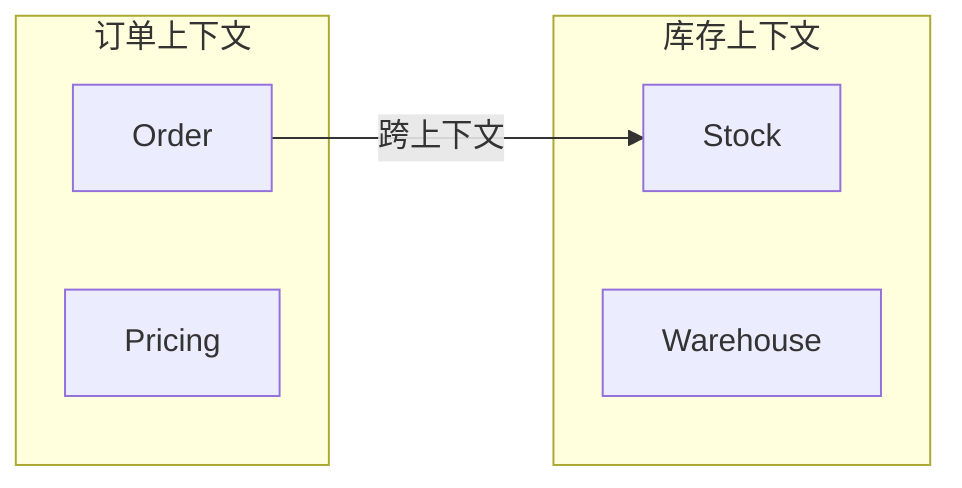

# DDD 核心概念

**目标读者**：P6/P7 面试准备  
**面试级别**：P6 中频 / P7 高频

## 快速自测

> **🔴 面试官最关心的 3 个问题**
>
> 1. 实体和值对象的区别是什么？
> 2. 聚合的边界如何确定？
> 3. 领域事件在 DDD 中扮演什么角色？

---

## 一、实体（Entity）

### 定义

实体是具有唯一标识的对象，其生命周期内标识不变。

```java
public class Order {
    private OrderId id;      // 唯一标识，贯穿生命周期
    private OrderStatus status;
    private List<OrderItem> items;

    // 实体比较：基于标识而非属性
    @Override
    public boolean equals(Object o) {
        if (this == o) return true;
        return o instanceof Order && ((Order) o).id.equals(this.id);
    }

    @Override
    public int hashCode() {
        return id.hashCode();
    }
}
```

### 实体特征

| 特征 | 说明 |
|------|------|
| 唯一标识 | 有全局唯一标识 |
| 生命周期 | 对象可以创建、删除 |
| 可变性 | 状态可以变化 |
| 连续性 | 标识在变化中保持不变 |

---

## 二、值对象（Value Object）

### 定义

值对象是不可变的、仅通过属性值来识别的对象。

```java
public class Money {
    private final BigDecimal amount;  // 不可变
    private final Currency currency;

    public Money(BigDecimal amount, Currency currency) {
        this.amount = amount;
        this.currency = currency;
    }

    // 所有方法返回新实例
    public Money add(Money other) {
        return new Money(this.amount.add(other.amount), this.currency);
    }
}
```

### 实体 vs 值对象

| 维度 | 实体 | 值对象 |
|------|------|--------|
| 标识 | 有唯一标识 | 无标识 |
| 可变性 | 可变 | 不可变 |
| 比较 | 基于标识 | 基于属性 |
| 生命周期 | 有生命周期 | 无生命周期 |

---

## 三、聚合（Aggregate）

### 定义

聚合是一组相关对象的集合，作为数据修改的单元。

```java
// Order 是聚合根
public class Order implements AggregateRoot {
    private OrderId id;
    private List<OrderItem> items;  // OrderItem 只能通过 Order 访问

    // 聚合根控制所有业务规则
    public void addItem(Product product, int quantity) {
        if (this.status != OrderStatus.DRAFT) {
            throw new OrderException("订单已锁定");
        }
        this.items.add(new OrderItem(product, quantity));
    }

    // 返回不可变列表，防止外部修改
    public List<OrderItem> getItems() {
        return Collections.unmodifiableList(this.items);
    }
}
```

### 聚合设计原则

1. 聚合根控制所有业务规则
2. 只通过聚合根访问内部对象
3. 聚合之间通过 ID 引用
4. 聚合边界要小

---

## 四、领域服务（Domain Service）

### 适用场景

当业务逻辑不属于任何实体或值对象时，使用领域服务。

```java
// 领域服务：跨实体的业务逻辑
public class PricingService {
    public Money calculateOrderTotal(List<OrderItem> items, Coupon coupon) {
        Money subtotal = items.stream()
            .map(OrderItem::getSubtotal)
            .reduce(Money.ZERO, Money::add);

        if (coupon != null) {
            return subtotal.subtract(coupon.getDiscount());
        }
        return subtotal;
    }
}
```

---

## 五、领域事件（Domain Event）

### 定义

领域事件是领域中发生的事情，可能触发后续业务流程。

```java
// 定义事件
public class OrderCreatedEvent implements DomainEvent {
    private final Order order;
    private final LocalDateTime occurredOn;

    public OrderCreatedEvent(Order order) {
        this.order = order;
        this.occurredOn = LocalDateTime.now();
    }

    @Override
    public LocalDateTime occurredOn() {
        return occurredOn;
    }
}

// 发布事件
public class Order {
    public static DomainEventPublisher publisher;

    public void create() {
        // 创建订单逻辑
        publisher.publish(new OrderCreatedEvent(this));
    }
}

// 监听事件
@DomainEventListener
public class InventoryEventHandler {
    @EventListener
    public void onOrderCreated(OrderCreatedEvent event) {
        // 扣减库存
    }
}
```

---

## 六、仓储（Repository）

### 接口定义在领域层

```java
// 领域层定义接口
public interface OrderRepository {
    Order findById(OrderId id);
    void save(Order order);
}

// 基础设施层实现
@Repository
public class JpaOrderRepository implements OrderRepository {
    @Override
    public Order findById(OrderId id) {
        return jpaRepo.findById(id.getValue())
            .map(entity -> /* 转换为领域对象 */);
    }
}
```

---

## 七、工厂（Factory）

### 用于创建复杂聚合

```java
public class OrderFactory {
    public Order createOrder(Customer customer, List<CartItem> cartItems) {
        Order order = new Order(customer.getId());

        for (CartItem item : cartItems) {
            order.addItem(item.getProduct(), item.getQuantity());
        }

        return order;
    }
}
```

---

## 八、限界上下文

### 定义

限界上下文是语义边界的边界，每个上下文有自己通用的语言。



---

## 九、面试追问

> **第一层**：实体和值对象的区别？
>
> **第二层**：聚合根的作用是什么？
>
> **第三层**：领域事件在微服务中如何应用？

**💡 加分回答**：可以提到 `Event Storming`（事件风暴）用于识别领域事件和限界上下文。
